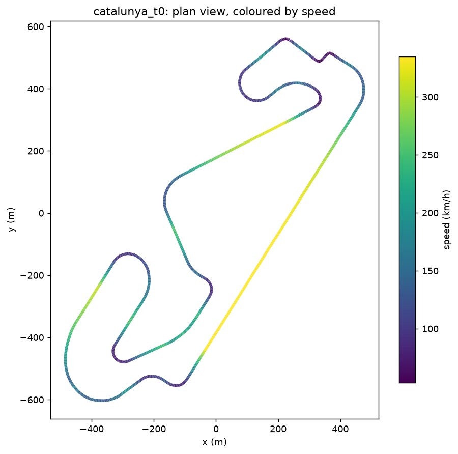

<!-- SPDX-License-Identifier: AGPL-3.0-only -->
# outlap

A parametric vehicle simulator — F1 → GT → passenger car — with a race-strategy Monte Carlo layer
planned on top. A Rust core (`crates/`), a Python API (`python/outlap/`, PyO3 + maturin), and
published JSON Schemas (`schemas/`). Code is AGPL-3.0; the schemas are Apache-2.0.

**New here? Read [`docs/GUIDE.md`](docs/GUIDE.md) — the zero-to-hero user guide.** It assumes no
vehicle-dynamics background and takes you from "what is a lap simulator" to running, understanding,
and extending outlap, with the physics, the API, and worked recipes.

The full architecture and specification live in [`docs/HANDOFF.md`](docs/HANDOFF.md); the working
agreement is in [`CLAUDE.md`](CLAUDE.md).

## What works at v0.1 (milestone M1)

- **One vehicle description** consumed by every solver tier — chassis, aero, suspension, tyres, a
  drivetrain topology graph, ERS/battery, brakes — with a strict, friendly load pipeline (miette
  spans, did-you-mean, plain-language topology errors). Powertrains enter *only* as neutral `.ptm`
  map files (the firewall).
- **A 3D track model**: `track.yaml` + `centerline.csv`, the first open 3D racetrack format —
  curvature, grade, banking, and the road frame by arc length. A Python importer builds it from
  OpenStreetMap geometry fused with open DEM elevation.
- **A minimum-curvature racing line** (QP over the lateral offset within the track bounds).
- **The T0 point-mass lap solver**: a forward/backward velocity-profile solve on the 3D ribbon that
  produces a **lap time on the real Circuit de Barcelona-Catalunya**.
- **A PDT HDF5 importer** that brings a professional motor/drive-unit/battery toolchain's results in
  as `.ptm` maps, battery params, and a distilled 2-node `.emotor` thermal model.

This is a sanity-level tier, not a parity model — see `docs/HANDOFF.md` §13 for the validation plan.

## Quick start

```sh
# Rust core: build, lint, test
cargo test --workspace

# First lap on Catalunya (T0 point-mass)
cargo run -p outlap-qss --example catalunya_lap
# → Lap time ~104.7 s, top speed ~335 km/h; writes a CSV for plotting

# Centerline vs min-curvature racing line
cargo run -p outlap-raceline --example catalunya_line

# Plots (Python)
cd python && uv sync --extra track-import
uv run python examples/plot_lap.py examples/output/catalunya_t0.csv
uv run python examples/plot_line_compare.py
```

The Catalunya T0 lap, coloured by speed (yellow on the straights, dark at the hairpins):



## Layout

| Path | What |
|------|------|
| `crates/outlap-schema` | file-format contract: serde/schemars types + load pipeline |
| `crates/outlap-core`   | shared numerics (monotone Hermite, C² splines) |
| `crates/outlap-track`  | 3D track model |
| `crates/outlap-qss`    | T0 point-mass lap solver (T1 QSS envelope generator to come) |
| `crates/outlap-raceline` | minimum-curvature racing line |
| `python/outlap`        | Python API, OSM/DEM + PDT importers, plotting |
| `schemas/`             | published JSON Schemas (generated from the Rust types) |
| `data/`                | reference vehicles and imported tracks |

## Contributing

See [`CONTRIBUTING.md`](CONTRIBUTING.md). Contributions are under AGPL-3.0 with a DCO sign-off.
