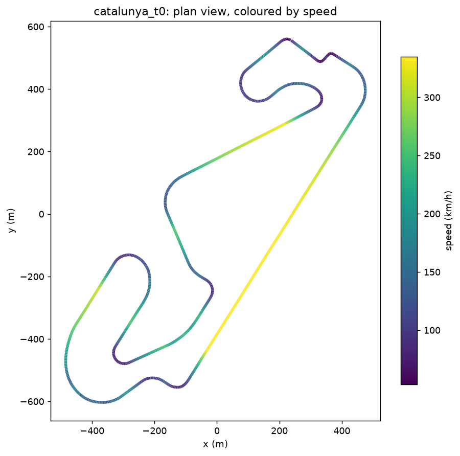

<!-- SPDX-License-Identifier: AGPL-3.0-only -->
# outlap

outlap is a parametric vehicle simulator. It covers F1 cars, GT cars, and passenger cars. A
Monte Carlo layer for race strategy is planned on top of it.

It has three parts: a Rust core in `crates/`, a Python API in `python/outlap/` built with PyO3 and
maturin, and published JSON Schemas in `schemas/`. The code is AGPL-3.0. The schemas are
Apache-2.0.

**New here? Read [`docs/GUIDE.md`](docs/GUIDE.md), the guide that takes you from zero to
competence.** It assumes that you know nothing about vehicle dynamics. It starts at "what is a lap
simulator" and ends with you running, understanding, and extending outlap. It covers the physics,
the API, and worked recipes.

[`docs/HANDOFF.md`](docs/HANDOFF.md) holds the full architecture and specification.
[`CLAUDE.md`](CLAUDE.md) holds the working agreement.

## What works at v0.4.0

**One description of the vehicle, which every solver tier reads.** It covers the chassis, aero,
suspension, tires, a graph of the drivetrain topology, the ERS and battery, and the brakes. The
load pipeline is strict, and its errors are friendly: it gives miette spans, it suggests the field
you meant, and it explains topology problems in plain language. A powertrain enters *only* as a
neutral `.ptm` map file. This is the firewall.

**Four solver tiers.**

- **T0** solves a velocity profile on the 3D ribbon with a point mass, in a forward pass and a
  backward pass.
- **T1** trims a double-track model at each station. It emits per-wheel loads, slips, and forces,
  and it emits setup metrics. It also generates a **g-g-g-v envelope**, which the fast T0 path then
  reads.
- **T2 is the transient tier.** It integrates a 7-DOF chassis through time at 1 ms, in the
  curvilinear 3D road frame. CI verifies its equations symbolically to 1e-12. It adds tire
  relaxation, an ideal preview driver behind a stability margin that scales with the corner, a
  state machine for gear shifts, torque vectoring, and blending of regeneration. T2 returns a trace
  indexed by time, like a data logger: steering, yaw, sideslip, per-wheel loads and slips, gear,
  regeneration power, and SoC.
- **T3** has 14 DOF. It adds the four unsprung masses, each on its own spring, damper, anti-roll
  bar, and bumpstop. Ride height, pitch, and heave therefore become states instead of assumptions.
  The platform moves under braking, and the aero balance moves with it. It is verified symbolically
  against the same SymPy derivation as T2.

**Tires.** There is a steady-state Magic Formula 6.1 model and a physical brush model. A `.tir`
codec reads and writes them, and a Python pipeline fits MF6.1. Reference `.tyr` sets ship with
citations. First-order slip relaxation is live in T2.

The thermal and wear stack arrived in v0.3. A reduced three-node Farroni-TRT thermal model makes
grip depend on temperature. Archard wear feeds back on itself past a cliff. Thermal damage does not
reverse. Every tier marches these as slow states, so outlap can simulate a **stint**.
`outlap.wearcal` calibrates them by inversion from stint pace. Soft, medium, and hard compound
presets ship.

**Powertrain, thermal, and battery.** `.ptm` maps flow through the graph of the drivetrain
topology, which holds gearboxes, splits, and differentials that are open, locked, limited-slip, or
solid. An N-node thermal network for the machine derates torque. A Thévenin battery gives a
terminal voltage that depends on SoC, and that voltage feeds back into the maps of the drive units.
This is the Vdc–SoC coupling. Slow states march along a QSS lap. At T2 the pack charges under
braking and discharges under power, live in the time loop.

**An energy manager in the 2026 style, and fuel mass.** A `policy:` overlay states the regulation
and governs how an electric unit deploys and recovers. It holds a taper of power against speed,
piecewise linear, evaluated exactly as the regulation writes it. It holds a harvest allowance for
each lap, an override envelope for overtaking, and the ramp-down of power demand that makes a
recharge phase a real constraint. It marches as a slow state across one lap and across a whole
race. State of charge therefore moves in both directions, and the ledger closes.

Fuel is mass. The load adds to the dry car. The engine burns it, and it drains. The center of
gravity migrates as it drains. The car gets faster as the race runs. The flow ceiling shrinks the
traction envelope of the engine, rather than being applied afterward.

**A 3D track model**, held as `track.yaml` plus `centerline.csv`. It gives curvature, grade,
banking, and the road frame against arc length.

**Two generators for the racing line.** One solves the minimum-curvature QP. The other refines it
with **time weighting**, where the weights are proportional to time spent. That is the first step
toward the minimum-time line.

28 circuits ship. `catalunya_osm` and `spa_osm` are 3D, from OSM and a DEM; Spa carries its real
climb of about 100 m. `barcelona_real_2026` is the geometry that the f1 reference car is calibrated
against. The other 25 are flat TUMFTM circuits, under LGPL-3.0.

**Importers.** They read OSM and DEM tracks, and they assemble a closed lap from a fragmented
circuit. They read TUMFTM tracks. They read PDT HDF5 powertrains and write `.ptm` maps, battery
parameters, and an `.emotor` thermal network. They read `.tir` tire files.

**A course of notebooks**, `notebooks/00` through `11`. CI executes them, and their outputs are
committed. They start at the car as data. They end with you reading T2 traces like a race engineer:
the anatomy of a corner, the friction circle in action, and car balance through what-if overrides.
The last one accounts for energy over a full race distance.

**Validation, reported honestly.** The cross-check against Perantoni & Limebeer 2014 puts top speed
within 1 % and corner apexes within 5 %. The parity gate between QSS and T2 checks **hull
containment**: every T2 operating point must sit inside the T1 grip envelope. Measured exceedance
is 0.0 % on all three reference cars.

The numbers that do *not* meet their ambitions are recorded, not hidden, and each comes with a full
decomposition. There are two: the gap in T2 lap time, which the stability margin of the driver
causes, and the ceiling on transient throughput. See `docs/validation/`.

[`docs/GUIDE.md`](docs/GUIDE.md) tours every capability. Chapter 15 gives an honest account of the
limits.

## Quick start

```sh
# Rust core: build, lint, test
cargo test --workspace

# First lap on Catalunya (T0 point-mass)
cargo run -p outlap-qss --example catalunya_lap
# → Lap time ~104.7 s, top speed ~337 km/h; writes a CSV for plotting

# Centerline vs min-curvature racing line
cargo run -p outlap-raceline --example catalunya_line

# Plots (Python)
cd python && uv sync --extra track-import
uv run python examples/plot_lap.py examples/output/catalunya_t0.csv
uv run python examples/plot_line_compare.py
```

Here is the T0 lap at Catalunya, colored by speed. The straights are yellow. The hairpins are dark.



## Layout

| Path | What |
|------|------|
| `crates/outlap-schema` | The contract for the file formats: the serde and schemars types, and the load pipeline |
| `crates/outlap-core`   | Shared numerics: monotone Hermite interpolation, C² splines, and N-D gridded maps. Also the block, bus, and SoA scaffolding, and the fixed-step split integrator |
| `crates/outlap-tire`   | The MF6.1 and brush tire models, slip relaxation, and the `.tir` codec |
| `crates/outlap-track`  | The 3D track model |
| `crates/outlap-thermal`| The N-node thermal network for a machine (LPTN) |
| `crates/outlap-qss`    | The T0 and T1 quasi-steady-state lap solvers, the g-g-g-v envelope, and the T2 speed targets that scale with the corner |
| `crates/outlap-raceline` | Racing lines: minimum-curvature and time-weighted |
| `crates/outlap-vehicle` | The T2 physics blocks: the 7-DOF chassis RHS, load transfer, tires with relaxation, and the preview driver |
| `crates/outlap-transient` | T2 lap orchestration: the step loop of the split integrator, the line table, and the control layer for shifting, torque vectoring, and regeneration |
| `crates/outlap-py`     | The PyO3 bindings, which build the `outlap_core` extension |
| `python/outlap`        | The Python API, the OSM/DEM, TUMFTM, and PDT importers, tire fitting, and plotting |
| `schemas/`             | The published JSON Schemas, generated from the Rust types |
| `docs/GUIDE.md`        | The guide that takes you from zero to competence |
| `data/`                | Reference vehicles and imported tracks |

## Contributing

Read [`CONTRIBUTING.md`](CONTRIBUTING.md). You contribute under AGPL-3.0, with a DCO sign-off.
