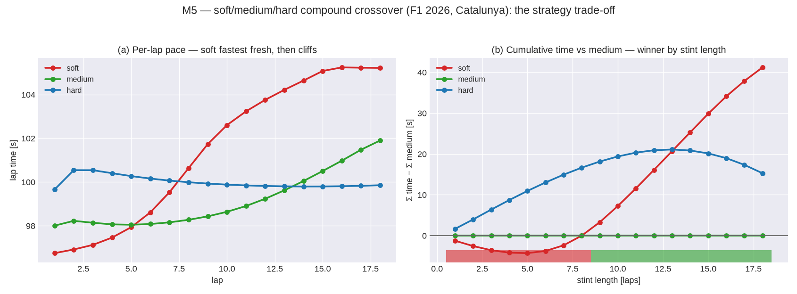

<!-- SPDX-License-Identifier: CC-BY-SA-4.0 -->
# F1 2026 compound presets: soft, medium, and hard

These are three **synthetic** dry-slick compound presets. Each one builds on the generic
racing-slick MF6.1 core, which is the default `f1_2026` slick. They differ in the three ways that
real compounds differ: peak grip, temperature window, and wear rate.

They exist for the multi-compound strategy demonstration (M5 PR10,
`notebooks/10_stint_strategy.ipynb`). That demonstration is dry only, and it previews stage 2. Wet
conditions are stage-2 work. See Decision #4.

`outlap.wearcal` calibrated the thermal and wear blocks into the racing-slick band (M5 PR7 and
PR8). Each compound scales that baseline. **These presets are not measured tire data.** outlap
redistributes no FastF1 parameter and no TTC parameter (HANDOFF §15).

| | peak grip (LMUX/LMUY) | `t_opt` | `k_w` (wear) | `w_c` cliff | `delta_c` | character |
|---|---|---|---|---|---|---|
| **soft** | 1.02 | 88 °C | 7.0e-9 | 1.7 mm | 0.15 | most grip, warms up quickest, wears quickest, earliest cliff |
| **medium** | 1.00 | 95 °C | 4.4e-9 | 2.0 mm | 0.12 | the baseline |
| **hard** | 0.98 | 102 °C | 2.6e-9 | 2.5 mm | 0.09 | least grip, warms up slowest, wears slowest, latest cliff |

These values give a **crossover** in lap time. The soft has more grip, so it is quickest for the
first laps. It also degrades quickest. The hard starts slower, but it holds its pace longest. This
trade-off drives pit-stop strategy.

To run a stint on a compound, point the `tires:` block of a vehicle at that preset. You can also
pass the preset through the `overrides` mechanism or the scratch mechanism. The notebook shows the
comparison.



To regenerate the figure, run `python python/tools/plot_compound_crossover.py`. For the full
walkthrough, read `notebooks/10_stint_strategy.ipynb`.

## Usage

```python
from outlap.core import Track, solve_stint_dataset
# Copy an f1_2026 vehicle dir, swap its tyr/*.tyr.yaml for a compound, then run a stint —
# see notebooks/10_stint_strategy.ipynb, which does exactly this for all three compounds.
```
