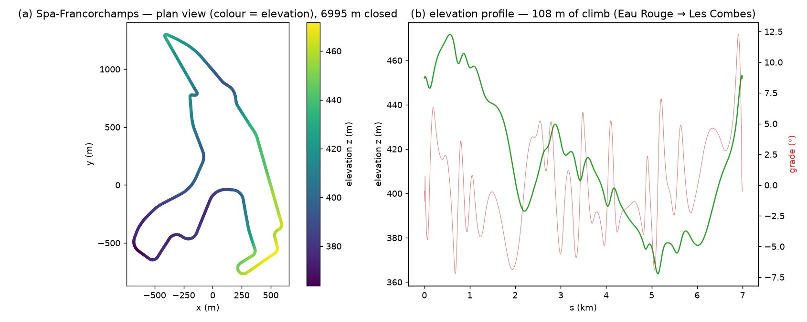

<!-- SPDX-License-Identifier: CC-BY-SA-4.0 -->
# Reference tracks

Circuits in outlap's 3D track format (`track.yaml` + `centerline.csv`, §9.3). Two provenances,
each with its own licence — recorded per-track in the `track.yaml` `meta` block. These are
real-world geometry, kept out of the synthetic CI golden fixtures.

## TUMFTM racetrack-database (LGPL-3.0) — 25 circuits

The 25 flat circuits (`austin`, `brands_hatch`, … `zandvoort`) are converted from the
[TUMFTM `racetrack-database`](https://github.com/TUMFTM/racetrack-database) — smoothed centre
lines with **satellite-measured** corridor widths, the standard academic bootstrap dataset
(HANDOFF §4.4). Under outlap's AGPL-3.0 licence this LGPL-3.0 data is redistributable; the vendored
files keep the upstream notice.

- **Licence**: LGPL-3.0 — the upstream text is shipped verbatim as
  [`LICENSE-tumftm-LGPL-3.0.txt`](LICENSE-tumftm-LGPL-3.0.txt).
- **Attribution** (in each `track.yaml`): *Centerline © TU München, Institute of Automotive
  Technology (TUMFTM racetrack-database), LGPL-3.0*.
- **Flat 2-D caveat**: this source is strictly 2-D. Every track carries `z = 0`, `banking_deg = 0`,
  `grip_scale = 1` and `meta.accuracy_class: C`. This is legitimate (no elevation was fabricated),
  but these tracks do **not** exercise grade / vertical-curvature / banking physics — use
  `catalunya_osm` (below) or an OSM+DEM import for that. `ims` is the 2.5-mile oval geometry, flat
  (its real banking is not represented); `nuerburgring` is the **GP-Strecke** (~5.14 km), not the
  Nordschleife. The set is frozen ~2021, so a few layouts are the *era* geometry (e.g. Yas Marina
  pre-2021, Zandvoort pre-2020).

### Re-vendoring the TUMFTM tracks

A one-time local run (never in CI — no network there). Pinned to upstream commit `e59595d`:

```sh
git clone https://github.com/TUMFTM/racetrack-database.git /tmp/tumftm
git -C /tmp/tumftm checkout e59595d1f3573b30d1ded6a08984935b957688e0
cd python
uv run python -m outlap.importers.tumftm_track --input /tmp/tumftm/tracks --out ../data/tracks
cp /tmp/tumftm/LICENSE ../data/tracks/LICENSE-tumftm-LGPL-3.0.txt
```

The importer maps the source widths **by name** (`w_tr_right_m → width_right_m`,
`w_tr_left_m → width_left_m`; the source lists RIGHT before LEFT) and passes the native ≈5 m grid
through unchanged. `--ds <m>` resamples to a different spacing if needed.

## OSM + DEM (ODbL) — `catalunya_osm`

`catalunya_osm` is the **3D** Circuit de Barcelona-Catalunya, built by
`outlap.importers.osm_track` from public data — the reference for the 3D ribbon (elevation, grade,
banking, vertical curvature). Presets ship for Catalunya, Spa and Silverstone (Decision #23).

- **Centerline**: © OpenStreetMap contributors, [ODbL](https://www.openstreetmap.org/copyright);
  the derived database keeps the same terms.
- **Elevation**: open DEMs (EU-DEM 25 m / SRTM) via [opentopodata.org](https://www.opentopodata.org);
  see the `track.yaml` `meta.dem`. Banking is not resolved from coarse public DEMs — add sparse
  `banking_keypoints` to refine it (accuracy class moves from B toward A).

```sh
cd python
uv run python -m outlap.importers.osm_track --preset catalunya --out ../data/tracks/catalunya_osm
```

> **Note**: `catalunya_osm` is the 3D OSM+DEM import — the **reference Catalunya** used by the
> introductory notebooks, the example laps, and the Perantoni & Limebeer 2014 cross-check
> (`docs/validation/limebeer.md`). `catalunya` is the flat **TUMFTM** vendoring above, a peer of
> the other 24 circuits; PR10 found its class-C smoothed geometry does not reproduce the PL2014
> apex bands, so the cross-check stays on `catalunya_osm` (the fast-corner gate is deferred to M4).
> They are the same circuit from two sources.

### `spa_osm` — the 3-D showcase circuit

`spa_osm` is the **3D** Circuit de Spa-Francorchamps from the same importer — the M4 elevation
showcase (Spa climbs ~100 m from Eau Rouge to Les Combes, so its grade and vertical curvature are
the point). Same licensing as `catalunya_osm` (OSM/ODbL centreline + `eudem25m` elevation).

Spa's OSM `highway=raceway` geometry is **fragmented** into corner-named ways (Kemmel, Blanchimont,
Fagnes, …) plus a pit lane and a separate kart track. The importer assembles the timed lap in
`_assemble_circuit`: it drops non-circuit ways by name, prunes dead-end spurs to the 2-core, and
resolves the pit-bypass *theta* junction (two degree-3 nodes joined by three paths) to the cycle of
the **two longest** paths — the short third path is the bypass/pit chord. The result is a 6995 m
closed loop (official GP layout 7004 m, i.e. within 0.13%). `spa` (flat TUMFTM, above) is the same
circuit with zero elevation; `spa_osm` is the 3-D version.



```sh
cd python
uv run --with requests python -m outlap.importers.osm_track --preset spa --out ../data/tracks/spa_osm
```
