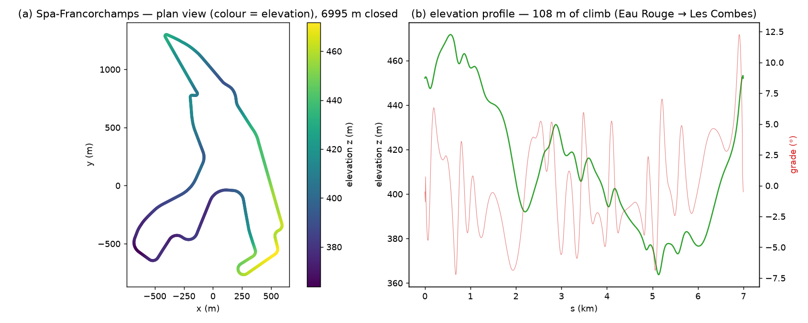

<!-- SPDX-License-Identifier: CC-BY-SA-4.0 -->
# Reference tracks

This directory holds circuits in the 3D track format of outlap (`track.yaml` + `centerline.csv`,
§9.3). The circuits come from two sources, and each source has its own license. The `meta` block in
each `track.yaml` records which one applies. This geometry is real. It is kept out of the synthetic
CI golden fixtures.

## TUMFTM racetrack-database (LGPL-3.0): 25 circuits

The 25 flat circuits (`austin`, `brands_hatch`, through `zandvoort`) are converted from the
[TUMFTM `racetrack-database`](https://github.com/TUMFTM/racetrack-database). That database holds
smoothed center lines with corridor widths **measured from satellite images**. It is the standard
academic bootstrap dataset (HANDOFF §4.4). The outlap license is AGPL-3.0, which permits
redistribution of this LGPL-3.0 data. The vendored files keep the upstream notice.

- **License**: LGPL-3.0. The upstream text ships verbatim as
  [`LICENSE-tumftm-LGPL-3.0.txt`](LICENSE-tumftm-LGPL-3.0.txt).
- **Attribution**, held in each `track.yaml`: *Centerline © TU München, Institute of Automotive
  Technology (TUMFTM racetrack-database), LGPL-3.0*.
- **Caveat: the data is flat and 2-D.** The source is strictly 2-D. Every track carries `z = 0`,
  `banking_deg = 0`, `grip_scale = 1`, and `meta.accuracy_class: C`. This is honest, because no
  elevation was invented. But these tracks do **not** exercise the physics of grade, vertical
  curvature, or banking. For that, use `catalunya_osm` below, or import a track from OSM and a DEM.

  Two circuits need a further note. `ims` is the 2.5-mile oval, and it is flat here, so its real
  banking is absent. `nuerburgring` is the **GP-Strecke**, about 5.14 km. It is not the
  Nordschleife.

  The set was frozen in about 2021. A few layouts therefore hold the geometry of that era. Yas
  Marina is the pre-2021 layout, and Zandvoort is the pre-2020 layout.

### How to re-vendor the TUMFTM tracks

Run this once on your own machine. Never run it in CI, because CI has no network. It is pinned to
upstream commit `e59595d`:

```sh
git clone https://github.com/TUMFTM/racetrack-database.git /tmp/tumftm
git -C /tmp/tumftm checkout e59595d1f3573b30d1ded6a08984935b957688e0
cd python
uv run python -m outlap.importers.tumftm_track --input /tmp/tumftm/tracks --out ../data/tracks
cp /tmp/tumftm/LICENSE ../data/tracks/LICENSE-tumftm-LGPL-3.0.txt
```

The importer maps the widths in the source **by name**: `w_tr_right_m` becomes `width_right_m`, and
`w_tr_left_m` becomes `width_left_m`. Note that the source lists RIGHT before LEFT. The importer
passes the native grid of about 5 m through unchanged. To resample to a different spacing, pass
`--ds <m>`.

## OSM and DEM (ODbL): `catalunya_osm`

`catalunya_osm` is the **3D** Circuit de Barcelona-Catalunya. `outlap.importers.osm_track` builds
it from public data. It is the reference for the 3D ribbon, which carries elevation, grade,
banking, and vertical curvature. Presets ship for Catalunya, Spa, and Silverstone (Decision #23).

- **Centerline**: © OpenStreetMap contributors,
  [ODbL](https://www.openstreetmap.org/copyright). The derived database keeps the same terms.
- **Elevation**: open DEMs (EU-DEM 25 m and SRTM) through
  [opentopodata.org](https://www.opentopodata.org). See `meta.dem` in the `track.yaml`. Public DEMs
  are too coarse to resolve banking. To refine banking, add a few `banking_keypoints`. The accuracy
  class then moves from B toward A.

```sh
cd python
uv run python -m outlap.importers.osm_track --preset catalunya --out ../data/tracks/catalunya_osm
```

> **Note.** Two directories hold the same circuit from two sources. `catalunya_osm` is the 3D
> import from OSM and a DEM. It is the **reference Catalunya**, and it is what the introductory
> notebooks, the example laps, and the Perantoni & Limebeer 2014 cross-check
> (`docs/validation/limebeer.md`) all use. `catalunya` is the flat **TUMFTM** vendoring described
> above, and it is a peer of the other 24 circuits. PR10 found that its smoothed class-C geometry
> does not reproduce the apex bands of PL2014. Therefore the cross-check stays on `catalunya_osm`.
> The gate on fast corners is deferred to M4.

### `spa_osm`: the 3-D showcase circuit

`spa_osm` is the **3D** Circuit de Spa-Francorchamps, from the same importer. It is the elevation
showcase for M4, because Spa climbs about 100 m from Eau Rouge to Les Combes. Its grade and
vertical curvature are the point. Its license matches `catalunya_osm`: an OSM centerline under ODbL
plus `eudem25m` elevation.

The OSM `highway=raceway` geometry for Spa is **fragmented**. It arrives as ways named after
corners (Kemmel, Blanchimont, Fagnes, and others), plus a pit lane and a separate kart track.
`_assemble_circuit` in the importer builds the timed lap from these pieces in three steps. First it
drops ways that are not part of the circuit, by name. Then it prunes dead-end spurs down to the
2-core. Then it resolves the theta junction at the pit bypass, where two degree-3 nodes are joined
by three paths: it keeps the cycle formed by the **two longest** paths, because the short third
path is the bypass and pit chord. The result is a closed loop of 6995 m. The official GP layout is
7004 m, so the error is 0.13%.

`spa` is the flat TUMFTM version of this circuit, described above, and it has no elevation.
`spa_osm` is the 3-D version.



```sh
cd python
uv run --with requests python -m outlap.importers.osm_track --preset spa --out ../data/tracks/spa_osm
```
