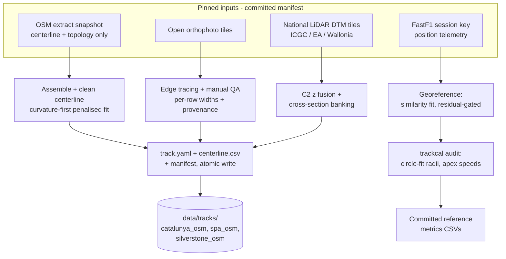
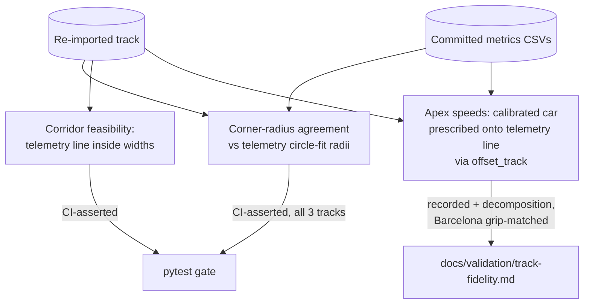

<!-- SPDX-License-Identifier: AGPL-3.0-only -->

# Track Fidelity Overhaul (MT) - Plan

## Goal Capsule

- **Objective:** Deliver milestone MT (`docs/HANDOFF.md` §12): make tracks trustworthy — real widths, curvature-clean centerlines, LiDAR-fused elevation + banking, a FastF1 telemetry-derived importer, and a CI track-quality gate — then re-import and validate the reference trio (Catalunya, Spa, Silverstone) so M7 compares on honest geometry. Ships as v0.5.0.
- **Authority:** CLAUDE.md hard rules override everything. This plan supersedes the HANDOFF §12 MT row's *mechanism* wording where research invalidated it (OSM boundary-tag widths — see KTD1); the row's *scope and intent* stand. Repo conventions and user preferences override this plan's landing strategy.
- **Execution profile:** Multi-PR milestone, trunk-based. One PR per implementation unit (adjacent Phase-A units may pair), one PR at a time — merge before starting the next dependent unit. Exception: the numbers-moving trio U7+U8+U9 lands as **one combined PR** so CI never sits red between the trio re-import and the golden re-bless (the M5 PR7–10 combined-landing precedent).
- **Stop conditions:** (1) An asserted Limebeer gate (`test_limebeer_top_speed_within_1pct`, `test_limebeer_slowest_apex_within_5pct`) fails on the re-imported geometry and cannot be honestly decomposed — stop and surface; never loosen a published-oracle gate silently. (2) A data-source license turns out to forbid redistribution of derived geometry — stop and surface. (3) A reference track has no usable telemetry in any season — radius-gate from the best available season and record the gap; do not fabricate a gate.

---

## Product Contract

### Summary

Rebuild the track import pipeline so shipped reference geometry matches reality: widths traced from open orthophotos, curvature cleaned by a bias-aware fitting method audited against telemetry circle-fit radii, elevation and banking fused from national LiDAR, every import reproducible from committed inputs, and a Decision-#48-style validation gate holding the result to real lap telemetry.

### Problem Frame

Through M6 the car models were validated and calibrated (f1_2026 grip fit to real 2026 Barcelona telemetry), leaving the track as the dominant sim-vs-real error: the calibrated car laps 83 s on telemetry-derived Barcelona geometry but 94 s on the shipped `catalunya_osm` (real pole ~80.1 s) — an ~11 s gap that is pure geometry. Root causes are recorded in the HANDOFF: OSM imports hard-default widths to 6.0 m per side (`python/src/outlap/importers/osm_track.py`), banking is written as 0 everywhere despite complete runtime support, no track was ever ground-truthed, and ~10 Hz telemetry position reconstruction has curvature noise (tightest Barcelona apex ~31 m vs ~34 m circle-fit, capping v_min ~10% low). The M6 prototype that produced `data/tracks/barcelona_real_2026` was never committed — only its data. MT is the prerequisite for the M7 hero demo.

The HANDOFF's diagnostic rule bounds the scope: a **localized** corner-speed mismatch is track geometry (MT's problem); a **uniform** straight-line offset is vehicle state — race fuel, engine/ERS modes, lift-and-coast (a future race-trim model, out of scope).

### Requirements

**Geometry fidelity**

- R1. Reference-trio tracks carry real per-row widths with recorded provenance; the importer errors when no width source resolves — never a silent 6.0 m default.
- R2. Imported centerline curvature is clean: apex radii agree with telemetry-derived circle-fit radii (the Barcelona ~31 m vs ~34 m tightest-apex bias is eliminated), using a curvature-first estimation method, not naive spline second derivatives.
- R3. Elevation is C² and banking is real where LiDAR resolves it: z fused from national LiDAR DTMs (ICGC Catalunya, UK EA 1 m, Wallonia 0.5 m); banking estimated from detrended cross-track sections and written per-row; `accuracy_class` and per-field provenance recorded in `track.yaml` meta.
- R4. A FastF1 telemetry importer produces a georeferenced driven-line track and reference metrics from session position data: multi-lap/multi-driver pooling, `Source == 'interpolated'` filtering, and a residual-gated similarity transform to real-world coordinates (FastF1 frames are local and unscaled).

**Validation**

- R5. A track-quality gate runs in CI, network-free, off small committed derived-metrics CSVs: corner-radius agreement asserted per reference track; apex-speed agreement recorded with a decomposition (grip-matched car exists only for Barcelona).
- R6. The reference set is re-imported and validated: `catalunya_osm` and `spa_osm` replaced in place; `silverstone_osm` added alongside the untouched TUMFTM `silverstone`; the 25-track TUMFTM set and its tests stay intact.
- R7. Every imported track is reproducible: a committed input manifest (OSM extract snapshot, LiDAR tile IDs + dataset versions, FastF1 session key, fitted transform, importer version) makes the import a pure function of committed inputs; a re-run reproduces `centerline.csv` byte-identically.

**Product health**

- R8. The community import path degrades honestly: every enrichment stage (widths, LiDAR, telemetry audit) is optional; a track built without them records what ran in meta and gets the matching `accuracy_class`; the existing opentopodata elevation path keeps working; network dependencies stay in optional extras with lazy imports.
- R9. License hygiene holds: per-source attribution carried per track (ODbL, CC-BY 4.0, OGL); committed derived-metrics CSVs are justified under the HANDOFF §15 derived-artifact reasoning in the PR that adds them; TUMFTM (LGPL) is consulted for approach only and recorded.
- R10. The numbers-move is managed: raceline and QSS consume one κ definition; curvature smoothing becomes a recorded sim setting; goldens are re-blessed with the required physics note; the asserted Limebeer gates are re-verified on the new geometry; notebooks and docs with embedded numbers are refreshed in the same change that moves them.
- R11. MT closes with a v0.5.0 release PR (changelog, HANDOFF §12 row updated); tagging and the GitHub release remain user-owned.

### Scope Boundaries

- **Deferred to Follow-Up Work:** a Rust penalised/smoothing spline in `outlap-core` (KTD2 keeps cleaning Python-side; revisit if third-party runtime re-cleaning is demanded); re-import of the other 24 TUMFTM circuits; automated width extraction (CV pipeline) beyond the semi-automated QA tooling; `.xodr`/OpenCRG importers (HANDOFF §9.3 "later importers"); a race-trim/fuel-load model for the uniform straight-line offset.
- **Outside this milestone:** M7 deliverables (batch, CLI, hero demo, WASM widget); sim-racing telemetry importers (post-1.0, Locked Decision #10); any change to vehicle models or calibration.

---

## Planning Contract

### Key Technical Decisions

- KTD1. **Widths come from orthophoto edge tracing with manual QA** (session-settled: user-directed — chosen over LiDAR-automatic edge extraction and telemetry-corridor widths: honest effort for three tracks with no CV-pipeline risk; only ICGC ships LiDAR intensity, and telemetry corridors systematically under-measure). External research killed the HANDOFF's OSM-boundary-tag mechanism: OSM maps raceways as centerline ways, width tags are rare and untrusted, and surface polygons (`area:highway`) have near-zero adoption — TUMFTM had to build satellite-image extraction for the same reason. Open national orthophotos (PNOA/ICGC ~25 cm, UK aerial, Wallonia ~25 cm) are licensed-clean. LiDAR cross-sections and the telemetry corridor serve as cross-checks, not sources. Governs R1.
- KTD2. **Curvature cleaning lives in the Python importer** (session-settled: user-directed — chosen over a new penalised spline in wasm-clean Rust `outlap-core`: preserves the "importer produces the file, Rust interpolates it" seam with zero wasm/numerics risk). Shipped `centerline.csv` is already clean; `outlap-core` keeps only interpolating splines. Third-party noisy CSVs must pass through the Python importer to be cleaned. Governs R2.
- KTD3. **Curvature estimation is a penalised smoothing fit with curvature as a first-class target; radii are audited with robust circle fits.** Naive spline-second-derivative curvature on noisy data is a documented, provably biased anti-pattern. Primary method: tension/roughness-penalised periodic smoothing spline with physically motivated, per-corner-adaptive regularization (under-smoothing leaves κ noise; over-smoothing washes out exactly the 30–35 m apexes). Fallback alternative if adaptive regularization proves fragile: RTS forward-backward smoothing with a kinematic curvature state. Radius audit: Taubin/Hyper algebraic fit for initialization + iterative geometric refinement, on windowed short arcs around detected apexes (algebraic fits alone are biased on short arcs). TUMFTM repos (LGPL-3.0) consulted for approach only — record repo + license next to the citations. Governs R2, R5.
- KTD4. **Gate split: corner-radius asserted, apex-speed recorded with decomposition** (session-settled: user-directed — chosen over asserting both: apex speed drags in tyre μ, fuel mass — the sim runs 768 kg dry — ERS mode, and driver margin; Decision #48 forbids green gates the tier can't honestly certify). Radius agreement is geometry-vs-geometry and is asserted on all three tracks. Apex-speed comparison prescribes the calibrated car onto the *telemetry line* via `offset_track` (not the QP raceline — comparing lines, not line models) plus a corridor-feasibility check (the telemetry line must fit inside the imported corridor); it is recorded with a decomposition, grip-matched on Barcelona only. Governs R5.
- KTD5. **`silverstone_osm` lands as a new directory** (session-settled: user-directed — chosen over replacing `silverstone` in place: that asset is TUMFTM/LGPL, pinned by the 25-track test and shared attribution; replacing it would change license provenance — a hard-rule-3 hazard). `catalunya_osm`/`spa_osm` are replaced in place (session-settled: user-approved — they are already ODbL products of the same importer; the documented `X` / `X_osm` pairing is preserved). Governs R6.
- KTD6. **The gate runs in pytest off committed CSVs; FastF1 never enters CI** (session-settled: user-approved). Follows the `wearcal` pattern exactly: lazy import, `pytest.importorskip` on regeneration paths, committed derived fixtures (`docs/validation/data/pl2014_fig8_speed.csv` and `data/wear/f1_medium_catalunya_stint.csv` are the precedents). Governs R5, R9.
- KTD7. **Reproducibility via committed input manifests.** Overpass is live and opentopodata interpolates server-side — two runs today cannot reproduce a track. Each track dir gains a manifest pinning the OSM extract (committed snapshot), LiDAR tile IDs + dataset versions, FastF1 session key, fitted georeference transform, and importer version; import becomes a pure function of committed inputs (the `tumftm_track.py` `UPSTREAM_COMMIT` pin is the precedent). Governs R7.
- KTD8. **One κ definition; smoothing becomes a recorded sim setting.** Today the raceline QP reads raw `Track::curvature_h` while the QSS velocity profile sees a 25 m boxcar (`CURV_SMOOTH_RADIUS = 6` at 2 m spacing in `crates/outlap-qss/src/path.rs`) — two inconsistent κ definitions, and the boxcar inflates apex speeds on clean geometry. Both consumers move to one definition; the smoothing window becomes a sim numeric recorded in resolved settings (the Fz-coupling mode is the pattern), with the global default unchanged at introduction so the 25 TUMFTM tracks and synthetic fixtures don't silently move. The default flips in the re-bless unit (U9), where the whole numbers-move is decomposed. The 30 m vertical finite-difference baseline (`VERTICAL_BASELINE_M`) becomes a sim numeric the same way — LiDAR-clean C² z makes it a redundant second low-pass. Governs R10.
- KTD9. **Banking lands dense per-row; schema change stays MINOR.** LiDAR cross-section banking is written into the existing `banking_deg` CSV column (runtime support is complete and currently exercised only by synthetic tests). `banking_keypoints` stays for the hand-annotation path; a track supplying both is a config error (today keypoints silently override the column). `track/1.1` adds meta provenance fields only (width source, LiDAR dataset, georef transform, importer version); no `centerline.csv` column changes — the parser is column-count-strict and unversioned, and `outlap migrate` does not exist, so MAJOR is off the table. Governs R3, R8.
- KTD10. **Import robustness: staged CLI, atomic writes.** Enrichment stages (widths, LiDAR z/banking, telemetry audit) are explicit optional stages of one CLI; builds go to a temp dir with an atomic rename; overwriting an existing track dir requires `--force`. New deps (`pyproj`, `rasterio` — MIT/BSD-class, flag in the PR per hard rule 3) live in the `track-import` extra with lazy imports. Governs R7, R8.

### High-Level Technical Design

Import pipeline — stages, sources, and artifacts:

Validation gate — what is asserted vs recorded:

Directional guidance: stage boundaries and the assert/record split are the design; module/function shapes are the implementer's call.

### Sequencing

Three phases; units within a phase are parallelizable in principle but land one PR at a time:

- **Phase A — foundations:** U1 (trackcal core) → U2 (FastF1 importer), U3 (LiDAR fusion), U4 (width tooling).
- **Phase B — pipeline + Rust:** U5 (importer rebuild, needs U1), U6 (κ reconciliation, independent).
- **Phase C — data, gate, close:** U7 (re-import trio, needs U3–U5) → U8 (gate + validation doc, needs U1, U2, U7) → U9 (numbers flip + re-bless, needs U6, U8) → U10 (release). U7–U9 execute as distinct units but land in one combined PR (see Goal Capsule) — re-imported data without re-blessed goldens is a red-CI state that must never merge alone.

---

## Implementation Units

| U-ID | Title | Key files | Depends on |
|---|---|---|---|
| U1 | trackcal analysis package | `python/src/outlap/trackcal/` | — |
| U2 | FastF1 track importer | `python/src/outlap/importers/fastf1_track.py` | U1 |
| U3 | LiDAR elevation + banking fusion | `python/src/outlap/importers/lidar_dem.py` | — |
| U4 | Width extraction + QA tooling | `python/src/outlap/importers/width_trace.py` | — |
| U5 | Importer pipeline rebuild + track/1.1 | `python/src/outlap/importers/osm_track.py`, `crates/outlap-schema/` | U1 |
| U6 | κ reconciliation (Rust) | `crates/outlap-qss/src/path.rs`, `crates/outlap-track/`, `crates/outlap-raceline/` | — |
| U7 | Re-import the reference trio | `data/tracks/` | U3, U4, U5 |
| U8 | Track-quality gate + validation doc | `python/tests/test_track_fidelity.py`, `docs/validation/` | U1, U2, U7 |
| U9 | Numbers flip + golden re-bless | goldens, notebooks, docs | U6, U8 |
| U10 | v0.5.0 release | `CHANGELOG.md`, `docs/` | U9 |

### U1. trackcal analysis package

- **Goal:** The shared geometry/analysis core: curvature-first centerline fitting, corner detection, robust apex-radius and apex-speed extraction, and the reference-metrics CSV format. This re-creates the never-committed M6 prototype as reviewed, tested code.
- **Requirements:** R2, R5 (KTD3).
- **Dependencies:** none.
- **Files:** `python/src/outlap/trackcal/{__init__.py,geometry.py,corners.py,data.py}` (mirrors the `wearcal/` package shape); tests `python/tests/test_trackcal.py`.
- **Approach:**
  1. `geometry.py`: penalised periodic smoothing fit with per-corner-adaptive regularization; curvature evaluated from the fit, never finite-differenced from raw points.
  2. `corners.py`: apex detection (curvature extrema; optionally anchored to FastF1 `circuit_info` corner annotations), windowed short-arc extraction, Taubin/Hyper circle fit + geometric refinement per KTD3.
  3. `data.py`: fixture reader for committed metrics CSVs + lazy FastF1 loader split, following `wearcal/data.py`; metrics CSV schema includes the fitted georeference transform in its header (KTD7).
  4. Doc-comment headers citing the methods (paper symbols inside kernels per repo convention); record TUMFTM (LGPL-3.0, approach-only) beside the citations.
- **Execution note:** Test-first on synthetic geometry with known ground truth — exact circles, clothoid transitions, and noise-injected samples — so bias is measured, not assumed.
- **Patterns to follow:** `python/src/outlap/wearcal/` (package layout, lazy import, fixture/live split); pyright strict applies outside `importers/`.
- **Test scenarios:**
  - Exact circle of radius 34 m sampled at 10 Hz-equivalent spacing: fitted radius within 0.5%.
  - Noisy circle (Gaussian position noise matching FastF1 amplitude): fitted radius unbiased within 2%; naive spline-second-derivative comparison documented as failing this (regression guard for the method choice).
  - Clothoid-connected S-bend: curvature sign change located within one sample; no overshoot ringing.
  - Closed synthetic oval: periodic fit is C² at the seam (curvature continuous across s = 0).
  - Corner detection on a two-corner synthetic track: both apexes found, windows don't overlap.
  - Metrics CSV round-trip: write then read preserves radii, speeds, and transform header exactly.
  - Degenerate input (straight line, < 10 points): typed error, no crash.
- **Verification:** `uv run --directory python pytest tests/test_trackcal.py`, ruff, pyright strict clean.

### U2. FastF1 track importer

- **Goal:** `python -m outlap.importers.fastf1_track` turns a session's position telemetry into a georeferenced driven-line track dir + input manifest, and regenerates `data/tracks/barcelona_real_2026` as a reproducible artifact.
- **Requirements:** R4, R7 (KTD7, KTD10).
- **Dependencies:** U1.
- **Files:** `python/src/outlap/importers/fastf1_track.py`; tests `python/tests/test_fastf1_track.py`; regenerated `data/tracks/barcelona_real_2026/` (+ manifest); delete the stray empty `data/tracks/barcelona_real_2026/barcelona_real_2026_clean_narrow/`.
- **Approach:**
  1. Pool position samples across selected laps/drivers, dropping `Source == 'interpolated'` rows; FastF1 units are 1/10 m in a local frame.
  2. Georeference: fit a similarity transform against OSM anchor points (start/finish line, a few unambiguous corners); assert a residual ceiling before proceeding; record the transform in the manifest (KTD10-style staged CLI; lazy `fastf1` import in the `track-import` extra).
  3. Fit the pooled cloud with `trackcal.geometry`; emit a driven-line track (narrow honest widths, meta says so) — this artifact class is for audit and calibration, not corridor solving.
  4. Manifest: session key, laps/drivers used, transform, importer version.
- **Patterns to follow:** `wearcal/data.py` (cache dir, lazy import, derived-data-only outputs); `tumftm_track.py` (pinned-input provenance).
- **Test scenarios:**
  - Synthetic "session" fixture (no network): known geometry + known similarity transform + noise → recovered transform within tolerance; recovered tightest radius within 2% of truth.
  - Interpolated-source rows are excluded from the fit (count asserted).
  - Residual gate: a deliberately misregistered anchor set raises a typed error, no track written.
  - Atomic write: simulated failure mid-write leaves no partial track dir; `--force` required over an existing dir.
  - Manifest round-trip: re-running the importer on the committed snapshot inputs reproduces `centerline.csv` byte-identically.
  - `pytest.importorskip("fastf1")` guards any live-path test; CI never installs fastf1.
- **Verification:** offline tests green; regenerated `barcelona_real_2026` loads via `Track::load` and its length is within 1% of the previous artifact.

### U3. LiDAR elevation + banking fusion

- **Goal:** Replace service-interpolated elevation with national LiDAR DTMs for the reference trio and estimate per-row banking from cross-track sections; keep opentopodata as the community fallback.
- **Requirements:** R3, R8 (KTD9, KTD10).
- **Dependencies:** none (integrates in U5/U7).
- **Files:** `python/src/outlap/importers/lidar_dem.py`; tests `python/tests/test_lidar_dem.py`; `python/pyproject.toml` (extend `track-import` extra: `pyproj`, `rasterio`).
- **Approach:**
  1. Per-source presets (ICGC Catalunya CC-BY 4.0 preferred over PNOA for Catalunya; EA 1 m DTM OGL; Wallonia 0.5 m MNT CC-BY 4.0) with tile fetch by ID — tile IDs + dataset versions go in the manifest; fetched tiles cache locally, never committed.
  2. CRS handling via pyproj (EPSG:25831 / 27700 / Lambert 2008 → track ENU frame); assert the product is a DTM (bare-earth), not DSM.
  3. z: sample along the centerline, fuse with a C²-consistent fit (replaces the `UnivariateSpline` + service-interpolation chain for preset tracks).
  4. Banking: cross-track sections sampled perpendicular to the centerline, detrended and averaged over multiple points per section (single-point sampling can't resolve the 0.2 m low end against a 6–15 cm noise floor); written into the `banking_deg` column; per-corner SNR recorded — sections that don't resolve fall back to 0 with provenance saying so.
- **Execution note:** All tests run on small synthetic raster fixtures committed to the repo — a tilted plane with known banking, a crowned road profile — never on live tiles.
- **Test scenarios:**
  - Synthetic tilted-plane raster (known 1.0° banking): recovered banking within 0.05°.
  - Crowned-profile raster (camber both sides): detrending yields ~0 net banking, crown does not alias into banking.
  - Low-SNR section (noise ≥ signal): falls back to 0 with the provenance flag set, no spurious banking.
  - CRS round-trip: a known point survives EPSG:25831 → ENU → back within 1 cm.
  - DSM guard: a raster flagged as surface model raises a typed error.
  - Missing tile: typed error naming the tile ID; no partial fusion.
  - opentopodata fallback path still produces the current `catalunya_osm`-style output when no preset matches.
- **Verification:** offline tests green; ruff + pyright; new deps' licenses noted in the PR description (hard rule 3).

### U4. Width extraction + QA tooling

- **Goal:** Semi-automated per-row widths for the reference trio: trace track edges from open orthophotos with hand-adjustable control points, cross-check against LiDAR sections and the telemetry corridor, and emit widths + provenance.
- **Requirements:** R1 (KTD1).
- **Dependencies:** none (integrates in U5/U7).
- **Files:** `python/src/outlap/importers/width_trace.py`; QA renderer `python/tools/plot_track_width_qa.py`; tests `python/tests/test_width_trace.py`.
- **Approach:**
  1. Fetch open orthophoto tiles per preset (same manifest pinning as U3); project onto the track ENU frame.
  2. Edge model: per-station left/right offsets initialized by an edge-detection pass, corrected by hand-placed control points where detection fails (chicanes, kerbs, pit walls); the committed artifact is the control-point set — reproducible, reviewable, and re-runnable (KTD7).
  3. Cross-checks: LiDAR cross-section width and multi-lap telemetry-corridor spread rendered on the QA overlay; disagreement beyond a band flags the station for review.
  4. Output: per-row `width_left_m`/`width_right_m` + width-source provenance in meta; unresolved stations are an error, not a default (R1).
- **Test scenarios:**
  - Synthetic orthophoto (drawn track of known width): traced widths within 0.25 m.
  - Control-point override: a hand point wins over the detected edge in its window and blends smoothly.
  - Unresolved stations (no edge, no control point): typed error listing stations; no output written.
  - Pit-lane exclusion: a synthetic branch outside the corridor does not widen the track.
  - Provenance: emitted meta records source + method per side.
- **Verification:** offline tests green; QA overlay figures render for a synthetic fixture via the tools script.

### U5. Importer pipeline rebuild + track/1.1

- **Goal:** `osm_track.py` becomes a staged, pinned, atomic pipeline that composes U1/U3/U4, and the schema gains MINOR provenance fields.
- **Requirements:** R1, R2, R7, R8 (KTD2, KTD7, KTD9, KTD10).
- **Dependencies:** U1.
- **Files:** `python/src/outlap/importers/osm_track.py`; `crates/outlap-schema/src/track.rs`, `crates/outlap-schema/src/load/semantic.rs`, `crates/outlap-schema/src/lib.rs` (`current_minor`), regenerated `schemas/track.json`; fixture `crates/outlap-schema/tests/fixtures/track/synthetic_oval.track.yaml`; tests `python/tests/test_osm_track.py`, `crates/outlap-schema/tests/`.
- **Approach:**
  1. Input pinning: fetch OSM once, commit the extract snapshot per track; imports read the snapshot, not Overpass (Overpass only via an explicit `--refresh-snapshot` stage).
  2. Centerline: replace the linear-`np.interp` resample + `UnivariateSpline` chain with the `trackcal.geometry` curvature-first fit (KTD2/KTD3); keep the existing circuit-assembly logic (non-circuit way filtering, 2-core pruning) and add `disused:highway=raceway` filtering.
  3. Staged CLI: `--stages widths,lidar,telemetry-audit` all optional; meta records which ran; `accuracy_class` derived from what ran; temp-dir build + atomic rename + `--force` (KTD10); expose `--half-width` for the explicit-degraded community path (recorded in meta, no silent default).
  4. `track/1.1`: additive `TrackMeta` fields (width source, LiDAR dataset + tiles, georef transform, importer version, per-field provenance); semantic check: dense `banking_deg` + `banking_keypoints` both present → error (KTD9); regenerate `schemas/track.json` via `gen_schemas` (CI `--check` gate).
- **Patterns to follow:** the unknown-field walk and did-you-mean diagnostics in `crates/outlap-schema/src/load/`; the `banking_keypoints` ascending semantic check as the template for new checks.
- **Test scenarios:**
  - Snapshot determinism: two runs from the same committed snapshot produce byte-identical `centerline.csv`.
  - Stage skipping: no-LiDAR run emits `accuracy_class: B`-style honest meta; widths stage absent + no `--half-width` → error (R1); `--half-width 6.0` runs and records the degradation.
  - Both banking forms present → miette-spanned config error with a clear message (Rust semantic test).
  - `track/1.1` file loads on the new build; a `track/1.1` file with the new fields read by a hypothetical 1.0-max reader produces the newer-minor hint (existing unknown-field machinery test pattern).
  - Interrupted build (kill between temp write and rename) leaves the target dir untouched.
  - Python schema mirror: `python -m outlap.schemas --check` passes with the regenerated JSON schema.
- **Verification:** `cargo test -p outlap-schema`, `gen_schemas --check`, python tests + `outlap.schemas --check` green.

### U6. κ reconciliation (Rust)

- **Goal:** One κ definition for raceline and QSS; the curvature-smoothing window and the 30 m vertical baseline become recorded sim settings with unchanged defaults.
- **Requirements:** R10 (KTD8).
- **Dependencies:** none.
- **Files:** `crates/outlap-qss/src/path.rs`, `crates/outlap-raceline/src/lib.rs`, `crates/outlap-track/src/lib.rs`, `crates/outlap-schema/src/sim.rs` (numerics fields), regenerated `schemas/sim.json` + the sim `current_minor` bump, tests in `crates/outlap-qss/tests/`, `crates/outlap-raceline/tests/`.
- **Approach:**
  1. Promote `CURV_SMOOTH_RADIUS` (as a window in meters) and `VERTICAL_BASELINE_M` to sim numerics, defaulted to today's values, embedded in the resolved-settings record every result carries.
  2. Route the raceline QP and `T0Path` through the same smoothed-κ accessor so the QP's corridor problem and the velocity profile see one curvature (today the QP reads raw `curvature_h` — two definitions).
  3. No default change in this unit: byte-identical results on all existing tracks is the acceptance bar (the flip happens in U9 with the re-bless).
- **Execution note:** This unit must prove bit-identity before merging — run the golden suite unchanged; any diff means the refactor leaked a numeric change.
- **Test scenarios:**
  - Default-config run on `catalunya_osm` (pre-re-import) reproduces current goldens bit-identically.
  - Setting the smoothing window to 0 changes apex κ on a synthetic hairpin in the expected direction (sharper), and the setting appears in the resolved-settings record.
  - Raceline QP and QSS path report identical κ arrays for the same track + settings (new invariant test).
  - wasm build of `outlap-qss`/`outlap-raceline` stays green.
- **Verification:** full `cargo test` + release-mode QSS tests + wasm builds; goldens untouched.

### U7. Re-import the reference trio

- **Goal:** `catalunya_osm` and `spa_osm` rebuilt in place with real widths, LiDAR z + banking, clean curvature, and manifests; `silverstone_osm` added; attribution and READMEs updated.
- **Requirements:** R1, R3, R6, R7, R9 (KTD5).
- **Dependencies:** U3, U4, U5.
- **Files:** `data/tracks/{catalunya_osm,spa_osm,silverstone_osm}/` (track.yaml, centerline.csv, manifest, OSM snapshot, width control points); `data/tracks/README.md`; re-anchored tests `crates/outlap-track/tests/{load.rs,elevation.rs,spa_osm.rs}` + new `crates/outlap-track/tests/banking.rs`.
- **Approach:**
  1. Run the full pipeline per track; hand-QA widths per U4; commit manifests + snapshots + control points.
  2. Attribution: per-track concatenated attribution (ODbL + the track's LiDAR/orthophoto source) in meta + `data/tracks/README.md`; `silverstone_osm` follows the documented `X`/`X_osm` pairing (KTD5) — TUMFTM assets untouched.
  3. Expected anchor moves: `catalunya_osm` length toward the official ~4655 m (currently 4677 m); spa length/elevation bands re-derived from the new import; update the test bands with the measured values, not invented ones.
  4. New banking test: per-row banking non-zero where LiDAR resolved it; banking survives `offset_track` (the raceline inherits it).
- **Test scenarios:**
  - Each trio track loads via `Track::load`; closed-loop guard passes; lengths within re-derived bands.
  - `catalunya_osm` width at a known wide station and a known narrow station brackets the defaulted 6.0/6.0 (regression against silent defaults).
  - `spa_osm` elevation span stays > 60 m; grade and κ_v within the existing physical bounds.
  - Banking: at least one corner per track with |banking| > 0.5° where LiDAR resolved it; `banking.rs` asserts offset-survival.
  - `tumftm_tracks.rs` still passes untouched (25 tracks, `silverstone` anchors intact).
  - Manifest re-run reproducibility spot-check on one track in CI-runnable form (from committed snapshot, no network).
- **Verification:** `cargo test -p outlap-track`; python track-loading tests; licenses/attribution reviewed in the PR (R9). Downstream goldens fail by design at this point — U7 merges only inside the combined U7+U8+U9 PR (Goal Capsule execution profile).

### U8. Track-quality gate + validation doc

- **Goal:** The Decision-#48 gate: committed reference metrics per trio track, a network-free pytest gate asserting corner-radius agreement and corridor feasibility, apex-speed recorded with decomposition, and `docs/validation/track-fidelity.md`.
- **Requirements:** R5, R9 (KTD4, KTD6).
- **Dependencies:** U1, U2, U7.
- **Files:** `docs/validation/data/{catalunya,spa,silverstone}_track_metrics.csv`; `python/tests/test_track_fidelity.py`; `docs/validation/track-fidelity.md`; renderer `python/tools/plot_track_fidelity.py` (also adopts the two orphaned `f1_calib_*.png` figures with a real renderer).
- **Approach:**
  1. Generate metrics offline via trackcal + FastF1 (session key + transform in the CSV header); commit the derived CSVs; record the §15 derived-artifact justification in the PR (R9).
  2. Gate (asserted, all three): per-corner radius agreement between the imported geometry and telemetry circle-fit radii within tolerance (exact threshold derived from the Barcelona distribution during implementation — indicative band ≤ 5%, must hold with honest margin); telemetry line fits inside the imported corridor (feasibility).
  3. Recorded: apex speeds with the calibrated f1_2026 prescribed onto the telemetry line via `offset_track`, grip-matched state pinned (Barcelona); Spa/Silverstone apex speeds recorded uncalibrated with the confound named. Decomposition table in `track-fidelity.md` follows the `limebeer.md` format (Oracle → Configuration → Gate results → decomposition → Recorded-not-gated).
  4. Telemetry season per track = latest available with usable position data (geometry is year-stable); season recorded in the manifest and the CSV header.
- **Test scenarios:**
  - Gate passes on all three committed metrics CSVs, network-free.
  - Tamper guard: perturbing a committed radius by 10% fails the gate (the assertion actually binds).
  - Corridor feasibility: telemetry line inside widths at every station; a synthetic narrowed corridor fails.
  - Tightest-apex regression: Barcelona tightest-corner radius within tolerance of the ~34 m circle-fit reference (the M6 bias is the named regression case).
  - Missing-metrics track: skipped with an explicit reason, not silently green.
  - Metrics regeneration path is `importorskip`-guarded; CI never touches FastF1.
- **Verification:** pytest gate green; `track-fidelity.md` complete in the Decision-#48 format; figures rendered by the committed script.

### U9. Numbers flip + golden re-bless

- **Goal:** Flip the κ-smoothing default for honest apex radii, re-bless every golden the trio re-import moved, re-verify the asserted Limebeer gates, and refresh notebooks/docs — one coherent numbers-moving change with its physics note.
- **Requirements:** R10 (KTD8).
- **Dependencies:** U6, U8.
- **Files:** `python/tests/golden/{limebeer_t0_flat,limebeer_t1_flat,limebeer_t2_flat,f1_2026_t0}.parquet`; `crates/outlap-qss/tests/catalunya.rs`, `crates/outlap-raceline/tests/catalunya_line.rs`, `crates/outlap-transient/tests/parity_report.rs`; `notebooks/*.ipynb` (the ten loading `catalunya_osm` — 00, 01, 02, 03, 04, 07, 08, 09, 10, 11 — incl. `02_track.ipynb`); `docs/validation/limebeer.md`; `docs/GUIDE.md` (§2.6 smoothing sentence + number-bearing sections); `README.md`.
- **Approach:**
  1. Flip the smoothing default (off/small) now that shipped geometry is curvature-clean; the resolved-settings record documents it.
  2. `OUTLAP_BLESS=1` re-bless with the required PR note explaining the physics change (real widths + clean κ + banking + length correction).
  3. Re-verify asserted gates: `test_limebeer_top_speed_within_1pct` and `test_limebeer_slowest_apex_within_5pct` (0.9 pp headroom today — the stop condition applies if it breaks); re-derive the recorded tripwire bands; rewrite the `limebeer.md` decomposition (geometry item shrinks — that is the milestone's claim, stated with numbers).
  4. Refresh notebooks (CI executes them with in-cell assertions) and every doc-embedded lap number in one commit, following the `docs(notebooks): refresh f1_2026 outputs` precedent.
- **Execution note:** Never regenerate a golden without understanding each channel's delta first — decompose length vs width vs κ vs banking contributions (a per-cause toggle run) before blessing.
- **Test scenarios:**
  - Tier parity gates stay green on all reference vehicles (QSS↔T2 hull containment, energy parity).
  - Both asserted Limebeer gates green on the new geometry; recorded bands re-derived and documented.
  - Golden diffs reviewed per channel within `_TOLS` semantics; T2 gear channel remains exact.
  - All notebooks execute headless; in-cell assertions (racing line beats centerline, energy closure) pass.
  - `rg`-sweep test: no doc references the old 94 s Catalunya lap or 4677 m length (stale-number sweep, manual checklist in the PR).
- **Verification:** full CI matrix green (rust, python, notebooks, wasm, schema-drift); `limebeer.md` rewritten with the new decomposition.

### U10. v0.5.0 release

- **Goal:** Close MT: changelog, HANDOFF row, theory documentation, version bumps; release PR ready for the user to tag.
- **Requirements:** R11.
- **Dependencies:** U9.
- **Files:** `CHANGELOG.md` (git-cliff + hand enrichment per convention); `docs/HANDOFF.md` (§12 MT row ships column, §9.3 mechanism wording → orthophoto/LiDAR pipeline); new `docs/theory/track-geometry.md` (method citations: circle fits, penalised splines, LiDAR fusion; consulted repos + licenses); `Cargo.toml`/`python/pyproject.toml` version bumps.
- **Approach:** follow the `chore(release): v0.4.0` precedent; the theory page carries the clean-room citation trail for the geometry methods (TUMFTM LGPL consulted-approach-only recorded).
- **Test scenarios:** `Test expectation: none — release/docs unit; CI matrix green is the gate.`
- **Verification:** release PR green end-to-end; tag + GitHub release left to the user.

---

## Verification Contract

| Gate | Command | Applies to |
|---|---|---|
| Rust format/lint/tests | `cargo fmt --all --check && cargo clippy --workspace --all-targets -- -D warnings && cargo test --workspace` | every unit |
| Release-mode perf/alloc | `cargo test --release -p outlap-qss --test catalunya --test alloc` + the transient perf/parity set | U6, U7, U9 |
| Schema drift | `cargo run -p outlap-schema --bin gen_schemas -- --check` | U5, U6 |
| wasm | `cargo build --target wasm32-unknown-unknown -p outlap-wasm` (+ per-crate builds CI runs) | U6 |
| Python | `uv run --directory python ruff check src tests && uv run --directory python ruff format --check src tests && uv run --directory python pyright && uv run --directory python pytest` | every Python unit |
| Python schema mirror | `uv run --directory python python -m outlap.schemas --check` | U5, U6 |
| Notebooks | headless `jupyter execute` over `notebooks/*.ipynb` (CI job) | U9 |
| Golden re-bless | `OUTLAP_BLESS=1 uv run --directory python pytest tests/test_limebeer.py` + PR physics note | U9 only |
| Track-quality gate | `uv run --directory python pytest tests/test_track_fidelity.py` (network-free) | U8, U9 |
| Tier parity | QSS↔transient parity suite on all reference vehicles | U9 |

CI never installs `fastf1`, `pyproj`, `rasterio`, or any network importer dependency; all CI-visible tests run from committed fixtures and metrics.

---

## Definition of Done

- All ten units merged; full CI matrix green (rust, python, notebooks, wasm, schema-drift).
- The track-quality gate asserts corner-radius agreement + corridor feasibility on all three reference tracks from committed metrics; apex speeds recorded with decomposition in `docs/validation/track-fidelity.md`.
- Barcelona's tightest-apex radius bias (~31 m vs ~34 m) is demonstrably closed on the re-imported geometry; `catalunya_osm` length is consistent with the official ~4655 m.
- Both asserted Limebeer gates hold on the new geometry; tripwire bands re-derived; `docs/validation/limebeer.md` decomposition rewritten.
- Reference trio carries manifests, attribution, and provenance meta; TUMFTM assets and tests untouched; no silent width defaults anywhere in the trio.
- Notebooks and number-bearing docs refreshed; no stale 94 s / 4677 m references.
- v0.5.0 release PR ready (changelog, HANDOFF row); tagging is the user's.
- No abandoned experimental code or scratch artifacts left in the diff (including the empty `barcelona_real_2026_clean_narrow/`).

---

## Risks & Dependencies

- **Limebeer slow-apex gate (0.9 pp headroom).** Real widths open the slow chicane; the asserted ≤5% apex gate is the likeliest CI break. Mitigation: geometry getting *more* accurate can move the delta either way; if it breaks, stop per the Goal Capsule and decompose — the oracle comparison may need its own frozen-geometry configuration (Limebeer's Catalunya is a paper idealization, not the 2026 real circuit), which is a legitimate Decision-#48 outcome to surface, not to decide silently.
- **Telemetry availability (assumption).** 2026 sessions exist for Barcelona (used in M6); Spa/Silverstone 2026 races may not have run or have usable data at implementation time. Geometry is year-stable — the manifest records whichever season is used; apex-speed recording is Barcelona-only regardless (KTD4).
- **Orthophoto/LiDAR license verification (assumption).** ICGC CC-BY 4.0, EA OGL, Wallonia CC-BY 4.0 verified at research time; PNOA carries commercial-use ambiguity — prefer ICGC for Catalunya. Re-verify each license at implementation and record in `data/tracks/README.md`; a surprise is a stop condition.
- **Banking SNR at the low end.** 0.2 m banking sits ~1.5–3× above the LiDAR noise floor; multi-point detrended averaging is required, and honest fallback-to-zero with provenance is the failure mode, not fake banking.
- **Blast radius beyond tests.** Ten CI-executed notebooks and dozens of doc-embedded numbers move with the geometry; U9 owns them in one commit; budget it as real work, not cleanup.
- **Length correction alone moves lap times ~0.5%** before any width/banking effect — decompose per-cause in U9 so the physics note is honest.

---

## Sources & Research

- **Repo evidence:** `crates/outlap-track/src/lib.rs` (ribbon build, 30 m baseline, banking machinery); `crates/outlap-qss/src/path.rs` (κ boxcar); `crates/outlap-raceline/src/lib.rs` (corridor QP, raw-κ consumption); `python/src/outlap/importers/osm_track.py` (defaulted widths, opentopodata chain); `python/src/outlap/wearcal/` (FastF1 opt-in pattern); `docs/validation/limebeer.md` + `docs/validation/data/pl2014_fig8_speed.csv` (gate + committed-metrics precedents); `crates/outlap-track/tests/tumftm_tracks.rs` (LGPL asset pinning); `data/tracks/README.md` (provenance conventions). The M6 prototype was never committed — `data/tracks/barcelona_real_2026` and the two `f1_calib_*.png` figures are orphaned outputs.
- **External (load-bearing):** OSM raceway mapping practice — centerline ways, unreliable width tags, low `area:highway` adoption (OSM wiki: Tag:highway=raceway, Key:area:highway); Copernicus GLO-30 product handbook (30 m posting, 2–4 m vertical noise → banking infeasible); ICGC Territorial LiDAR v3.1 (CC-BY 4.0, ~6 cm RMSE), UK EA National LiDAR Programme 1 m DTM (OGL), Géoportail Wallonie MNT 2021–22 (CC-BY 4.0); curvature-from-noisy-GPS literature (De Brabanter et al. penalised-spline derivative bias; Early & Sykulski smoothing splines on noisy GPS; NIST clothoidal splines; Chernov-school circle-fit robustness: Pratt/Taubin/Hyper + geometric refinement on short arcs); TUMFTM `racetrack-database` / `trajectory_planning_helpers` (LGPL-3.0 — approach-only: spline-approximation regularization, satellite-image width extraction precedent); FastF1 3.8.x docs (MIT; ~10 Hz position in 1/10 m local frame, `circuit_info().rotation`, accuracy how-to, `Source` flag semantics).
