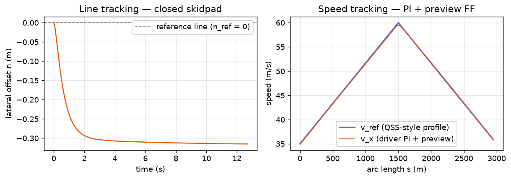
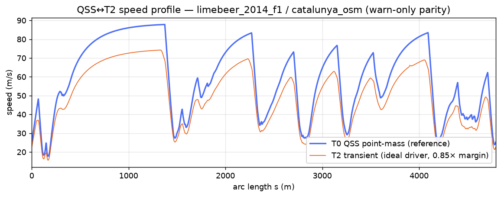

<!-- SPDX-License-Identifier: AGPL-3.0-only -->
# The ideal driver — MacAdam preview steering + PI speed tracking

This page documents the transient tier's ideal deterministic driver
([`outlap_vehicle::control::Driver`]), the `control`-phase block that closes the T2 loop: it steers
the car along the target line and tracks the QSS speed profile. It is a clean-room implementation
from the cited literature; no other project's source was consulted or copied.

The driver is **ideal and deterministic** in v1 (Locked Decision #21): the gains are vehicle data,
there is no skill or noise model yet. Two future Monte-Carlo error channels are anticipated but not
built here — a "wander off the line" perception error rides on the preview channels (§1), and a
"late shift" timing error rides on the PR6 shift-event queue, not on this block.

## 1. Reference: the QSS profile and the preview channels

Using the QSS speed profile as the transient driver's reference makes tier parity a built-in
regression test (HANDOFF §7.7): if the transient car cannot follow what the point-mass solver said
was achievable, the QSS↔T2 parity gate catches it. The driver never touches a track or an envelope
in the loop — the orchestrator publishes, each step, the current-station target-line channels
(`n_ref`, `κ_ref`, `v_ref`) and the **preview** channels sampled at the look-ahead station

```
s_p = s + L_p,   L_p = max(v_x · t_preview, L_floor)
```

(`n_ref(s_p)`, `κ_ref(s_p)`, `v_ref(s_p)`). The preview *time* `t_preview` — not a fixed distance —
is the human-driver invariant MacAdam (1981) identifies; the floor `L_floor` keeps the look-ahead
well-posed at low speed. The block is pure: it reads these channels and the fast state, and writes
the steer/throttle/brake bus signals plus one augmented-ODE derivative (§3).

## 2. Steering: curvature feed-forward + preview path law + yaw-rate stabilisation

The steer is a **feed-forward** that anticipates the corner, a MacAdam-style **preview feedback** that
nulls the path error, and a **yaw-rate stabiliser** that catches a slide:

```
δ_ff    = κ_ref(s_p) · (L + K_us · v_x²)                      (understeer-gradient feed-forward)
r_tgt   = v_x · κ_ref(s_p)                                    (reference yaw rate for the corner)
n_pred  = n + L_p · sin ψ_rel                                 (offset predicted at the preview point)
β       = atan2(v_y, v_x)                                     (sideslip)
recover = clamp(k_slip·(|β| − β_lim), 0, 1)                   (slide severity: 0 gripping, 1 loose)
δ_fb    = (1−recover)·k_prev·(n_ref(s_p) − n_pred) − k_ψ·ψ_rel + k_r·(1 + 5·recover)·(r_tgt − r)
δ       = clamp(δ_ff + δ_fb, ±δ_max)
```

**Feed-forward.** `δ_ff = κ(L + K_us·v²)` is the classical understeer-gradient steering law: `L·κ`
is the Ackermann (kinematic) steer for the target curvature, and `K_us·v²·κ = K_us·a_y` is the extra
steer an understeering car needs to generate the lateral acceleration `a_y = v²κ`. `K_us` is the
vehicle's **own** understeer gradient `K = dδ/da_y − L/v²` (`T1Vehicle::understeer_gradient`,
Decision #8), so the same driver data transfers across cars. At steady cornering `δ_fb → 0` and the
FF alone delivers the target yaw `r → v·κ` (verified by the `step_steer` property test). The offset is
predicted from the body heading (a well-damped path law; extrapolating the sideslip-laden lateral
velocity over the long preview arm would destabilise the transient).

**Yaw-rate stabilisation is what lets a front-steer driver catch a slide.** Damping the yaw to the
*reference* rate `r_tgt = v·κ_ref` — not to zero — makes the driver **counter-steer** whenever the
car over-rotates (`|r| > |r_tgt|` ⇒ oversteer). Two things escalate the recovery as the rear steps
out: the path term, which would steer *further into* the corner and worsen the slide, is faded out by
`(1 − recover)`; and the counter-steer gain ramps up sharply (`k_r·(1 + 5·recover)`) so a loose rear
gets strong opposite lock. When gripping (`recover ≈ 0`) the law reduces to gentle path-following +
yaw damping and does not touch clean cornering (the smooth-track property tests are unchanged). This
is the **minimal yaw stabilisation** the ideal driver needs to lap a real circuit before PR6's
torque-vectoring controller (`ΔM_z = K_p·(r_tgt − r)`) adds an *active* yaw moment; until then, on a
real track, the driver also tracks a grip margin (a fraction of the QSS speed profile) so the
rear-drive car stays inside its combined-slip limit. Gains are Limebeer-tuned literature defaults
(§4), surfaced as estimated.

## 3. Speed: PI tracking with a preview feed-forward (augmented-ODE integral)

The longitudinal loop tracks the QSS profile `v_ref` with a preview feed-forward and a PI:

```
e_v  = v_ref(s) − v_x
a_ff = (v_ref(s_p) − v_x) · v_x / L_p                         (accel to reach the previewed speed)
u    = a_ff / a_scale + k_p·e_v + k_i·ξ                       (a_scale = gg-headroom usable accel)
throttle = max(clamp(u, ±1), 0) · (1 − recover),  brake = max(−clamp(u, ±1), 0)
ξ̇  = e_v         (held at 0 when the pedal is saturated and e_v would push further — anti-windup)
```

**Feed-forward.** `a_ff` is the constant acceleration that would carry the car from its current speed
to the previewed target speed over the look-ahead distance; dividing by `a_scale`, the **gg-headroom
usable acceleration**, maps that demand onto the `[−1, 1]` pedal axis. Anticipating the braking/
throttle zone this way lets the PI trim only the residual, which is what keeps the transient lap
close to the point-mass reference.

**Power is cut as the rear slides.** The throttle is scaled by `(1 − recover)` — the same slide
factor that fades the steer path term (§2) — so a rear that steps out under power loses the drive that
is overloading it and can recover grip. This is the longitudinal half of the minimal stabiliser.

**The integral is a real state, not a per-step snapshot.** `ξ = ∫(v_ref − v_x) dt` is carried in the
fast state as a continuous **augmented ODE** ([`ControllerState::SpeedIntegral`]) and advanced by the
split integrator's RK sweep alongside the chassis DOF — so the PI loop is stepped consistently across
the Runge–Kutta stages (a step-boundary accumulator would be inconsistent within a stage and degrade
the integrator order). Anti-windup is **conditional integration**: `ξ̇` is held at zero whenever the
pedal is already saturated and the error would drive it further into saturation, with a hard clamp on
`|ξ|` as a backstop. The whole loop is deterministic (fixed `dt`, fixed-order reductions), so a lap is
bit-reproducible across runs (verified by the full-lap determinism test).

## 4. Gains and defaults

Every gain is vehicle data (a new optional `driver:` section, schema `vehicle/1.5`). Unset gains fall
back to the literature defaults below — tuned once on `limebeer_2014_f1` (Decision #8) — and each
default is surfaced as **estimated** in the loaded-model report (nothing silent, #41). `K_us` is the
one derived quantity: it comes from the vehicle's own `understeer_gradient()` at assembly, not from
the file.

| symbol | field | default | meaning |
|--------|-------|---------|---------|
| `t_preview` | `preview_time_s` | 0.6 s | MacAdam preview time (`L_p = v·t_preview`) |
| `k_prev` | `preview_gain` | 0.2 rad/m | preview lateral-error steer gain |
| `k_ψ` | `heading_gain` | 1.0 rad/rad | heading-error steer gain |
| `k_r` | `yaw_damping` | 0.3 rad/(rad/s) | yaw-rate damping |
| `δ_max` | `max_steer_rad` | 0.5 rad | road-wheel steer saturation |
| `k_p` | `speed_kp` | 0.2 pedal/(m/s) | speed proportional gain |
| `k_i` | `speed_ki` | 0.05 pedal/(m/s·s) | speed integral gain |
| `a_scale` | `ff_accel_scale_mps2` | 15 m/s² | gg-headroom usable accel (feed-forward normaliser) |
| `β_lim` | `stability_slip_limit_rad` | 0.05 rad | sideslip at which the slide recovery engages |
| `k_slip` | `stability_slip_gain` | 8 /rad | how fast recovery ramps in past `β_lim` |

The PI gains follow a bandwidth rule (the proportional gain sets the speed-loop crossover; the
integral time `k_p/k_i` removes the residual drag/rolling offset that would otherwise leave a
steady-state tracking error and cost lap-time parity).

## 5. Minimal actuation (PR5 scope)

To close a lap the driver's demands are turned into forces by the minimal
[`Powertrain`](outlap_vehicle::control::Powertrain) block: throttle scales the **best-gear** wheel
drive-force ceiling `F_drive_max(v)` — the QSS traction envelope, which already picks the gear at
each speed, so the shift is *instantaneous and ideal* — distributed to the wheels by the static axle/
side split (reusing `DriveControl::Split`), and brake scales a balance-bar-split friction torque. The
full shift state machine (torque-cut → ratio-swap → clutch-ramp, consuming `shift_time_s` on the
step-boundary event queue) and the yaw-moment torque-vectoring allocator are PR6.

## 6. Behaviour

The two loops track cleanly on smooth tracks — the closed-loop skidpad holds the reference line to a
small proportional offset, and the speed loop follows a QSS-style profile almost exactly:



On the real `catalunya_osm` racing line, the transient car follows the whole QSS speed profile (below,
seeded at the straightest station and tracking a grip margin of the profile — see the warn-only
parity report). PR6's active torque vectoring closes the margin; the residual is the transient-vs-
point-mass parity signal PR10 gates.



## References

- C. C. MacAdam, "Application of an Optimal Preview Control for Simulation of Closed-Loop Automobile
  Driving," *IEEE Transactions on Systems, Man, and Cybernetics*, SMC-11(6), 1981, pp. 393–399 —
  the preview-point steering formulation.
- G. Perantoni & D. J. N. Limebeer, "Optimal control for a Formula One car with variable
  parameters," *Vehicle System Dynamics* 52(5), 2014 — the reference car and the QSS-profile target.
- T. D. Gillespie, *Fundamentals of Vehicle Dynamics*, SAE, 1992 — the understeer-gradient steering
  law `δ = L/R + K_us·a_y`.

No external open-source project was consulted for the driver; it is authored from the literature
above.
