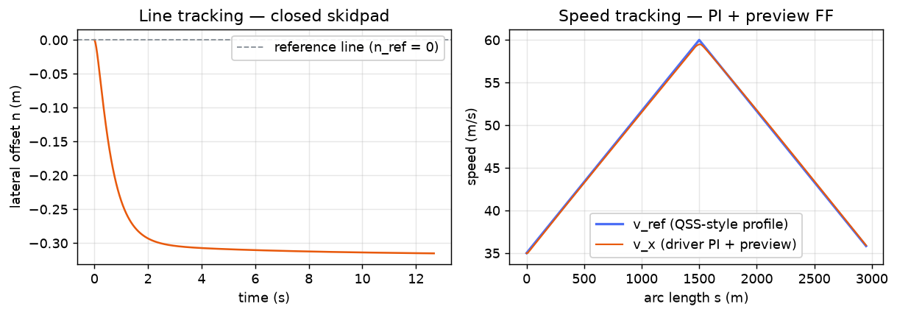
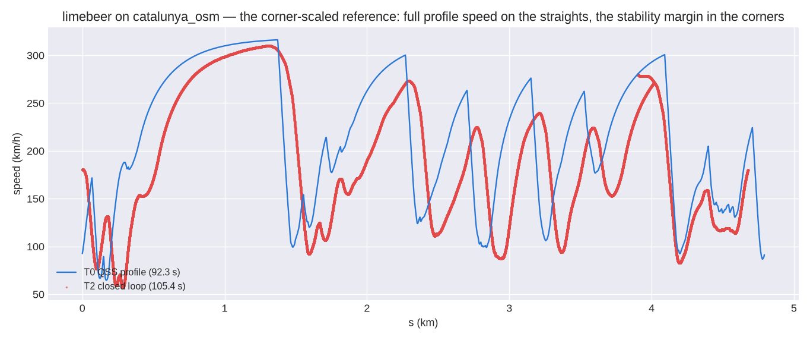

<!-- SPDX-License-Identifier: AGPL-3.0-only -->
# The ideal driver: MacAdam preview steering and PI speed tracking

This page documents the ideal deterministic driver of the transient tier,
[`outlap_vehicle::control::Driver`]. It is the block in the `control` phase that closes the T2 loop.
It steers the car along the target line, and it tracks the QSS speed profile.

It is a clean-room implementation, from the literature cited at the end. No source from another
project was read or copied.

The driver is **ideal and deterministic** in v1 (Locked Decision #21). Its gains are vehicle data.
There is no model of skill and no model of noise, yet.

Two future error channels for Monte Carlo work are anticipated, and neither is built here. A "wander
off the line" perception error will ride on the preview channels (§1). A "late shift" timing error
will ride on the shift-event queue of PR6, not on this block.

## 1. The reference: the QSS profile and the preview channels

The transient driver takes the QSS speed profile as its reference. That choice makes tier parity a
built-in regression test (HANDOFF §7.7). If the transient car cannot follow what the point-mass
solver called achievable, the parity gate between QSS and T2 catches it.

The driver never touches a track or an envelope inside the loop. On each step the orchestrator
publishes the target-line channels at the current station — `n_ref`, `κ_ref`, `v_ref` — and the
**preview** channels, sampled at the look-ahead station

```
s_p = s + L_p,   L_p = max(v_x · t_preview, L_floor)
```

which gives `n_ref(s_p)`, `κ_ref(s_p)`, and `v_ref(s_p)`.

The preview *time*, `t_preview`, is what stays invariant for a human driver. MacAdam (1981)
identifies this, and it is why the look-ahead is a time and not a fixed distance. The floor
`L_floor` keeps the look-ahead well-posed at low speed.

The block is pure. It reads those channels and the fast state. It writes the steer, throttle, and
brake signals to the bus, plus one derivative for the augmented ODE (§3).

## 2. Steering: curvature feed-forward, a preview path law, and yaw-rate stabilization

The steer has three parts. A **feed-forward** anticipates the corner. A MacAdam-style **preview
feedback** nulls the path error. A **yaw-rate stabilizer** catches a slide.

```
δ_ff    = κ_ref(s_p) · (L + K_us · v_x²)                      (understeer-gradient feed-forward)
r_tgt   = v_x · κ_ref(s_p)                                    (reference yaw rate for the corner)
n_pred  = n + L_p · sin ψ_rel                                 (offset predicted at the preview point)
β       = atan2(v_y, v_x)                                     (sideslip)
recover = clamp(k_slip·(|β| − β_lim), 0, 1)                   (slide severity: 0 gripping, 1 loose)
δ_fb    = (1−recover)·k_prev·(n_ref(s_p) − n_pred) − k_ψ·ψ_rel + k_r·(1 + 5·recover)·(r_tgt − r) − k_β·β
δ       = clamp(δ_ff + δ_fb, ±δ_max)
```

**The feed-forward.** `δ_ff = κ(L + K_us·v²)` is the classical steering law of the understeer
gradient. `L·κ` is the Ackermann, or kinematic, steer for the target curvature. `K_us·v²·κ =
K_us·a_y` is the extra steer that an understeering car needs, to generate the lateral acceleration
`a_y = v²κ`.

`K_us` is the car's **own** understeer gradient, `K = dδ/da_y − L/v²`. It comes from
`T1Vehicle::understeer_gradient` (Decision #8). The same driver data therefore transfers across
cars.

In steady cornering, `δ_fb → 0`, and the feed-forward alone delivers the target yaw, `r → v·κ`. The
`step_steer` property test verifies this.

The offset is predicted from the body heading, which gives a well-damped path law. Extrapolating the
lateral velocity, which carries the sideslip, over the long preview arm would destabilize the
transient.

**Yaw-rate stabilization is what lets a front-steer driver catch a slide.** The driver damps the yaw
toward the *reference* rate, `r_tgt = v·κ_ref`, and not toward zero. It therefore **counter-steers**
whenever the car over-rotates, which is when `|r| > |r_tgt|`, and means oversteer.

Two things escalate the recovery as the rear steps out. The path term would steer *further into* the
corner and worsen the slide, so `(1 − recover)` fades it out. And the counter-steer gain ramps up
sharply, through `k_r·(1 + 5·recover)`, so a loose rear gets strong opposite lock.

When the car grips, `recover ≈ 0`. The law then reduces to gentle path-following plus yaw damping,
and it does not touch clean cornering. The property tests on a smooth track are unchanged.

**Sideslip damping catches the slide that the yaw damper cannot see.** The yaw-rate term reacts only
to *rotational* slides, where `r` is far from `r_tgt`.

A **translational** slide is invisible to it. That is the car crabbing off the line with its nose
crooked, while `r ≈ r_tgt ≈ 0`. It is the failure mode measured after corner exit. The path term is
faded out at exactly that moment.

The `−k_β·β` term closes that gap. It steers the heading back toward the velocity vector, which
kills the quasi-equilibrium of the crab. In clean cornering `β` is small, at 1° to 3°, and the term
is a mild trim that the feed-forward absorbs.

On a real track the driver also tracks a **grip margin that scales with the corner**. This is the
shaped speed reference of `outlap_qss::margin`. It has four parts: the full QSS profile where
lateral demand is low; a stability margin, 0.85 by default, where the profile rides the lateral grip
limit; the margin of each corner propagated back through its braking zone, plus a settle ramp; and
feasibility passes for braking and traction that know the friction ellipse, so that the shaped
target is dynamically reachable at the entry and exit of every corner.

The margin at the limit is the honest boundary of this driver. Nothing filters the QSS envelope
boundary for open-loop stability, and tracking the raw profile spins the car.

The gains are literature defaults, tuned on the Limebeer car (§4), and surfaced as estimated.

## 3. Speed: PI tracking with a preview feed-forward, as an augmented ODE

The longitudinal loop tracks the QSS profile `v_ref`, with a preview feed-forward and a PI
controller:

```
e_v  = v_ref(s) − v_x
a_ff = (v_ref(s_p) − v_x) · v_x / L_p                         (accel to reach the previewed speed)
u    = a_ff / a_scale + k_p·e_v + k_i·ξ                       (a_scale = gg-headroom usable accel)
tc       = clamp(1 − k_κ·(max_w κ_w − κ_lim), 0, 1)           (drive wheel-slip governor)
throttle = max(clamp(u, ±1), 0) · (1 − recover) · tc,  brake = max(−clamp(u, ±1), 0)
ξ̇  = e_v         (held at 0 when the pedal is saturated and e_v would push further — anti-windup)
```

**The feed-forward.** `a_ff` is the constant acceleration that would carry the car from its current
speed to the previewed target speed, over the look-ahead distance. Dividing by `a_scale`, the
**usable acceleration in the gg headroom**, maps that demand onto the pedal axis, `[−1, 1]`.

Anticipating the braking zone and the throttle zone this way leaves the PI to trim only the
residual. That is what keeps the transient lap close to the point-mass reference.

**Power is cut as the rear slides.** `(1 − recover)` scales the throttle. It is the same slide factor
that fades the path term in the steer (§2). A rear that steps out under power therefore loses the
drive that is overloading it, and can recover grip. This is the longitudinal half of the minimal
stabilizer.

**The pedal is also modulated against wheelspin.** With race gearing, the wheel torque in a low gear
is a *multiple* of the grip limit. Even a modest pedal fraction can therefore light up the driven
axle in the middle of a corner exit. That was the measured trigger for slides once the `f1_2026`
reference gained its realistic final drive.

The governor `tc` cuts the pedal in proportion, as the worst positive lagged slip ratio on the drive
side passes the region of the force peak, `κ_lim`. Braking slips are negative, and it leaves them
untouched.

This is the ideal driver modulating the pedal the way a human does. It is not a traction-control
system on the car. It reads the same lagged slip states that the tire model integrates, and it does
so deterministically.

**The integral is a real state, not a snapshot at each step.** `ξ = ∫(v_ref − v_x) dt` is carried in
the fast state as a continuous **augmented ODE**, [`ControllerState::SpeedIntegral`]. The RK sweep of
the split integrator advances it alongside the chassis DOF. The PI loop is therefore stepped
consistently across the Runge–Kutta stages. An accumulator at the step boundary would be
inconsistent within a stage, and it would degrade the order of the integrator.

Anti-windup is **conditional integration**. `ξ̇` is held at zero whenever the pedal is already
saturated and the error would drive it further into saturation. A hard clamp on `|ξ|` is the
backstop.

The whole loop is deterministic, with a fixed `dt` and fixed-order reductions. A lap is therefore
bit-reproducible across runs, which the full-lap determinism test verifies.

## 4. Gains and defaults

Every gain is vehicle data, in a new optional `driver:` section of schema `vehicle/1.5`.

A gain that is not set falls back to the literature default below. Those defaults were tuned once,
on `limebeer_2014_f1` (Decision #8). The loaded-model report surfaces each default as **estimated**.
Nothing is silent (#41).

`K_us` is the one derived quantity. It comes from the car's own `understeer_gradient()` at assembly,
not from the file.

| symbol | field | default | meaning |
|--------|-------|---------|---------|
| `t_preview` | `preview_time_s` | 0.6 s | MacAdam preview time (`L_p = v·t_preview`) |
| `k_prev` | `preview_gain` | 0.2 rad/m | preview lateral-error steer gain |
| `k_ψ` | `heading_gain` | 1.0 rad/rad | heading-error steer gain |
| `k_r` | `yaw_damping` | 0.3 rad/(rad/s) | yaw-rate damping |
| `δ_max` | `max_steer_rad` | 0.5 rad | road-wheel steer saturation |
| `k_p` | `speed_kp` | 0.2 pedal/(m/s) | speed proportional gain |
| `k_i` | `speed_ki` | 0.05 pedal/(m/s·s) | speed integral gain |
| `a_scale` | `ff_accel_scale_mps2` | 15 m/s² | gg-headroom usable accel (feed-forward normaliser) |
| `β_lim` | `stability_slip_limit_rad` | 0.05 rad | sideslip at which the slide recovery engages |
| `k_slip` | `stability_slip_gain` | 8 /rad | how fast recovery ramps in past `β_lim` |
| `k_β` | `sideslip_damping` | 0.5 rad/rad | sideslip-damping steer (the translational-slide correction) |
| `κ_lim` | `traction_slip_limit` | 0.09 | drive-wheel slip ratio where the pedal governor starts cutting |
| `k_κ` | `traction_slip_gain` | 25 /slip | governor cut rate past `κ_lim` |

The PI gains follow a rule on bandwidth. The proportional gain sets the crossover of the speed loop.
The integral time, `k_p/k_i`, removes the residual offset from drag and rolling resistance. Without
it, a steady-state tracking error would remain, and it would cost parity in lap time.

## 5. Minimal actuation, the scope of PR5

To close a lap, the minimal [`Powertrain`](outlap_vehicle::control::Powertrain) block turns the
demands of the driver into forces.

Throttle scales the ceiling on wheel drive force in the **best gear**, `F_drive_max(v)`. That is the
QSS traction envelope, which already picks the gear at each speed. The shift is therefore
*instantaneous and ideal*. The static split between axles and sides distributes the force to the
wheels, reusing `DriveControl::Split`.

Brake scales a friction torque, split by the balance bar.

Two things are PR6: the full shift state machine, which cuts torque, swaps the ratio, and ramps the
clutch, consuming `shift_time_s` on the event queue at step boundaries; and the torque-vectoring
allocator for yaw moment.

## 6. Behavior

Both loops track cleanly on a smooth track. The closed-loop skidpad holds the reference line to a
small proportional offset, and the speed loop follows a QSS-style profile almost exactly:



On the real racing line at `catalunya_osm`, the transient car tracks the **corner-scaled** reference.
The figure below is seeded at the straightest station. The car meets the raw QSS profile at the top
of the straights, and holds the stability margin through the corners. The residual gap in the
corners is the recorded parity signal between the transient tier and the point mass
(`docs/validation/limebeer.md`).



## References

- C. C. MacAdam, "Application of an Optimal Preview Control for Simulation of Closed-Loop Automobile
  Driving," *IEEE Transactions on Systems, Man, and Cybernetics*, SMC-11(6), 1981, pp. 393–399 —
  the preview-point steering formulation.
- G. Perantoni & D. J. N. Limebeer, "Optimal control for a Formula One car with variable
  parameters," *Vehicle System Dynamics* 52(5), 2014 — the reference car and the QSS-profile target.
- T. D. Gillespie, *Fundamentals of Vehicle Dynamics*, SAE, 1992 — the understeer-gradient steering
  law `δ = L/R + K_us·a_y`.

No external open-source project was consulted for the driver. It is authored from the literature
above.
