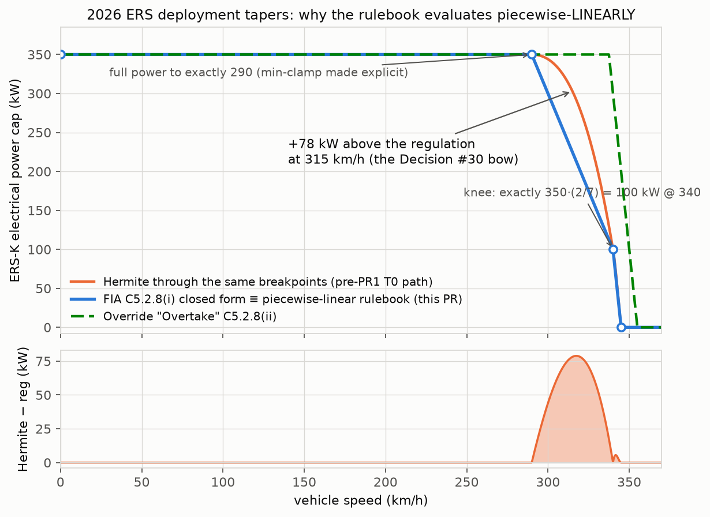
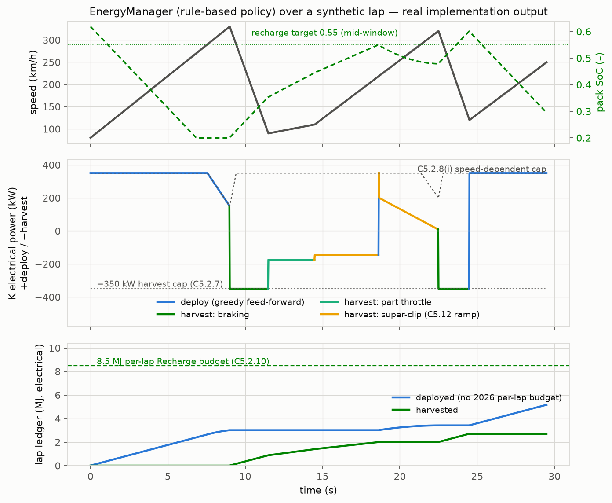
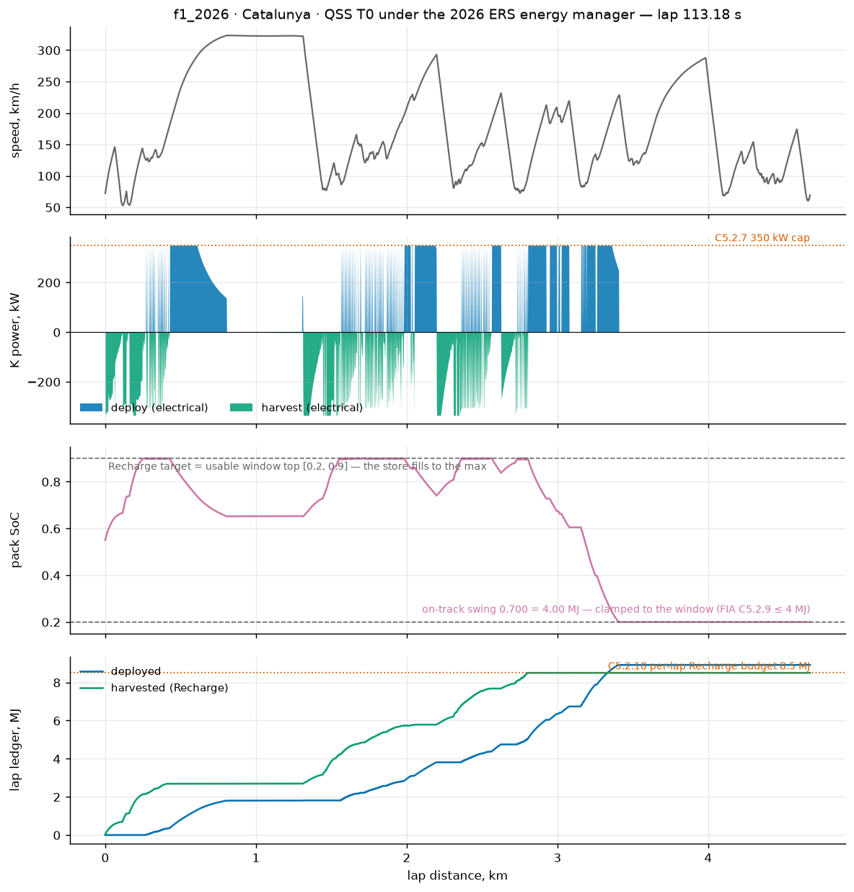
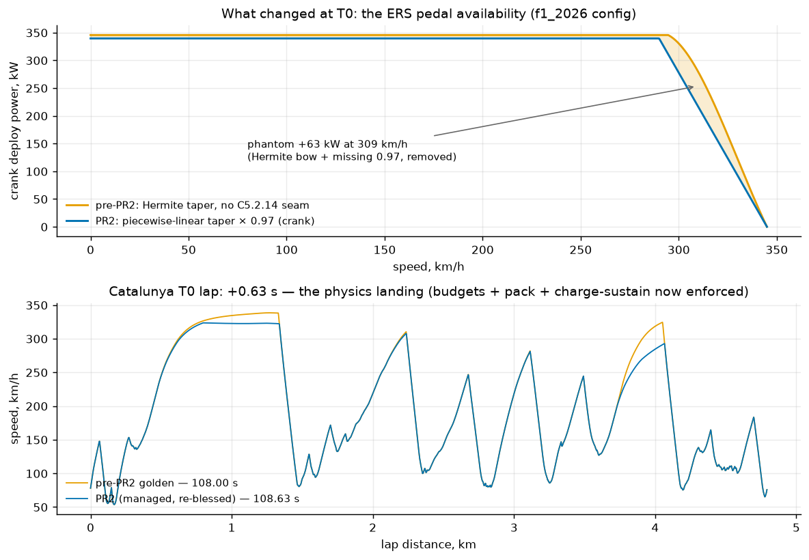
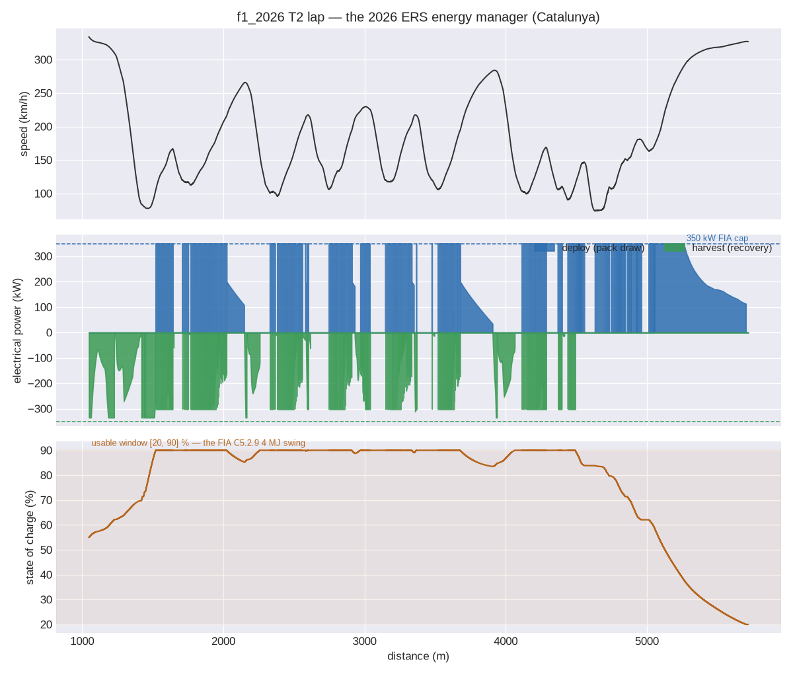

<!-- SPDX-License-Identifier: AGPL-3.0-only -->
# ERS energy manager — the 2026-Formula-1 rulebook as a tier-agnostic library

A modern hybrid race car does not simply "have 350 kW extra": *when* the electrical machine may
push, how hard at each speed, how much energy may be recovered per lap, and how the ECU sneaks
recharge out of the engine on the straights are all regulated behavior — and they decide race
strategy. `outlap-powertrain` implements that behavior once, as a pure, allocation-free,
wasm-clean library both solver families consume (`crates/outlap-powertrain`): the **rulebook**
(the regulations as data + queries), the **per-lap energy ledger**, and the **energy manager**
(a pure `decide(inputs, ledger) → command` control-phase policy). The quasi-static (QSS) march
and the transient (T2/T3) loop call the *same* implementation, so cross-tier energy parity
measures physics — never two hand-written copies of the rules.

This is a **clean-room flagship model**. It is implemented from the primary sources below; no
other project's source was consulted.

## Sources

- **FIA 2026 Formula 1 Regulations, Section C [Technical], Issue 19 (2026-06-25)** — articles
  C5.2.3–C5.2.5 (fuel-energy flow), C5.2.7 (±350 kW ERS-K electrical cap), C5.2.8 (deployment and
  override speed tapers), C5.2.9 (the 4 MJ usable SoC window), C5.2.10 (the per-lap Recharge
  budget and the override bonus), C5.2.11 (500 Nm crank torque cap), C5.2.14 / C5.2.21 (the fixed
  0.97 electrical↔mechanical correction), C5.12.4–C5.12.7 (the power-demand ramp-down).
- **FIA 2026 Formula 1 Regulations, Section B [Sporting], Issue 07 (2026-06-25)** — B7.2
  (override activation / Detection Gap; per-event parameters).

> ⚠ **Version trap.** The widely-indexed *"2026 F1 Technical Regulations PU — Issue 1
> (2022-08-16)"* PDF is the original draft and disagrees with the in-force rules: its taper was
> `P = 1850 − 5v` with a 150 kW floor at ≥ 340 km/h, it had no Override mode, and harvest was
> 9 MJ/lap. Everything below cites Issue 19 or later.

The *mechanisms* are architecture; the *numbers* are `vehicle.yaml` config data (the regulations
themselves make most of them per-event parameters, B7.2.1b). A GT hybrid with a 120 kW machine
and a 3 MJ harvest budget is the same rulebook with a different `ers:` block.

## One conversion seam: everything regulatory is electrical

Every cap and budget in C5.2 is written at the **CU-K DC bus** — the electrical side. The
rulebook therefore keeps all regulatory quantities electrical and exposes exactly one conversion
to the mechanical crank side, the fixed factor of C5.2.14 (default 0.97, configurable as
`ers.elec_mech_factor`):

```
deploy:   P_mech = 0.97 · P_elec          (C5.2.14)
harvest:  P_elec = 0.97 · P_mech          (C5.2.21, "or its inverse")
```

Two consequences the tests pin down:

- at the 350 kW electrical harvest cap the axle may absorb ≈ **360.8 kW mechanical**
  (350/0.97) — the regen envelope is min-composed on the mechanical side *before* conversion;
- the per-lap ledger integrates **electrical** command power. Integrating mechanical power would
  under-count harvest by 3% and over-count deploy by 3% — a systematic error inside any ≤ 1%
  parity band.

The MGU-K torque cap (C5.2.11, 500 Nm crank-referenced) binds before the power cap at low speed;
it is carried by the MGU-K `.ptm` torque envelope (no new schema field) and min-composed on the
mechanical side: `P ≤ τ(ω)·ω`.

## Deployment tapers — evaluated piecewise-linearly (a recorded Decision #30 exception)

C5.2.8(i) writes the deployment limit as closed-form lines over speed (kW over km/h):

```
P(v) = min(350, 1800 − 5·v)        v < 340
P(v) = 6900 − 20·v                 340 ≤ v < 345
P(v) = 0                           v ≥ 345
```

Full power holds to exactly 290 km/h (where `1800 − 5·290 = 350` — the plateau *is* the min-clamp
made explicit), and the knee at 340 km/h is exactly `100 kW = 350·(2/7)`. The override
("Overtake") curve, C5.2.8(ii), is `P = min(350, 7100 − 20·v)`, zero at ≥ 355 km/h — full power
to 337.5 km/h.

As breakpoints (the `vehicle.yaml` `SpeedTaper` form):

```yaml
deployment:
  taper_vs_speed: { speed_kph: [0, 290, 340, 345], power_frac: [1.0, 1.0, 0.2857142857142857, 0.0] }
override_mode:
  taper_vs_speed: { speed_kph: [0, 337.5, 355],    power_frac: [1.0, 1.0, 0.0] }
```

These breakpoints reproduce the closed forms **only under piecewise-linear evaluation**. outlap's
interpolation standard (Locked Decision #30) is the shared monotone cubic Hermite — but a Hermite
through these breakpoints is *wrong here*: the flat 0–290 plateau forces a zero tangent at
290 km/h, and the cubic bows the [290, 340] segment up to **+78 kW above the regulation line at
315 km/h**. Regulatory closed-form piecewise-linear formulas are therefore evaluated by the exact
piecewise-linear interpolant (`outlap_core::PiecewiseLinear`) — the one recorded exception to
Decision #30, scoped to closed-form regulations; gridded maps (torque envelopes, aero maps) stay
on the Hermite. The property test evaluates the rulebook against the closed-form articles at
10 000 random *interior* speeds — the test a Hermite fails by construction.



## Budgets and the per-lap ledger

- **Harvest ("Recharge")**: ≤ `per_lap_harvest_mj` per lap (C5.2.10; 8.5 MJ baseline,
  event-reducible). **All** harvest paths — braking regen, part-throttle harvest, ICE-driven
  back-drive — count against this single integral. With Override active the lap gains
  `extra_energy_per_lap_mj` (+0.5 MJ) of **extra harvest allowance** (C5.2.10(iii)) — a harvest
  bonus, *not* a deployment budget (the field's earlier doc-comment said "energy allowance in
  override"; it was corrected while the field had zero consumers).
- **Deployment**: **no per-lap budget exists in the 2026 regulations** (C5.2, absence verified) —
  deployment is bounded only by the power curves and the SoC window. The optional
  `per_lap_deploy_mj` stays supported as generic config for non-F1 rule sets, and it is **never
  estimated**: the former loader heuristic that back-filled it with `es.capacity_mj` was removed
  (a phantom 4 MJ/lap cap on an F1 car the moment budgets are enforced), and a property test
  holds that a null budget stays unenforced.
- **The ES swing limit** (C5.2.9): `max SoC − min SoC ≤ 4 MJ` on track — a regulatory *swing*, not
  a capacity. `ers.es.capacity_mj` is that limit, enforced independently of the pack's physical
  `soc_window` by the running-band clip (see "QSS tier wiring" below); results also carry the
  recorded on-track max−min SoC in MJ.

The ledger ([`LapEnergyLedger`]) is caller-clocked: `record(cmd, dt)` each step, `reset()` at the
lap boundary. A lap boundary resets the **ledger**, never the pack — the store carries over.
Budget enforcement is by construction: the manager clips each command so `ledger + cmd·dt` cannot
exceed a budget, and the closure property `Σ cmd·dt == ledger` holds bit-for-bit.

## The rule-based v1 policy

§8.3's V1 contract — *"deploy below taper speed, harvest under braking, recharge on designated
straights"* — as a priority list, decided once per step boundary (mode changes are discrete
step-boundary events, §11.2):

1. **Braking** → harvest through the brake-blend path:
   `P_elec = min(0.97·min(P_regen_envelope, P_brake_demand), P_harvest_cap, budget headroom)`.
2. **Driving with recharge wanted** — recharge phases enabled, SoC below the configurable target
   (`recovery.recharge_target_soc`, **default: the top of the usable `soc_window`** — the store
   recharges toward the maximum the pack allows; a pack/car property, overridable per vehicle),
   ICE surplus available, budget left:
   - *part throttle*: the ICE covers the driver's demand gap and the K harvests the surplus;
   - *full throttle* ("super-clip"): the K's demand ramps down from the previous level toward
     back-drive, rate-limited by the C5.12 bounds — initial step ≤ 150 kW, thereafter ≤ 50 kW/s,
     episode total ≤ 700 kW (`recovery.ramp_initial_step_kw` / `ramp_rate_kw_per_s` /
     `ramp_total_kw`). Note the full swing from +350 kW deploy to −350 kW harvest *is* the 700 kW
     total.
3. **Driving otherwise** → **greedy feed-forward deployment**: the full curve
   `min(cap, cap·taper(v))` whenever driver demand is positive. Deliberately demand-*gated*, not
   demand-scaled, and with **no SoC input** — SoC starvation is honest physics that the pack's
   discharge ceiling clamps downstream (D-M6-8).
4. **Coasting** → idle.

The command is electrical; the tier wiring converts through the seam and then applies the
ceilings it owns (torque envelope at the live shaft speed, machine-thermal derate, pack charge
acceptance — the pack has the final word).

Override activation: the per-run `override` flag **wins unconditionally** over the schema
`activation` hint (which stays a stage-2 strategy annotation). In single-car sessions the 2026
sporting regulations simply enable Overtake at all times (B7.2.2–B7.2.3) — that is the v1 hook.



## The u(s) schedule policy

The §8.3 control vector `u(s) = [deploy/regen ∈ [−1,1], override_flag, lift_point, shift_map_id]`
is accepted as a per-station data schedule ([`UsSchedule`]) — an API input, not a vehicle-schema
document (control input ≠ car identity; stage 2 formalizes the file format). The manager executes
the deploy/regen fraction (scaling the budget-clipped envelope command) and the override flag;
`lift_point` (driver speed-loop lift hook) and `shift_map_id` (named shift maps) are carried per
station for the M6 PR4 wiring. The rule-based and scheduled policies emit the same `ErsCommand`
type, so tier wiring and the parity gate are policy-agnostic.

## QSS tier wiring (M6 PR2)

The quasi-steady tier consumes the manager inside its slow-state march: per station along the
solved profile, the march classifies the station from the point-mass force balance
(`F = m·(a_x + drag + g·sinθ)`; drive / braking, with full throttle at ≥ 98% of the pedal
availability), builds the manager's inputs, and realizes the command against the ceilings the
tier owns — **the pack has the final word**. The realized electric wheel-force share then enters
the next profile solve as an ADDITIVE per-station slice: the machine/battery caps scale the
electric share only, never the ICE.



**Deployment** (electrical → wheel force): `min(cap·taper(v), pack discharge ceiling)` → × 0.97
(C5.2.14) → `min(machine mechanical ceiling)` → × η_driveline → `/v`. Both conversion factors
stay distinct: 0.97 is the regulation's electrical→mechanical crank factor, η the crank→wheel
driveline loss. The C5.2.11 crank torque cap is not separately enforced at this tier — the MGU-K
`.ptm` is a bare-machine map with no declared reduction ratio, so the ratio-invariant machine
power ceiling `max(τ·ω)` is the binding proxy (T2 enforces torque through the gearbox, M6 PR4).
The uncoupled pedal availability runs the same rulebook curve — retiring the tier's old
Hermite-taper, no-0.97 shortcut:



**Harvest** composes the same five ceilings as the transient tier's series regen blend
(`blend_regen`), in the same order, so parity gate #4 measures physics rather than modelling
gaps:

| # | Ceiling | QSS form |
|---|---------|----------|
| 1 | machine envelope | `max(τ·ω)` over the `.ptm` map (symmetric-machine fallback) |
| 2 | low-speed fade | linear to zero below 2 m/s (the T2 constant) |
| 3 | pack charge acceptance | `regen_power_limit_w` — design curve × kinetic derate ∧ CV taper |
| 4 | blend authority | `brakes.regen_blend.max_regen_frac` × the braking demand |
| 5 | per-axle split | balance bar over the axle(s) the machine drives |

Braking and part-throttle harvest never touch the trajectory (the calipers supply the braking
deficit; the ICE covers the part-throttle gap). Full-throttle **super-clip** back-drive is the
exception by design: the C5.12 "power limited" periods reduce net force on straights while the
store recharges, so the slice goes negative and the lap honestly slows.

The per-lap ledger banks the REALIZED command (post pack-clip) — never more than commanded, so
budgets hold by construction and lap energy closure is exact. Attribution follows D-M6-10: the
pack exchanges only the manager's electrical deploy/harvest power; the ICE covers the rest of
traction (this replaces the pre-M6 full-draw simplification for hybrids). The march is governed
by a deeper fixed outer-iteration count than the derate marches (8 vs 2): the deploy/harvest
schedule reshapes the very profile it was decided on, and at the charge-sustain equilibrium a
straight station is bistable between deploy and super-clip harvest — so the solver-fed deploy
slice is under-relaxed (ω = 0.5) to converge the fixed point. Measured residuals are recorded per
lap (`max |Δscale|`, `max |Δdeploy force|`, `|Δlap time|`), and every no-manager path keeps the
original count bit-identically.

Two **independent** limits bound the state of charge, and the march enforces both:

- **The physical usable window** (`soc_window`) — a car/battery property. `Pack::step_power` clamps
  SoC to `[0, 1]` only, so the manager path clamps to `[soc_lo, soc_hi]` each step (a segment that
  begins just inside an edge would otherwise overshoot it by one step).
- **The FIA C5.2.9 on-track swing** (`ers.es.capacity_mj`, e.g. 4 MJ) — a *regulation*: `max − min`
  SoC energy on track. Enforced by a **running-band clip** that needs no knowledge of the future
  minimum: a step may not raise SoC more than the swing above the lap's lowest point so far
  (`seen_lo + swing`), nor lower it more than the swing below the highest (`seen_hi − swing`).
  Together these bound `max − min ≤ swing` causally at every step. Where the reg band sits strictly
  inside the physical window the pack stops delivering/accepting via a power cap (ledger-consistent,
  not a post-hoc clamp), so the store simply "runs out of allocation" above its physical floor.

The two are independent: the reg limit must only *fit within* the physical window
(`capacity_mj ≤ (span) × e_pack_wh`, the load-pipeline cross-check — you cannot swing more energy
than the store holds). A pack sized exactly to the reg (the shipped f1 pack: a 4 MJ window over
[0.2, 0.9] with a 4 MJ swing limit) sees the reg band coincide with the physical window, so the
regulatory branch is inert and the physical clamp alone bounds the swing; a physically larger pack
has its swing clipped at `capacity_mj`, below the physical edge. The lap reports its on-track swing
in MJ either way. The load pipeline also cross-checks the declared `ers.es` window against the
referenced battery document (windows must agree exactly).

## T2 (transient) tier wiring (M6 PR4)

The transient tier drives the **same** `EnergyManager` through a step-boundary controller, so parity
gate #4 compares one implementation of the rules — never two hand-written copies. The controller is
a two-layer contract (HANDOFF §6.2b): it **decides once per step at the boundary** (sense → control),
publishing frozen bus channels the pure powertrain block consumes on **every** RHS evaluation (the
same pattern as the shift FSM's `torque_scale`). Because the bus is cleared and rebuilt each RHS
eval, the deploy command is re-published every eval, not once per step.



Each step the controller mirrors the QSS `ers_decide → ers_realize` chain from the boundary
throttle/brake/speed and the slow-clock-refreshed pack ceilings:

- **Deploy** is an ADDITIVE MGU-K wheel force on top of the mechanical (drivetrain-unit) traction
  curve — the sampled traction ceiling stays ERS-free, exactly as at T0/T1. The realize chain is the
  same as QSS: `min(cap·taper(v), pack discharge ceiling)` → × 0.97 → machine mechanical ceiling →
  × η / v. The pack **draw** is the manager's electrical deploy power ONLY (D-M6-10); the ICE covers
  the rest of traction. A SoC-starved pack (`discharge_power_limit_w → 0` at the window floor) simply
  stops deploying — the car runs on the engine, no panic.
- **Harvest** composes the identical five ceilings; the braking force is untouched, so the trajectory
  is regen-invariant (Decision #11) and only the banked energy differs. Full-throttle **super-clip**
  back-drive again subtracts a mechanical slice from the drive force on a "power limited" straight.
- The **per-lap ledger** banks the realized command and **resets at the start/finish line** in a
  multi-lap stint (the FIA per-lap Recharge budget is enforced lap-by-lap; the pack SoC carries).

Because the transient pack advances on the **decimated slow clock**, the pack's own regen/discharge
ceilings (which go to zero at the window edges) are refreshed every `slow_decimation` steps; a step
that begins just inside an edge can overshoot it by one slow window, so the slow stack clamps the SoC
to the usable window each slow step — the same belt-and-suspenders clamp the QSS march applies, so
both tiers bound the on-track swing identically. For the shipped f1 pack (window == reg == 4 MJ) the
physical window alone bounds the swing.

**One legitimate divergence.** The T1 g-g-g-v envelope excludes the ERS deploy by design (it is a
separate rule-based mechanism), so a hybrid that deploys ~350 kW at T2 operates *outside* the
ERS-free hull on corner exits — hull containment is therefore recorded, not asserted, for an ERS car
(the Decision #48 pattern); the honest hybrid parity is gate #4 (fuel + ERS energy per lap, PR8). The
C5.2.11 crank torque cap is likewise reused from the T0 ratio-invariant machine ceiling so the T2
realization is byte-for-byte the T0 one (best for gate #4); a true through-the-gearbox torque cap
(which only bites at low speed, where the power cap already dominates) is a recorded follow-up.

**Machine efficiency seam.** Both tiers' electric-drive efficiency (regen recovery and motoring
draw) is sampled from the machine's `.ptm` efficiency map into a speed-indexed curve at assembly
(the block stays wasm-clean — it evaluates a pre-sampled monotone cubic, never a `.ptm` table); a
machine with no efficiency map keeps the documented constant, so a car without a mapped drive unit is
byte-identical to the pre-PR4 flat-efficiency block.

### Battery ECM completion — the optional 2nd RC pair

The Thevenin pack (§8.4) gains an optional second RC branch (`ecm.rc_pairs: 2`, `battery/1.2`): a
slower relaxation arc alongside the fast one, its `r2`/`tau2` sampled from two additive sidecar
columns. The two overpotentials add in series (`V_RC = V_RC1 + V_RC2`); both are advanced by the
same exact-exponential integrator, so a two-RC pack reproduces the double-exponential Thevenin step
response to machine precision, and `r2 → 0` reduces exactly to the single-RC closed form. A one-pair
pack leaves the branch inert and is byte-identical to before.

## Not modelled (v1)

Recorded per §15; all are event config or stage-2 territory:

- per-sector 250 kW deployment caps (C5.2.8(iii)) and the non-public low-grip curves (DOC-111);
- Boost-mode SECU detail (DOC-058); the 50 km/h standing-start rule; garage-recharge rules;
- the override *Detection Gap* activation policy (B7.2 — press-confirmed within ≈1 s of the car
  ahead): stage-2; v1 exposes the unconditional per-run flag;
- C5.12 fine structure: the ≥ 1 s initial-step hold, the two-regime (50–100 kW/s) rate rule, and
  the below-210 km/h / gearshift / negative-demand carve-outs — the three simplified bounds above
  are the conservative envelope;
- driver lift-and-coast *behavior* and selectable named shift maps: the `u(s)` schedule carries all
  four components (`deploy/regen`, `override_flag`, `lift_point`, `shift_map_id`) as a validated data
  input on both tiers' entry points, and the manager **executes** the deploy/regen fraction and the
  override flag; the `lift_point` → driver-speed-loop hook and the `shift_map_id` → gearbox-FSM
  selection are accepted-but-inert (they touch the closed-loop driver and a new vehicle-schema
  surface — deferred to keep this PR's green state, resumable without touching the plumbing).

## Provenance

Clean-room per CLAUDE.md rule 2: implemented from the FIA 2026 regulations cited above (primary
sources; figures verified 2026-07-16 against Section C Issue 19 and Section B Issue 07). No
external repository was consulted for this model.
