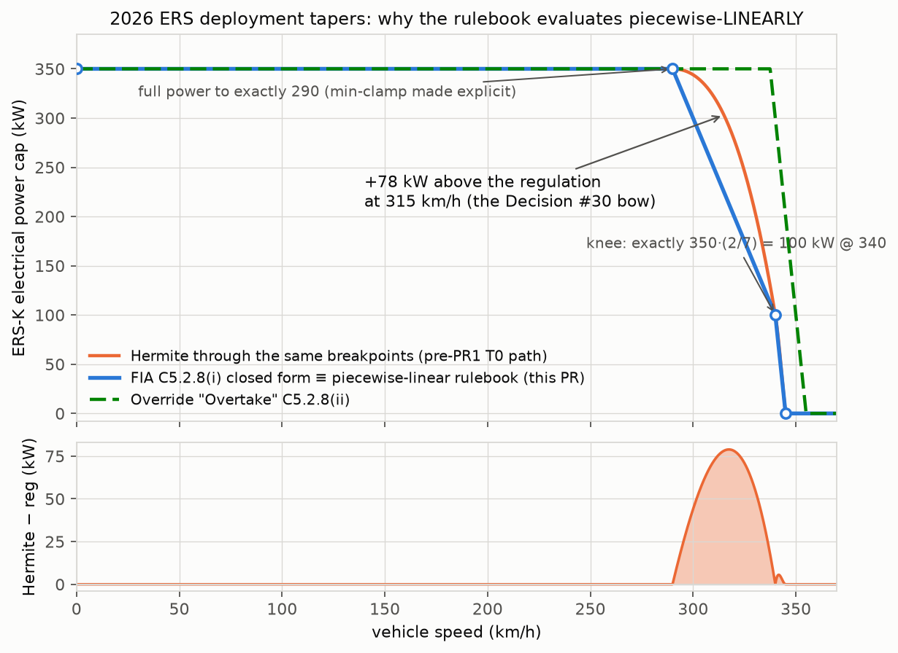
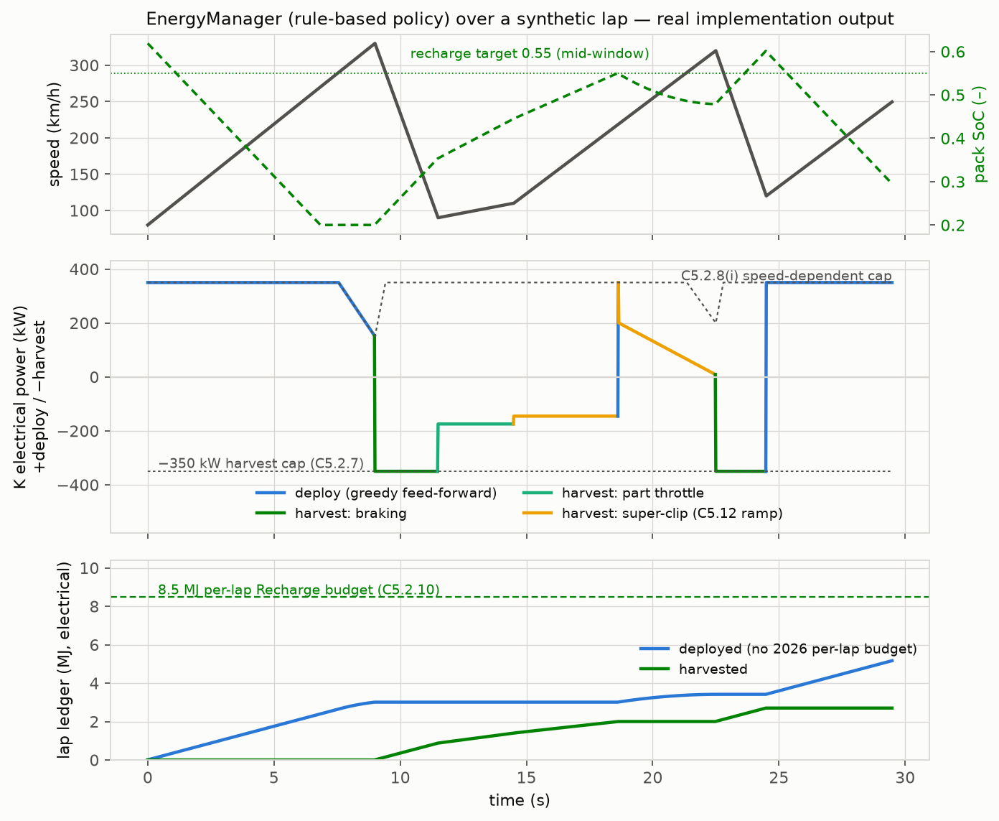
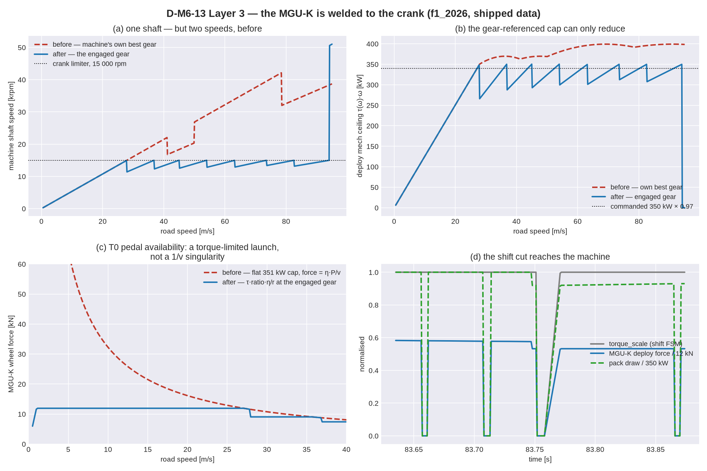
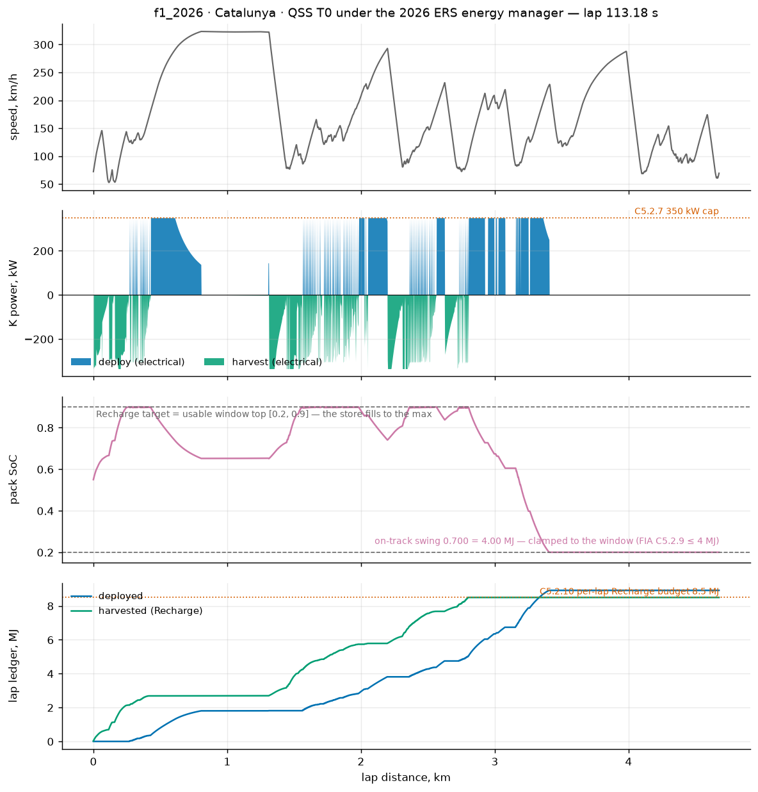
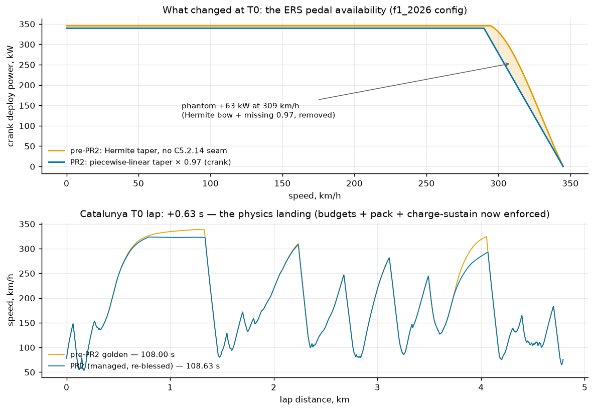
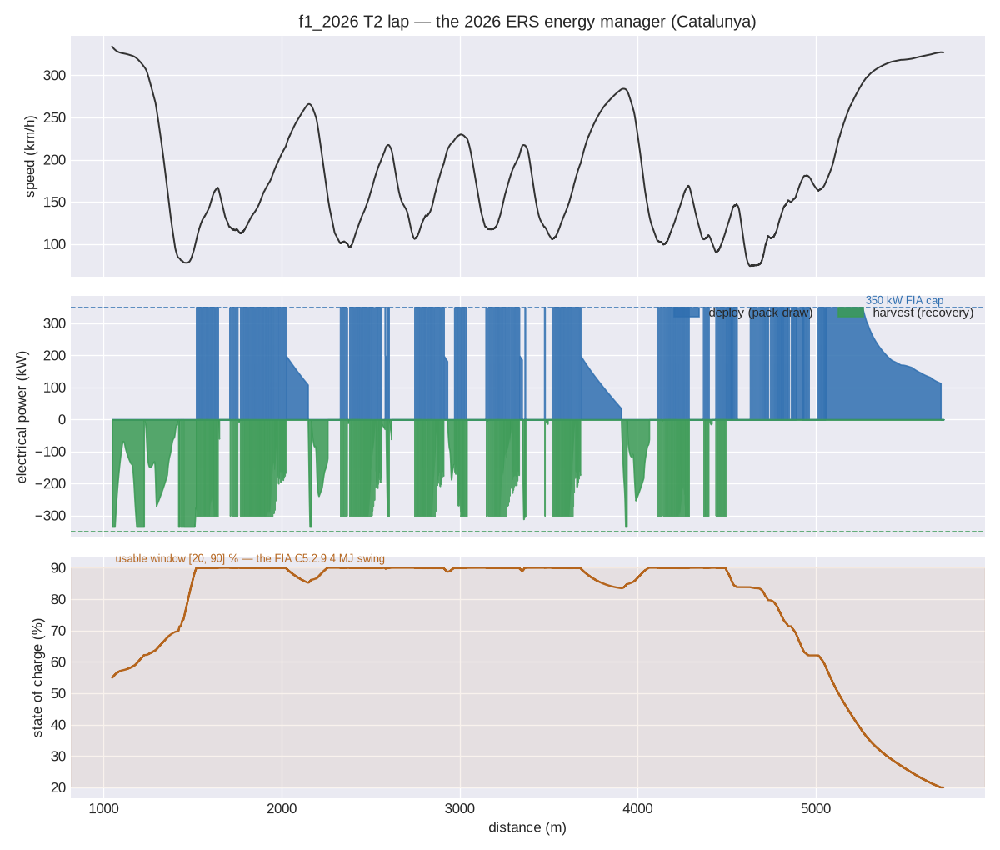

<!-- SPDX-License-Identifier: AGPL-3.0-only -->
# The ERS energy manager: the 2026 Formula 1 rulebook as a tier-agnostic library

A modern hybrid race car does not simply "have 350 kW extra". Four things are regulated behavior:
*when* the electrical machine may push, how hard it may push at each speed, how much energy it may
recover on each lap, and how the ECU takes recharge out of the engine on the straights. Those four
things decide race strategy.

`outlap-powertrain` implements that behavior once, in `crates/outlap-powertrain`. The library is
pure, allocation-free, and wasm-clean, and both solver families consume it. It has three parts: the
**rulebook**, which is the regulations as data plus queries; the **energy ledger** for each lap; and
the **energy manager**, which is a pure control-phase policy, `decide(inputs, ledger) → command`.

The quasi-static march and the transient loop for T2 and T3 call the *same* implementation. Energy
parity across tiers therefore measures physics. It never measures two hand-written copies of the
rules.

This is a **clean-room flagship model**. It is implemented from the primary sources below. No source
from another project was consulted.

## Sources

- **FIA 2026 Formula 1 Regulations, Section C [Technical], Issue 19 (2026-06-25)** — articles
  C5.2.3–C5.2.5 (fuel-energy flow), C5.2.7 (±350 kW ERS-K electrical cap), C5.2.8 (deployment and
  override speed tapers), C5.2.9 (the 4 MJ usable SoC window), C5.2.10 (the per-lap Recharge
  budget and the override bonus), C5.2.11 (MGU-K crank-referenced torque management — see
  ["The shared crank"](#the-shared-crank-one-shaft-two-sources) for what outlap does and does not
  take from it), C5.2.14 / C5.2.21 (the fixed 0.97 electrical↔mechanical correction),
  C5.12.4–C5.12.7 (the power-demand ramp-down).
- **FIA 2026 Formula 1 Regulations, Section B [Sporting], Issue 07 (2026-06-25)** — B7.2
  (override activation / Detection Gap; per-event parameters).

> ⚠ **A trap with versions.** The widely indexed PDF titled *"2026 F1 Technical Regulations PU —
> Issue 1 (2022-08-16)"* is the original draft, and it disagrees with the rules in force. Its taper
> was `P = 1850 − 5v`, with a 150 kW floor at 340 km/h and above. It had no Override mode. Its
> harvest was 9 MJ per lap. Everything below cites Issue 19 or later.

The *mechanisms* are architecture. The *numbers* are configuration data in `vehicle.yaml`. The
regulations themselves make most of them per-event parameters (B7.2.1b). A GT hybrid with a 120 kW
machine and a 3 MJ harvest budget is the same rulebook with a different `ers:` block.

## One seam for conversion: everything regulatory is electrical

Every cap and every budget in C5.2 is written at the **DC bus of the CU-K**, which is the electrical
side.

The rulebook therefore keeps every regulatory quantity electrical. It exposes exactly one conversion
to the mechanical crank side: the fixed factor of C5.2.14, which defaults to 0.97 and is
configurable as `ers.elec_mech_factor`:

```
deploy:   P_mech = 0.97 · P_elec          (C5.2.14)
harvest:  P_elec = 0.97 · P_mech          (C5.2.21, "or its inverse")
```

Two consequences follow, and the tests pin both down.

At the electrical harvest cap of 350 kW, the axle may absorb about **360.8 kW mechanical**, which is
350/0.97. The regen envelope is therefore min-composed on the mechanical side, *before* the
conversion.

And the ledger for each lap integrates **electrical** command power. Integrating mechanical power
would under-count harvest by 3 % and over-count deploy by 3 %. That is a systematic error inside any
parity band of 1 % or less.

The **torque** limit of the MGU-K binds before its power cap, at low speed. The machine's own peak
envelope in its `.ptm` file carries that limit, so no new schema field is needed. It is min-composed
on the mechanical side, as `P ≤ τ(ω)·ω`, where `ω` is the **shared-crank** speed described below.

Note what is *not* modeled. outlap enforces no fixed numerical figure for crank torque. The 2026
regulations manage MGU-K torque through homologated real-time sensing, not through a single
published number. A hard-coded value would therefore be a fabricated citation. The shipped machine's
own envelope, near 223 N·m, is the binding limit.

## Deployment tapers, evaluated piecewise-linearly: a recorded exception to Decision #30

C5.2.8(i) writes the deployment limit as closed-form lines over speed, in kW against km/h:

```
P(v) = min(350, 1800 − 5·v)        v < 340
P(v) = 6900 − 20·v                 340 ≤ v < 345
P(v) = 0                           v ≥ 345
```

Full power holds to exactly 290 km/h, where `1800 − 5·290 = 350`. The plateau *is* the min-clamp
made explicit. The knee at 340 km/h is exactly `100 kW = 350·(2/7)`.

The override, or "Overtake", curve is C5.2.8(ii): `P = min(350, 7100 − 20·v)`. It is zero at 355
km/h and above, and it holds full power to 337.5 km/h.

As breakpoints, in the `SpeedTaper` form used by `vehicle.yaml`:

```yaml
deployment:
  taper_vs_speed: { speed_kph: [0, 290, 340, 345], power_frac: [1.0, 1.0, 0.2857142857142857, 0.0] }
override_mode:
  taper_vs_speed: { speed_kph: [0, 337.5, 355],    power_frac: [1.0, 1.0, 0.0] }
```

These breakpoints reproduce the closed forms **only under piecewise-linear evaluation**.

The interpolation standard of outlap is the shared monotone cubic Hermite (Locked Decision #30). A
Hermite through these breakpoints is *wrong here*. The flat plateau from 0 to 290 km/h forces a zero
tangent at 290 km/h, and the cubic then bows the segment from 290 to 340 upward, to **78 kW above
the regulation line at 315 km/h**.

A closed-form piecewise-linear formula from a regulation is therefore evaluated by the exact
piecewise-linear interpolant, `outlap_core::PiecewiseLinear`. This is the one recorded exception to
Decision #30, and it is scoped to closed-form regulations. Gridded maps, such as torque envelopes
and aero maps, stay on the Hermite.

The property test evaluates the rulebook against the closed-form articles at 10 000 random
*interior* speeds. A Hermite fails that test by construction.



## Budgets, and the ledger for each lap

- **Harvest, called "Recharge".** It is capped at `per_lap_harvest_mj` for each lap (C5.2.10). The
  baseline is 8.5 MJ, and an event may reduce it. **Every** path that harvests counts against this
  single integral: braking regeneration, harvest at part throttle, and back-drive from the ICE.

  With Override active, the lap gains `extra_energy_per_lap_mj`, which is +0.5 MJ, of **extra
  allowance to harvest** (C5.2.10(iii)). It is a bonus to harvest, and *not* a budget to deploy. The
  earlier doc-comment on that field said "energy allowance in override". It was corrected while the
  field had no consumers.
- **Deployment.** **The 2026 regulations contain no per-lap budget for deployment.** Its absence in
  C5.2 was verified. Deployment is bounded only by the power curves and by the SoC window.

  The optional `per_lap_deploy_mj` remains supported, as generic configuration for rule sets outside
  F1. It is **never estimated**. The loader used to back-fill it with `es.capacity_mj`, which would
  put a phantom cap of 4 MJ per lap on an F1 car the moment budgets are enforced. That heuristic was
  removed, and a property test holds that a null budget stays unenforced.
- **The ES swing limit** (C5.2.9). On track, `max SoC − min SoC ≤ 4 MJ`. This is a regulatory
  *swing*, not a capacity.

  `ers.es.capacity_mj` is that limit. The running-band clip enforces it independently of the pack's
  physical `soc_window`; see "Wiring the QSS tier" below. Results also carry the recorded on-track
  `max − min` SoC, in MJ.

The ledger, [`LapEnergyLedger`], is clocked by its caller. It takes `record(cmd, dt)` on each step,
and `reset()` at the lap boundary. A lap boundary resets the **ledger**, and never the pack. The
store carries over.

Budgets are enforced by construction. The manager clips each command so that `ledger + cmd·dt`
cannot exceed a budget. The closure property `Σ cmd·dt == ledger` therefore holds bit for bit.

## The rule-based policy of v1

§8.3 states the v1 contract: *"deploy below taper speed, harvest under braking, recharge on
designated straights"*.

It is implemented as a priority list, decided once at each step boundary. Mode changes are discrete
events at a step boundary (§11.2).

1. **Braking** harvests through the brake-blend path:
   `P_elec = min(0.97·min(P_regen_envelope, P_brake_demand), P_harvest_cap, budget headroom)`.
2. **Driving, with recharge wanted.** This applies when recharge phases are enabled, SoC is below
   the configurable target, ICE surplus is available, and budget is left.

   The target is `recovery.recharge_target_soc`. Its **default is the top of the usable
   `soc_window`**, so the store recharges toward the maximum that the pack allows. That is a
   property of the pack and the car, and each vehicle may override it.

   - At *part throttle*, the ICE covers the gap in the driver's demand, and the K harvests the
     surplus.
   - At *full throttle*, which is the "super-clip" case, the demand on the K ramps down from its
     previous level toward back-drive. The bounds of C5.12 rate-limit that ramp: the initial step is
     at most 150 kW, the rate thereafter is at most 50 kW/s, and the episode total is at most
     700 kW. The fields are `recovery.ramp_initial_step_kw`, `ramp_rate_kw_per_s`, and
     `ramp_total_kw`. Note that the full swing, from +350 kW of deploy to −350 kW of harvest, *is*
     that 700 kW total.
3. **Driving otherwise** uses **greedy feed-forward deployment**. It takes the full curve,
   `min(cap, cap·taper(v))`, whenever the driver's demand is positive.

   It is deliberately *gated* by demand, and not *scaled* by it. And it takes **no SoC input**.
   Starving the pack of charge is honest physics, and the pack's discharge ceiling clamps it
   downstream (D-M6-8).
4. **Coasting** goes idle.

The command is electrical. The tier wiring converts it through the seam, and then applies the
ceilings that the tier owns: the torque envelope at the live shaft speed, the machine-thermal
derate, and the pack's charge acceptance. The pack has the final word.

Activating Override: the `override` flag for the run **wins unconditionally** over the `activation`
hint in the schema, which stays an annotation for stage-2 strategy work. In a session with one car,
the 2026 sporting regulations simply enable Overtake at all times (B7.2.2–B7.2.3). That is the v1
hook.



## The u(s) schedule policy

§8.3 defines the control vector
`u(s) = [deploy/regen ∈ [−1,1], override_flag, lift_point, shift_map_id]`.

outlap accepts it as a data schedule with one entry for each station, in [`UsSchedule`]. It is an
API input, not a document in the vehicle schema, because a control input is not the identity of a
car. Stage 2 formalizes the file format.

The manager executes two components: the deploy and regen fraction, which scales the command after
the budget clip, and the override flag. The other two, `lift_point` for the lift hook on the driver
speed loop, and `shift_map_id` for named shift maps, are carried at each station for the wiring in
M6 PR4.

The rule-based policy and the scheduled policy emit the same `ErsCommand` type. The tier wiring and
the parity gate are therefore agnostic to the policy.

## The shared crank: one shaft, two sources

An MGU-K in 2026 F1 is **bolted to the crankshaft**, through a fixed single-speed reduction. It is
not a second drive unit with a gearbox of its own. Whatever gear the car is in, the machine turns at
whatever speed the engine turns at.

outlap therefore models a drivetrain node that is the `output` of two or more sources as a genuine
shared shaft, rather than as a topology string. On `f1_2026` that node is `crank`, and the 8-speed
gearbox and the LSD sit on the shared couplers below it.

For the engaged gear `g` at road speed `v`, evaluated in **fixed order of source declaration**,
which is the engine first and then the machine:

```
ω_crank = ratio(g)/r_wheel · v                     # ONE speed, both sources
τ_crank = τ_ice(ω_crank) + τ_k(ω_crank)            # summed at the shaft
F_wheel = τ_crank · ratio(g) · η(g) / r_wheel      # the gearbox ratio applied ONCE, to the sum
F_wheel × torque_scale                             # a shift cut interrupts BOTH sources
```

Three consequences follow, and one deliberate non-consequence.

1. **The machine's torque envelope binds at the true crank speed.** `τ_k` is the machine's own peak
   envelope from its `.ptm` file, read at `ω_crank`. Below its base speed the machine is therefore
   limited by *torque*. An MGU-K of about 223 N·m in first gear delivers `τ·ratio·η/r ≈ 11 kN` at
   the wheel. It cannot reach its rated 350 kW, whatever the manager commands.

   The previous model evaluated the machine at whichever of the eight gears maximized `τ(ω)·ω`. That
   modeled the *same* physical shaft at 50 000 rpm for the machine and 15 000 rpm for the engine, at
   the same instant. It also made the deploy force behave as `η·P/v`, which is unbounded toward
   standstill.
2. **The engine alone chooses the gear.** The engaged gear is the one that maximizes the wheel force
   of the reference source, which is the first declared source that is not governed. That is exactly
   the gear that the mechanical traction ceiling already assumes.

   The machine adds its crank torque *in that gear*. It never pulls the choice. The mechanical
   traction curve is therefore untouched, and any change in a hybrid's lap is attributable to the
   machine.
3. **A shift cut reaches the machine.** Both sources sit upstream of the gearbox, so the
   `torque_scale` of the shift FSM interrupts the combined crank torque.

   The cut is applied in exactly one place, the governor, where it scales three things together: the
   deploy force, the draw from the pack, and the winding loss. An earlier revision scaled only the
   force. That let a machine in mid-shift drain the pack and heat its winding while delivering
   nothing.

Both sources share one ratio. Summing at the crank and applying the ratio once is therefore
algebraically identical to applying that ratio to each source and summing at the wheel. The additive
force-adder structure is already the crank sum — *provided* that both sources are pinned to the same
gear, which is what this formulation supplies.

Both solver families evaluate it through one shared object. The QSS march and the transient governor
therefore cannot drift apart, and tier parity gate #4 measures physics rather than two copies of the
rules.

**Declaring the reference frame.** A unit's `.ptm` file is always read as referenced to the shaft
that the unit outputs onto. That is the crank here, and a differential for an axle drive. This holds
regardless of what the map calls itself.

If a map is authored at the machine's own shaft instead, the unit declares the reduction between the
two as `fixed_ratio:`, which is machine speed divided by output-shaft speed. The loader folds that
into the unit's gearing once, at load. There is exactly one way to declare a reduction, and no
per-step code ever sees it.

The `path:` of a unit carries its differential only. Gearboxes live on the shared graph, at
`drivetrain.couplers`, where every source below them shares their ratios.

The regulatory rev limit of the engine is likewise configuration, not map data.
`policy.max_engine_speed_rpm` clips every combustion envelope at load. The crank, and any machine
welded to it, therefore can never be driven past the regulation, whatever a map was authored to do.

**The non-consequence: no numerical cap on crank torque.** C5.2.11 governs MGU-K crank torque. The
2026 regulations manage it through homologated real-time sensing, rather than through one published
figure. outlap therefore enforces **no** hard number, and adds no schema field for one.

The binding limit, referenced to the gear, is the machine's own `.ptm` envelope at `ω_crank`. That
is what a torque cap would be for in any case.

The node is **kinematic**. It is a sum of torques, not a state of shaft dynamics. Crank inertia,
torsional compliance, and clutch state are not modeled.



Clean-room note: summing torque at a shared shaft is the standard torque-coupling formulation for a
parallel hybrid. See Guzzella & Sciarretta, *Vehicle Propulsion Systems*, 3rd ed., Springer 2013,
§4, on the parallel hybrid and torque addition at a common shaft; and Ehsani, Gao & Emadi, *Modern
Electric, Hybrid Electric, and Fuel Cell Vehicles*, 2nd ed., CRC 2010, ch. 7, on torque coupling in
a parallel HEV drivetrain. It is applied here to the F1 driveline reduction of Perantoni & Limebeer,
*Vehicle System Dynamics* 52(5), 2014.

## Wiring the QSS tier (M6 PR2)

The quasi-steady tier consumes the manager inside its march of the slow states.

At each station along the solved profile, the march does three things. It classifies the station
from the point-mass force balance, `F = m·(a_x + drag + g·sinθ)`, into driving or braking, and calls
the throttle full at 98 % or more of the pedal availability. It builds the inputs for the manager.
And it realizes the command against the ceilings that the tier owns. **The pack has the final word.**

The realized share of electric wheel force then enters the next solve of the profile, as an ADDITIVE
slice at each station. The caps from the machine and the battery scale the electric share only.
They never scale the ICE.



**Deployment**, from electrical power to wheel force:
`min(cap·taper(v), pack discharge ceiling)`, then × 0.97 (C5.2.14), then
`min(machine mechanical ceiling at the engaged gear)`, then × η_driveline, then `/v`.

The two conversion factors stay distinct. 0.97 is the regulation's factor from electrical to
mechanical at the crank. η is the driveline loss from crank to wheel.

The machine ceiling is the **gear-referenced** `τ(ω_crank)·ω_crank` of the shared-crank formulation
above. It is no longer the ratio-invariant `max(τ·ω)` proxy.

The uncoupled pedal availability runs the same rulebook curve. That retires the tier's old shortcut,
which used a Hermite taper and omitted the 0.97:



**Harvest** composes the same five ceilings as the series regen blend of the transient tier,
`blend_regen`, and it composes them in the same order. Parity gate #4 therefore measures physics,
not gaps between two models:

| # | Ceiling | QSS form |
|---|---------|----------|
| 1 | machine envelope | `τ_regen(ω_crank)·ω_crank` at the engaged gear (symmetric-machine fallback) |
| 2 | low-speed fade | linear to zero below 2 m/s (the T2 constant) |
| 3 | pack charge acceptance | `regen_power_limit_w` — design curve × kinetic derate ∧ CV taper |
| 4 | blend authority | `brakes.regen_blend.max_regen_frac` × the braking demand |
| 5 | per-axle split | balance bar over the axle(s) the machine drives |

Harvest under braking and at part throttle never touches the trajectory. The calipers supply the
braking deficit, and the ICE covers the gap at part throttle.

Back-drive under **super-clip** at full throttle is the exception, by design. The "power limited"
periods of C5.12 reduce the net force on a straight while the store recharges. The slice therefore
goes negative, and the lap honestly slows.

The ledger for each lap banks the REALIZED command, after the pack clip. It is never more than what
was commanded. Budgets therefore hold by construction, and the energy closure for a lap is exact.

Attribution follows D-M6-10. The pack exchanges only the manager's electrical power, for deploy and
harvest. The ICE covers the rest of traction. This replaces the simplification before M6, which drew
the full traction from the pack on a hybrid.

The march runs a deeper fixed count of outer iterations than the derate marches: 8 rather than 2.
There is a reason. The schedule for deploy and harvest reshapes the very profile that it was decided
on. And at the equilibrium where charge is sustained, a station on a straight is bistable between
deploying and super-clip harvesting.

The deploy slice that is fed back to the solver is therefore under-relaxed, at ω = 0.5, so that the
fixed point converges. Each lap records the measured residuals: `max |Δscale|`,
`max |Δdeploy force|`, and `|Δlap time|`. Every path without a manager keeps the original count,
bit-identically.

Two **independent** limits bound the state of charge, and the march enforces both.

- **The physical usable window**, `soc_window`, which is a property of the car and its battery.
  `Pack::step_power` clamps SoC to `[0, 1]` only. The manager path therefore clamps to
  `[soc_lo, soc_hi]` on each step. Otherwise a segment that begins just inside an edge would
  overshoot it by one step.
- **The on-track swing of FIA C5.2.9**, which is `ers.es.capacity_mj`, for example 4 MJ. This is a
  *regulation*: the `max − min` of SoC energy on track.

  A **running-band clip** enforces it, and that clip needs no knowledge of the future minimum. A
  step may not raise SoC more than the swing above the lowest point the lap has seen so far, which
  is `seen_lo + swing`. Nor may it lower SoC more than the swing below the highest point seen,
  `seen_hi − swing`. Together those bound `max − min ≤ swing` causally, at every step.

  Where the regulatory band sits strictly inside the physical window, the pack stops delivering and
  accepting through a power cap. That is consistent with the ledger, and it is not a clamp applied
  afterward. The store therefore simply "runs out of allocation" above its physical floor.

The two limits are independent. The regulatory limit must only *fit within* the physical window. The
load pipeline cross-checks that, as `capacity_mj ≤ (span) × e_pack_wh`: you cannot swing more energy
than the store holds.

A pack sized exactly to the regulation sees the two coincide. The shipped f1 pack is one: a 4 MJ
window over [0.2, 0.9], with a 4 MJ swing limit. The regulatory branch is therefore inert there, and
the physical clamp alone bounds the swing. A physically larger pack has its swing clipped at
`capacity_mj`, below the physical edge.

Either way, the lap reports its on-track swing in MJ. The load pipeline also cross-checks the
declared `ers.es` window against the referenced battery document. The two windows must agree
exactly.

## Wiring the T2 transient tier (M6 PR4)

The transient tier drives the **same** `EnergyManager`, through a controller at the step boundary.
Parity gate #4 therefore compares one implementation of the rules, never two hand-written copies.

The controller is a two-layer contract (HANDOFF §6.2b). It **decides once for each step, at the
boundary**, in the sense and control phases. It publishes frozen bus channels, and the pure
powertrain block consumes those on **every** evaluation of the RHS. This is the same pattern as
`torque_scale` in the shift FSM.

The bus is cleared and rebuilt on each RHS evaluation, so the deploy command is re-published on
every evaluation, not once for each step.



On each step, the controller mirrors the QSS chain of `ers_decide → ers_realize`. It works from the
throttle, brake, and speed at the boundary, and from the pack ceilings that the slow clock
refreshes.

- **Deploy** is an ADDITIVE wheel force from the MGU-K, on top of the mechanical traction curve of
  the drivetrain units. The sampled traction ceiling stays free of ERS, exactly as at T0 and T1.

  The realize chain matches QSS: `min(cap·taper(v), pack discharge ceiling)`, then × 0.97, then the
  machine's mechanical ceiling at the engaged gear, then × η / v, and finally × the `torque_scale`
  of the shift FSM.

  The **draw** on the pack is the manager's electrical deploy power ONLY (D-M6-10). The ICE covers
  the rest of traction.

  A pack starved of charge, where `discharge_power_limit_w → 0` at the floor of the window, simply
  stops deploying. The car then runs on the engine. Nothing panics.
- **Harvest** composes the identical five ceilings. The braking force is untouched, so the
  trajectory is invariant to regeneration (Decision #11), and only the banked energy differs.
  Back-drive under **super-clip** at full throttle again subtracts a mechanical slice from the drive
  force, on a straight that is "power limited".
- **The ledger for each lap** banks the realized command, and **resets at the start and finish
  line** during a stint of many laps. The FIA Recharge budget is enforced lap by lap. The pack SoC
  carries.

The transient pack advances on the **decimated slow clock**. The pack's own ceilings for regen and
discharge go to zero at the edges of the window, and they are refreshed every `slow_decimation`
steps.

A step that begins just inside an edge can therefore overshoot it, by one slow window. The slow
stack clamps SoC to the usable window on each slow step. That is the same belt-and-suspenders clamp
that the QSS march applies, so both tiers bound the on-track swing identically. For the shipped f1
pack, where the window equals the regulation at 4 MJ, the physical window alone bounds the swing.

**One legitimate divergence.** The T1 g-g-g-v envelope excludes the ERS deploy by design, because
that deploy is a separate rule-based mechanism. A hybrid that deploys about 350 kW at T2 therefore
operates *outside* the ERS-free hull on corner exits.

Hull containment is therefore recorded, and not asserted, for a car with ERS. That is the pattern of
Decision #48. The honest parity measure for a hybrid is gate #4: fuel and ERS energy for each lap,
in PR8.

The machine torque limit is the same gear-referenced `τ(ω_crank)·ω_crank` that the QSS march
applies. Both tiers evaluate it through one shared object, so the T2 realization cannot drift from
the QSS one. That lockstep IS what makes gate #4 measure physics rather than two copies of the
rules.

**The seam for machine efficiency.** Both tiers take the efficiency of the electric drive — for
regen recovery and for motoring draw — from the machine's `.ptm` efficiency map. At assembly, that
map is sampled into a curve indexed by speed.

The block therefore stays wasm-clean: it evaluates a monotone cubic that was sampled in advance, and
never a `.ptm` table. A machine with no efficiency map keeps the documented constant, so a car
without a mapped drive unit is byte-identical to the block before PR4, which used flat efficiency.

### Completing the battery ECM: the optional 2nd RC pair

The Thevenin pack of §8.4 gains an optional second RC branch, through `ecm.rc_pairs: 2` in
`battery/1.2`. It is a slower relaxation arc, alongside the fast one. Its `r2` and `tau2` are
sampled from two additive columns in the sidecar.

The two overpotentials add in series, as `V_RC = V_RC1 + V_RC2`. The same exact-exponential
integrator advances both.

A pack with two RC pairs therefore reproduces the double-exponential Thevenin step response to
machine precision. And `r2 → 0` reduces exactly to the single-RC closed form. A pack with one pair
leaves the branch inert, and is byte-identical to before.

## Not modeled in v1

These are recorded under §15. All of them are either event configuration or stage-2 territory.

- The deployment caps of 250 kW for each sector (C5.2.8(iii)), and the low-grip curves that are not
  public (DOC-111).
- **Crank shaft dynamics.** The shared crank node is a kinematic sum of torques. Crank inertia,
  torsional compliance, and clutch slip are therefore absent, and the engine and the machine are
  rigidly locked to one speed. Adding a genuine shaft state, and with it a divergence between engine
  and machine speed during a shift, is stage-2 work.
- A numerical figure for crank torque under C5.2.11. This is deliberate; see
  ["The shared crank"](#the-shared-crank-one-shaft-two-sources).
- The SECU detail of Boost mode (DOC-058), the rule for a standing start at 50 km/h, and the rules
  for recharging in the garage.
- The activation policy for the override *Detection Gap* (B7.2), where the press must be confirmed
  within about 1 s of the car ahead. That is stage-2. v1 exposes the unconditional flag for a run.
- The fine structure of C5.12: the hold of at least 1 s on the initial step, the two-regime rate rule
  from 50 to 100 kW/s, and the carve-outs below 210 km/h, during a gearshift, and under negative
  demand. The three simplified bounds above are the conservative envelope.
- The *behavior* of lift-and-coast by the driver, and selectable named shift maps.

  The `u(s)` schedule carries all four components — `deploy/regen`, `override_flag`, `lift_point`,
  and `shift_map_id` — as a validated data input, at the entry point of both tiers. The manager
  **executes** the deploy and regen fraction and the override flag.

  Two hooks are accepted but inert: `lift_point` into the driver speed loop, and `shift_map_id` into
  the gearbox FSM. Both touch the closed-loop driver and a new surface in the vehicle schema. They
  are deferred to keep this PR green, and they are resumable without touching the plumbing.
- The **alignment of `u(s)` across tiers**, station by station. The schedule is indexed by path
  segment at T0 and T1, and by arc-length breakpoint at T2, with `s` wrapped into one lap. It is
  consistent within a tier. But a schedule authored for one tier is not station-for-station
  identical on the other.

  A formal index anchored on `s`, and the file format for `u(s)` itself, are stage-2 (D-M6-9). v1
  exposes the schedule as an API input, for the tier being run.
- The independent regulatory swing band of FIA C5.2.9, at T2. The transient tier bounds the on-track
  SoC swing with the physical usable window only. For the shipped f1 pack that window coincides with
  the 4 MJ regulation. A pack physically larger than the regulation would need the running-band clip
  at T2 as well. That is a recorded follow-up, and no committed vehicle triggers it.

## Provenance

This model is clean-room, under CLAUDE.md rule 2. It is implemented from the FIA 2026 regulations
cited above, which are primary sources. The figures were verified on 2026-07-16, against Section C
Issue 19 and Section B Issue 07.

The summation of torque at the shared crank comes from the standard textbook treatments of a
parallel hybrid, cited in ["The shared crank"](#the-shared-crank-one-shaft-two-sources): Guzzella &
Sciarretta 2013 §4, and Ehsani, Gao & Emadi 2010 ch. 7. The F1 driveline reduction comes from
Perantoni & Limebeer 2014.

No external repository was consulted for this model.
