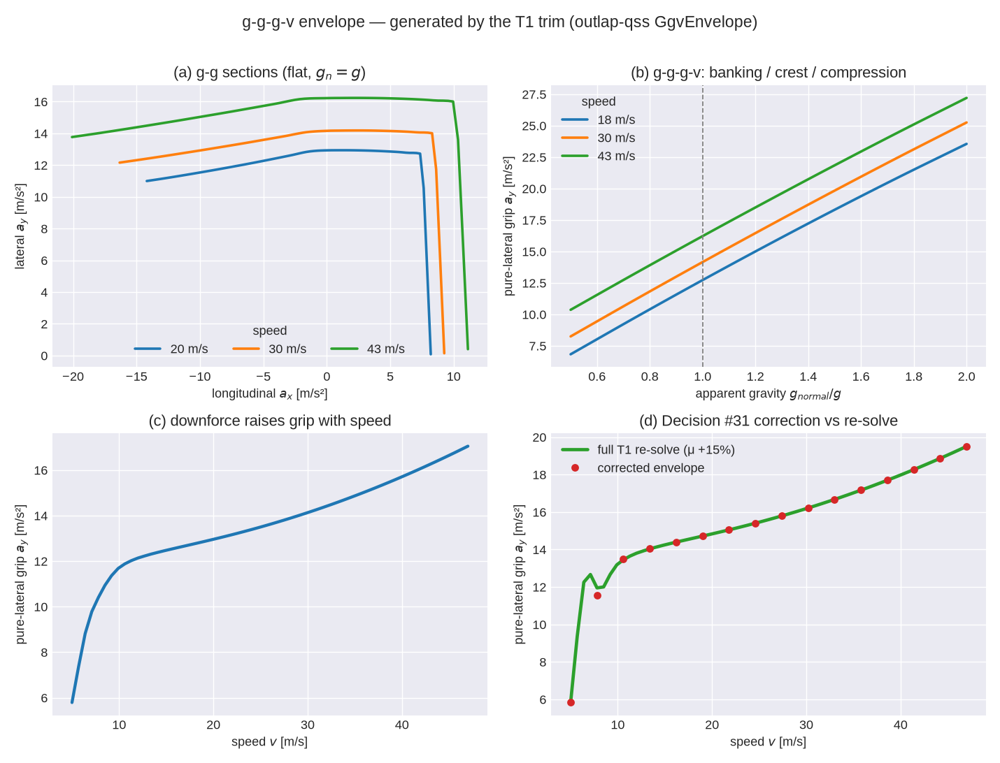

<!-- SPDX-License-Identifier: AGPL-3.0-only -->
# The g-g-g-v acceleration envelope

The **g-g-g-v envelope** is the friction limit of a car as a function of speed and road-normal
load. It is what makes the point-mass **T0** lap solver honest without paying for a full trim at
every station: T0 reads a pre-computed grip boundary that already carries the T1 double-track
physics (per-axle load transfer, downforce, differential behaviour). This is the production T0↔T1
coupling (Locked Decision #31). It is generated by `GgvEnvelope::generate` in `outlap-qss` and
consumed by the T0 velocity-profile solver via `solve_into_ggv`.

The figure below is generated by the real model — the committed example
`crates/outlap-qss/examples/ggv_traces.rs` builds the envelope and `python/tools/plot_ggv_envelope.py`
plots its output.



## The classical g-g and its two extra axes

A **g-g diagram** plots the maximum longitudinal and lateral accelerations a car can reach: the
boundary of the achievable `(a_x, a_y)` region (Rice 1973; Milliken & Milliken 1995). Minimising lap
time means living on that boundary. Two effects reshape it, and adding them gives the **g-g-g-v**
diagram (Werner et al. 2025):

* **Speed `v`** — aerodynamic downforce grows with `v²`, so the tyres are pressed harder into the
  road at speed and the whole envelope inflates (panel c).
* **Road-normal specific gravity `g_normal`** (the "apparent gravity" `g̃` of Rowold et al. 2023) —
  on a 3-D ribbon, banking, grade, and vertical road curvature change how hard gravity + inertia
  press the car onto the road. A crest unloads the tyres (`g_normal < g`), a dip or compression like
  Eau Rouge loads them (`g_normal > g`). Emulated by Werner et al. (2025, eq. 1) as a virtual
  vertical force `F_{z,ext} = m·(a_z − g)` added at the CG, so the effective normal specific force is
  `g_normal = a_z`; flat ground is `g_normal = g` (panel b, dashed line).

outlap stores the base table

```
  a_y,corr = gg(v, a_x, g_normal)                       (the maximum sustainable lateral acceleration)
```

over the `sim.envelope` grid (`40 × 25 × 7` by default — Locked Decision #10; raise only with a PR
note).

## How the boundary is found

For a commanded operating point `(v, a_y, a_x, g_normal)` the T1 trim (`docs/theory/t1-trim.md`)
either converges (the point is inside the friction limit) or reports **infeasible** (past it). The
envelope generator uses that as an oracle: at each `(v, g_normal)` it brackets the straight-line
longitudinal limits, then for each `a_x` node **bisects the commanded `a_y`** to the largest feasible
value — the boundary. Points beyond the straight-line traction/braking limit sit on the boundary with
`a_y = 0` (never a panic; the PR2 infeasible-trim contract). This is the quasi-steady-state
acceleration-envelope construction of Tremlett et al. (2014) and Lovato & Massaro (2022); outlap
traces it with the trim's damped-Newton feasibility rather than a ramp-steer Milliken Moment Method,
and — unlike Werner et al. (2025, §II-E) — does **not** filter the boundary for open-loop stability
(a transient T2+ concern).

**Powertrain limits are omitted from the envelope** (Werner et al. 2025, §II-C): it is a pure
*tyre-force* limit. The drive-force ceiling is applied *separately* by the lap solver, which takes
`min(tyre-grip a_x, powertrain a_x)` exactly as the constant-μ ellipse path does — this cleanly
separates the tyre envelope from the powertrain map.

### Velocity-frame projection

A point-mass solver has no body-slip angle `β` as a state, but the trim does. Following Werner et al.
(2025, eq. 5) the stored lateral acceleration is projected into the **velocity-vector frame**:

```
  a_y,corr = a_y,body · cos β − a_x · sin β
```

so the boundary is orthogonal to the velocity vector and directly comparable with the point-mass
centripetal demand `κ_ℓ·v² + g·sinθ_bank·cosθ_grade` the T0 solver computes.

### Normalised longitudinal axis

The longitudinal capability spans a wide range across speed and load (light-load low-speed grip is a
fraction of high-downforce high-speed grip). A single fixed *actual*-`a_x` grid would leave the
feasible window falling between nodes at low load, so — matching the per-speed g-g construction of
the reference works — the `a_x` axis is **normalised**: a node `â_x ∈ [−1, 1]` maps to the actual
acceleration `a_x = â_x · a_x,cap(v, g_normal)`, where `a_x,cap` is that point's own straight-line
braking (`â_x < 0`) or acceleration (`â_x > 0`) limit. Every slice then uses the full range with a
node exactly on `â_x = 0` (pure lateral) — no holes, uniform resolution. Queries take the actual `a_x`
and normalise internally; the lap solver reads `a_x,cap` back via `accel_limit` / `brake_limit`.

## Decision #31 corrections

Regenerating the envelope for every off-reference vehicle state in a strategy sweep (a different tyre
grip, mass, or downforce) is expensive. Instead the generator stores, per node, three **relative
sensitivities** — central finite differences of full-T1 boundary re-solves over each parameter's
correction band:

```
  S_μ ≈ ∂ln a_y / ∂ln μ_tire ,   S_m ≈ ∂ln a_y / ∂ln m ,   S_ClA ≈ ∂ln a_y / ∂ln ClA
```

and evaluates the corrected boundary as a **separable multiplicative** form that is identity at the
reference by construction:

```
  a_y,corr(v, a_x, g_normal ; μ, m, ClA) =
     gg(v, a_x, g_normal) · (1 + S_μ·(μ/μ₀ − 1)) · (1 + S_m·(m/m₀ − 1)) · (1 + S_ClA·(ClA/ClA₀ − 1))
```

clamped at 0. The **reference state** is: tyre-grip and downforce scale 1 (`μ₀`, `ClA₀`), mass `m₀`
the vehicle's own mass (no fuel burn in M3), cold tyres (the trim's basis), and a thermal-/SoC-neutral
state — the dynamic machine-thermal derate and the battery power cap are separate dynamic caps that
compose with this static envelope at the lap level (PR6), so the envelope itself stays neutral.

The correction is a **lateral-grip magnitude** model. It is accurate near the cornering peak
(panel d), where the sensitivities are well-behaved; toward the longitudinal shoulders — where the
velocity-frame `−a_x·sinβ` term dominates and where a multiplicative factor fundamentally cannot
*move* the shoulder (`0 × factor = 0`) — the sensitivities are clamped and the correction is a bound,
not an accurate value. The lap solver caps `a_x` and takes the powertrain `min` there anyway.

## Consumption by T0

`solve_into_ggv` runs the same forward/backward velocity-profile passes as the constant-μ ellipse
(`docs/theory/t0-point-mass.md`), with the ellipse replaced by envelope look-ups:

* **cornering-speed limit** — the largest `v` whose centripetal demand `≤ a_y,corr(v, 0, g_normal(v))`;
* **forward step** — `min(` inverted grip `a_x` at the current lateral demand, `powertrain a_x )`,
  less grade;
* **backward (braking) step** — the inverted braking grip, plus drag and uphill gravity.

The envelope's `a_x` boundary already embeds the aero drag the T1 trim saw, so the solver subtracts a
consistent reference drag `drag_accel(v)` from the powertrain branch (no double count). The constant-μ
friction ellipse remains as the degenerate no-envelope path. `sim.tier` dispatch and the Python
result surface that select the envelope path in production land in PR8.

## Validation (CI)

* **node-exactness** — the interpolant reproduces the boundary finder at grid nodes (≤ 0.02 %);
* **corrections = identity** at the reference state (to 1e-12);
* **g_normal monotonicity** — absolute lateral grip does not fall as normal load rises;
* **concavity** — the `a_y(a_x)` section is concave (the feasible g-g region is convex);
* **Decision #31 accuracy gate** — the corrected envelope matches full-T1 re-solves at sampled
  off-reference states (bands ±15 % μ, ±10 % mass, ±30 % ClA), in the lateral-grip region, to **≤ 2 %**
  of the local peak grip (realised ≈ 0.6 % on the reduced CI grid; the base-table interpolation error
  is a separate, grid-limited quantity, ≈ 5 % on the reduced CI grid and far smaller on the production
  `40 × 25 × 7`);
* **containment** — a T0-on-envelope lap's speed profile stays within the envelope's pure-lateral
  boundary, and agrees with the constant-μ-ellipse lap within a documented band;
* **zero-allocation** — every envelope query and the whole `solve_into_ggv` pass are allocation-free
  (dhat gate).

## References

Clean-room from published literature — no simulator source was read.

* R. S. Rice, "Measuring car-driver interaction with the g-g diagram," *SAE Technical Paper* 730018,
  1973.
* W. F. Milliken & D. L. Milliken, *Race Car Vehicle Dynamics*, SAE, 1995 (Milliken Moment Method,
  ch. 8).
* A. J. Tremlett, M. Massaro, D. J. N. Limebeer, et al., "Quasi-steady-state linearisation of the
  racing vehicle acceleration envelope: a limited slip differential example," *Vehicle System
  Dynamics* 52(11), 2014, pp. 1416–1442.
* D. Lovato & M. Massaro, "A three-dimensional free-trajectory quasi-steady-state optimal-control
  method for the minimum-lap-time of race vehicles," *Vehicle System Dynamics* 60(5), 2022,
  pp. 1512–1530.
* M. Rowold, L. Ögretmen, U. Kasolowsky, B. Lohmann, "Online Time-Optimal Trajectory Planning on
  Three-Dimensional Race Tracks," *2023 IEEE Intelligent Vehicles Symposium (IV)*, 2023, pp. 1–8
  (arXiv:2304.10954) — the 3-D apparent-gravity `g̃` axis.
* F. Werner, S. Sagmeister, M. Piccinini, J. Betz, "A Quasi-Steady-State Black Box Simulation
  Approach for the Generation of g-g-g-v Diagrams," 2025, arXiv:2504.10225 — the virtual-inertial-
  force QSS method, the velocity-frame lateral correction (eq. 5), and the tyre-force-only envelope.
