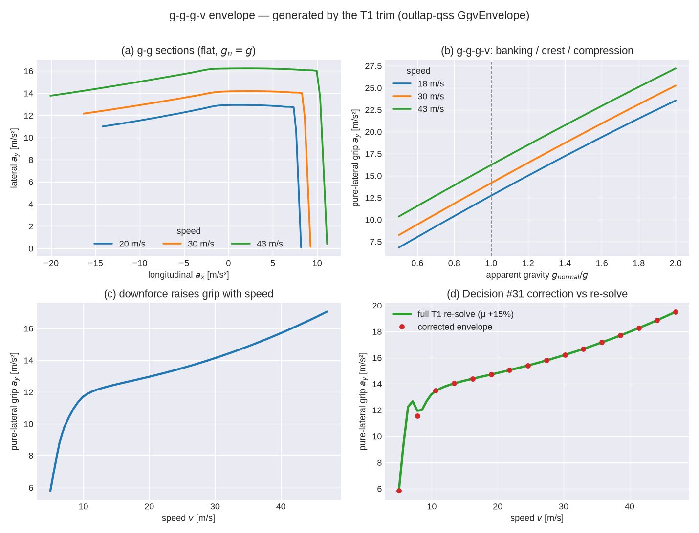
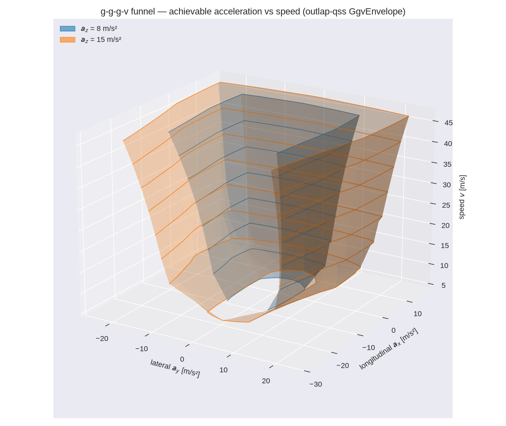
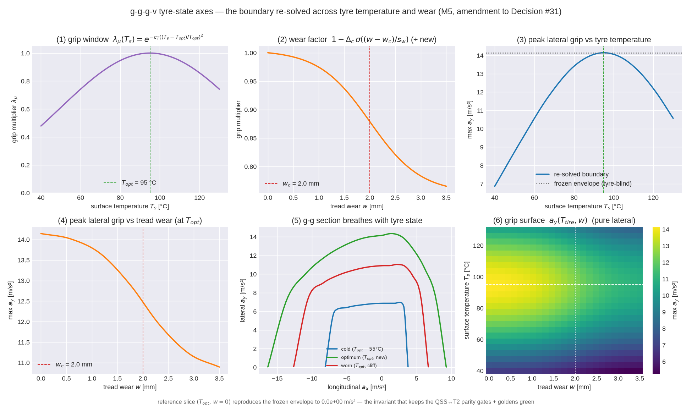

<!-- SPDX-License-Identifier: AGPL-3.0-only -->
# The g-g-g-v acceleration envelope

The **g-g-g-v envelope** is the friction limit of a car, as a function of speed and road-normal
load.

It is what makes the point-mass **T0** lap solver honest, without paying for a full trim at every
station. T0 reads a grip boundary that was computed in advance, and that boundary already carries
the double-track physics of T1: load transfer at each axle, downforce, and the behavior of the
differential. This is the production coupling between T0 and T1 (Locked Decision #31).

`GgvEnvelope::generate` in `outlap-qss` generates it. The T0 velocity-profile solver consumes it
through `solve_into_ggv`.

The figure below comes from the real model. The committed example
`crates/outlap-qss/examples/ggv_traces.rs` builds the envelope, and
`python/tools/plot_ggv_envelope.py` plots its output.



The 4-D envelope is a **funnel**. Lateral acceleration and longitudinal acceleration span the plane.
Speed runs up the z axis. There is one surface for each value of apparent gravity, `a_z`, which
equals `g_normal`.

The funnel widens with speed, as downforce loads the tires. At every speed, a compression, at
`a_z = 15 m/s²`, gives more grip than a crest, at `a_z = 8 m/s²`.



## The classical g-g diagram, and its two extra axes

A **g-g diagram** plots the maximum longitudinal and lateral accelerations a car can reach. It is
the boundary of the achievable region in `(a_x, a_y)` (Rice 1973; Milliken & Milliken 1995).
Minimizing lap time means living on that boundary.

Two effects reshape it. Adding them gives the **g-g-g-v** diagram (Werner et al. 2025).

* **Speed `v`.** Aerodynamic downforce grows with `v²`. At speed the tires are therefore pressed
  harder into the road, and the whole envelope inflates. See panel (c).
* **Road-normal specific gravity, `g_normal`.** Rowold et al. (2023) call this the apparent gravity
  `g̃`. On a 3-D ribbon, banking, grade, and vertical curvature all change how hard gravity and
  inertia press the car onto the road. A crest unloads the tires, so `g_normal < g`. A dip, or a
  compression like Eau Rouge, loads them, so `g_normal > g`.

  Werner et al. (2025, eq. 1) emulate this as a virtual vertical force at the CG,
  `F_{z,ext} = m·(a_z − g)`. The effective normal specific force is then `g_normal = a_z`. Flat
  ground is `g_normal = g`, the dashed line in panel (b).

outlap stores the base table

```
  a_y,corr = gg(v, a_x, g_normal)                       (the maximum sustainable lateral acceleration)
```

over the `sim.envelope` grid. The default is `40 × 25 × 7` (Locked Decision #10). Raise it only with
a note in the PR.

## How the boundary is found

Give the T1 trim (`docs/theory/t1-trim.md`) a commanded operating point,
`(v, a_y, a_x, g_normal)`. It either converges, which means the point is inside the friction limit,
or it reports **infeasible**, which means the point is past it.

The envelope generator uses that as an oracle. At each `(v, g_normal)` it brackets the longitudinal
limits in a straight line. Then, at each `a_x` node, it **bisects the commanded `a_y`** to the
largest feasible value. That value is the boundary.

A point beyond the straight-line limit for traction or braking sits on the boundary with `a_y = 0`.
It never panics; this is the contract for an infeasible trim from PR2.

This is the quasi-steady-state construction of an acceleration envelope, from Tremlett et al. (2014)
and Lovato & Massaro (2022). outlap traces it with the damped-Newton feasibility of the trim, rather
than with a ramp-steer Milliken Moment Method. And unlike Werner et al. (2025, §II-E), it does
**not** filter the boundary for open-loop stability. That is a concern for T2 and above.

**Powertrain limits are omitted from the envelope** (Werner et al. 2025, §II-C). It is a pure limit
on *tire force*.

The lap solver applies the ceiling on drive force *separately*. It takes
`min(tyre-grip a_x, powertrain a_x)`, exactly as the path with a constant-μ ellipse does. This keeps
the tire envelope cleanly separate from the powertrain map.

### Projection into the velocity frame

A point-mass solver has no body-slip angle `β` as a state. The trim does. Following Werner et al.
(2025, eq. 5), the stored lateral acceleration is therefore projected into the **frame of the
velocity vector**:

```
  a_y,corr = a_y,body · cos β − a_x · sin β
```

The boundary is then orthogonal to the velocity vector. It is therefore directly comparable with the
centripetal demand that the T0 solver computes for a point mass,
`κ_ℓ·v² + g·sinθ_bank·cosθ_grade`.

### The normalized longitudinal axis

Longitudinal capability spans a wide range across speed and load. Grip at low speed and light load
is a fraction of grip at high speed with high downforce.

A single fixed grid in *actual* `a_x` would therefore leave the feasible window falling between
nodes at low load. The `a_x` axis is instead **normalized**, which matches how the reference works
construct a g-g diagram for each speed.

A node `â_x ∈ [−1, 1]` maps to the actual acceleration `a_x = â_x · a_x,cap(v, g_normal)`.
`a_x,cap` is that point's own straight-line limit: for braking when `â_x < 0`, and for acceleration
when `â_x > 0`.

Every slice therefore uses its full range, with a node exactly at `â_x = 0`, which is pure lateral.
There are no holes, and the resolution is uniform.

A query takes the actual `a_x` and normalizes internally. The lap solver reads `a_x,cap` back
through `accel_limit` and `brake_limit`.

## Corrections under Decision #31

Regenerating the envelope for every off-reference state of the vehicle in a strategy sweep is
expensive. Such a sweep varies tire grip, mass, or downforce.

The generator therefore stores three **relative sensitivities** at each node. Each is a central
finite difference, taken from full T1 re-solves of the boundary over the correction band of that
parameter:

```
  S_μ ≈ ∂ln a_y / ∂ln μ_tire ,   S_m ≈ ∂ln a_y / ∂ln m ,   S_ClA ≈ ∂ln a_y / ∂ln ClA
```

It then evaluates the corrected boundary in a **separable multiplicative** form. By construction
that form is the identity at the reference:

```
  a_y,corr(v, a_x, g_normal ; μ, m, ClA) =
     gg(v, a_x, g_normal) · (1 + S_μ·(μ/μ₀ − 1)) · (1 + S_m·(m/m₀ − 1)) · (1 + S_ClA·(ClA/ClA₀ − 1))
```

The result is clamped at 0.

The **reference state** is this: tire grip and downforce at scale 1, which are `μ₀` and `ClA₀`; mass
at `m₀`, the car's own mass, because M3 burns no fuel; cold tires, which is the basis of the trim;
and a state that is neutral in thermal and SoC terms.

The dynamic derate from machine temperature and the power cap of the battery are separate dynamic
caps. They compose with this static envelope at the level of the lap (PR6). The envelope itself
therefore stays neutral.

The correction models the **magnitude of lateral grip**. It is accurate near the cornering peak,
panel (d), where the sensitivities behave well.

Toward the longitudinal shoulders it is not. There the term `−a_x·sinβ` from the velocity frame
dominates. And a multiplicative factor fundamentally cannot *move* the shoulder, because
`0 × factor = 0`. The sensitivities are therefore clamped, and the correction is a bound rather than
an accurate value. The lap solver caps `a_x` and takes the powertrain `min` there in any case.

## Tire-state axes: T_tire and wear (M5; an amendment to Decision #31)

Above, μ_tire, mass, and ClA are separable multiplicative *corrections*. They are accurate near the
peak, and a bound elsewhere.

The thermal state and wear state of the tire differ in kind. The grip window `λ_μ(T_s)` and the wear
cliff move the *whole* boundary, including the longitudinal shoulders that a multiplicative factor
cannot touch. They are also the axes that make the QSS tier capable of running a stint. HANDOFF §6.1
puts it plainly: *"the tyre-state axes are the differentiator"*.

M5 therefore adds them as **genuine grid dimensions, across which the boundary is re-solved**. They
are not corrections. This is the amendment to Decision #31, and D-M5-2.

```
  a_y,corr(v, a_x, g_normal, T_tire, wear)   — a 5-D table; the â_x shoulders gain the same two axes.
```

At each `(T_tire, wear)` node, the boundary is re-solved in full, at a uniform grip factor:

```
  g(T_tire, wear) = λ_μ(T_tire) / λ_μ(T_opt)  ·  wear_grip(wear) / wear_grip(0)
```

That factor is applied through `T1Vehicle::with_mu_scale`, the same uniform grip knob that the tier
feeds to the force call at each wheel, as `mu_scale_total`, isotropic on `LMUX` and `LMUY`.

The grip model in the envelope is therefore identical to the grip model in the tier. It is the same
thermal window, `λ_μ(T_s) = exp(−c_T·((T_s−T_opt)/T_opt)²)` (`docs/theory/tire-thermal.md`), and the
same wear cliff, `1 − Δ_c·σ((w−w_c)/s_w)` (`docs/theory/tire-wear.md`).

The T_tire axis is the temperature of the tread surface, which is what drives the grip window. The
couplings through gas-law pressure and carcass softening depend on the *other* two node
temperatures, and they stay at their reference here. On the reference tires they carry no MF force
effect in any case, because those tires have no `PP*` pressure terms. The envelope therefore carries
the dominant effect on grip magnitude, and the tier composes the rest on each step.



**The invariant on the reference slice.** `T_opt` is placed at the exact center node of the T_tire
axis, and `wear = 0` at node 0. Therefore `g(T_opt, 0) = 1` *bit for bit*, because `x/x = 1` in
IEEE-754.

The re-solve at that node is therefore identical to the frozen sweep, and the reference slice
reproduces the pre-M5 envelope exactly. This is verified to `0.0` m/s², in the panel labeled
`ident`.

That is what keeps the parity gates between QSS and T2 green, and every golden green. The axes are
**opt-in**, through `GgvEnvelope::generate_with_tire_state`. The default `generate` is unchanged and
cheap. `ay_boundary` and `ay_boundary_corrected`, and every existing consumer, therefore see the
frozen boundary untouched. The tiers index the live state through
`ay_boundary_at(v, a_x, g_normal, T_tire, wear)`, and the QSS march wires this in PR5.

The cost is the trade. The boundary sweep runs `t_points × w_points` times, which
`GgvEnvelope::notes` records. That cost is paid at cold assembly, and only when the axes are
requested.

The figure comes from the real generator, through
`crates/outlap-qss/examples/envelope_tire_state.rs` and then
`python/tools/plot_envelope_tire_state.py`. Panel 1 shows the Farroni grip window, and panel 2 the
Archard and Grosch wear cliff, which are what the axes carry. Panels 3 and 4 show peak lateral grip
falling away from the optimum temperature, and across the wear cliff, with the frozen envelope
overlaid. Panel 5 shows the g-g section breathing between cold, optimum, and worn tires. Panel 6
shows the 2-D grip surface, `a_y(T_tire, wear)`.

## Fuel mass and CG: corrections, and NOT axes (M6; D-M6-4)

Burning fuel shrinks the mass of the car and migrates its center of gravity over a lap
(`docs/theory/fuel-mass.md`).

Unlike the tire state, these **stay separable multiplicative corrections**. That is the *opposite*
conclusion to the amendment on tire axes above, Decision #49, and there is a concrete reason.

Tire thermal state and wear reshape grip **non-linearly and non-monotonically**. The grip window
peaks at `T_opt`, and the wear cliff is a sigmoid. A first-order factor therefore genuinely misses
physics that a re-solved axis captures.

Mass and CG perturb the load-transfer algebra **smoothly and monotonically**. The boundary responds
near-linearly to `∂/∂mass` and `∂/∂cg`, across the whole range that matters for grip. A secant is
therefore accurate, and CI validates it against full T1 re-solves, exactly as it validates the
corrections for μ_tire, mass, and ClA. A re-solved axis would only multiply an envelope build that
takes 5 s to 22 s, and it would buy no fidelity.

The correction set of #31 therefore gains two things. **Mass** was already present as `∂gg/∂mass`,
and is now wired to the fuel slow state. **CG** arrives through `with_cg`, as four new secants:
`∂gg/∂a_f` and `∂gg/∂h_cg`, each up and down.

The envelope is built at the **full-tank reference `m₀`**, at the full-tank CG (D-M6-4b). Mirroring
the invariant at `T_opt` and zero wear, the correction for mass and CG is therefore **exactly 1.0 at
the start of a lap**, and it drifts as the tank drains. A car with no `fuel:` block builds at its own
constant mass, and every query is byte-identical.

The composed query, `BoundaryQuery`, combines the tire-state axes with the `CorrectionSet` for mass,
CG, grip, and downforce. It is the live path for a stint: the tire march and the fuel burn both
move, and their effects compose through `ay_boundary_query`.

## How T0 consumes it

`solve_into_ggv` runs the same forward and backward velocity-profile passes as the constant-μ
ellipse (`docs/theory/t0-point-mass.md`). It replaces the ellipse with look-ups into the envelope:

* **The cornering-speed limit** is the largest `v` whose centripetal demand is at most
  `a_y,corr(v, 0, g_normal(v))`.
* **The forward step** takes `min(` the inverted grip `a_x` at the current lateral demand, the
  powertrain `a_x` `)`, less the grade.
* **The backward, or braking, step** takes the inverted braking grip, plus drag and uphill gravity.

The `a_x` boundary of the envelope already embeds the aero drag that the T1 trim saw. The solver
therefore subtracts a consistent reference drag, `drag_accel(v)`, from the powertrain branch. Drag
is not counted twice.

The constant-μ friction ellipse remains as the degenerate path, for a car with no envelope.

Dispatch on `sim.tier`, and the Python result surface that select the envelope path in production,
land in PR8.

## Validation in CI

* **Node exactness.** The interpolant reproduces the boundary finder at the grid nodes, within
  0.02 %.
* **Corrections are the identity** at the reference state, to 1e-12.
* **Monotonicity in `g_normal`.** Absolute lateral grip does not fall as normal load rises.
* **Concavity.** The `a_y(a_x)` section is concave, so the feasible g-g region is convex.
* **The accuracy gate of Decision #31.** The corrected envelope matches full T1 re-solves at sampled
  off-reference states, over bands of ±15 % in μ, ±10 % in mass, and ±30 % in ClA. In the region of
  lateral grip, it holds to **≤ 2 %** of the local peak grip. The realized value is about 0.6 % on
  the reduced CI grid.

  The interpolation error of the base table is a separate quantity, and the grid limits it. It is
  about 5 % on the reduced CI grid, and far smaller on the production grid of `40 × 25 × 7`.
* **Containment.** The speed profile of a T0 lap on the envelope stays within the pure-lateral
  boundary of that envelope, and it agrees with the lap on the constant-μ ellipse within a
  documented band.
* **Zero allocation.** Every envelope query, and the whole `solve_into_ggv` pass, allocate nothing.
  A dhat gate enforces this.

## References

This model is clean-room, from published literature. No code was copied. The
**TUM-AVS/GGGVDiagrams** repository (GPL-3.0), which is the reference implementation of Werner et
al. 2025, was consulted for the *approach* only, and re-authored independently from the papers
below.

* R. S. Rice, "Measuring car-driver interaction with the g-g diagram," *SAE Technical Paper* 730018,
  1973.
* W. F. Milliken & D. L. Milliken, *Race Car Vehicle Dynamics*, SAE, 1995 (Milliken Moment Method,
  ch. 8).
* A. J. Tremlett, M. Massaro, D. J. N. Limebeer, et al., "Quasi-steady-state linearisation of the
  racing vehicle acceleration envelope: a limited slip differential example," *Vehicle System
  Dynamics* 52(11), 2014, pp. 1416–1442.
* D. Lovato & M. Massaro, "A three-dimensional free-trajectory quasi-steady-state optimal-control
  method for the minimum-lap-time of race vehicles," *Vehicle System Dynamics* 60(5), 2022,
  pp. 1512–1530.
* M. Rowold, L. Ögretmen, U. Kasolowsky, B. Lohmann, "Online Time-Optimal Trajectory Planning on
  Three-Dimensional Race Tracks," *2023 IEEE Intelligent Vehicles Symposium (IV)*, 2023, pp. 1–8
  (arXiv:2304.10954) — the 3-D apparent-gravity `g̃` axis.
* F. Werner, S. Sagmeister, M. Piccinini, J. Betz, "A Quasi-Steady-State Black Box Simulation
  Approach for the Generation of g-g-g-v Diagrams," 2025, arXiv:2504.10225 — the virtual-inertial-
  force QSS method, the velocity-frame lateral correction (eq. 5), and the tyre-force-only envelope.
