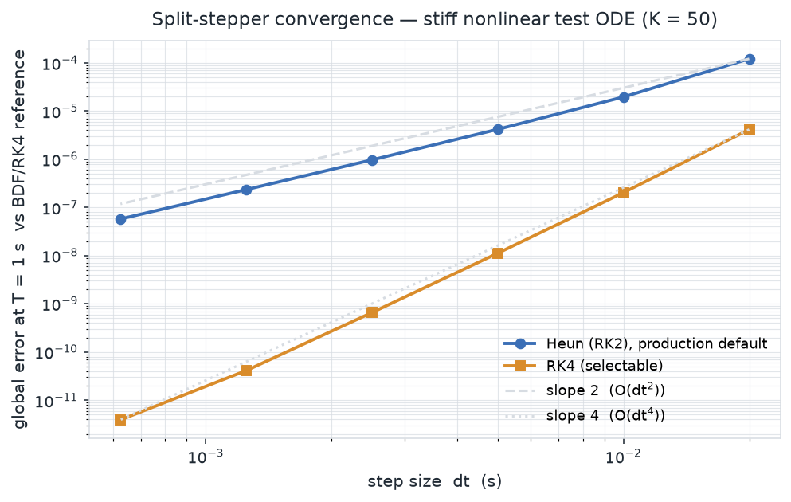

<!-- SPDX-License-Identifier: AGPL-3.0-only -->
# Fixed-step split integrator

The transient tiers (T2/T3) advance the model with a **fixed-step, split** integrator — never an
adaptive solver (Locked Decision #30 mandates fixed-step in production paths; determinism and
`wasm` in-browser real-time both require it). "Split" means each family of state is advanced by the
scheme that suits its stiffness, all on the same step `dt` (default 1 ms):

| State family | Scheme | Why |
|--------------|--------|-----|
| Chassis / driveline (smooth) | explicit **Runge–Kutta** (Heun default, RK4 selectable) | 2nd-order accurate, cheap, no implicit solve |
| Tire relaxation (stiff) | **exact-exponential** update | analytic over a step; unconditionally stable at every speed |
| Slow states (temps, wear, SOC, fuel) | **semi-implicit Euler** on a decimated clock | A-stable on the diagonal decay; cheap at 10–100 s timescales |
| Discrete transitions (shifts, mode changes) | **step-boundary event queue** | one linear back-interpolation; no root-finding in the loop |

Implemented from HANDOFF §11.2; the relaxation equation and its exact update follow Pacejka, *Tire
and Vehicle Dynamics*, 3rd ed. (2012), §7.2/§8.5. The reference verification integrator is
[`diffsol`](https://github.com/martinjrobins/diffsol) (BDF/ESDIRK), used dev-only in one test crate.

## Butcher-tableau-generic RK

The explicit step is written once over a general Butcher tableau `(a, b, c)` and specialised to a
method by its coefficients — Heun/RK2 (`c = [0, 1]`, `b = [½, ½]`) by default, classical RK4
selectable for convergence studies via the `sim.yaml` `integrator` field. One sweep:

```
for i in 0..s:  x_stage = x + dt · Σ_{j<i} a[i][j]·k[j];   f(t + c[i]·dt, x_stage) → k[i]
x ← x + dt · Σ_i b[i]·k[i]
```

All stage scratch lives in a preallocated `SimArena`, so a step performs **zero heap allocations**
(CI-gated by a dhat test). The stage and weight reductions run in fixed ascending order, so a step
is **bit-reproducible** across runs on the same target.

## Exact-exponential relaxation channel

A tire slip channel obeys `σ·ẋ + |V|·x = |V|·x_ss`. Freezing the steady-state target `x_ss` over a
step gives the analytic solution

```
x ← x_ss + (x − x_ss)·exp(−|V|·dt/σ)
```

The decay factor lies in `(0, 1]` for `|V|, dt ≥ 0`, so the update is a pure contraction toward
`x_ss` — stable at any speed, and *exact* (two half-steps equal one full step), which kills the
relaxation stiffness without an implicit solve. This is the single most important integrator
decision (HANDOFF §11.2). It is **one implementation**: `relax::exact_exponential` in `outlap-core`,
which `outlap_tire::relax_step` floors `σ` and delegates to.

## Semi-implicit slow substep and the decimated clock

Slow states follow `ẋ = source − decay·x`. Taking the decay term implicitly gives the A-stable step
`x ← (x + dt·source)/(1 + dt·decay)`, which cannot ring or overshoot even for a large slow step.
Because these states move on 10–100 s timescales, resolving them at the 1 ms fast step is wasteful:
a `SlowClock` fires the slow substep once every `slow_decimation` fast steps (default 20 → a 20 ms
slow step at `dt = 1 ms`).

## Events at step boundaries

Discrete transitions (gear shifts, ERS mode changes) are scheduled in a time-ordered `EventQueue`
and applied at the step boundary at or after their due time. Where a caller needs the sub-step
crossing, one linear `back_interpolate(g_prev, g_now)` recovers the fraction `θ ∈ [0, 1]` of the
step at which a monitored quantity crossed zero. No root-finding runs in the hot loop.

## Convergence

The production stepper must converge to the reference solution at its formal order. On a stiff,
nonlinear scalar test ODE (`y' = −K·y + K·cos t − y²`, `K = 50`), Heun shows clean **O(dt²)** global
error against a tight `diffsol` BDF solution — the error ratio across a halved step is ≈ 4 — and RK4
is orders of magnitude tighter at the same step:



The convergence, order, and bit-determinism assertions live in
`crates/outlap-conformance/tests/convergence.rs`.
