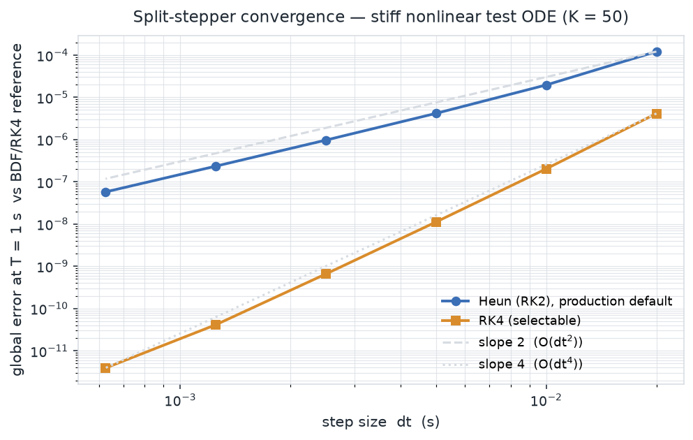

<!-- SPDX-License-Identifier: AGPL-3.0-only -->
# The fixed-step split integrator

The transient tiers, T2 and T3, advance the model with a **fixed-step, split** integrator. They
never use an adaptive solver. Locked Decision #30 mandates a fixed step in production paths. Two
things require it: determinism, and real-time `wasm` in a browser.

"Split" means that each family of state advances by the scheme that suits its stiffness. All
families share the same step `dt`, which defaults to 1 ms.

| State family | Scheme | Why |
|--------------|--------|-----|
| Chassis and driveline, which are smooth | Explicit **Runge–Kutta**. Heun by default; RK4 is selectable. | Accurate to 2nd order, cheap, and needs no implicit solve. |
| Tire relaxation, which is stiff | An **exact-exponential** update | It is analytic over a step, and stable at every speed without condition. |
| Slow states: temperatures, wear, SOC, fuel | **Semi-implicit Euler**, on a decimated clock | A-stable on the diagonal decay, and cheap at timescales of 10 s to 100 s. |
| Discrete transitions: shifts, mode changes | An **event queue at step boundaries** | One linear back-interpolation. No root-finding in the loop. |

This is implemented from HANDOFF §11.2. The relaxation equation and its exact update follow
Pacejka, *Tire and Vehicle Dynamics*, 3rd ed. (2012), §7.2 and §8.5. The reference integrator for
verification is [`diffsol`](https://github.com/martinjrobins/diffsol), which offers BDF and ESDIRK.
It is a dev-only dependency of one test crate.

## Runge–Kutta, generic over a Butcher tableau

The explicit step is written once, over a general Butcher tableau `(a, b, c)`. Its coefficients
specialize it to a method. Heun, which is RK2, is the default: `c = [0, 1]` and `b = [½, ½]`.
Classical RK4 is selectable through the `integrator` field of `sim.yaml`, for convergence studies.

One sweep:

```
for i in 0..s:  x_stage = x + dt · Σ_{j<i} a[i][j]·k[j];   f(t + c[i]·dt, x_stage) → k[i]
x ← x + dt · Σ_i b[i]·k[i]
```

All stage scratch lives in a `SimArena` that is allocated in advance. A step therefore performs
**zero heap allocations**, and a dhat test gates this in CI.

The reductions over stages and over weights run in a fixed ascending order. A step is therefore
**bit-reproducible** across runs on the same target.

## The exact-exponential relaxation channel

A tire slip channel obeys `σ·ẋ + |V|·x = |V|·x_ss`. Freeze the steady-state target `x_ss` over one
step. The analytic solution is then

```
x ← x_ss + (x − x_ss)·exp(−|V|·dt/σ)
```

The decay factor lies in `(0, 1]` whenever `|V| ≥ 0` and `dt ≥ 0`. The update is therefore a pure
contraction toward `x_ss`. It is stable at any speed. It is also *exact*, because two half-steps
equal one full step. It removes the stiffness of relaxation without an implicit solve.

This is the single most important decision about the integrator (HANDOFF §11.2). There is **one
implementation**: `relax::exact_exponential` in `outlap-core`. `outlap_tire::relax_step` puts a
floor under `σ` and delegates to it.

## The semi-implicit slow substep, and the decimated clock

A slow state follows `ẋ = source − decay·x`. Take the decay term implicitly. The step is then
`x ← (x + dt·source)/(1 + dt·decay)`, which is A-stable. It cannot ring, and it cannot overshoot,
even at a large slow step.

These states move on timescales of 10 s to 100 s. Resolving them at the 1 ms fast step would waste
work. A `SlowClock` therefore fires the slow substep once every `slow_decimation` fast steps. The
default is 20, which gives a 20 ms slow step at `dt = 1 ms`.

## Events at step boundaries

Discrete transitions, such as gear shifts and changes of ERS mode, are scheduled in an `EventQueue`
ordered by time. Each one applies at the first step boundary at or after its due time.

A caller that needs the crossing within a step calls `back_interpolate(g_prev, g_now)` once. That
returns the fraction `θ ∈ [0, 1]` of the step at which a monitored quantity crossed zero. No
root-finding runs in the hot loop.

## Convergence

The production stepper must converge to the reference solution at its formal order.

The test ODE is stiff, nonlinear, and scalar: `y' = −K·y + K·cos t − y²`, with `K = 50`. Against a
tight BDF solution from `diffsol`, Heun shows clean **O(dt²)** global error. Halving the step
divides the error by about 4. RK4 is tighter by orders of magnitude at the same step:



The assertions on convergence, on order, and on bit-determinism live in
`crates/outlap-conformance/tests/convergence.rs`.
