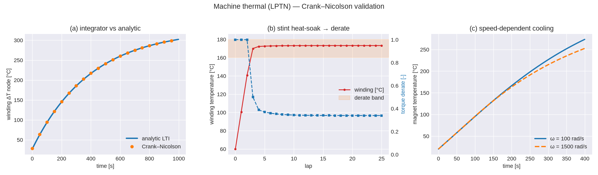

<!-- SPDX-License-Identifier: AGPL-3.0-only -->
# Machine thermal — an N-node lumped-parameter network with derating

`outlap-thermal` advances a machine's temperatures over the QSS solution and turns them into a
commanded-torque **derate**, so a stint is honest: lap 1 ≠ lap 20, and heat-soak over a corner-heavy
sequence costs deployable torque. The model is a **lumped-parameter thermal network** (LPTN): `N`
isothermal nodes with heat capacities `Cᵢ` (J/K), pairwise conductances `g_ij = 1/R_ij` (W/K), a
per-node loss source `Pᵢ` (W), one pinned ambient node, and an optional coolant node. It advances
with a semi-implicit **Crank–Nicolson** step; the derate is a linear ramp `1 → 0` as each rated node
crosses `T_warn → T_max` (the winding normally binds).

## Firewall amendment (Locked Decision #25, 2026-07-05)

The original firewall (§1) forbids outlap from modelling machine internals. Decision #25's original
form was a deliberately simple fixed 2-node model. **This is now amended (author-authorized):** the
network is any-`N`, and for the *detailed* path outlap **builds** the conductance operator from
machine geometry using ported heat-transfer correlations, evaluated per segment at the shaft speed
and node temperatures. The amendment is narrow — it applies to the thermal model only; torque,
efficiency and loss still cross the firewall as neutral `.ptm` maps. The correlations are implemented
**clean-room from published literature**, cited below; the PDT *geometry-building* code is not ported —
outlap consumes an assembled edge list plus the geometry parameters each convection edge needs.

## The network and its advance

Each integrated node obeys an energy balance; the coolant/ambient nodes are boundary conditions:

```
Cᵢ · dTᵢ/dt = Pᵢ + Σⱼ g_ij · (Tⱼ − Tᵢ)          (integrated nodes)
T_ambient   = T_amb                              (pinned; from conditions.yaml or an override)
T_coolant   = T_inlet + Q_in / (2·ρ·c_p·ṁ)       (quasi-static jacket balance, Q_in = Σⱼ g_cj(Tⱼ−T_c))
```

Writing the operator `G` with off-diagonals `G_ij = g_ij` and Kirchhoff diagonal
`G_ii = −Σ_{j≠i} g_ij`, the system is `C·Ṫ = G·T + P`. The **Crank–Nicolson** (trapezoidal) step is

```
(C/h − G/2) · T₊ = (C/h + G/2) · T + P
```

with `G` assembled at the current temperatures (semi-implicit). The scheme is A-stable, so the coarse
per-segment step `h = Δs/v` of a lap stays bounded; the ambient row is replaced by `T₊ = T_amb` and
the coolant row by its balance target. The solve is a fixed-size Gaussian elimination with partial
pivoting — allocation-free, so the slow-state advance meets the hot-loop discipline (§1). The coolant
balance mirrors the continuous-envelope energy balance: the coolant leaves at the mean of inlet and
outlet, `T_inlet + Q_in/(2·ρc_pṁ)`.

### Copper-resistance feedback

The winding loss rises with temperature as `R_dc(T) = R_ref·(1 + α·(T − T_ref))`. When enabled, the
loss deposited at the winding node is scaled by `1 + α·(T − T_ref)` each step (α ≈ 0.00393 K⁻¹ for
copper). This is a positive feedback: without the derate closing the torque loop it drives runaway, so
in a lap solve the derate that this model produces is what keeps a real stint bounded.

### Derating

```
derate = min over rated nodes of  clamp( (T_max − T) / (T_max − T_warn), 0, 1 )
```

A node participates only if it declares both `t_warn_c` and `t_max_c`; the coolant/ambient boundary
nodes never derate. The lap solve multiplies the traction ceiling ([qss-powertrain](qss-powertrain.md))
by this factor, and the reduced torque reduces the loss injected next segment — the physical loop.

## Two authoring tiers, one integrator

The same integrator serves both a community user and a PDT import:

- **Lumped** (`emotor/1.1`, hand-authored) — a reduced node menu: `winding` and `ambient` required,
  `stator_iron` / `rotor` / `coolant` optional, `housing` recommended. Solid-to-solid conductances are
  **constant**; omitted capacities/conductances are filled from documented mass heuristics —
  `C = f_role · m · c_p` (e.g. winding `f = 0.15`, `c_p = 385 J/kg·K` for copper) and a role-pair
  reference conductance scaled by `(m/m₀)^{2/3}` (interface area ∝ mass^{2/3}), flagged as **estimates**
  in the loaded-model report. Cooling is declared by a raw-scalar **cooling block** — a `jacket`
  (channel width/height, flow, fluid, wetted area) and an `air_gap` (rotor radius, gap, stack length)
  — from which the assembly derives the coolant capacity rate `ρ·c_p·ṁ`, the channel velocity and
  hydraulic diameter, and the air-gap interface area. Losses come from the `.ptm` total-loss map split
  across nodes; whatever is not routed lands on the winding node.
- **Detailed** (imported) — a PDT importer collapses the FEA-resolved LPTN onto the same reduced menu,
  summing the *real* per-node capacities and inter-group `G_const` conductances, and reads the cooling
  block's raw scalars from clean fields (`info/air_gap_mm`, `info/rotor/outer_radius_mm`,
  `thermal_obj/user/cooling_liquid_jacket`, `thermal_obj/cooling`) — never the FEA mesh. Losses come
  from the per-component `.ptm` loss breakdown aggregated to the reduced groups. The `emotor/1.1`
  `convection` edge list remains an advanced escape hatch for a fully explicit network.

## Heat-transfer correlations (detailed path)

Each convection edge maps a node pair, an interface area `A`, and a correlation to a conductance
`g = h·A` (or `g = λ_eff·A/δ` for the air-gap film). Implemented from the published forms:

| Edge | Correlation | Reference |
|---|---|---|
| Air-gap film | modified-Taylor regimes `Nu(Ta_m)` with rotor thermal-expansion gap | Becker & Kaye, *J. Heat Transfer* 84(2), 1962 |
| End-winding / internal-air | `h = a + b·u_rotor^p` in the rotor peripheral speed | Kylander, doctoral thesis, Chalmers, 1995 |
| Rotating-shaft external | `Nu_d = 0.076·Re_d^{0.7}` | Etemad, *Trans. ASME* 77, 1955 |
| Housing free convection | Churchill–Chu cylinder `Nu(Ra)` + linearized radiation | Churchill & Chu, *Int. J. Heat Mass Transfer* 18, 1975 |
| Liquid-jacket channel | Gnielinski turbulent / laminar `Nu = 4.36`, blended | Gnielinski, *Int. Chem. Eng.* 16, 1976 |

Air properties (`λ, μ, ν, ρ, c_p, Pr, β`) use polynomial/ideal-gas fits valid over ~250–500 K. No
lap-time-optimiser or game-engine source is read for the implementation. Machine-topology coverage in
this release is IPM / SPM / SynRM; the importer selects convection edges from the machine's declared
interface areas.

## Validation



The figure shows (left) the Crank–Nicolson advance of a first-order node against the analytic LTI step
response `T(t) = T_amb + (P/g)(1 − e^{−t g/C})`; (centre) a stint on the lumped network — the winding
temperature rises lap over lap and the torque derate falls monotonically as it enters the
`T_warn → T_max` band; (right) the detailed network's speed-dependent cooling — the air-gap film
stiffens with shaft speed, so the magnet runs cooler at higher speed for the same loss. Property tests
cover the LTI match, energy closure at steady state (injected power = coolant + ambient rejection),
derating monotonicity, the coolant quasi-static target, and the mass-heuristic fill.
