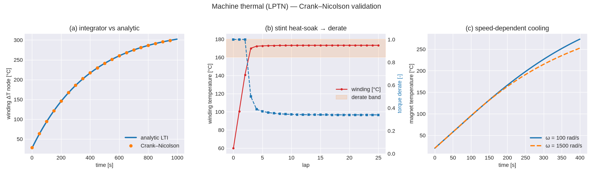

<!-- SPDX-License-Identifier: AGPL-3.0-only -->
# Machine thermal: an N-node lumped-parameter network with derating

`outlap-thermal` advances the temperatures of a machine over the QSS solution. It turns those
temperatures into a **derate** on the commanded torque. A stint is therefore honest: lap 1 differs
from lap 20, and heat soaked up over a sequence of corners costs deployable torque.

The model is a **lumped-parameter thermal network**, or LPTN. It has `N` isothermal nodes with heat
capacities `Cᵢ` in J/K, pairwise conductances `g_ij = 1/R_ij` in W/K, a loss source `Pᵢ` in W at
each node, one pinned ambient node, and an optional coolant node.

It advances with a semi-implicit **Crank–Nicolson** step. The derate is a linear ramp from `1` to
`0`, as each rated node crosses from `T_warn` to `T_max`. The winding normally binds first.

## Amendment to the firewall (Locked Decision #25, 2026-07-05)

The original firewall in §1 forbids outlap to model the internals of a machine. Decision #25 in its
original form was a deliberately simple fixed 2-node model.

**The author has authorized an amendment.** The network now takes any `N`. On the *detailed* path,
outlap **builds** the conductance operator from the geometry of the machine, using ported
heat-transfer correlations. It evaluates them on each segment, at the shaft speed and the node
temperatures.

The amendment is narrow. It applies to the thermal model only. Torque, efficiency, and loss still
cross the firewall as neutral `.ptm` maps.

The correlations are implemented **clean-room from published literature**, cited below. The PDT code
that *builds the geometry* is not ported. outlap consumes an assembled edge list, plus the geometry
parameters that each convection edge needs.

## The network, and how it advances

Each integrated node obeys an energy balance. The coolant node and the ambient node are boundary
conditions:

```
Cᵢ · dTᵢ/dt = Pᵢ + Σⱼ g_ij · (Tⱼ − Tᵢ)          (integrated nodes)
T_ambient   = T_amb                              (pinned; from conditions.yaml or an override)
T_coolant   = T_inlet + Q_in / (2·ρ·c_p·ṁ)       (quasi-static jacket balance, Q_in = Σⱼ g_cj(Tⱼ−T_c))
```

Write the operator `G` with off-diagonals `G_ij = g_ij` and the Kirchhoff diagonal
`G_ii = −Σ_{j≠i} g_ij`. The system is then `C·Ṫ = G·T + P`. The **Crank–Nicolson**, or trapezoidal,
step is

```
(C/h − G/2) · T₊ = (C/h + G/2) · T + P
```

`G` is assembled at the current temperatures, which makes the scheme semi-implicit.

Crank–Nicolson is A-stable. The coarse step for each segment of a lap, `h = Δs/v`, therefore stays
bounded. The ambient row is replaced by `T₊ = T_amb`, and the coolant row by its balance target.

The solve is a fixed-size Gaussian elimination with partial pivoting. It allocates nothing, so the
advance of the slow states meets the hot-loop discipline of §1.

The coolant balance mirrors the energy balance of a continuous envelope. The coolant leaves at the
mean of the inlet and outlet temperatures, `T_inlet + Q_in/(2·ρc_pṁ)`.

### Feedback from copper resistance

The winding loss rises with temperature, as `R_dc(T) = R_ref·(1 + α·(T − T_ref))`. When this is
enabled, the loss deposited at the winding node is scaled by `1 + α·(T − T_ref)` on each step. For
copper, α is about 0.00393 K⁻¹.

This is positive feedback. Without the derate to close the torque loop, it runs away. In a lap
solve, the derate that this model produces is therefore what keeps a real stint bounded.

### Derating

```
derate = min over rated nodes of  clamp( (T_max − T) / (T_max − T_warn), 0, 1 )
```

A node takes part only if it declares both `t_warn_c` and `t_max_c`. The boundary nodes, coolant and
ambient, never derate.

The lap solve multiplies the traction ceiling ([qss-powertrain](qss-powertrain.md)) by this factor.
The reduced torque then reduces the loss injected on the next segment. That is the physical loop.

## Two tiers of authoring, one integrator

The same integrator serves a community user and a PDT import.

- **Lumped** (`emotor/1.1`, hand-authored) uses a reduced menu of nodes. `winding` and `ambient` are
  required. `stator_iron`, `rotor`, and `coolant` are optional. `housing` is recommended.

  The conductances between solids are **constant**. Documented heuristics based on mass fill in any
  capacity or conductance that the author omits. A capacity is `C = f_role · m · c_p`; for a winding,
  `f = 0.15` and `c_p = 385 J/kg·K`, for copper. A conductance takes a reference value for the pair
  of roles, scaled by `(m/m₀)^{2/3}`, because interface area goes as mass^{2/3}. The loaded-model
  report flags every filled value as an **estimate**.

  Cooling is declared by a **cooling block** of raw scalars. A `jacket` gives channel width and
  height, flow, fluid, and wetted area. An `air_gap` gives rotor radius, gap, and stack length. From
  those, assembly derives the capacity rate of the coolant, `ρ·c_p·ṁ`, the channel velocity and
  hydraulic diameter, and the interface area of the air gap.

  Losses come from the total-loss map in the `.ptm` file, split across the nodes. Whatever is not
  routed lands on the winding node.
- **Detailed** (imported) starts from an LPTN that FEA resolved. A PDT importer collapses it onto
  the same reduced menu. It sums the *real* capacity at each node and the `G_const` conductances
  between groups. It reads the raw scalars of the cooling block from clean fields:
  `info/air_gap_mm`, `info/rotor/outer_radius_mm`, `thermal_obj/user/cooling_liquid_jacket`, and
  `thermal_obj/cooling`. It never reads the FEA mesh.

  Losses come from the loss breakdown for each component in the `.ptm` file, aggregated to the
  reduced groups.

  The `convection` edge list of `emotor/1.1` remains available as an advanced escape hatch, for a
  fully explicit network.

## Heat-transfer correlations, on the detailed path

Each convection edge maps a pair of nodes, an interface area `A`, and a correlation, to a
conductance `g = h·A`. The air-gap film uses `g = λ_eff·A/δ` instead. Each correlation is
implemented from a published form:

| Edge | Correlation | Reference |
|---|---|---|
| Air-gap film | modified-Taylor regimes `Nu(Ta_m)` with rotor thermal-expansion gap | Becker & Kaye, *J. Heat Transfer* 84(2), 1962 |
| End-winding / internal-air | `h = a + b·u_rotor^p` in the rotor peripheral speed | Kylander, doctoral thesis, Chalmers, 1995 |
| Rotating-shaft external | `Nu_d = 0.076·Re_d^{0.7}` | Etemad, *Trans. ASME* 77, 1955 |
| Housing free convection | Churchill–Chu cylinder `Nu(Ra)` + linearized radiation | Churchill & Chu, *Int. J. Heat Mass Transfer* 18, 1975 |
| Liquid-jacket channel | Gnielinski turbulent / laminar `Nu = 4.36`, blended | Gnielinski, *Int. Chem. Eng.* 16, 1976 |

The air properties `λ, μ, ν, ρ, c_p, Pr, β` come from polynomial fits and the ideal-gas law. They
are valid from about 250 K to 500 K.

No source from a lap-time optimizer or a game engine was read for this implementation.

This release covers three machine topologies: IPM, SPM, and SynRM. The importer selects the
convection edges from the interface areas that the machine declares.

## Validation



The figure has three panels.

On the left, the Crank–Nicolson advance of a first-order node runs against the analytic LTI step
response, `T(t) = T_amb + (P/g)(1 − e^{−t g/C})`.

In the center, a stint runs on the lumped network. The winding temperature rises lap over lap. The
torque derate falls monotonically as the winding enters the band from `T_warn` to `T_max`.

On the right, the detailed network shows cooling that depends on speed. The air-gap film stiffens
as shaft speed rises, so the magnet runs cooler at higher speed for the same loss.

Property tests cover five things: the match against the LTI solution; energy closure at steady
state, where injected power equals what the coolant and the ambient reject; monotonicity of the
derate; the quasi-static target for the coolant; and the fill from the mass heuristics.
