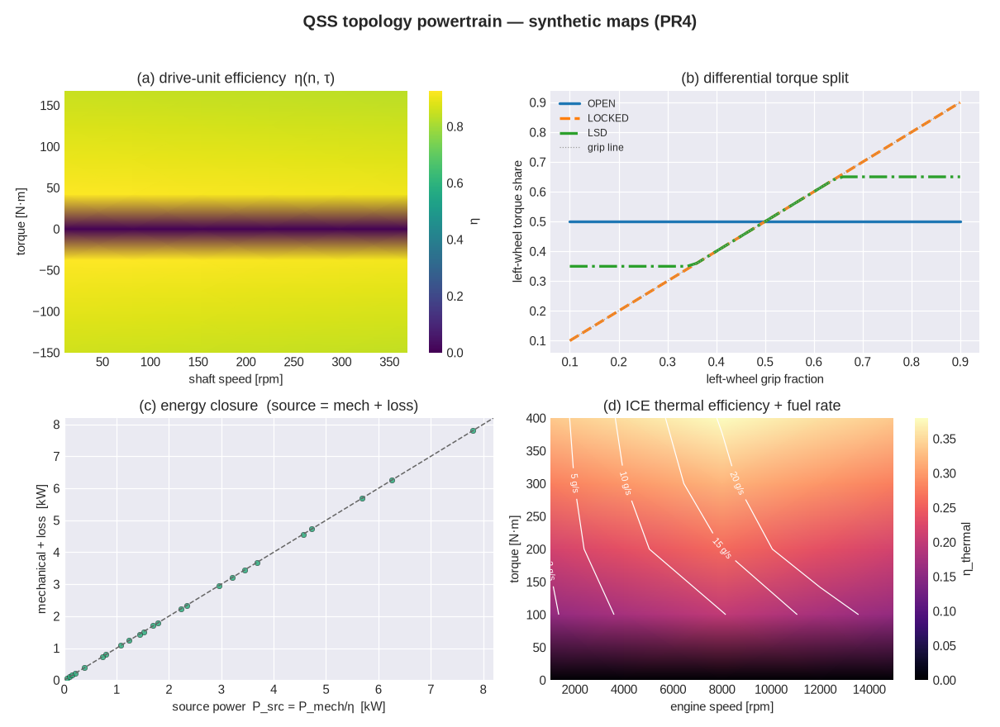
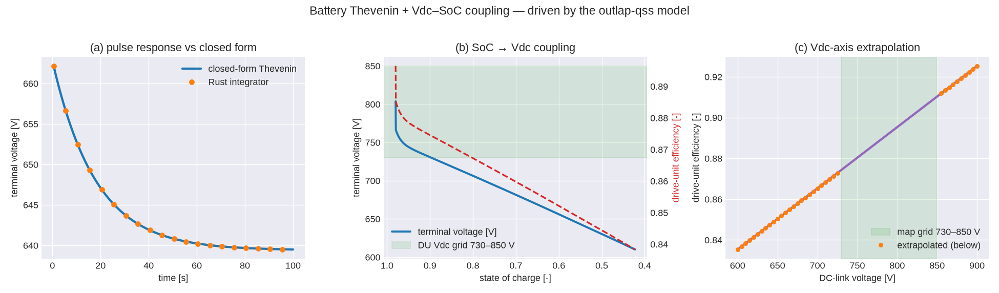

<!-- SPDX-License-Identifier: AGPL-3.0-only -->
# QSS powertrain — topology graph in the traction limit

`outlap-qss`'s `t1::powertrain` module folds the **drivetrain topology graph** (§8.0) into the
quasi-steady-state trim: the powertrain torque envelope becomes the traction ceiling, the efficiency
and loss maps drive energy accounting, and the differential torque split enters the
[double-track trim](t1-trim.md) directly so open vs locked behaviour shapes the mid-corner per-wheel
forces. Powertrains are consumed only as neutral `.ptm` map files — the firewall (§1): outlap never
models a machine, inverter, or gearbox internally.

Implemented clean-room from published literature: Perantoni & Limebeer, *"Optimal control for a
Formula One car with variable parameters"*, Vehicle System Dynamics 52(5), 2014 (the reference F1
driveline); Guiggiani, *The Science of Vehicle Dynamics*, 2nd ed., 2018, ch. 3 (driveline torque
balance); Milliken & Milliken, *Race Car Vehicle Dynamics*, 1995, ch. 20 (differential torque-bias
models). No lap-time-optimiser or game-engine source is read for the implementation.

## The topology graph as data (§8.0)

A drivetrain is a directed graph: torque **sources** (`.ptm` maps — ICE, electric machines, or
lumped drive units) reach wheel **sinks** through an ordered **coupler** path (gearbox, fixed ratio,
differential). Any four-wheeled concept is a topology plus data — `drivetrain.units[]`, each
`{source, path: [couplers…], wheels: […]}` — and the assembler validates the graph (reachability,
no ratio conflicts, §8.0) at load time. The T1 reduction folds each unit's coupler path into a set
of **gears** using the T0 convention

```
ω_shaft = (ratio / r_wheel) · v            (shaft speed from vehicle speed)
F_wheel = (ratio · η_mech / r_wheel) · τ    (wheel force from source torque)
ratio   = Π(fixed ratios) · gear_ratio · final_drive
```

where `η_mech` is the constant (or mapped) **mechanical** gearbox efficiency and `r_wheel` the driven
tyre's unloaded radius. A `kind: drive_unit` map is already lumped at the wheel-side shaft, so the
topology applies no further ratio unless `meta.upstream_ratio_applied: false`.

### Traction ceiling

The largest wheel force a unit can put down at speed `v` is its best on-envelope gear,

```
F_max(v) = max over gears g on-envelope of  τ_peak(ω_g) · ratio_g · η_mech,g / r_wheel
```

with `τ_peak(ω)` the `.ptm` peak-torque envelope (the shared monotone cubic Hermite, Decision #30)
and gears whose shaft speed exceeds the envelope's top rev-limited out. Summed over the drive units
this is `max_tractive_force(v)`. It is the **powertrain traction ceiling** — the g-g-g-v envelope
(PR7) caps the acceleration boundary with it, while the tyre-grip limit is enforced by the trim
itself. The machine/thermal efficiency map does **not** reduce this force: the `.ptm` torque envelope
is already the mechanical output; the efficiency map governs the *energy drawn*, below.

The ceiling folds only the `drivetrain.units` — an F1's ERS/MGU-K lives in the separate `ers:` block
(§8.3) and its rule-based deployment (speed taper, per-lap energy budget) is **not** added to the
T1 traction ceiling in M3; that boost is surfaced in the loaded-model report as an assembly note and
folded in with the energy manager later.

## Wheel-torque conservation and static splits

A coupler is a linear torque gain: `Σ τ_wheel = τ_source · ratio · η`. Static allocation is data —
`control.split.front` (front/rear) and `control.split.left` (left/right) partition the source torque
across axles/sides — and every split's fractions sum to one. Rule-based control only in M3: the
yaw-moment torque-vectoring controller and QP allocation are M4/post-v1 (Locked Decisions #2, #11).

## The differential torque split (§8.2) inside the trim

The differential on the driven axle sets how an axle torque `τ` divides between its two wheels — and
that split is a genuine unknown of the trim, not a post-processing step. The trim's 9th unknown `w`
is the **driven-axle slip split** (`κ_left = s + w`, `κ_right = s − w`), closed by a 9th residual
that encodes the differential law:

| differential | trim residual (drive) | behaviour |
|---|---|---|
| open | `F_{x,left} − F_{x,right} = 0` | **equal torque**; `w` free, the two wheels take unequal slip |
| locked / solid | `w = 0` | **equal speed**; the wheels take equal slip, torque follows grip |
| LSD | `w = 0` (locks under load) | equal speed; preload/ramp bound the reported split |

Under braking the differential is inactive — the balance bar splits brake torque — so `w = 0`. An
**open** diff can carry no torque difference: the two wheels must produce equal longitudinal force,
so the inner (less-loaded) wheel slips more to match the outer wheel's torque, and its grip *caps*
the deliverable axle torque. When the demand exceeds that cap — maximum lateral and longitudinal at
once — the equal-torque root ceases to exist and the point is a clean traction boundary (the FWD
reference car shows exactly this at `|a_y| = 6, a_x = 3`). A **locked** or **solid** diff holds the
wheels at equal speed and lets torque follow grip, so the axle delivers the *sum* of the two wheels'
capability and the left/right force difference produces a yaw moment straight out of `R3`.

**LSD (a documented QSS simplification).** A preloaded limited-slip differential locks up at the
traction limit, so in the trim the LSD uses the **locked** (equal-speed) constraint; its preload and
ramp bound the reported torque split rather than unlocking a partial differential slip (a T2/M4
refinement). The standalone reference used for reporting and the property tests carries the full
range — `T_bias = preload + ramp·|τ_axle|`, the side-to-side torque difference clamped between the
open (`0`) and locked (grip-proportional) limits:

```
(τ_left, τ_right) = grip_proportional(τ, cap_left, cap_right), then clamp |τ_left − τ_right| ≤ T_bias
```

The schema's `ramp: [accel, decel]` is read as a **percent lock-up** (0–100 → fraction, values ≤ 1
taken as fractions directly) applied to the axle torque; the drive ramp is used under acceleration,
the brake ramp under braking.



*The committed synthetic maps (`python/tools/plot_qss_powertrain.py`): (a) the drive-unit efficiency
map η(speed, torque) from the importer-emitted parquet; (b) the differential torque split vs
left/right grip ratio — open holds 50/50, locked follows grip, the LSD sits between within its bias
band; (c) energy closure — source power and mechanical + loss coincide at the drive nodes; (d) the
ICE brake-thermal-efficiency map and the fuel-mass rate it implies under load.*

## Energy accounting and the efficiency/loss maps

The dense `efficiency`/`loss_w` tables in a `.ptm` sidecar (parquet, decoded at assembly time on the
native edge; the solver consumes the wasm-clean `GriddedTable`) drive energy accounting. At a source
shaft point `(n, τ)` with mechanical power `P_mech = τ·ω`:

```
drive (τ > 0):  P_source = P_mech / η        loss = P_mech · (1/η − 1)
regen (τ < 0):  P_source = P_mech · η         loss = |P_mech| · (1 − η)
ICE fuel rate:  ṁ_fuel = P_source / LHV       (η is brake thermal efficiency; LHV ≈ 43 MJ/kg)
```

so **energy closes**: `P_source = P_mech + loss`, exactly at the map's grid nodes when the importer
emits a consistent efficiency/loss pair, and to interpolation accuracy between them. Fuel mass is
accounted but held constant in M3 (no fuel slow state — that is M4/M5); the machine thermal
derating is PR5 (see `machine-thermal.md`) and the battery Vdc–SoC coupling is the next section.

### PDT round-trip gate (§10.5 / §13)

The importer (`outlap.importers.pdt_h5`) writes a long/tidy parquet — `speed_rpm, torque_nm,
efficiency, loss_w` — beside the `.ptm`. The round-trip gate loads that emitted `.ptm` plus its
parquet through the real `GriddedMapN` path and reproduces spot efficiencies from the source arrays
to **1e-6** (exact at the grid nodes the importer sampled). Unreachable cells beyond the torque
envelope carry `NaN` and are nearest-valid filled + flagged out-of-hull; the zero-torque spin column
is pinned to `η = 0`. CI runs on synthetic PDT-shaped fixtures only — real PDT data never enters the
repository (firewall, Decision #7).

## Property tests

Differential split limits (open ⇒ equal torque; locked/solid ⇒ grip-proportional/equal speed; LSD
between the two within its bias band); coupler torque conservation `Σ τ_out = τ_in·ratio·η`;
axle/side split fractions and diff outputs sum to one; energy closure `source = mechanical + loss` at
the drive nodes; ICE fuel-mass rate positive under load; the PDT round-trip reproducing spot
efficiencies to 1e-6 through `GriddedMapN`; the open diff splitting driven-wheel slip while
locked/LSD keeps it equal (in the live trim); a positive traction ceiling that falls with speed for a
geared engine; and a gearbox map efficiency assembling for T1 (retiring T0's
`UnsupportedEfficiencyMap` for the double-track tier).

## Battery model and the Vdc–SoC coupling (§8.4)

A battery pack enters the QSS as a **Thevenin equivalent circuit** (`battery/1.0`): open-circuit
voltage `OCV`, series resistance `R0`, one RC pair `(R1, τ1)`, and the entropic coefficient
`dU/dT`, all tabulated on a `(SoC, temperature)` grid, plus the `ns × np` pack topology, the SoC
window, peak-power-vs-SoC limits, and a lumped thermal node. Cell tables scale to the pack by `ns`
(voltage) and `ns/np` (resistance). The equivalent-circuit form and its state equations follow the
published NREL `thevenin` model (BSD-3) and the ECM literature it cites (Plett, *Battery Management
Systems* Vol. 1, 2015, ch. 2–3), re-authored clean-room.

At the pack level, with discharge current `I` positive, the terminal (DC-link) voltage is

```
V_term = OCV(SoC, T) − I·R0 − V_RC ,        V_RC → I·R1  at time constant τ1.
```

**Three per-segment slow states** advance alongside PR5's machine node temperatures at the same
lap-loop hook (wired in PR8), each a zero-allocation, deterministic step:

- **SoC** — Coulomb-counted, `ΔSoC = −I·Δt / (3600·Q_pack)`.
- **`V_RC`** — advanced by the *exact* exponential integrator for a current held constant over the
  segment, `V_RC ← V_RC·e^{−Δt/τ1} + I·R1·(1 − e^{−Δt/τ1})`. Over a constant-current pulse this
  reproduces the closed-form Thevenin response to machine precision (§13 battery row, ≤ 1 % RMS).
- **`T_batt`** — a lumped node `C = m·c_p` heated by the irreversible `I²R0 + V_RC²/R1` dissipation
  and the entropic `I·T·dU/dT` term, cooled to the coolant through `R_th`; semi-implicit Euler on
  the decay term (A-stable, matching §11's slow-state integrator).

**Vdc–SoC coupling (user decision, 2026-07-05).** A machine/drive-unit `.ptm` used with a battery
is checked for a **Vdc axis** (`ptm/1.1`). If present, its efficiency/loss maps are 3-D
`(speed, torque, vdc)` and are evaluated at the pack's SoC-dependent terminal voltage `V_term` — so
a low-SoC (low-voltage) point shifts **both** the traction efficiency and the machine-heating loss
injected into PR5's `.emotor` network. If absent, the map is single-voltage. No battery ⇒
single-voltage.

The real 220S pack swings ≈ 620–808 V over its SoC window while a drive-unit map is typically gridded
730–850 V, so a large low/mid-SoC band sits **below** the map. On the Vdc axis the shared monotone
Hermite (Decision #30) uses **linear** out-of-domain extrapolation from the boundary slice —
C¹-continuous with the interior — rather than clamping, so the map stays usable there; extrapolated
torque/efficiency are floored to feasible bounds and any extrapolated band is recorded in the
loaded-model report. The battery peak-power limit and PR5's thermal derate are both dynamic caps on
the traction boundary and **compose** (the lap takes the `min`); neither is baked into PR7's static
envelope, which stays thermal/SoC-neutral (reference cold, full charge).



*Driven by the committed Rust model (`python/tools/plot_battery_coupling.py` runs
`crates/outlap-qss/examples/battery_coupling.rs`): (a) the Thevenin pulse response vs the closed
form; (b) an SoC sweep of the committed pack — terminal voltage and the drive-unit efficiency at the
coupled voltage; (c) drive-unit efficiency vs DC-link voltage, with the map grid shaded so the
below/above-grid linear extrapolation is visible.*

### Braking regen (battery + electric machine)

Regeneration is a property of **any battery + electric machine**, not of the 2026 ERS manager: an EV
powertrain, a hybrid's helper machine, and the F1 MGU-K all recover braking energy through the
machine. So on a braking segment (`F_req < 0`) the QSS slow-state march harvests into the pack even
when the car has **no `ers:` block** — the manager only *schedules* the F1-specific deploy/budget on
top. The recovery uses the same ceiling chain as the transient tier's `blend_regen` (see
[transient_control.md](transient_control.md)), collapsed to the point mass:

```
demand_W     = max_regen_frac · axle_share · (−F_req · v)     # blend authority × driven-axle brake
envelope_W   = ( Σ_axle regen_force(v) ) · v · fade(v)        # the machine's regen power envelope
mech_W       = min(demand_W, envelope_W)
elec_W       = min(mech_W · η_regen, P_accept(SoC, T))        # η_regen = 0.90; pack charge acceptance
ΔSoC         = −elec_W · dt / E_pack                          # charge (Coulomb count)
```

`max_regen_frac` is `brakes.regen_blend.max_regen_frac` (0 — hence no harvest — without a
`regen_blend` block); `axle_share` is the driven axle's share of braking from the balance bar;
`regen_force(v)` is the `.ptm` regen envelope (`max_regen_force_by_axle`); `fade(v)` is the low-speed
roll-off; `η_regen = 0.90` is a documented constant matching the transient tier's `RegenParams`, so
QSS and T2 recover the same energy from a given capture. `P_accept` is the pack's charge-acceptance
ceiling (CV taper ∧ kinetic derate) — decisively, a **near-full pack accepts almost nothing**, so a
hot-lap EV starting near 100 % SoC barely regens. The braking force at the wheels is unchanged (the
calipers supply the deficit), so **the trajectory is untouched** — a car's drive-segment lap stays
byte-identical, only the SoC channel gains the recovered charge. The ERS manager substitutes the FIA
0.97 electrical↔mechanical factor for `η_regen` and adds the per-lap Recharge budget; the ceilings
are otherwise identical, so the manager and the plain-EV path recover consistently.

### Battery property tests

Pulse response vs the closed-form Thevenin (RMS ≪ 1 %); a regen pulse lifting the terminal above OCV;
SoC monotone under discharge; the discharge clipped to zero at the SoC-window floor; determinism of
the slow-state advance; the Vdc-stacked map reproduced in-grid and **linearly extrapolated** below
and above the grid (exact, since the synthetic field is linear in Vdc); the coupling presence matrix
(a map with a Vdc axis tracks the coupled voltage; a single-voltage map ignores it); and the pack's
terminal voltage driving a lower coupled efficiency as it drains. The slow-state advance is covered
by the zero-allocation gate.
