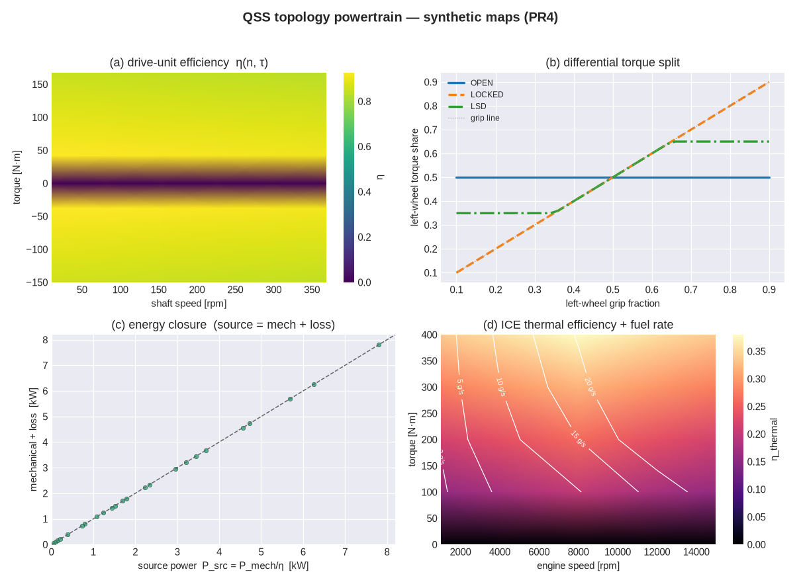
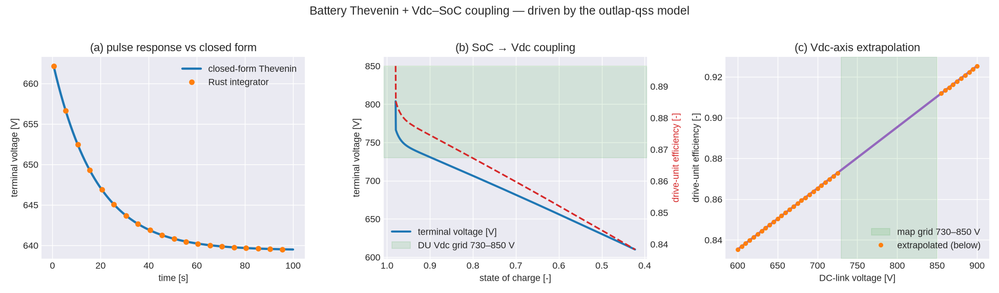

<!-- SPDX-License-Identifier: AGPL-3.0-only -->
# The QSS powertrain: a topology graph inside the traction limit

The `t1::powertrain` module of `outlap-qss` folds the **drivetrain topology graph** (§8.0) into the
quasi-steady-state trim. Three things follow. The torque envelope of the powertrain becomes the
traction ceiling. The efficiency and loss maps drive energy accounting. And the torque split of the
differential enters the [double-track trim](t1-trim.md) directly, so the difference between an open
and a locked differential shapes the per-wheel forces in mid-corner.

Powertrains are consumed only as neutral `.ptm` map files. That is the firewall (§1). outlap never
models a machine, an inverter, or a gearbox internally.

It is implemented clean-room, from published literature. Perantoni & Limebeer, *"Optimal control for
a Formula One car with variable parameters"*, Vehicle System Dynamics 52(5), 2014, gives the
reference F1 driveline. Guiggiani, *The Science of Vehicle Dynamics*, 2nd ed., 2018, ch. 3, gives the
torque balance of a driveline. Milliken & Milliken, *Race Car Vehicle Dynamics*, 1995, ch. 20, gives
the torque-bias models for a differential. No source from a lap-time optimizer or a game engine was
read for the implementation.

## The topology graph as data (§8.0)

A drivetrain is a directed graph. Torque **sources**, which are `.ptm` maps for an ICE, an electric
machine, or a lumped drive unit, reach wheel **sinks** through an ordered path of **couplers**: a
gearbox, a fixed ratio, or a differential.

Any concept with four wheels is therefore a topology plus data. That is `drivetrain.units[]`, where
each unit is `{source, path: [couplers…], wheels: […]}`. The assembler validates the graph at load
time, checking reachability and conflicting ratios (§8.0).

The T1 reduction folds the coupler path of each unit into a set of **gears**, using the T0
convention:

```
ω_shaft = (ratio / r_wheel) · v            (shaft speed from vehicle speed)
F_wheel = (ratio · η_mech / r_wheel) · τ    (wheel force from source torque)
ratio   = Π(fixed ratios) · gear_ratio · final_drive
```

`η_mech` is the **mechanical** efficiency of the gearbox, either constant or mapped. `r_wheel` is the
unloaded radius of the driven tire.

A map is always referenced at the shaft that its unit outputs onto (ptm/2.0). A map authored at the
machine's own shaft declares the reduction in the `fixed_ratio:` field of the unit (vehicle/2.1).
There is no escape hatch for an individual map.

### The traction ceiling

The largest wheel force a unit can put down at speed `v` comes from its best gear that is still on
the envelope:

```
F_max(v) = max over gears g on-envelope of  τ_peak(ω_g) · ratio_g · η_mech,g / r_wheel
```

`τ_peak(ω)` is the peak-torque envelope from the `.ptm` file, interpolated by the shared monotone
cubic Hermite (Decision #30). A gear whose shaft speed exceeds the top of the envelope is rev-limited
out.

Summed over the drive units, this is `max_tractive_force(v)`. It is the **traction ceiling of the
powertrain**. The g-g-g-v envelope (PR7) caps the acceleration boundary with it. The trim itself
enforces the limit from tire grip.

The efficiency map of the machine, and its thermal map, do **not** reduce this force. The torque
envelope in the `.ptm` file is already the mechanical output. The efficiency map governs the *energy
drawn*, as described below.

The ceiling folds in only `drivetrain.units`. The ERS and MGU-K of an F1 car live in the separate
`ers:` block (§8.3). Their rule-based deployment, which covers the speed taper and the energy budget
for each lap, is **not** added to the T1 traction ceiling in M3. The loaded-model report surfaces
that boost as an assembly note, and the energy manager folds it in later.

## Conservation of wheel torque, and the static splits

A coupler is a linear gain on torque: `Σ τ_wheel = τ_source · ratio · η`.

Static allocation is data. `control.split.front` partitions the source torque between front and
rear, and `control.split.left` partitions it between left and right. The fractions of every split
sum to one.

M3 has rule-based control only. The torque-vectoring controller for yaw moment, and QP allocation,
are M4 or post-v1 work (Locked Decisions #2 and #11).

## The torque split of the differential (§8.2), inside the trim

The differential on the driven axle decides how an axle torque `τ` divides between its two wheels.
That split is a genuine unknown of the trim. It is not a post-processing step.

The 9th unknown of the trim is `w`, the **slip split on the driven axle**, where `κ_left = s + w` and
`κ_right = s − w`. A 9th residual closes it, and that residual encodes the law of the differential:

| differential | trim residual (drive) | behaviour |
|---|---|---|
| open | `F_{x,left} − F_{x,right} = 0` | **equal torque**; `w` free, the two wheels take unequal slip |
| locked / solid | `w = 0` | **equal speed**; the wheels take equal slip, torque follows grip |
| LSD | `w = 0` (locks under load) | equal speed; preload/ramp bound the reported split |

Under braking the differential is inactive, because the balance bar splits brake torque. Therefore
`w = 0`.

An **open** differential can carry no difference in torque. The two wheels must produce equal
longitudinal force. The inner wheel, which is less loaded, therefore slips more to match the torque
of the outer wheel, and its grip *caps* the torque that the axle can deliver.

When the demand exceeds that cap — maximum lateral and maximum longitudinal at once — the root with
equal torque ceases to exist. The point is then a clean traction boundary. The FWD reference car
shows exactly this at `|a_y| = 6, a_x = 3`.

A **locked** or **solid** differential holds the wheels at equal speed and lets torque follow grip.
The axle therefore delivers the *sum* of what the two wheels can do, and the difference in force
between left and right produces a yaw moment straight out of `R3`.

**LSD, a documented simplification in QSS.** A limited-slip differential with preload locks up at
the traction limit. The trim therefore gives the LSD the **locked** constraint, at equal speed. Its
preload and ramp bound the torque split that the trim reports, rather than unlocking a partial slip
across the differential. That refinement belongs to T2 and M4.

The standalone reference, used for reporting and for the property tests, carries the full range. The
bias is `T_bias = preload + ramp·|τ_axle|`, and the difference in torque between the sides is clamped
between the open limit, which is `0`, and the locked limit, which is proportional to grip:

```
(τ_left, τ_right) = grip_proportional(τ, cap_left, cap_right), then clamp |τ_left − τ_right| ≤ T_bias
```

The schema field `ramp: [accel, decel]` is read as a **percent of lock-up**. A value from 0 to 100
becomes a fraction, and a value at or below 1 is taken as a fraction directly. It applies to the
axle torque. The drive ramp applies under acceleration, and the brake ramp under braking.



*The committed synthetic maps, from `python/tools/plot_qss_powertrain.py`. Panel (a) is the
efficiency map of the drive unit, η(speed, torque), from the parquet that the importer emits. Panel
(b) is the torque split of the differential against the ratio of grip between left and right: open
holds 50/50, locked follows grip, and the LSD sits between the two, inside its bias band. Panel (c)
shows energy closing, where source power equals mechanical power plus loss at the drive nodes. Panel
(d) is the brake-thermal-efficiency map of the ICE, and the rate of fuel mass that it implies under
load.*

## Energy accounting, and the efficiency and loss maps

The dense `efficiency` and `loss_w` tables in a `.ptm` sidecar drive energy accounting. They arrive
as parquet, and are decoded at assembly time on the native edge. The solver consumes the
wasm-clean `GriddedTable`.

At a point `(n, τ)` on a source shaft, with mechanical power `P_mech = τ·ω`:

```
drive (τ > 0):  P_source = P_mech / η        loss = P_mech · (1/η − 1)
regen (τ < 0):  P_source = P_mech · η         loss = |P_mech| · (1 − η)
ICE fuel rate:  ṁ_fuel = P_source / LHV       (η is brake thermal efficiency; LHV ≈ 43 MJ/kg)
```

**Energy therefore closes**: `P_source = P_mech + loss`. It closes exactly at the grid nodes of the
map, when the importer emits a consistent pair of efficiency and loss. Between nodes it closes to
interpolation accuracy.

M3 accounts for fuel mass but holds it constant. There is no fuel slow state, which is M4 or M5
work. The thermal derating of the machine is PR5; see `machine-thermal.md`. The Vdc–SoC coupling of
the battery is the next section.

### The PDT round-trip gate (§10.5 and §13)

The importer, `outlap.importers.pdt_h5`, writes a long, tidy parquet beside the `.ptm` file. Its
columns are `speed_rpm, torque_nm, efficiency, loss_w`.

The round-trip gate loads that emitted `.ptm`, and its parquet, through the real `GriddedMapN` path.
It then reproduces spot efficiencies from the source arrays, to **1e-6**. At the grid nodes that the
importer sampled, the match is exact.

Cells beyond the torque envelope are unreachable. They carry `NaN`, and the importer fills them from
the nearest valid cell and flags them as outside the hull. The zero-torque spin column is pinned to
`η = 0`.

CI runs on synthetic fixtures shaped like PDT data, and on nothing else. Real PDT data never enters
the repository. That is the firewall, and Decision #7.

## Property tests

They cover: the limits of the differential split, where open gives equal torque, locked and solid
give grip-proportional torque at equal speed, and the LSD sits between the two inside its bias band;
conservation of torque through a coupler, `Σ τ_out = τ_in·ratio·η`; that the split fractions for
axles and sides, and the outputs of the differential, sum to one; energy closure, where source
equals mechanical plus loss at the drive nodes; a positive rate of fuel mass for the ICE under load;
the PDT round trip reproducing spot efficiencies to 1e-6 through `GriddedMapN`; that the open
differential splits the slip of the driven wheels while locked and LSD keep it equal, in the live
trim; a traction ceiling that is positive and falls with speed for a geared engine; and a gearbox
efficiency map assembling for T1, which retires the `UnsupportedEfficiencyMap` error of T0 for the
double-track tier.

## The battery model, and the Vdc–SoC coupling (§8.4)

A battery pack enters the QSS as a **Thevenin equivalent circuit** (`battery/1.0`). It carries the
open-circuit voltage `OCV`, the series resistance `R0`, one RC pair `(R1, τ1)`, and the entropic
coefficient `dU/dT`. All four are tabulated on a grid of `(SoC, temperature)`.

It also carries the pack topology `ns × np`, the SoC window, limits on peak power against SoC, and
one lumped thermal node. Cell tables scale to the pack by `ns` for voltage and by `ns/np` for
resistance.

The form of the equivalent circuit and its state equations follow the published NREL `thevenin`
model (BSD-3), and the ECM literature that it cites (Plett, *Battery Management Systems* Vol. 1,
2015, ch. 2–3). They are re-authored clean-room.

At the pack level, with discharge current `I` taken as positive, the terminal voltage on the DC link
is

```
V_term = OCV(SoC, T) − I·R0 − V_RC ,        V_RC → I·R1  at time constant τ1.
```

**Three slow states advance on each segment**, alongside the node temperatures of the machine from
PR5. They share the same hook in the lap loop, which PR8 wires. Each step is deterministic and
allocates nothing.

- **SoC** is Coulomb-counted: `ΔSoC = −I·Δt / (3600·Q_pack)`.
- **`V_RC`** advances by the *exact* exponential integrator, for a current held constant over the
  segment: `V_RC ← V_RC·e^{−Δt/τ1} + I·R1·(1 − e^{−Δt/τ1})`. Over a pulse at constant current, this
  reproduces the closed-form Thevenin response to machine precision. That is the battery row of §13,
  at ≤ 1 % RMS.
- **`T_batt`** is a lumped node with `C = m·c_p`. Two sources heat it: the irreversible dissipation
  `I²R0 + V_RC²/R1`, and the entropic term `I·T·dU/dT`. It cools to the coolant through `R_th`.
  Semi-implicit Euler advances the decay term, which is A-stable and matches the slow-state
  integrator of §11.

**The Vdc–SoC coupling, a user decision of 2026-07-05.** When a `.ptm` map for a machine or a drive
unit is used with a battery, outlap checks it for a **Vdc axis**, `vdc_v`.

If that axis is present, the efficiency and loss maps are 3-D, over `(speed, torque, vdc)`. They are
evaluated at the terminal voltage of the pack, `V_term`, which depends on SoC. A point at low SoC,
and therefore low voltage, therefore shifts **both** the traction efficiency and the heating loss
that is injected into the `.emotor` network from PR5.

If the axis is absent, the map is single-voltage. A car with no battery is single-voltage too.

The real 220S pack swings from about 620 V to 808 V over its SoC window. A drive-unit map is
typically gridded from 730 V to 850 V. A wide band at low and middle SoC therefore sits **below** the
map.

On the Vdc axis, the shared monotone Hermite (Decision #30) uses **linear** extrapolation outside
the domain, from the boundary slice. It does not clamp. The extrapolation is C¹-continuous with the
interior, so the map stays usable there. Extrapolated torque and efficiency are floored to feasible
bounds, and the loaded-model report records any band that was extrapolated.

The peak-power limit of the battery and the thermal derate from PR5 are both dynamic caps on the
traction boundary, and they **compose**: the lap takes the `min`. Neither is baked into the static
envelope of PR7, which stays neutral in thermal and SoC terms, at a cold reference and full charge.



*Driven by the committed Rust model. `python/tools/plot_battery_coupling.py` runs
`crates/outlap-qss/examples/battery_coupling.rs`. Panel (a) is the Thevenin pulse response against
the closed form. Panel (b) sweeps SoC on the committed pack, showing terminal voltage and the
efficiency of the drive unit at the coupled voltage. Panel (c) plots the efficiency of the drive
unit against DC-link voltage, with the grid of the map shaded, so that the linear extrapolation
below and above the grid is visible.*

### Regeneration under braking, from a battery and an electric machine

Regeneration is a property of **any battery plus electric machine**. It is not a property of the
2026 ERS manager. An EV powertrain, the helper machine of a hybrid, and the F1 MGU-K all recover
braking energy through the machine.

On a braking segment, where `F_req < 0`, the QSS march of the slow states therefore harvests into
the pack, even on a car with **no `ers:` block**. The manager only *schedules* the F1-specific
deploy and budget on top of that.

The recovery uses the same chain of ceilings as `blend_regen` in the transient tier (see
[transient_control.md](transient_control.md)), collapsed onto the point mass:

```
demand_W     = max_regen_frac · axle_share · (−F_req · v)     # blend authority × driven-axle brake
envelope_W   = ( Σ_axle regen_force(v) ) · v · fade(v)        # the machine's regen power envelope
mech_W       = min(demand_W, envelope_W)
elec_W       = min(mech_W · η_regen, P_accept(SoC, T))        # η_regen = 0.90; pack charge acceptance
ΔSoC         = −elec_W · dt / E_pack                          # charge (Coulomb count)
```

`max_regen_frac` comes from `brakes.regen_blend.max_regen_frac`. Without a `regen_blend` block it is
0, so there is no harvest. `axle_share` is the driven axle's share of braking, from the balance bar.
`regen_force(v)` is the regen envelope in the `.ptm` file, through `max_regen_force_by_axle`.
`fade(v)` is the roll-off at low speed.

`η_regen = 0.90` is a documented constant. It matches `RegenParams` in the transient tier, so QSS and
T2 recover the same energy from a given capture.

`P_accept` is the ceiling on charge acceptance for the pack, which is the CV taper and the kinetic
derate. This matters decisively: a **pack that is near full accepts almost nothing**. An EV on a hot
lap that starts near 100 % SoC therefore barely regenerates.

The braking force at the wheels is unchanged, because the calipers supply the deficit. **The
trajectory is therefore untouched.** A lap on a drive segment stays byte-identical, and only the SoC
channel gains the recovered charge.

The ERS manager substitutes the FIA factor of 0.97 between electrical and mechanical energy for
`η_regen`, and it adds the Recharge budget for each lap. The ceilings are otherwise identical, so the
manager and the plain-EV path recover consistently.

### Property tests for the battery

They cover: the pulse response against the closed-form Thevenin, at an RMS well under 1 %; a regen
pulse lifting the terminal voltage above OCV; SoC monotone under discharge; the discharge clipped to
zero at the floor of the SoC window; determinism in the advance of the slow states; a Vdc-stacked map
reproduced inside the grid and **linearly extrapolated** below and above it, which is exact because
the synthetic field is linear in Vdc; the matrix of coupling presence, where a map with a Vdc axis
tracks the coupled voltage and a single-voltage map ignores it; and the terminal voltage of the pack
driving a lower coupled efficiency as it drains. The zero-allocation gate covers the advance of the
slow states.
