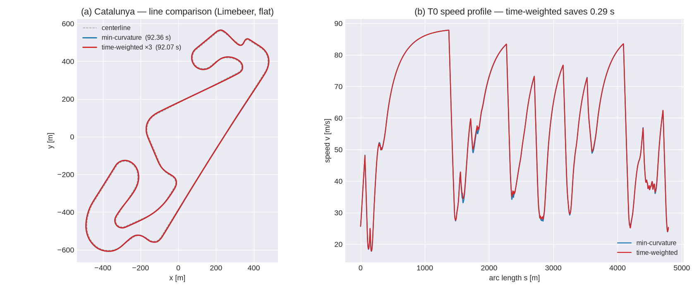

<!-- SPDX-License-Identifier: AGPL-3.0-only -->
# The racing line: min-curvature and time-weighted QP

A lap solver only ever moves as fast as the line it is given lets it. outlap generates that line as a
convex quadratic program over the lateral offset `n(s)` inside the track corridor, and returns it as
a **first-class `Track`** (its own `κ(s)`, grade, and road frame) so every tier drives it through the
identical geometry API. Two generators share the same QP machinery
(`crates/outlap-raceline/src/lib.rs`):

* **`min_curvature`** — the classic minimum-curvature line (Locked Decision #14).
* **`time_weighted`** — a minimum-*time* refinement that reweights the same QP by the local time
  spent, `Δt = Δs / v`, closing on the fastest line without leaving the convex QP (Decision #10).

## The minimum-curvature QP

With the offset path `r_i = c_i + n_i·l̂_i` (a centerline point plus an offset along the road-plane
lateral) the discrete path curvature linearises (Heilmeier et al. 2020, §3.1) to

```
κ_new,i = κ_r,i + (n_{i-1} − 2 n_i + n_{i+1}) / Δs²  +  κ_r,i²·n_i   =   (M·n + κ_r)_i
```

with `M` tridiagonal (`M_{i,i} = −2/Δs² + κ_r,i²`, `M_{i,i±1} = 1/Δs²`). The last term, `κ_r²·n`, is
the metric correction that makes an *inward* offset correctly **increase** curvature. Minimising the
sum of squared curvature `‖M·n + κ_r‖²` subject to the corridor box `n_lo ≤ n ≤ n_hi` is a convex QP,

```
minimise  ½ nᵀ P n + qᵀ n     with  P = 2 MᵀM,   q = 2 Mᵀκ_r
subject to [I; −I]·n ≤ [n_hi; −n_lo]
```

solved with clarabel. `P` is pentadiagonal (plus the two wrap corners on a closed track); a small
Tikhonov term on the diagonal keeps the solution unique on straights, where curvature is flat and the
offset is otherwise free.

Re-implemented from the published formulation (F. Braghin et al., *Race driver model*, Computers &
Structures 86, 2008; A. Heilmeier et al., *Minimum-curvature trajectory planning…*, Vehicle System
Dynamics 58(10), 2020, §3.1–3.2) — never from the LGPL TUM source.

## Why min-curvature is not minimum-time

The minimum-curvature line minimises `∫κ² ds`, not lap time. It spends its "curvature budget"
uniformly along the lap, so it under-opens the **medium-speed** corners where a real car would trade a
little extra path length for a higher entry/exit speed, and over-optimises fast kinks that were never
the limiting factor. On the Limebeer/Barcelona reference this line-optimality gap is one of the named
components of the QSS-vs-optimal-control lap-time residual (see `docs/validation/limebeer.md`).

## The time-weighted line (Decision #10)

Time, not curvature, is what we want to minimise. The time to traverse station `i` is
`Δt_i = Δs_i / v_i`, so a **time-weighted** objective replaces the flat sum with

```
minimise  Σ_i w_i · κ_new,i²  =  (M·n + κ_r)ᵀ W (M·n + κ_r),     w_i = Δt_i ∝ 1/v_i
```

which is still a convex QP, now with `P = 2 MᵀWM` and `q = 2 MᵀWκ_r` (`W = diag(w)`). Down-weighting
the fast straights and up-weighting the slow corners tells the optimiser to spend its curvature
budget where the car actually loses time — it opens the slow corners more, at the cost of a little
straight-line curvature it can afford. With `W = I` this reduces **exactly** to min-curvature, so the
two generators are one code path (`solve_qp(..., weights)`); the flat path is assembled byte-for-byte
as before so min-curvature provenance is unchanged.

The weights depend on the speeds, and the speeds depend on the line — so the weights are found by an
**outer reweight loop** (Rowold et al. 2023; Lovato & Massaro 2022 use the same speed-feedback idea
for their minimum-lap-time lines):

1. Start from the min-curvature line.
2. Run a **T0 / g-g-g-v speed pre-pass** on the current line to get `v(s)` and the modelled lap time.
3. Set `w_i = 1/v_i` and re-solve the weighted QP for a new line.
4. Keep the faster line; stop when the modelled lap time stops improving (or after `iterations`,
   typically 2–4).

Because each step is a single convex QP and the loop keeps the fastest line, the modelled lap time is
**monotone non-increasing** across iterations by construction. The speed pre-pass lives at the
orchestration layer that owns the car's envelope (`outlap.time_weighted`, which takes a
`vehicle_dir`); the `outlap-raceline` crate stays wasm-clean and does only the one weighted solve, so
the same envelope is built once and reused across iterations.

The figure below is generated by the real model — `python/tools/plot_raceline.py` builds both lines
for the Limebeer car on Catalunya and overlays them.



## Provenance

Every lap records which line it ran (`LineDescriptor`): `Centerline`, `MinCurvature { ds_m,
iterations }`, or `TimeWeighted { ds_m, iterations }` with the real converged iteration count — never
a silent `1`. The `RacelineGenerator` schema enum mirrors this (`min_curvature` |
`time_weighted { iterations }`); adding `time_weighted` is an additive-MINOR schema change.

## References

* F. Braghin, F. Cheli, S. Melzi, E. Sabbioni. *Race driver model.* Computers & Structures 86 (2008).
* A. Heilmeier, A. Wischnewski, L. Hermansdorfer, J. Betz, M. Lienkamp, B. Lohmann. *Minimum-curvature
  trajectory planning and control for an autonomous race car.* Vehicle System Dynamics 58(10) (2020).
* T. Lovato, M. Massaro. *A three-dimensional free-trajectory quasi-steady-state optimal-control
  method for minimum-lap-time of race vehicles.* Vehicle System Dynamics 60(5) (2022).
* M. Rowold, L. Ögretmen, U. Kasolowsky, B. Lohmann. *Online time-optimal trajectory planning on
  three-dimensional race tracks.* IEEE IV (2023).
