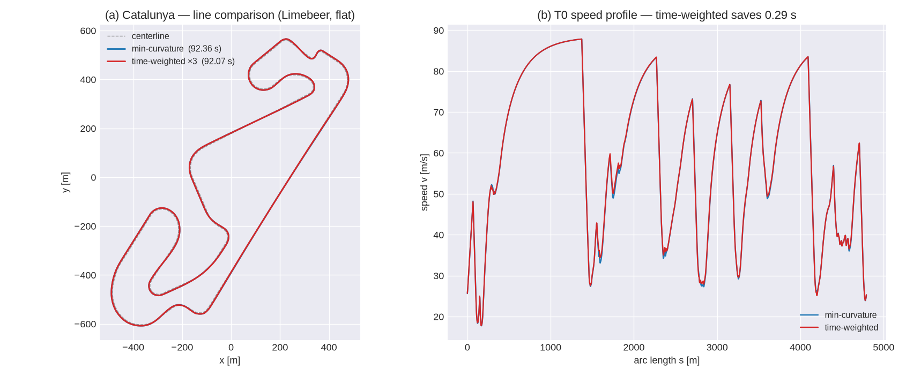

<!-- SPDX-License-Identifier: AGPL-3.0-only -->
# The racing line: the minimum-curvature and time-weighted QP

A lap solver can only go as fast as the line it is given. outlap generates that line as a convex
quadratic program over the lateral offset `n(s)`, inside the track corridor. It returns the result
as a **first-class `Track`**, with its own `κ(s)`, grade, and road frame. Every tier therefore
drives the line through the identical geometry API.

Two generators share the same QP machinery, in `crates/outlap-raceline/src/lib.rs`:

* **`min_curvature`** produces the classic minimum-curvature line (Locked Decision #14).
* **`time_weighted`** refines it toward minimum *time*. It reweights the same QP by the time spent
  locally, `Δt = Δs / v`. It therefore closes on the fastest line without leaving the convex QP
  (Decision #10).

## The minimum-curvature QP

Write the offset path as `r_i = c_i + n_i·l̂_i`: a centerline point, plus an offset along the
lateral direction in the road plane. The discrete path curvature then linearizes (Heilmeier et al.
2020, §3.1) to

```
κ_new,i = κ_r,i + (n_{i-1} − 2 n_i + n_{i+1}) / Δs²  +  κ_r,i²·n_i   =   (M·n + κ_r)_i
```

`M` is tridiagonal, with `M_{i,i} = −2/Δs² + κ_r,i²` and `M_{i,i±1} = 1/Δs²`. The last term,
`κ_r²·n`, is the metric correction. It is what makes an offset toward the inside correctly
**increase** the curvature.

Minimize the sum of squared curvature, `‖M·n + κ_r‖²`, subject to the corridor box
`n_lo ≤ n ≤ n_hi`. That is a convex QP:

```
minimise  ½ nᵀ P n + qᵀ n     with  P = 2 MᵀM,   q = 2 Mᵀκ_r
subject to [I; −I]·n ≤ [n_hi; −n_lo]
```

clarabel solves it. `P` is pentadiagonal, plus two corners that wrap on a closed track. A small
Tikhonov term on the diagonal keeps the solution unique on a straight, where the curvature is flat
and the offset would otherwise be free.

The formulation is re-implemented from two published sources: F. Braghin et al., *Race driver
model*, Computers & Structures 86, 2008; and A. Heilmeier et al., *Minimum-curvature trajectory
planning…*, Vehicle System Dynamics 58(10), 2020, §3.1–3.2. It never comes from the LGPL TUM
source.

## Why the minimum-curvature line is not the minimum-time line

The minimum-curvature line minimizes `∫κ² ds`. It does not minimize lap time.

It therefore spends its budget of curvature evenly along the lap. Two errors follow. It under-opens
the **medium-speed** corners, where a real car would trade a little extra path length for a higher
speed at entry and exit. And it over-optimizes fast kinks, which were never the limiting factor.

On the Limebeer reference at Barcelona, this gap in line optimality is one of the named components
of the residual between the QSS lap and the optimal-control lap. See `docs/validation/limebeer.md`.

## The time-weighted line (Decision #10)

What we want to minimize is time, not curvature. Traversing station `i` takes
`Δt_i = Δs_i / v_i`. A **time-weighted** objective therefore replaces the flat sum:

```
minimise  Σ_i w_i · κ_new,i²  =  (M·n + κ_r)ᵀ W (M·n + κ_r),     w_i = Δt_i ∝ 1/v_i
```

This is still a convex QP. It now has `P = 2 MᵀWM` and `q = 2 MᵀWκ_r`, with `W = diag(w)`.

Down-weighting the fast straights and up-weighting the slow corners tells the optimizer where to
spend its budget of curvature: where the car actually loses time. It therefore opens the slow
corners more, and pays for that with a little curvature on the straights, which it can afford.

With `W = I` this reduces **exactly** to minimum curvature. The two generators are therefore one
code path, `solve_qp(..., weights)`. The flat path assembles byte for byte as it did before, so the
provenance of the minimum-curvature line is unchanged.

The weights depend on the speeds, and the speeds depend on the line. An **outer reweight loop**
therefore finds the weights. Rowold et al. 2023 use this scheme, and Lovato & Massaro 2022 use the
same idea of feeding speed back into their minimum-lap-time lines.

1. Start from the minimum-curvature line.
2. Run a **speed pre-pass** on the current line, at T0 or on the g-g-g-v envelope. This gives `v(s)`
   and the modeled lap time.
3. Set `w_i = 1/v_i`, and re-solve the weighted QP for a new line.
4. Keep the faster of the two lines. Stop when the modeled lap time stops improving, or after
   `iterations` passes, which is typically 2 to 4.

Each step is a single convex QP, and the loop always keeps the fastest line. The modeled lap time is
therefore **monotone non-increasing** across iterations, by construction.

The speed pre-pass lives in the orchestration layer that owns the envelope of the car. That layer
is `outlap.time_weighted`, which takes a `vehicle_dir`. The `outlap-raceline` crate therefore stays
wasm-clean and does only the one weighted solve. The envelope is built once and reused across
iterations.

The figure below comes from the real model. `python/tools/plot_raceline.py` builds both lines for
the Limebeer car at Catalunya and overlays them.



## Provenance

Every lap records the line it ran, in a `LineDescriptor`. There are three: `Centerline`,
`MinCurvature { ds_m, iterations }`, and `TimeWeighted { ds_m, iterations }`. The iteration count is
the real converged count. It is never a silent `1`.

The `RacelineGenerator` enum in the schema mirrors this: `min_curvature` and
`time_weighted { iterations }`. Adding `time_weighted` is an additive change, so it bumps MINOR.

## References

* F. Braghin, F. Cheli, S. Melzi, E. Sabbioni. *Race driver model.* Computers & Structures 86 (2008).
* A. Heilmeier, A. Wischnewski, L. Hermansdorfer, J. Betz, M. Lienkamp, B. Lohmann. *Minimum-curvature
  trajectory planning and control for an autonomous race car.* Vehicle System Dynamics 58(10) (2020).
* T. Lovato, M. Massaro. *A three-dimensional free-trajectory quasi-steady-state optimal-control
  method for minimum-lap-time of race vehicles.* Vehicle System Dynamics 60(5) (2022).
* M. Rowold, L. Ögretmen, U. Kasolowsky, B. Lohmann. *Online time-optimal trajectory planning on
  three-dimensional race tracks.* IEEE IV (2023).
