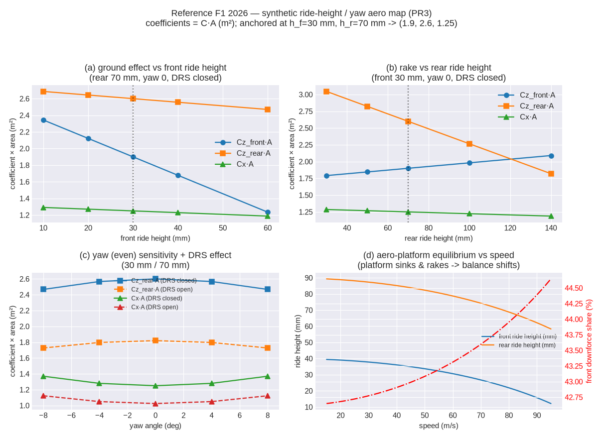
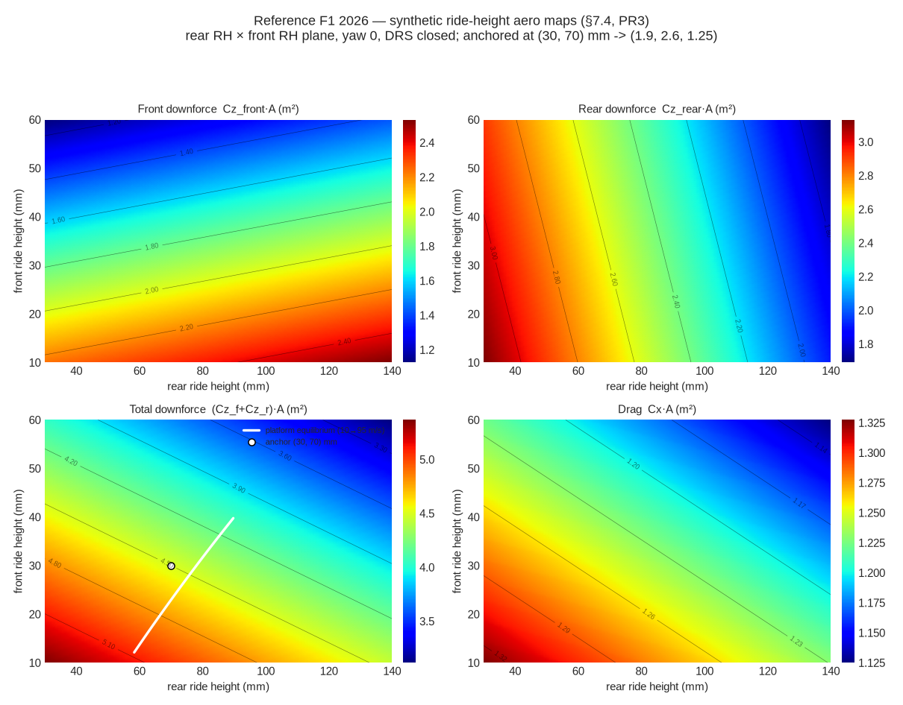

<!-- SPDX-License-Identifier: AGPL-3.0-only -->
# T1 — quasi-steady-state double-track trim

`outlap-qss`'s `t1` module solves the **quasi-steady-state (QSS) trim** of a double-track vehicle:
given a commanded operating point `(v, a_y, a_x)` — speed, lateral and longitudinal CG acceleration
— it finds the steady chassis state that produces exactly those accelerations in planar
force/moment balance, with per-wheel forces from the shared
[tire model](mf61-steady-state.md). The trim is the per-point kernel the g-g-g-v envelope generator
(PR7) sweeps to build the tier‑0 friction surface.

Implemented clean-room from published literature: Perantoni & Limebeer, *"Optimal control for a
Formula One car with variable parameters"*, Vehicle System Dynamics 52(5), 2014 (the reference car
and the QSS framing); Lovato & Massaro, *"A three-dimensional free-trajectory quasi-steady-state
optimal-control method for minimum-lap-time…"*, VSD 60(5), 2022 (the g-g-g-v envelope framing);
Pacejka, *Tire and Vehicle Dynamics*, 3rd ed., 2012, ch. 1 (axis system, steady-state cornering);
Guiggiani, *The Science of Vehicle Dynamics*, 2nd ed., 2018, ch. 3 & 7 (load transfer, roll
geometry); Milliken & Milliken, *Race Car Vehicle Dynamics*, 1995 (lateral-load-transfer
decomposition). No lap-time-optimiser source code is read for the implementation.

## Frame and unknowns

ISO 8855 body frame: `x` forward, `y` left, `z` up; origin at the CG, so the front axle sits at
`x = +a_f`, the rear at `x = −b_r` (`a_f = cg_x`, `b_r = L − a_f`), the left wheels at `y = +t/2`.
The trim solves an 8‑unknown vector `z`:

| index | symbol | meaning |
|---|---|---|
| 0 | `δ` | front road-wheel steer angle, rad |
| 1 | `β` | body-slip angle (CG velocity vs body `x`), rad |
| 2 | `r` | yaw rate, rad/s |
| 3 | `s` | longitudinal-slip control (`> 0` drive, `< 0` brake) |
| 4–7 | `F_{z,i}` | per-wheel normal loads `[FL, FR, RL, RR]`, N |

## Wheel kinematics

The contact-point velocity of wheel `i` at body position `(x_i, y_i)` is `V_CG + ω × r_i` with
`V_CG = v·(cos β, sin β)` and `ω = (0, 0, r)`:

```
V_{x,i} = v cos β − r y_i
V_{y,i} = v sin β + r x_i
```

Rotating into the (steered) wheel frame by `δ_i` (`δ` front, `0` rear) and applying the crate
[sign contract](mf61-steady-state.md) `tan α = V_sy / |V_cx|`:

```
V_{xw} =  V_x cos δ_i + V_y sin δ_i
V_{yw} = −V_x sin δ_i + V_y cos δ_i
α_i = atan2(V_{yw}, |V_{xw}|)
```

The longitudinal slip is set by the control `s`: `κ_i = s` on the driven wheels for `s ≥ 0`
(drive), and `κ_i = s·b_i` on all wheels for `s < 0` (brake), with the front/rear brake split `b_i`
from the balance bar. This one-parameter longitudinal model captures the friction-circle coupling
(longitudinal force consumes grip available for cornering); the drivetrain-graph traction limit and
diff behaviour are refined in PR4.

## Force/moment balance and the kinematic closure

Per-wheel wheel-frame forces `(F_x, F_y, M_z)` from the tire model are rotated back to the body frame
and summed. With constant aero drag `F_drag = ½ρ C_xA v²` along body `x`, the residuals are

```
R1: ΣF_x − F_drag − m a_x = 0        (longitudinal balance)
R2: ΣF_y − m a_y = 0                 (lateral balance)
R3: Σ(x_i F_{y,i} − y_i F_{x,i} + M_{z,i}) = 0   (yaw-moment balance, ṙ = 0)
R4: r v − (a_y cos β − a_x sin β) = 0            (steady-state kinematic closure)
```

R4 is the steady-cornering identity: for constant body-frame velocity the CG acceleration is
`ω × V`, whose components are `a_x = −r v sin β`, `a_y = r v cos β`; solving for the yaw rate that
reproduces the commanded `(a_x, a_y)` gives R4. It pins `r` to `(v, a_x, a_y, β)`.

## Quasi-static load transfer

The remaining four residuals set the normal loads from a quasi-static transfer model
(residuals `R_{4+i}: F_{z,i} − F_{z,i}^{pred} = 0`). Static axle loads carry the front/rear weight
split plus aero downforce; the pitch (longitudinal) transfer and the per-axle lateral transfer are
added:

```
front_total = m g (b_r/L) + ½ρ C_{z,f}A v²
rear_total  = m g (a_f/L) + ½ρ C_{z,r}A v²
ΔF_z^x = m a_x h_cg / L                                    (rear gains under +a_x)
M_φ = m a_y (h_cg − h_ra)                                  (roll moment about the roll axis)
ΔF_{z,a}^y = m a_y (W_a/W) h_{rc,a}/t_a  +  ξ_a M_φ / t_a  (geometric + elastic, per axle a)
```

`h_ra` is the roll-axis height directly under the CG (interpolated between the front/rear
roll-centre heights along the wheelbase), `W_a/W` the axle weight fraction, `h_{rc,a}` the axle
roll-centre height, and `ξ_a` the axle's share of total roll stiffness. The geometric term is the
axle's centripetal reaction through its roll centre; the elastic term is the sprung roll moment
distributed by roll-stiffness share. Summed over both axles the transfer reproduces the total roll
moment `m a_y h_cg` (Milliken decomposition). For `a_y > 0` (left corner) load moves to the outside
(right) wheels. Anti-dive/anti-squat change the geometric/elastic split of the *pitch* attitude
(ride height), not the steady-state `F_z` totals, so they enter the aero-platform equilibrium below
rather than here. Unsprung mass is lumped into the sprung mass for v1 (documented estimate).

### F_z coupling (Decision #29)

`fz_coupling` selects what drives the transfer accelerations `(a_x^{lt}, a_y^{lt})`:

- **`one_step_lag`** (default): the *commanded* `(a_x, a_y)` — the loads decouple from the
  instantaneous tire forces.
- **`fixed_point`**: the *summed tire* accelerations `(ΣF_x − F_drag)/m`, `ΣF_y/m` — fully coupled.

At convergence R1/R2 force `ΣF = m·a`, so both closures reach the same trim; the mode changes only
the algebraic coupling in the Jacobian (and matters for the transient tiers). It is recorded in
every result.

## Ride-height / yaw aero map and the platform equilibrium (§7.4)

The constant `C_zA`/`C_xA` above is the degenerate (passenger-car) case. The primary aero
representation is a **gridded map**

```
{ C_{z,front}A, C_{z,rear}A, C_xA } = f(h_front, h_rear, yaw [, DRS])
```

interpolated by the shared tensor-product monotone cubic Hermite (Decision #30). This is the first
open ride-height aero-map representation (§5.5): it generalises Perantoni & Limebeer's
speed-dependent aero to explicit ride heights so a downforce car's pitch attitude — the thing that
*defines* its behaviour — drives the coefficients. The reference `f1_2026` map is **synthetic**
(`python/tools/gen_f1_aero.py`), anchored so the reference ride heights (30 mm front / 70 mm rear,
yaw 0, DRS closed) reproduce the constant-aero fallback (`C_{z,f}A = 1.9`, `C_{z,r}A = 2.6`,
`C_xA = 1.25`; a stand-in for the PL2014 aero that PR9 reconciles against the published figures).



*The committed synthetic F1 map (`python/tools/plot_f1_aero.py`): (a,b) ground effect and rake, (c)
the even yaw sensitivity and DRS effect, and (d) the platform sinking and raking with speed so the
downforce balance shifts forward — the speed-dependent balance a constant-aero car cannot show.*



*The same map as the classic 2-D ride-height maps — front, rear, and total downforce and drag over
the rear-RH × front-RH plane (yaw 0, DRS closed). The white line on the total-downforce panel is the
aero-platform **equilibrium locus** (the front/rear ride heights the trim rides as speed climbs from
10 → 95 m/s), starting at the static platform and sinking into the high-downforce corner.*

**Aero-platform equilibrium.** The coefficients depend on ride heights, which depend on the
downforce they produce — a fixed point. The platform sinks from its static (design) ride height
under the downforce and the spring-carried part of the longitudinal load transfer:

```
T = m a_x h_cg / L                                  (longitudinal transfer, + under acceleration)
front_lt = −T                    rear_lt = (1−antisquat)·T          (a_x ≥ 0: rear squats)
front_lt = (1−antidive)·(−T)     rear_lt =  T                       (a_x < 0: front dives)
h_a = h_a^static − (½ρ C_{z,a}A v² + a_lt) / (2 k_a)                (per axle a, clamped ≥ 0)
```

`k_a` is the wheel ride rate (axle rate `2 k_a`). Iterating `h → coefficients → downforce → h` with
under-relaxation (`λ = 0.6`) converges the platform in a few steps (deterministic cap of 40
iterations, `1 µm` tolerance, zero allocation). The effective `½ρ C_{z,a}A` / `½ρ C_xA` at the
converged platform then feed the load transfer and drag exactly as the constant terms did. Because
the aerodynamic **yaw** is the body-slip angle `β` (an unknown), the map is evaluated *inside* the
residual, so the finite-difference Jacobian captures `∂(downforce)/∂β` — the mechanism that makes
the g-g diagram asymmetric mid-corner when the map carries a yaw dependence (a symmetric,
even-in-yaw map keeps the g-g left/right symmetric but shrinks it off-centre). DRS is closed in the
trim (its activation is a controller concern). Out-of-grid ride heights **clamp** to the edge
coefficients rather than extrapolating a ground-effect curve past its validity.

Clean-room citations: Perantoni & Limebeer 2014 (speed-dependent aero of the reference car); Katz,
*Race Car Aerodynamics*, 1995 (ground-effect ride-height sensitivity and rake); the platform
fixed point is a standard quasi-static heave balance.

## Numerics

The 8×8 system is solved by **Levenberg–Marquardt** (Marquardt diagonal scaling) on the scaled
residual: forces are scaled by `m g`, the moment by `m g L`, the closure by `g`, and the four
`F_z` unknowns are non-dimensionalised by `m g` so every unknown is `O(1)` and the finite-difference
Jacobian is well conditioned despite mixing radians and newtons. The trial state is clamped to
physically generous bounds so the search cannot wander into the periodic-`β` aliases that trap a
plain Newton. The state is warm-started from point-mass kinematics (Ackermann steer, `r = a_y/v`)
and the direct load-transfer prediction.

For the rare tight-geometry / near-limit point where the direct solve stalls, the trim falls back
to **homotopy continuation**: it first solves the trivial straight-line trim `(a_y, a_x) = (0, 0)`,
then ramps a continuation parameter `t: 0 → 1` scaling the target accelerations, re-solving from the
previous point with an adaptive step (grow on success, halve on failure). This converges at
arbitrarily tight feasible corners; when the ramp cannot advance past some `t < 1`, the target lies
beyond the friction (or steer-range) boundary and the point is returned as `Infeasible` — the last
feasible point on the ramp is the boundary. Everything runs on fixed-size stack arrays — zero
allocation per solve (CI dhat gate) — and `Infeasible` is a clean flag consumed by the envelope
generator as a boundary, never a panic. Convergence is verified over a dense `(v, a_y, a_x)` grid
for both reference cars down to hairpin-scale corners (~6 m radius at 8 m/s).

## Setup metrics

- **Understeer gradient** `K = dδ/da_y − L/v²` (central-differenced from two small‑`a_y` trims):
  `> 0` understeer, `< 0` oversteer.
- **Aero balance**: the front axle's share of total downforce — speed-invariant with constant aero,
  and speed-dependent with a ride-height map installed (the platform rakes with downforce), reported
  at a given speed by `aero_front_downforce_share_at(v)`.

## Property tests

Friction-circle containment per wheel; `ΣF_z = weight + downforce`; left/right symmetry for a
symmetric car at `±a_y`; ISO 8855 sign conventions (left corner ⇒ `a_y, δ, r > 0`, load to the
outside wheels); pitch transfer direction (braking loads the front, accelerating the rear); Newton
convergence over a dense feasible `(v, a_y, a_x)` grid for both reference fixtures; graceful
infeasibility flagging; `fz_coupling` modes agree at convergence; zero-allocation trim solve.

Aero-map tests: the committed F1 map reproduces the reference coefficients at the reference ride
heights; a constant map degenerates to the constant-aero trim (≤1e-9); the platform equilibrium
converges and sinks monotonically with speed; a yaw-sensitive map cuts downforce off-centre while a
yaw-flat map does not; DRS open cuts rear downforce and drag; the mapped-aero trim stays
zero-allocation.
