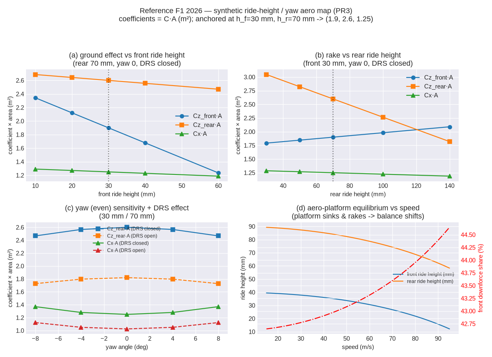
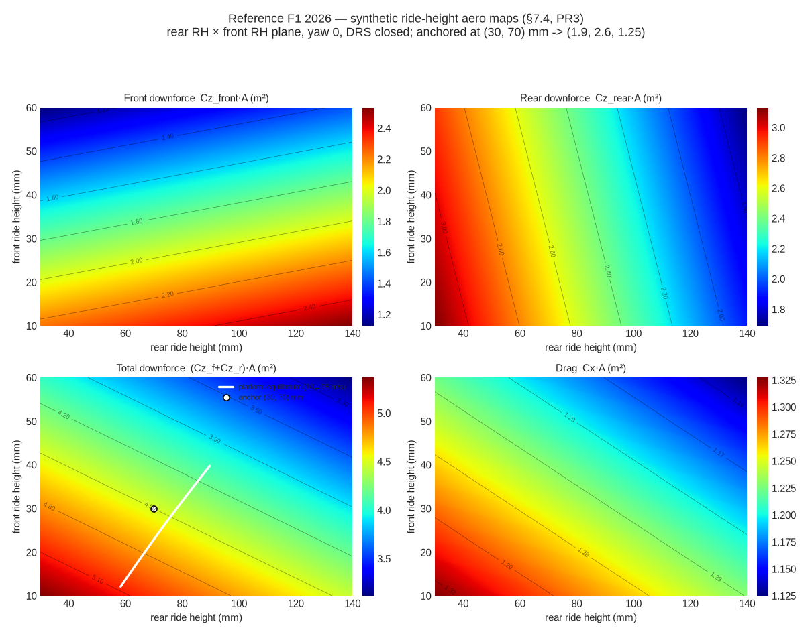

<!-- SPDX-License-Identifier: AGPL-3.0-only -->
# T1: the quasi-steady-state double-track trim

The `t1` module of `outlap-qss` solves the **quasi-steady-state (QSS) trim** of a double-track
vehicle. Give it a commanded operating point `(v, a_y, a_x)`, which is speed and the lateral and
longitudinal acceleration of the CG. It finds the steady chassis state that produces exactly those
accelerations, in planar balance of forces and moments. The forces at each wheel come from the
shared [tire model](mf61-steady-state.md).

The trim is the kernel for one point. The generator of the g-g-g-v envelope (PR7) sweeps it to build
the friction surface for tier 0.

It is implemented clean-room, from published literature. Perantoni & Limebeer, *"Optimal control for
a Formula One car with variable parameters"*, Vehicle System Dynamics 52(5), 2014, gives the
reference car and the QSS framing. Lovato & Massaro, *"A three-dimensional free-trajectory
quasi-steady-state optimal-control method for minimum-lap-time…"*, VSD 60(5), 2022, gives the
framing of the g-g-g-v envelope. Pacejka, *Tire and Vehicle Dynamics*, 3rd ed., 2012, ch. 1, gives
the axis system and steady-state cornering. Guiggiani, *The Science of Vehicle Dynamics*, 2nd ed.,
2018, ch. 3 and 7, gives load transfer and roll geometry. Milliken & Milliken, *Race Car Vehicle
Dynamics*, 1995, gives the decomposition of lateral load transfer. No source code from a lap-time
optimizer was read for the implementation.

## The frame and the unknowns

The body frame is ISO 8855: `x` forward, `y` left, `z` up. The origin is at the CG. The front axle
therefore sits at `x = +a_f` and the rear at `x = −b_r`, where `a_f = cg_x` and `b_r = L − a_f`. The
left wheels sit at `y = +t/2`.

The trim solves a vector `z` of 9 unknowns:

| index | symbol | meaning |
|---|---|---|
| 0 | `δ` | front road-wheel steer angle, rad |
| 1 | `β` | body-slip angle (CG velocity vs body `x`), rad |
| 2 | `r` | yaw rate, rad/s |
| 3 | `s` | longitudinal-slip control (`> 0` drive, `< 0` brake) |
| 4 | `w` | driven-axle slip split (`κ_left = s + w`, `κ_right = s − w`; the [differential](qss-powertrain.md) unknown) |
| 5–8 | `F_{z,i}` | per-wheel normal loads `[FL, FR, RL, RR]`, N |

## Wheel kinematics

The contact point of wheel `i` sits at body position `(x_i, y_i)`. Its velocity is `V_CG + ω × r_i`,
with `V_CG = v·(cos β, sin β)` and `ω = (0, 0, r)`:

```
V_{x,i} = v cos β − r y_i
V_{y,i} = v sin β + r x_i
```

Rotate that into the steered wheel frame by `δ_i`, which is `δ` at the front and `0` at the rear.
Then apply the [sign contract](mf61-steady-state.md) of the crate, `tan α = V_sy / |V_cx|`:

```
V_{xw} =  V_x cos δ_i + V_y sin δ_i
V_{yw} = −V_x sin δ_i + V_y cos δ_i
α_i = atan2(V_{yw}, |V_{xw}|)
```

The control `s` and the split `w` on the driven axle set the longitudinal slip.

Under drive, where `s ≥ 0`, the driven wheels get `κ_left = s + w` and `κ_right = s − w`. The
[differential](qss-powertrain.md) therefore distributes torque between left and right.

Under braking, where `s < 0`, every wheel gets `κ_i = s·b_i`. The balance bar sets the front and
rear brake split `b_i`, and `w` is inactive.

This captures two things: the coupling around the friction circle, where longitudinal force consumes
grip that cornering could have used, and the behavior of the differential.

The traction ceiling from the drivetrain graph is a separate [powertrain](qss-powertrain.md) query.
The g-g-g-v envelope (PR7) uses it to cap the acceleration boundary.

## Balance of forces and moments, and the kinematic closure

The tire model returns wheel-frame forces `(F_x, F_y, M_z)` at each wheel. Those rotate back to the
body frame and sum. Aero drag is constant, `F_drag = ½ρ C_xA v²`, along body `x`. The residuals are

```
R1: ΣF_x − F_drag − m a_x = 0        (longitudinal balance)
R2: ΣF_y − m a_y = 0                 (lateral balance)
R3: Σ(x_i F_{y,i} − y_i F_{x,i} + M_{z,i}) = 0   (yaw-moment balance, ṙ = 0)
R4: r v − (a_y cos β − a_x sin β) = 0            (steady-state kinematic closure)
```

R4 is the identity of steady cornering. When the body-frame velocity is constant, the acceleration
of the CG is `ω × V`. Its components are `a_x = −r v sin β` and `a_y = r v cos β`. Solve for the yaw
rate that reproduces the commanded `(a_x, a_y)`, and R4 follows. It pins `r` to `(v, a_x, a_y, β)`.

## Quasi-static load transfer

The remaining four residuals set the normal loads, from a quasi-static transfer model. They are
`R_{4+i}: F_{z,i} − F_{z,i}^{pred} = 0`.

The static axle loads carry the weight split between front and rear, plus aero downforce. The
transfer from pitch, which is longitudinal, and the lateral transfer at each axle are then added:

```
front_total = m g (b_r/L) + ½ρ C_{z,f}A v²
rear_total  = m g (a_f/L) + ½ρ C_{z,r}A v²
ΔF_z^x = m a_x h_cg / L                                    (rear gains under +a_x)
M_φ = m a_y (h_cg − h_ra)                                  (roll moment about the roll axis)
ΔF_{z,a}^y = m a_y (W_a/W) h_{rc,a}/t_a  +  ξ_a M_φ / t_a  (geometric + elastic, per axle a)
```

`h_ra` is the height of the roll axis directly under the CG, interpolated between the roll-center
heights at the front and rear along the wheelbase. `W_a/W` is the weight fraction of the axle.
`h_{rc,a}` is the roll-center height of the axle. `ξ_a` is the share of total roll stiffness that
the axle carries.

The geometric term is the centripetal reaction of the axle through its roll center. The elastic term
is the sprung roll moment, distributed by the share of roll stiffness. Summed over both axles, the
transfer reproduces the total roll moment `m a_y h_cg`. This is the Milliken decomposition.

When `a_y > 0`, which is a left corner, load moves to the outside wheels, on the right.

Anti-dive and anti-squat change how the *pitch* attitude splits between geometric and elastic, which
means ride height. They do not change the steady-state totals of `F_z`. They therefore enter the
aero-platform equilibrium below, not this section.

Unsprung mass is lumped into the sprung mass in v1. That is a documented estimate.

### F_z coupling (Decision #29)

`fz_coupling` selects what drives the transfer accelerations, `(a_x^{lt}, a_y^{lt})`:

- **`one_step_lag`**, the default, uses the *commanded* `(a_x, a_y)`. The loads therefore decouple
  from the instantaneous tire forces.
- **`fixed_point`** uses the *summed tire* accelerations, `(ΣF_x − F_drag)/m` and `ΣF_y/m`. The
  loads are therefore fully coupled.

At convergence, R1 and R2 force `ΣF = m·a`. Both closures therefore reach the same trim. The mode
changes only the algebraic coupling in the Jacobian, and it matters for the transient tiers. Every
result records which mode ran.

## The aero map over ride height and yaw, and the platform equilibrium (§7.4)

The constant `C_zA` and `C_xA` above are the degenerate case, which suits a passenger car. The
primary representation of aero is a **gridded map**:

```
{ C_{z,front}A, C_{z,rear}A, C_xA } = f(h_front, h_rear, yaw [, DRS])
```

The shared tensor-product monotone cubic Hermite interpolates it (Decision #30).

This is the first open representation of an aero map over ride height (§5.5). It generalizes the
speed-dependent aero of Perantoni & Limebeer to explicit ride heights. The pitch attitude of a
downforce car is the thing that *defines* its behavior, and here that attitude drives the
coefficients.

The reference map for `f1_2026` is **synthetic**, written by `python/tools/gen_f1_aero.py`. It is
anchored so that the reference ride heights — 30 mm front, 70 mm rear, yaw 0, DRS closed —
reproduce the constant-aero fallback: `C_{z,f}A = 1.9`, `C_{z,r}A = 2.6`, and `C_xA = 1.25`. It is a
stand-in for the PL2014 aero, which PR9 reconciles against the published figures.



*The committed synthetic F1 map, from `python/tools/plot_f1_aero.py`. Panels (a) and (b) show ground
effect and rake. Panel (c) shows the even sensitivity to yaw, and the effect of DRS. Panel (d) shows
the platform sinking and raking as speed rises, which shifts the downforce balance forward. A
constant-aero car cannot show that speed-dependent balance.*



*The same map, drawn as the classic 2-D ride-height maps. They show front, rear, and total downforce
and drag over the plane of rear ride height against front ride height, at yaw 0 with DRS closed. The
white line on the total-downforce panel is the **equilibrium locus** of the aero platform. It traces
the front and rear ride heights that the trim rides as speed climbs from 10 to 95 m/s. It starts at
the static platform and sinks into the corner of high downforce.*

**The aero-platform equilibrium.** The coefficients depend on the ride heights, and the ride heights
depend on the downforce that those coefficients produce. That is a fixed point.

The platform sinks from its static design ride height, under two loads: the downforce, and the part
of the longitudinal load transfer that the springs carry.

```
T = m a_x h_cg / L                                  (longitudinal transfer, + under acceleration)
front_lt = −T                    rear_lt = (1−antisquat)·T          (a_x ≥ 0: rear squats)
front_lt = (1−antidive)·(−T)     rear_lt =  T                       (a_x < 0: front dives)
h_a = h_a^static − (½ρ C_{z,a}A v² + a_lt) / (2 k_a)                (per axle a, clamped ≥ 0)
```

`k_a` is the ride rate at the wheel, so the axle rate is `2 k_a`.

Iterating from ride height to coefficients to downforce and back, with under-relaxation at
`λ = 0.6`, converges the platform in a few steps. The cap is deterministic at 40 iterations, the
tolerance is 1 µm, and the loop allocates nothing.

At the converged platform, the effective `½ρ C_{z,a}A` and `½ρ C_xA` feed the load transfer and the
drag exactly as the constant terms did.

The aerodynamic **yaw** is the body-slip angle `β`, which is an unknown. The map is therefore
evaluated *inside* the residual, so that the finite-difference Jacobian captures
`∂(downforce)/∂β`. That is the mechanism that makes the g-g diagram asymmetric in mid-corner, when
the map carries a dependence on yaw. A map that is symmetric, and therefore even in yaw, keeps the
g-g diagram symmetric between left and right, but shrinks it away from the center.

DRS is closed in the trim. Activating it is a concern for a controller.

A ride height outside the grid **clamps** to the edge coefficients. The model does not extrapolate a
ground-effect curve beyond where it is valid.

Clean-room citations: Perantoni & Limebeer 2014, for the speed-dependent aero of the reference car;
Katz, *Race Car Aerodynamics*, 1995, for sensitivity to ride height in ground effect, and for rake.
The platform fixed point is a standard quasi-static heave balance.

## Numerics

**Levenberg–Marquardt**, with Marquardt diagonal scaling, solves the 9×9 system on the scaled
residual.

Forces are scaled by `m g`. The moment is scaled by `m g L`. The closure is scaled by `g`. The four
`F_z` unknowns are non-dimensionalized by `m g`. Every unknown is therefore `O(1)`, and the
finite-difference Jacobian stays well conditioned, even though the vector mixes radians and newtons.

The [differential](qss-powertrain.md) residual closes the split `w` on the driven axle: equal torque
for an open differential, and equal speed otherwise.

The trial state is clamped to physically generous bounds, so the search cannot wander into the
periodic aliases of `β` that trap a plain Newton method.

The state is warm-started from point-mass kinematics, using the Ackermann steer and `r = a_y/v`, and
from the direct prediction of load transfer.

Some points have tight geometry or sit near the limit, and the direct solve stalls there. They are
rare. The trim then falls back to **homotopy continuation**. It first solves the trivial
straight-line trim at `(a_y, a_x) = (0, 0)`. It then ramps a continuation parameter `t` from 0 to 1,
scaling the target accelerations, and re-solves from the previous point with an adaptive step. The
step grows on success and halves on failure.

This converges at feasible corners of arbitrary tightness. When the ramp cannot advance past some
`t < 1`, the target lies beyond the friction boundary or the steer range. The point is then returned
as `Infeasible`, and the last feasible point on the ramp is the boundary.

Everything runs on fixed-size stack arrays, so a solve allocates nothing. A dhat gate in CI enforces
that. `Infeasible` is a clean flag, which the envelope generator consumes as a boundary. It is never
a panic.

Convergence is verified over a dense grid of `(v, a_y, a_x)`, for both reference cars, down to
hairpin-scale corners of about 6 m radius at 8 m/s.

## Setup metrics

- **Understeer gradient**, `K = dδ/da_y − L/v²`. It is central-differenced from two trims at small
  `a_y`. `K > 0` is understeer, and `K < 0` is oversteer.
- **Aero balance**, which is the front axle's share of total downforce. With constant aero it does
  not vary with speed. With a ride-height map installed it does, because the platform rakes as
  downforce changes. `aero_front_downforce_share_at(v)` reports it at a given speed.

## Property tests

They cover: containment in the friction circle at each wheel; `ΣF_z = weight + downforce`; symmetry
between left and right for a symmetric car at `±a_y`; the ISO 8855 sign conventions, where a left
corner gives `a_y, δ, r > 0` and moves load to the outside wheels; the direction of pitch transfer,
where braking loads the front and accelerating loads the rear; Newton convergence over a dense
feasible grid of `(v, a_y, a_x)` for both reference fixtures; graceful flagging of infeasibility;
agreement between the two `fz_coupling` modes at convergence; and a trim solve that allocates
nothing.

The tests on the aero map cover: that the committed F1 map reproduces the reference coefficients at
the reference ride heights; that a constant map degenerates to the constant-aero trim, to within
1e-9; that the platform equilibrium converges, and sinks monotonically with speed; that a
yaw-sensitive map cuts downforce away from the center, while a yaw-flat map does not; that opening
DRS cuts rear downforce and drag; and that the trim with a mapped aero still allocates nothing.
