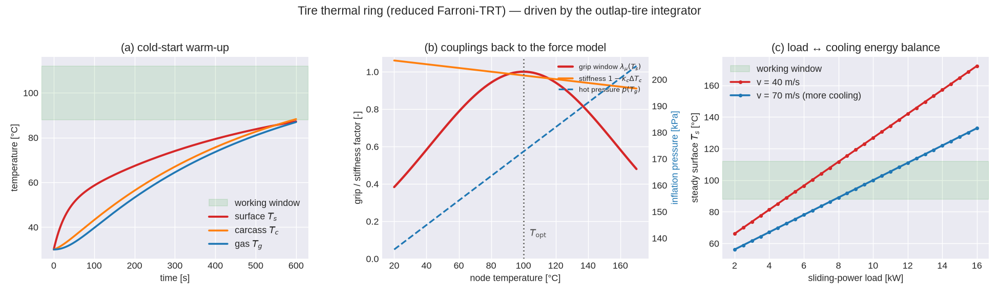
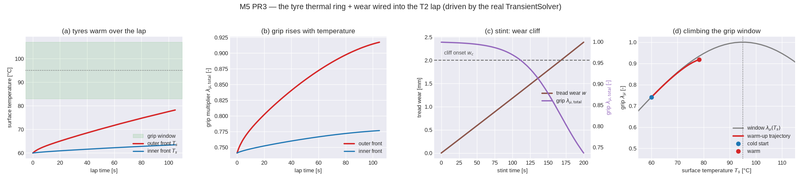

<!-- SPDX-License-Identifier: AGPL-3.0-only -->
# Tire thermal ring — a reduced Farroni-TRT lumped-node model

A tire's grip, inflation pressure, and carcass stiffness all move with temperature, and temperature
moves over a stint: lap 1 is not lap 20, and a corner-heavy sequence overheats the tread while a slow
lap lets it drop out of its window. `outlap-tire`'s **thermal ring** (`crates/outlap-tire/src/thermal.rs`)
carries that state — three lumped nodes per tire, advanced segment-to-segment — so the quasi-static
(QSS) tier becomes stint-capable and the transient (T2) tier feels its tires warm up and cool down.
This is the flagship physics of milestone M5 (HANDOFF §7.2): *no open-source tire thermal model
exists in any language*, so it is implemented **clean-room from the published literature** cited below.

This page documents the ring itself — the model, its discretization, and the three couplings it
exposes back to the [Magic-Formula force model](mf61-steady-state.md). The two degradation states that
ride on it — tread wear and irreversible thermal damage, and the positive-feedback grip cliff — are
documented in the companion [tire wear / thermal damage](tire-wear.md) page. Wiring both into a lap
(QSS `march_slow_states`; T2 `SlowStack`) is a separate milestone step; here the physics is proven on
its own.

## The three nodes

The ring is a lumped-parameter reduction of Farroni et al.'s *Thermo Racing Tyre* (TRT): instead of a
finite-volume mesh through the tread, it keeps the three temperatures a lap solver actually needs.

- **`T_s`** — the tread **surface**: the thin layer in contact with the road. It is the fast node,
  driven directly by the frictional sliding power and cooled by convection to the air and conduction
  to the road through the contact patch. It sets the grip.
- **`T_c`** — the tread bulk / **carcass**: the thermal mass of the tire. It is fed by hysteresis
  (the rolling-deformation loss) and exchanges heat with the surface above and the gas below. It sets
  the carcass stiffness and is the slow node that makes warm-up take laps, not seconds.
- **`T_g`** — the inflation **gas**: coupled only to the carcass; its temperature sets the hot
  inflation pressure through the ideal-gas law.

Each node obeys an energy balance (HANDOFF §7.2). Writing `G_sc, G_cg, G_road` for the solid-path
conductances (W/K) and `g_conv(v)` for the forced-convection conductance:

```
C_s·dT_s/dt = Q_fric − G_sc(T_s−T_c) − g_conv(v)·(1−a_cp)·(T_s−T_air) − G_road·a_cp·(T_s−T_road)
C_c·dT_c/dt = Q_hyst + G_sc(T_s−T_c) − G_cg(T_c−T_g)
C_g·dT_g/dt = G_cg(T_c−T_g)
```

The §7.2 rim term `−G_gr(T_g−T_rim)` is dropped: the `.tyr` schema (`TyrThermal`) carries no rim
conductance or rim temperature, so this is the reduced 3-node ring in which the gas equilibrates to
the carcass. §7.2 lists the rim as an *optional* fourth node; adding it is a schema-additive change
for later.

### Heat inputs and boundaries

- **Friction power** `Q_fric = p_t·P_slide`, where `P_slide = |Fx·v_sx| + |Fy·v_sy|` is the frictional
  sliding power at the contact patch and `p_t ≈ 0.6–0.7` is the fraction that heats the tread (the
  rest heats the road). `P_slide` comes from the current tire forces and sliding velocities; the ring
  applies `p_t`.
- **Hysteresis power** `Q_hyst = c_h·Fz·δ_tire·Ω`, the rolling-deformation loss deposited in the
  carcass. The caller forms it from the force model and passes it as a driver.
- **Convection** `g_conv(v) = (h₀ + h₁·v^0.8)·A_ext`. The `v^0.8` exponent is the turbulent-plate /
  Reynolds-number scaling of forced convection over a rolling tire; `A_ext` is the external
  (convecting) tread area. The contact-patch fraction `a_cp = A_cp/A_ext ∈ [0,1]` shields that
  fraction of the surface from the air and opens it to the road instead.
- **Boundaries** `T_air` (ambient) and `T_road` (`conditions.track_surface_C`) come from the
  conditions file.

`A_ext`, `a_cp`, `T_air`, and `T_road` are per-step **drivers**, not tire material parameters: they
depend on load, speed, and the environment, so the ring stays a pure function of
`(state, params, drivers, dt)` and carries no geometry of its own (keeping it `wasm`-clean). The
material parameters (`c_s, c_c, c_g, g_sc, g_cg, g_road, h0, h1, p_t, …`) are the `TyrThermal` block of
the `.tyr` file.

## Discretization

The ring advances with **semi-implicit Euler**: each node's own out-conductance (the diagonal decay
term) is taken implicitly, and the neighbour and boundary temperatures are held at the start-of-step
value — a Jacobi sweep. This is the shared `outlap_core::relax::semi_implicit_decay` primitive that
the battery temperature node also uses (HANDOFF §11.2):

```
x ← (x + dt·source) / (1 + dt·decay)          # decay = G_i/C_i, source = (Q_i + Σ g_ij T_j)/C_i
```

Two properties matter. It is **A-stable** in the decay term, so the coarse per-segment step of a QSS
lap (or the decimated slow clock of a T2 lap) cannot ring or overshoot — the update is a contraction
toward the instantaneous quasi-steady target. And because every node reads the start-of-step
neighbour temperatures, the sweep is **order-independent**, hence deterministic and bit-identical on
re-run (fixed-step, fixed-order, no fast-math — HANDOFF §11.2).

The discrete fixed point equals the continuous one exactly. At steady state `T_g* = T_c*` (the gas has
no external loss path) and `T_c* = T_s* + Q_hyst/G_sc` (the carcass runs hotter than the surface,
shedding its hysteresis heat upward), so the surface energy balance closes to

```
Q_fric + Q_hyst = g_conv·(1−a_cp)·(T_s*−T_air) + G_road·a_cp·(T_s*−T_road)
```

— all the heat in leaves through the surface. The property tests check this closure to round-off.

## Couplings back to the force model

The ring exposes three multipliers each step (HANDOFF §7.2). They are *computed* here; feeding them
into `SlipState` (`p`, `mu_scale_x/y`) and the carcass stiffnesses is the tier-wiring step.

1. **Gas-law pressure** — `p = p_cold · T_g/T_cold` (absolute temperatures), feeding the MF6.1 native
   inflation-pressure terms (`SlipState::p`). Hot tires run at higher pressure than their cold set
   pressure; a racing slick typically rises tens of kPa from cold to working temperature.
2. **Grip window** — `λ_μ(T_s) = exp(−c_T·((T_s−T_opt)/T_opt)²)`, a Gaussian peaking at `1` at the
   optimum temperature `T_opt` and falling off symmetrically. It scales `LMUX`/`LMUY` (isotropic; an
   asymmetric cold/hot-width option is a future extension). This is the "temperature window" every
   race engineer talks about: too cold or too hot and the tire gives up grip. The deviation is
   normalised by `T_opt` **expressed in °C** — the calibration convention the parameter is authored
   in — while the node state is stored in kelvin (SI-internal); the conversion happens only at this
   boundary.
3. **Carcass softening** — `(1 − k_c·(T_c−T_c,ref))`, scaling the carcass stiffnesses `PKX1`/`PKY1`. A
   hotter carcass is more compliant, which lowers the cornering and slip stiffness.

## Clean-room provenance

The reduced multi-node ring, the `v^0.8` forced-convection law, and the Gaussian grip window are
implemented from the published tire-thermal literature, not derived from any other codebase (game-engine
or lap-time-simulator tire code was **not** consulted as a source of derivation, per CLAUDE.md §2).

- **F. Farroni, D. Giordano, M. Russo, F. Timpone**, *"TRT: thermo racing tyre — a physical model to
  predict the tyre temperature distribution"*, **Meccanica** 49(3), 707–723, 2014 — the physical
  multi-layer tire thermal model this ring reduces.
- **F. Farroni, A. Sakhnevych, F. Timpone**, *"Physical modelling of tire wear for the analysis of the
  influence of thermal and frictional effects on vehicle performance"* (the TRT-EVO line), **Proc.
  IMechE Part L: Journal of Materials: Design and Applications**, 2017 — the thermal→grip/wear
  coupling framing (the wear states themselves are documented in [tire-wear](tire-wear.md)).
- **K. A. Grosch**, *"The relation between the friction and visco-elastic properties of rubber"*,
  **Proc. R. Soc. Lond. A** 274(1356), 21–39, 1963 — the temperature/velocity dependence of rubber
  friction underlying the grip window.
- **H. B. Pacejka**, *Tire and Vehicle Dynamics*, 3rd ed., 2012 — the MF6.1 inflation-pressure terms
  the gas-law coupling drives (see [mf61-steady-state](mf61-steady-state.md)).

The forced-convection `h(v) = h₀ + h₁·v^n` form with `n ≈ 0.8` is the standard turbulent forced-convection
correlation (Reynolds-number scaling, e.g. the Dittus–Boelter / flat-plate family); the ideal-gas
inflation relation `p ∝ T` is elementary. The `.tyr` reference blocks that exercise this model are
**synthetic placeholders** until the FastF1 inverse-calibration lands (a later M5 step).

## Validation



The figure is drawn from the real `TireThermalRing` integrator (`crates/outlap-tire/examples/thermal_ring.rs`,
plotted by `python/tools/plot_tire_thermal.py`), on an F1-slick-representative synthetic parameter
set. **(a)** A cold-start warm-up: the surface node responds on a tens-of-seconds time constant
(`τ_s = C_s/G_s`), while the heavier carcass and the gas lag it — the two-timescale warm-up that makes
a stint honest, climbing into the working window over a few laps. **(b)** The three force-model
couplings swept over temperature: the grip window `λ_μ(T_s)` peaks at `T_opt`, the carcass stiffness
factor falls linearly with `T_c`, and the hot pressure `p(T_g)` rises with the gas temperature.
**(c)** The steady surface temperature against sliding-power load at two speeds — more load runs the
tire hotter, more speed convects more heat away, and the balance point lands in the working window: a
direct read of the steady-state energy closure.

Property tests (`crates/outlap-tire/tests/thermal.rs`, HANDOFF §13/§14) cover: the discrete fixed
point equal to the closed-form steady state; steady-state energy closure; the warm-up time constant
and steady surface temperature landing in the broadcast-consistent operating band for an
F1-representative set; `λ_μ ∈ (0,1]` peaking at `T_opt`; monotone convection in speed; the calibrated
gas law; carcass softening reducing stiffness; monotone warm-up; zero allocations per step; f32/f64
parity; and bit-identical determinism.

## T2 tier integration — wiring the ring into a transient lap (PR3)

The ring above is a pure `step(dt, drivers)`; the transient (T2) solver owns the clock and drives it.
`outlap-transient`'s **`TireThermalStack`** (`crates/outlap-transient/src/tire_thermal.rs`) is the
per-wheel ring + wear advanced as a third *slow subsystem* (HANDOFF §6.1), alongside the battery pack
and the shift FSM — a hand-rolled subsystem, not a generic trait (Decision D-M5-1). It couples back
into the tyre force block through the per-wheel `mu_scale_{x,y}` (the total grip multiplier
`λ_μ,total`) and the gas-law inflation pressure `p`, both held frozen across the fast RK sweep exactly
like the shift-FSM torque scale and the battery regen ceiling.

**The decimated slow-clock loop.** Every fast step the solver *accumulates* the per-wheel heat into
the ring's window energies; on a slow-clock fire (every `slow_decimation` steps, ~20 ms) the ring
advances one step over the window and refreshes the held grip/pressure override, which then drives
every intervening fast step. The single ring step per window never touches the hot RK path.

```text
fast step:  couple Fz → relax (κ,α) → RK sweep → refresh Fz/accel
            └─ accumulate per-wheel  Q_fric·dt (slip power)  and  Q_hyst·dt  into the window
slow fire:  ring.step(window)  →  λ_μ,total, p per wheel  →  held on the Tire block
force call (each fast step):  MF6.1 with  LMU·λ_μ,total  and  the held gas-law pressure p
```

**Driver formation** (the §7.2 exogenous inputs, from the T2 force solution):

- **`Q_fric`** — the frictional sliding power `P_slide = |F_x·V_sx| + |F_y·V_sy|` (with `V_sx = κ·|V_cx|`
  and `V_sy = V_wy`), accumulated per fast step and window-averaged, so the heat the ring deposits
  closes to the frictional energy the patch actually dissipated (energy closure over the window).
- **`Q_hyst`** — the rolling-deformation loss `Q_hyst = c_h·F_z·δ·Ω` with the deflection `δ = F_z/k_z`
  and spin `Ω = v/R`, i.e. the standard load-squared rolling-hysteresis power. `c_h` is a documented
  modelling constant (`HYSTERESIS_LOSS_FACTOR`); `k_z`/`W` come from the MF6.1 coefficients with
  fallbacks (they set the deflection and external-tread-area scales, which calibration absorbs).
- **contact fraction** `a_cp = A_cp/A_ext` with the patch area `A_cp = F_z/p` (load over inflation
  pressure) and the external tread band `A_ext = 2π·R·W`; sampled at the window boundary.

**Step-phase order.** The grip/pressure update is a *slow* boundary decision: it is computed after the
fast step from the post-step force solution and held frozen through the next window's RK stages and
the relaxation sub-step. The relaxation states `(κ, α)` advance every fast step on their own exact-
exponential channel; they read the *held* grip/pressure, and the ring reads *their* forces one window
later — a one-window explicit coupling, deterministic and A-stable (the ring is semi-implicit).

**Parity-safe seed.** A T2 lap seeds every node warm at the grip optimum `T_s = T_c = T_opt` with the
gas at the cold reference `T_g = T_cold` and zero wear, so `λ_μ(T_opt) = 1` and `p = p_cold` *exactly*
at step 0 — the wired ring reproduces the frozen-tyre forces bit-for-bit at the start (the QSS↔T2
hull-containment gate stays valid), then drifts physically as the surface leaves the window under load
and the tyres wear. A cold seed reproduces the warm-up transient for the tests.

**Opt-in until calibration.** The wiring is complete and exercised, but the reference `.tyr`
thermal/wear parameters are still **synthetic placeholders** whose loaded steady-state sits below the
grip window — so a *default-on* lap would under-report pace. The Python `solve_transient_lap` therefore
gates the stack behind `tire_thermal=True` (default off ⇒ frozen tyres, byte-identical to pre-M5); the
flag flips on by default once the FastF1 inverse calibration (M5 PR7/PR8) moves the steady-state into
the window.



The figure is drawn from the real `TransientSolver` (`crates/outlap-transient/examples/tire_thermal_lap.rs`,
plotted by `python/tools/plot_tire_thermal_lap.py`) on a skidpad of the `limebeer_2014_f1` car.
**(a)** The outer (loaded) front tyre warms faster than the lightly-loaded inner one — the ring sees
each contact patch's own sliding power. **(b)** The grip multiplier the force call uses rises as the
tyres warm toward the window, outer ahead of inner. **(c)** A long stint: tread wear crosses the cliff
onset `w_c` and the total grip collapses through the C¹ sigmoid. **(d)** The warm-up drawn as a
trajectory on the static grip window `λ_μ(T_s)` — the tyre climbing the curve from a cold start.
Integration tests (`crates/outlap-transient/tests/tire_thermal.rs`) assert the warm-up (thermal-only,
wear held negligible), the wear cliff, exact energy closure across the slow-clock window, zero
allocations per step, and bit-identical determinism; the frozen (no-stack) path is asserted unchanged.
