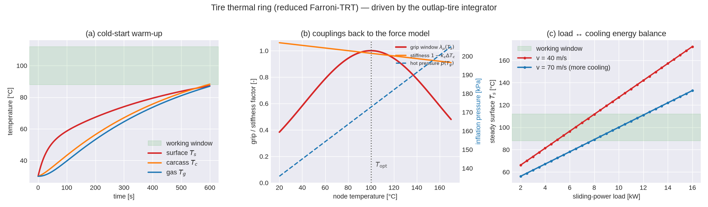
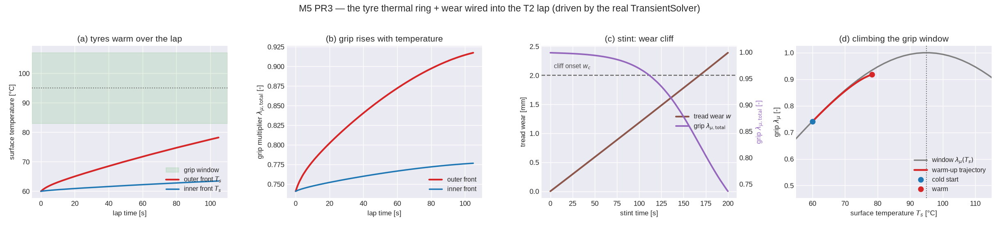
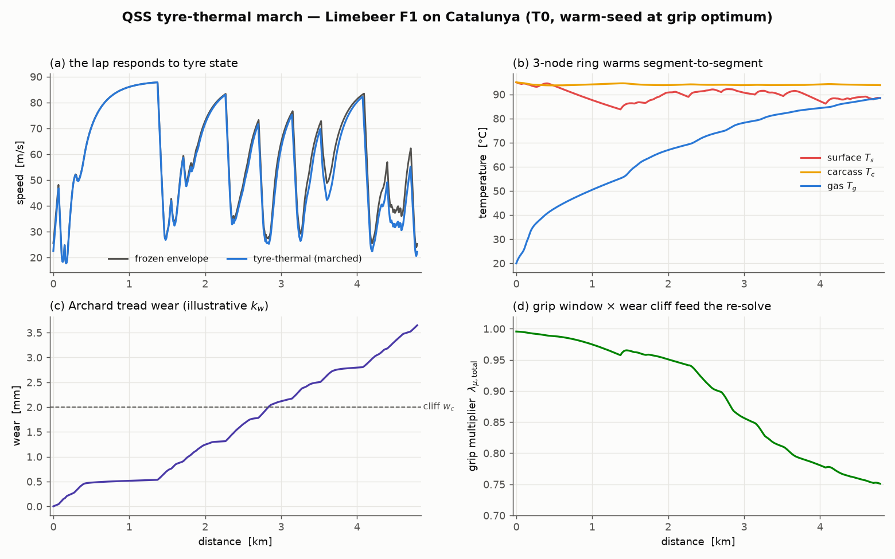
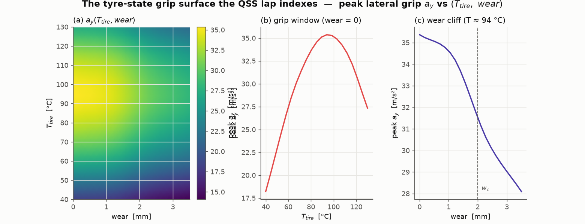
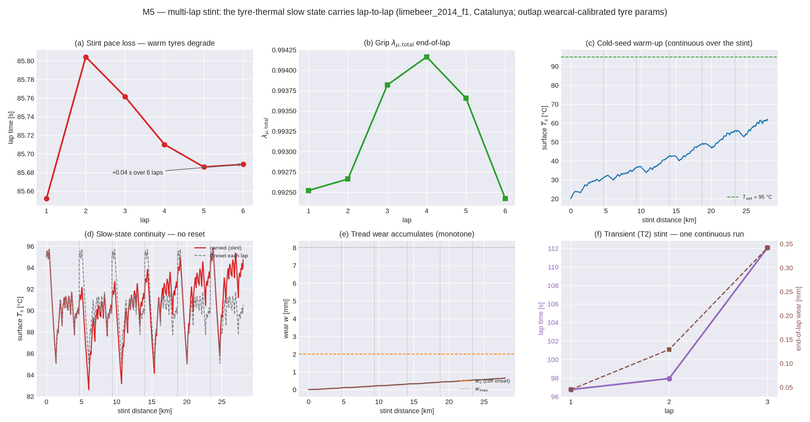

<!-- SPDX-License-Identifier: AGPL-3.0-only -->
# The tire thermal ring: a reduced Farroni-TRT lumped-node model

Three properties of a tire move with temperature: its grip, its inflation pressure, and its carcass
stiffness. Temperature itself moves over a stint. Lap 1 is not lap 20. A sequence of hard corners
overheats the tread, and a slow lap lets it drop out of its window.

The **thermal ring** of `outlap-tire` carries that state, in
`crates/outlap-tire/src/thermal.rs`. It holds three lumped nodes for each tire, and advances them
from segment to segment. Two things follow. The quasi-static (QSS) tier becomes able to run a stint.
And the transient (T2) tier feels its tires warm up and cool down.

This is the flagship physics of milestone M5 (HANDOFF §7.2). *No open-source tire thermal model
exists, in any language.* It is therefore implemented **clean-room from the published literature**
cited below.

This page documents the ring itself: the model, its discretization, and the three couplings that it
exposes back to the [Magic-Formula force model](mf61-steady-state.md).

Two degradation states ride on the ring: tread wear, and irreversible thermal damage, with the grip
cliff that positive feedback produces. The companion page,
[tire wear and thermal damage](tire-wear.md), documents those.

Wiring both into a lap — `march_slow_states` in QSS, and `SlowStack` in T2 — is a separate step of
the milestone. Here the physics is proven on its own.

## The three nodes

The ring is a lumped-parameter reduction of the *Thermo Racing Tyre* (TRT) model of Farroni et al.
Instead of a finite-volume mesh through the tread, it keeps the three temperatures that a lap solver
actually needs.

- **`T_s`**, the tread **surface**. This is the thin layer in contact with the road, and it is the
  fast node. The frictional sliding power drives it directly. It cools by convection to the air, and
  by conduction to the road through the contact patch. It sets the grip.
- **`T_c`**, the tread bulk, or **carcass**. This is the thermal mass of the tire. Hysteresis feeds
  it, which is the loss from rolling deformation. It exchanges heat with the surface above and the
  gas below. It sets the carcass stiffness, and it is the slow node that makes warm-up take laps
  rather than seconds.
- **`T_g`**, the inflation **gas**. It couples only to the carcass. Its temperature sets the hot
  inflation pressure, through the ideal-gas law.

Each node obeys an energy balance (HANDOFF §7.2). Write `G_sc`, `G_cg`, and `G_road` for the
conductances along the solid paths, in W/K, and `g_conv(v)` for the conductance of forced
convection:

```
C_s·dT_s/dt = Q_fric − G_sc(T_s−T_c) − g_conv(v)·(1−a_cp)·(T_s−T_air) − G_road·a_cp·(T_s−T_road)
C_c·dT_c/dt = Q_hyst + G_sc(T_s−T_c) − G_cg(T_c−T_g)
C_g·dT_g/dt = G_cg(T_c−T_g)
```

The rim term of §7.2, `−G_gr(T_g−T_rim)`, is dropped. The `.tyr` schema, in `TyrThermal`, carries
neither a rim conductance nor a rim temperature. This is therefore the reduced 3-node ring, in which
the gas equilibrates to the carcass. §7.2 lists the rim as an *optional* fourth node, and adding it
later is an additive change to the schema.

### Heat inputs and boundaries

- **Friction power**, `Q_fric = p_t·P_slide`. Here `P_slide = |Fx·v_sx| + |Fy·v_sy|` is the
  frictional sliding power at the contact patch, and `p_t ≈ 0.6–0.7` is the fraction that heats the
  tread. The rest heats the road. `P_slide` comes from the current tire forces and sliding
  velocities. The ring applies `p_t`.
- **Hysteresis power**, `Q_hyst = c_h·Fz·δ_tire·Ω`. This is the loss from rolling deformation, and
  it is deposited in the carcass. The caller forms it from the force model, and passes it in as a
  driver.
- **Convection**, `g_conv(v) = (h₀ + h₁·v^0.8)·A_ext`. The exponent of 0.8 is the scaling of forced
  convection over a rolling tire, from the turbulent-plate and Reynolds-number correlation. `A_ext`
  is the external tread area, which is the area that convects.

  The contact-patch fraction is `a_cp = A_cp/A_ext ∈ [0,1]`. It shields that fraction of the surface
  from the air, and opens it to the road instead.
- **Boundaries**, `T_air` and `T_road`. `T_air` is ambient. `T_road` is
  `conditions.track_surface_C`. Both come from the conditions file.

`A_ext`, `a_cp`, `T_air`, and `T_road` are **drivers** supplied at each step. They are not material
parameters of the tire, because they depend on load, speed, and the environment. The ring therefore
stays a pure function of `(state, params, drivers, dt)`, and it carries no geometry of its own. That
keeps it `wasm`-clean.

The material parameters — `c_s, c_c, c_g, g_sc, g_cg, g_road, h0, h1, p_t`, and the rest — are the
`TyrThermal` block of the `.tyr` file.

## Discretization

The ring advances with **semi-implicit Euler**. Each node takes its own out-conductance, which is
the diagonal decay term, implicitly. It holds the neighbor and boundary temperatures at their values
from the start of the step. That makes it a Jacobi sweep.

This is the shared primitive `outlap_core::relax::semi_implicit_decay`, which the battery
temperature node also uses (HANDOFF §11.2):

```
x ← (x + dt·source) / (1 + dt·decay)          # decay = G_i/C_i, source = (Q_i + Σ g_ij T_j)/C_i
```

Two properties matter.

It is **A-stable** in the decay term. The coarse step for each segment of a QSS lap, and the
decimated slow clock of a T2 lap, therefore cannot ring and cannot overshoot. The update is a
contraction toward the instantaneous quasi-steady target.

And every node reads the neighbor temperatures from the start of the step, so the sweep is
**independent of order**. It is therefore deterministic, and bit-identical on a re-run: fixed step,
fixed order, and no fast-math (HANDOFF §11.2).

The discrete fixed point equals the continuous one exactly. At steady state, `T_g* = T_c*`, because
the gas has no external path for loss. And `T_c* = T_s* + Q_hyst/G_sc`, so the carcass runs hotter
than the surface and sheds its hysteresis heat upward. The energy balance at the surface therefore
closes to

```
Q_fric + Q_hyst = g_conv·(1−a_cp)·(T_s*−T_air) + G_road·a_cp·(T_s*−T_road)
```

All the heat that goes in leaves through the surface. The property tests check this closure to
round-off.

## Couplings back to the force model

The ring exposes three multipliers at each step (HANDOFF §7.2). It *computes* them here. Feeding
them into `SlipState`, through `p` and `mu_scale_x/y`, and into the carcass stiffnesses, is the step
that wires the tier.

1. **Gas-law pressure**, `p = p_cold · T_g/T_cold`, using absolute temperatures. It feeds the native
   inflation-pressure terms of MF6.1, through `SlipState::p`. A hot tire runs at a higher pressure
   than its cold set pressure. A racing slick typically rises by tens of kPa from cold to working
   temperature.
2. **The grip window**, `λ_μ(T_s) = exp(−c_T·((T_s−T_opt)/T_opt)²)`. This is a Gaussian. It peaks at
   `1` at the optimum temperature `T_opt`, and falls off symmetrically. It scales `LMUX` and `LMUY`
   isotropically. An option for asymmetric widths on the cold and hot sides is a future extension.

   This is the "temperature window" that every race engineer talks about. Too cold or too hot, and
   the tire gives up grip.

   The deviation is normalized by `T_opt` **expressed in °C**, because that is the convention the
   parameter is calibrated and authored in. The node state is stored in kelvin, which is SI and
   internal. The conversion happens only at this boundary.
3. **Carcass softening**, `(1 − k_c·(T_c−T_c,ref))`. It scales the carcass stiffnesses `PKX1` and
   `PKY1`. A hotter carcass is more compliant, which lowers the cornering stiffness and the slip
   stiffness.

## Clean-room provenance

Three elements are implemented from the published tire-thermal literature, and derived from no other
codebase: the reduced multi-node ring, the `v^0.8` law for forced convection, and the Gaussian grip
window. Tire code from game engines and from lap-time simulators was **not** consulted as a source
for the derivation. This follows CLAUDE.md §2.

- **F. Farroni, D. Giordano, M. Russo, F. Timpone**, *"TRT: thermo racing tyre — a physical model to
  predict the tyre temperature distribution"*, **Meccanica** 49(3), 707–723, 2014 — the physical
  multi-layer tire thermal model this ring reduces.
- **F. Farroni, A. Sakhnevych, F. Timpone**, *"Physical modelling of tire wear for the analysis of the
  influence of thermal and frictional effects on vehicle performance"* (the TRT-EVO line), **Proc.
  IMechE Part L: Journal of Materials: Design and Applications**, 2017 — the thermal→grip/wear
  coupling framing (the wear states themselves are documented in [tire-wear](tire-wear.md)).
- **K. A. Grosch**, *"The relation between the friction and visco-elastic properties of rubber"*,
  **Proc. R. Soc. Lond. A** 274(1356), 21–39, 1963 — the temperature/velocity dependence of rubber
  friction underlying the grip window.
- **H. B. Pacejka**, *Tire and Vehicle Dynamics*, 3rd ed., 2012 — the MF6.1 inflation-pressure terms
  the gas-law coupling drives (see [mf61-steady-state](mf61-steady-state.md)).

The form `h(v) = h₀ + h₁·v^n`, with `n ≈ 0.8`, is the standard correlation for turbulent forced
convection, scaled by Reynolds number. The Dittus–Boelter and flat-plate family are examples. The
ideal-gas relation `p ∝ T` is elementary.

The `.tyr` reference blocks that exercise this model are **synthetic placeholders**, until the
inverse calibration against FastF1 lands in a later M5 step.

## Validation



The figure comes from the real `TireThermalRing` integrator. The example is
`crates/outlap-tire/examples/thermal_ring.rs`, and `python/tools/plot_tire_thermal.py` plots it. It
uses a synthetic parameter set that is representative of an F1 slick.

**(a)** A warm-up from cold. The surface node responds on a time constant of tens of seconds,
`τ_s = C_s/G_s`. The heavier carcass and the gas lag it. That two-timescale warm-up is what makes a
stint honest, and it climbs into the working window over a few laps.

**(b)** The three couplings to the force model, swept over temperature. The grip window `λ_μ(T_s)`
peaks at `T_opt`. The carcass stiffness factor falls linearly with `T_c`. The hot pressure `p(T_g)`
rises with the gas temperature.

**(c)** The steady surface temperature against sliding-power load, at two speeds. More load runs the
tire hotter. More speed convects more heat away. The balance point lands in the working window. This
is a direct read of the steady-state energy closure.

The property tests are in `crates/outlap-tire/tests/thermal.rs` (HANDOFF §13 and §14). They cover:
that the discrete fixed point equals the closed-form steady state; energy closure at steady state;
that the warm-up time constant and the settled surface temperature land in the operating band that
broadcasts are consistent with, for a set representative of F1; that `λ_μ ∈ (0,1]` and peaks at
`T_opt`; that convection is monotone in speed; the calibrated gas law; that carcass softening
reduces stiffness; monotone warm-up; zero allocations for each step; parity between f32 and f64; and
bit-identical determinism.

The end-to-end cross-check at lap level covers the warm-up from cold, and the settled surface
temperature against the published Farroni band and the band that broadcasts show for a slick. It is
[`docs/validation/tire-thermal.md`](../validation/tire-thermal.md).

## Integrating the T2 tier: wiring the ring into a transient lap (PR3)

The ring above is a pure `step(dt, drivers)`. The transient (T2) solver owns the clock and drives
it.

**`TireThermalStack`** in `outlap-transient`, at `crates/outlap-transient/src/tire_thermal.rs`,
holds the ring and the wear model for each wheel. It advances them as a third *slow subsystem*
(HANDOFF §6.1), alongside the battery pack and the shift FSM. It is a hand-rolled subsystem, not a
generic trait (Decision D-M5-1).

It couples back into the tire force block through two channels: the per-wheel `mu_scale_{x,y}`,
which carries the total grip multiplier `λ_μ,total`, and the gas-law inflation pressure `p`. Both
are held frozen across the fast RK sweep, exactly like the torque scale of the shift FSM and the
regen ceiling of the battery.

**The decimated slow-clock loop.** On every fast step, the solver *accumulates* the heat at each
wheel into the window energies of the ring. When the slow clock fires, which is every
`slow_decimation` steps, or about 20 ms, the ring advances one step over that window. It then
refreshes the held override for grip and pressure, and that override drives every fast step until
the next fire. The single ring step for each window never touches the hot RK path.

```text
fast step:  couple Fz → relax (κ,α) → RK sweep → refresh Fz/accel
            └─ accumulate per-wheel  Q_fric·dt (slip power)  and  Q_hyst·dt  into the window
slow fire:  ring.step(window)  →  λ_μ,total, p per wheel  →  held on the Tire block
force call (each fast step):  MF6.1 with  LMU·λ_μ,total  and  the held gas-law pressure p
```

**How the drivers are formed**, which are the exogenous inputs of §7.2, taken from the T2 force
solution:

- **`Q_fric`** is the frictional sliding power, `P_slide = |F_x·V_sx| + |F_y·V_sy|`, with
  `V_sx = κ·|V_cx|` and `V_sy = V_wy`. It accumulates on each fast step, and is averaged over the
  window. The heat the ring deposits therefore closes to the frictional energy that the patch
  actually dissipated, over that window.
- **`Q_hyst`** is the loss from rolling deformation, `Q_hyst = c_h·F_z·δ·Ω`, with deflection
  `δ = F_z/k_z` and spin `Ω = v/R`. This is the standard rolling-hysteresis power, which goes as the
  square of load.

  `c_h` is a documented modeling constant, `HYSTERESIS_LOSS_FACTOR`. `k_z` and `W` come from the
  MF6.1 coefficients, with fallbacks. They set the scales for deflection and for external tread
  area, which calibration absorbs.
- **The contact fraction** is `a_cp = A_cp/A_ext`. The patch area is `A_cp = F_z/p`, which is load
  over inflation pressure. The external tread band is `A_ext = 2π·R·W`. Both are sampled at the
  window boundary.

**The order of the step phases.** The update to grip and pressure is a *slow* decision, taken at a
boundary. It is computed after the fast step, from the force solution after that step. It is then
held frozen through the RK stages of the next window, and through the relaxation sub-step.

The relaxation states `(κ, α)` advance on every fast step, on their own exact-exponential channel.
They read the *held* grip and pressure. The ring reads *their* forces one window later. That is an
explicit coupling with a lag of one window. It is deterministic, and it is A-stable, because the
ring is semi-implicit.

**A seed that is safe for parity.** A T2 lap seeds every node warm, at the grip optimum, so
`T_s = T_c = T_opt`. It seeds the gas at the cold reference, `T_g = T_cold`, and it seeds zero wear.

Therefore `λ_μ(T_opt) = 1` and `p = p_cold` *exactly*, at step 0. The wired ring reproduces the
frozen-tire forces bit for bit at the start, so the hull-containment gate between QSS and T2 stays
valid. It then drifts physically, as the surface leaves the window under load and the tires wear.

A cold seed reproduces the warm-up transient, for the tests.

**Opt-in until calibration.** The wiring is complete and exercised. But the thermal and wear
parameters in the reference `.tyr` files are still **synthetic placeholders**, and the steady state
they load to sits below the grip window. A lap with the stack on by default would therefore
under-report pace.

The Python `solve_transient_lap` gates the stack behind `tire_thermal=True`. The default is off,
which gives frozen tires, byte-identical to the state before M5. The flag flips on by default once
the inverse calibration against FastF1 (M5 PR7 and PR8) moves the steady state into the window.



The figure comes from the real `TransientSolver`, through
`crates/outlap-transient/examples/tire_thermal_lap.rs`, plotted by
`python/tools/plot_tire_thermal_lap.py`. It runs a skidpad on the `limebeer_2014_f1` car.

**(a)** The outer front tire, which is loaded, warms faster than the lightly loaded inner one. The
ring sees the sliding power of each contact patch. **(b)** The grip multiplier that the force call
uses rises as the tires warm toward the window, with the outer tire ahead of the inner. **(c)** A
long stint. Tread wear crosses the onset of the cliff at `w_c`, and total grip collapses through the
C¹ sigmoid. **(d)** The warm-up drawn as a trajectory on the static grip window `λ_μ(T_s)`, with the
tire climbing the curve from a cold start.

The integration tests are in `crates/outlap-transient/tests/tire_thermal.rs`. They assert the
warm-up, with thermal state only and wear held negligible; the wear cliff; exact energy closure
across the slow-clock window; zero allocations for each step; and bit-identical determinism. They
also assert that the frozen path, with no stack, is unchanged.

## Integrating the QSS tier: marching the ring along the velocity profile (PR5)

The same pure `step(dt, drivers)` ring drives the quasi-static tier, T0 and T1. But the QSS solve has
no fast loop, and no per-wheel slip solution. It is a point-mass sweep of velocity, forward and
backward, on the g-g-g-v envelope.

The QSS coupling is `TireThermalMarch`, in `crates/outlap-qss/src/tire.rs`. It advances a **single
representative tire**, which is the front-tire ring that the tire-state axes of the envelope are
built from. It advances that tire **from segment to segment** along the solved profile. This is the
explicit Euler march over the quasi-static solution of §6.1.

The evolving `(T_tire, wear)` then **index the tire-state axes of the envelope**, through
`ay_boundary_at`, `accel_limit_at`, and `brake_limit_at`. The re-solve therefore sees a lap that has
physically degraded.

This is [Decision #49 (D-M5-2)][dec49] in action: the tire-state axes are the differentiator that
makes the QSS tier able to run a stint.

The coupling reuses the bounded outer march that the electrified slow states already run: solve,
march, re-solve, repeated `OUTER_ITERS` times.

**Closing the frictional power with reduced slip.** `Q_fric = p_t·(|F_x·V_sx| + |F_y·V_sy|)` needs
the sliding velocities at the contact patch, `V_s`. The T2 tier reads those from the tire model. The
point-mass QSS solve does not resolve them.

The QSS march therefore closes the gap with the standard reduced form, `V_s = κ_ref·v·ρ`.

Here `ρ = F/F_cap ∈ [0, 1]` is the **utilization** of the friction circle. The tire force is
`F = √(F_x² + F_y²)`, which is what holding the station's `(a_x, a_y)` demands. The local grip
capacity from the envelope is `F_cap = m·a_y,boundary`. And `κ_ref`, which is `SLIP_REFERENCE`, is a
reference slip at the grip limit.

The frictional power then reads `P_slide = F·V_s = κ_ref·v·F²/F_cap`. It rises with speed, with
force, and with utilization. It is zero when the car coasts in a straight line.

Like `HYSTERESIS_LOSS_FACTOR` for the carcass, `κ_ref` is a documented modeling constant. The
absolute magnitude of the frictional heat is set by the inverse calibration against FastF1 (M5 PR7
and PR8).

The carcass heat, `Q_hyst = c_h·F_z·(F_z/k_z)·(v/R)`, and the contact fraction,
`a_cp = F_z/(p·A_ext)`, are formed exactly as in the T2 tier. They act on the representative tire's
quarter share of the point-mass normal load.

**Bit-identity on the reference slice.** The march is seeded warm at the grip optimum, with
`T_s = T_c = T_opt` and `T_g = T_cold`. It therefore starts on the reference slice of the envelope,
at `(T_opt, wear = 0)`. That slice reproduces the frozen-tire envelope bit for bit, which is the
invariant from PR4.

A lap that never leaves the reference is therefore byte-identical to the QSS lap before M5. And the
coupling is **opt-in**, through `tire_thermal=True`, until calibration, exactly like the T2 stack.

Under load, the surface drifts within the window and the tread wears. The re-solve then indexes the
degraded grip.

The property tests in `crates/outlap-qss/src/tire.rs` assert: the warm-up from a cold seed; monotone
wear along the lap; bit-identity on the reference slice, through the solver; that a hot or worn tire
never laps faster than the frozen reference; and bit-identical determinism.



The figure comes from the real T0 solver, through `crates/outlap-qss/examples/tire_march_lap.rs`,
plotted by `python/tools/plot_tire_march.py`. It runs the `limebeer_2014_f1` car at Catalunya.

**(a)** The lap with tire thermal state diverges from the frozen envelope, as the tires degrade.
**(b)** The 3-node ring warms from segment to segment. The gas heats from cold, and the surface
drifts within the window under load. **(c)** Archard tread wear crosses the onset of the cliff at
`w_c`. This is drawn at an illustrative `k_w`, because the wear coefficient in the reference `.tyr`
file is a placeholder before calibration. **(d)** The total grip multiplier `λ_μ,total` that the
re-solve indexes, declining through the grip window and then the wear cliff.



This is the grip surface that the marched `(T_tire, wear)` index. **(a)** Peak lateral grip,
`a_y(T_tire, wear)`. **(b)** The grip window, peaking at `T_opt`. **(c)** The wear cliff, through the
C¹ sigmoid at `w_c`.

## Multi-lap stints (PR6)

A single lap seeds the tire state fresh. A **stint** runs `n_laps` laps back to back, and carries
the slow state across every lap boundary. That continuity, from §6.1, is what makes the tiers able
to run a stint.

The two tiers reach it differently, matching their structure.

- **QSS (T0 and T1).** Each lap is its own forward and backward solve of the velocity profile. The
  stint therefore loops that solve `n_laps` times. It re-seeds the march of the representative tire
  from the **terminal** state of the previous lap, through `TireThermalMarch::with_state`, which is
  fed the `QssLap::tire_terminal` that the profile solver now returns.

  The g-g-g-v envelope with tire-state axes is built **once** and reused. A stint therefore costs
  one envelope build, plus `n_laps` cheap re-solves.

  The result is a clean `(lap, s)` block, because every lap shares the station grid. The headline is
  the lap time for each lap.
- **Transient (T2).** The closed-loop tier integrates in time. A stint is therefore **one continuous
  run**, over `n_laps · L` of arc length, through `TransientSolver::run_laps`.

  The table for the target line wraps `s` into `[0, L]`. The road geometry and the speed reference
  therefore repeat on each lap, while the ring and wear at each wheel, and the battery SoC, keep
  integrating across the start and finish line. Nothing is re-seeded.

  The summary for each lap — lap time, per-wheel tire state at the end of the lap and at its peak,
  and the pack state at the end of the lap — is read off the recorded trace at each crossing that
  completes a lap.

The invariant on continuity is exact by construction: lap N+1 begins at the terminal
`(T_s, T_c, T_g, w, D)` of lap N.

On a closed line, station 0 is the start and finish. The last recorded station therefore sits one
march segment short of the boundary, and continuity holds to within that one segment. A *reset*
would fling every lap start back to the seed, which is a large jump that the property tests rule
out.



Both stints run the `limebeer_2014_f1` car at Catalunya. The thermal and wear parameters of the tire
are still the committed **synthetic** placeholders, because calibration is PR7 and PR8. The
*magnitude* of the decay is therefore not physical yet. The *machinery* is.

**(a)** A QSS stint seeded warm loses pace lap over lap, as the tires degrade. **(b)** The grip
multiplier `λ_μ,total` declines with it. **(c)** A stint seeded cold warms up out of a 20 °C
out-lap seed, toward the window. It is plotted continuously, over the arc length of the whole stint.
The heating in corners and the cooling on straights ride on a rising trend that carries across lap
boundaries. **(d)** The same surface temperature, against a reference that *resets* on each lap,
drawn dashed. The carried state settles to a lower equilibrium. A reset would re-trace lap 1 from
the seed on every lap. **(e)** Tread wear accumulates monotonically, saturating at `w_max` under the
`k_w` that precedes calibration. **(f)** The T2 transient stint: lap time for each lap, and
per-wheel wear at the end of each lap, from one continuous run.

The stint drivers surface through Python as `outlap.core.solve_stint_dataset(..., n_laps=…,
tier=…)`. The dataset builders on the `lap` axis are `stint_dataset` and `transient_stint_dataset`.
`python/tools/plot_stint.py` draws the figure.

[dec49]: ../HANDOFF.md
