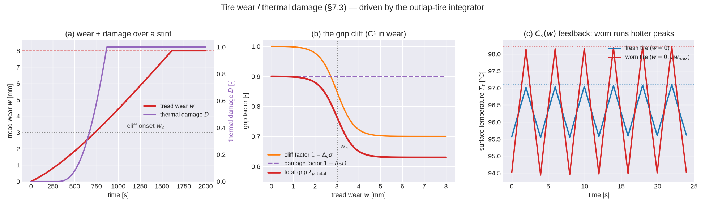

<!-- SPDX-License-Identifier: AGPL-3.0-only -->
# Tire wear and thermal damage — the degradation model on the ring

Grip does not only move with temperature; it decays over a stint as the tread wears and the rubber
takes irreversible heat damage. That decay — a gentle pace loss lap after lap, then a *cliff* where
the tire falls off sharply — is what turns a lap-time model into a strategy model: it is why an
undercut works, why a soft tire is fast then gone, why a stint has an optimal length. `outlap-tire`
adds two slow states on top of the [thermal ring](tire-thermal.md) to carry it (HANDOFF §7.3,
FLAGSHIP): **tread wear `w`** and **irreversible thermal damage `D`**. Like the ring, they are
implemented **clean-room from the published literature** (Archard; Grosch) cited below — *no
open-source tire wear/degradation model exists in any language*.

Both states are advanced in the **same** `TireThermalRing::step` as the temperatures
(`crates/outlap-tire/src/thermal.rs`), because wear feeds back into the ring: a worn tire has less
tread mass, so a smaller surface thermal capacity `C_s(w)`, so it runs hotter — the positive-feedback
mechanism behind the cliff.

## Tread wear `w`

Wear is an **Archard** sliding-energy law: material removed is proportional to the frictional sliding
work done in the contact patch, divided by the rubber's hardness. Hardness falls as the rubber heats
(**Grosch**), so a hot tire wears faster:

```
dw/dt = (k_w / H(T_s)) · Q_fric / A_cp        [mm/s]
```

- `Q_fric = p_t·P_slide` is the frictional power deposited in the tread (the same driver the ring
  uses), and `A_cp = a_cp·A_ext` is the contact-patch area, so `Q_fric/A_cp` is the frictional power
  *density* — the quantity that abrades rubber.
- `w` accumulates from `0` (new) toward `w_max` (bald) and **only ever grows** (`dw/dt ≥ 0`); the
  integrator clamps it monotone in `[0, w_max]`.
- `H(T_s)` is the temperature-dependent hardness. The shipped model uses the Grosch form
  `1/H(T_s) = min(exp(c_H·(T_s − T_opt)), cap)`: wear roughly e-folds per ~50 °C of surface
  temperature above the grip optimum, with the optimum `T_opt` as the hardness reference (a compound
  is characterised at its working window). The **magnitude** of wear is the calibratable `k_w`
  (`.tyr` `TyrWear`); the temperature *shape* `c_H` is a fixed modelling constant here (the FastF1
  inverse-calibration in a later M5 step fits `k_w`, not `c_H`).

## Thermal damage `D`

Beyond simple abrasion, overheated rubber reverts and hardens — a **irreversible** loss that a cool-
down lap cannot recover. It accumulates whenever the carcass exceeds a degradation threshold `T_deg`:

```
dD/dt = (1/τ_D) · ⟨(T_c − T_deg)/ΔT_ref⟩₊^β        with ⟨x⟩₊ = max(x, 0)
```

`D ∈ [0,1]` is monotone non-decreasing by construction (the ramp `⟨·⟩₊` is never negative), and the
integrator clamps it so cooling never repairs it. `τ_D` sets the timescale, `ΔT_ref` normalises the
over-temperature, and `β` sharpens the onset (a threshold-and-power law, not a linear one).

## Total grip

The ring hands the force model a single grip multiplier — the thermal window times the two
degradation factors (HANDOFF §7.3):

```
λ_μ,total = λ_μ(T_s) · (1 − Δ_c·σ((w−w_c)/s_w)) · (1 − Δ_D·D)
```

- `λ_μ(T_s)` is the [thermal grip window](tire-thermal.md) (peaks at `T_opt`).
- `(1 − Δ_c·σ((w−w_c)/s_w))` is the **wear cliff**: a logistic `σ(z)=1/(1+e^{−z})` centred on the
  critical wear `w_c` with sharpness `s_w`. It is `≈1` when new, collapses toward `1−Δ_c` past `w_c`,
  and — being a smooth sigmoid — is **C¹ in `w`** (no kink at the cliff, so the QSS envelope and the
  T2 force call stay differentiable). Because `σ` is monotone increasing, the factor is
  monotone-*decreasing* for **all** `w`, so grip erodes gradually below `w_c` and steepens across it.
- `(1 − Δ_D·D)` is the irreversible thermal-damage loss.

### Reduction note — the shipped `TyrWear` contract

§7.3 also writes a separate linear pre-cliff term `f_w = 1 − c_w1·(w/w_max)`. The shipped `.tyr` wire
contract (`TyrWear`) carries **no** `c_w1`: the gradual pre-cliff pace loss and the cliff are unified
into the single C¹ sigmoid above (which already erodes grip monotonically below `w_c`), and the
irreversible component is carried by the thermal-damage factor. This keeps the wear parameter set to
exactly the §7.3 headline coefficients (`k_w, w_max, w_c, s_w, Δ_c, τ_D, T_deg, ΔT_ref, β, Δ_D`) with
no redundant knob. Should stint calibration later show the sigmoid toe is too flat to reproduce the
observed ~0.05–0.10 s/lap gradual decay, restoring the explicit `f_w` term is an additive schema
change.

## The positive-feedback cliff: `C_s(w)`

The cliff is not just a grip curve — it is a *mechanism*. As the tread wears, there is less tread
mass, so the surface node's thermal capacity shrinks:

```
C_s(w) = c_s · max(1 − w/w_max, floor)
```

(the `floor` keeps the belt/base contribution so the node is never mass-less). A smaller `C_s` means
less thermal inertia, so under the pulsing load of a lap — hard in the corners, light on the
straights — the worn tire's surface **tracks the load peaks more closely**: it swings wider, reaching
*higher peak temperatures* in the corners (panel (c) below). Higher peaks push the surface further off
the top of the grip window (lower `λ_μ`), and hotter rubber wears faster still (`1/H(T_s)`) — worn →
hotter → less grip / faster wear → more worn. That is the physical loop the grip cliff sits on top of.

Note the subtlety: under a *constant* load the steady surface temperature is set by the energy balance
and is **independent** of `C_s` (capacity sets the time constant, not the fixed point). The feedback
bites on the **transient peaks**, which is exactly where a tire falls out of its window and off the
cliff — so the demonstration below uses an oscillating corner/straight load, not a constant one.

## Clean-room provenance

The Archard sliding-energy wear law, the Grosch hardness–temperature dependence, and the
threshold-power thermal-damage form are implemented from the published literature, not derived from
any other codebase (game-engine or lap-time-simulator tire code was **not** consulted as a source of
derivation, per CLAUDE.md §2).

- **J. F. Archard**, *"Contact and rubbing of flat surfaces"*, **J. Appl. Phys.** 24(8), 981–988,
  1953 — wear volume proportional to sliding work over hardness (the `k_w·Q_fric/H` form).
- **K. A. Grosch**, *"The relation between the friction and visco-elastic properties of rubber"*,
  **Proc. R. Soc. Lond. A** 274(1356), 21–39, 1963 — the temperature/velocity dependence of rubber
  friction and wear (hardness falling with temperature, `1/H(T_s)`).
- **F. Farroni, A. Sakhnevych, F. Timpone**, *"Physical modelling of tire wear for the analysis of the
  influence of thermal and frictional effects on vehicle performance"* (TRT-EVO), **Proc. IMechE Part
  L**, 2017 — the thermal→wear→grip coupling framing this model reduces.
- **H. B. Pacejka**, *Tire and Vehicle Dynamics*, 3rd ed., 2012 — the grip-scaling terms
  (`LMUX`/`LMUY`) the total multiplier drives.

The `.tyr` reference blocks that exercise this model are **synthetic placeholders** until the FastF1
inverse-calibration lands (a later M5 step); the figure below uses a physically-plausible synthetic
racing-slick set, so the point is the model's *shape*, not a fitted number.

## Validation



The figure is drawn from the real `TireThermalRing` integrator
(`crates/outlap-tire/examples/wear_cliff.rs`, plotted by `python/tools/plot_tire_wear.py`).
**(a)** A hard cornering stint from new tires: the tread wears (Archard) past the cliff onset `w_c`
and, once the carcass runs above `T_deg`, irreversible thermal damage accumulates to saturation.
**(b)** The grip factors against wear: the cliff factor is a smooth (C¹) sigmoid collapsing through
`w_c`, and the total grip is its product with the thermal-damage factor. **(c)** The `C_s(w)`
feedback: fresh and worn tires under an identical corner/straight load oscillation settle to the same
mean surface temperature, but the worn tire — with less surface capacity — swings wider and peaks
hotter, the mechanism that tips a worn tire into the cliff.

Property tests (`crates/outlap-tire/tests/wear.rs`, HANDOFF §13/§14) cover: wear monotone in sliding
energy (and zero without sliding); wear rate rising with surface temperature; damage monotone,
irreversible, and thresholded at `T_deg`; `λ_μ,total ∈ [0,1]` and C¹ across the cliff (finite-
difference derivative continuity); the `C_s(w)` feedback raising the worn tire's peak temperature; the
thermal-only path staying inert to wear; zero allocations per step; and bit-identical determinism plus
f32/f64 parity.
