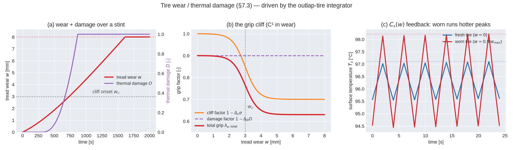

<!-- SPDX-License-Identifier: AGPL-3.0-only -->
# Tire wear and thermal damage: the degradation model on the ring

Grip does not only move with temperature. It also decays over a stint, as the tread wears and as the
rubber takes heat damage that does not reverse.

That decay has a shape: a gentle loss of pace lap after lap, then a *cliff*, where the tire falls
off sharply. The shape is what turns a lap-time model into a strategy model. It is why an undercut
works, why a soft tire is fast and then gone, and why a stint has an optimal length.

`outlap-tire` adds two slow states on top of the [thermal ring](tire-thermal.md) to carry it
(HANDOFF §7.3, FLAGSHIP): **tread wear `w`**, and **irreversible thermal damage `D`**. Like the
ring, both are implemented **clean-room from the published literature** cited below, from Archard
and Grosch. *No open-source model of tire wear or degradation exists, in any language.*

Both states advance inside the **same** `TireThermalRing::step` as the temperatures, in
`crates/outlap-tire/src/thermal.rs`. They must, because wear feeds back into the ring. A worn tire
has less tread mass. Its surface therefore has a smaller thermal capacity, `C_s(w)`, so it runs
hotter. That is the positive feedback behind the cliff.

## Tread wear `w`

Wear follows an **Archard** law on sliding energy. The material removed is proportional to the
frictional sliding work done in the contact patch, divided by the hardness of the rubber. Hardness
falls as rubber heats, which is the **Grosch** effect. A hot tire therefore wears faster:

```
dw/dt = (k_w / H(T_s)) · Q_fric / A_cp        [mm/s]
```

- `Q_fric = p_t·P_slide` is the frictional power deposited in the tread. It is the same driver that
  the ring uses. `A_cp = a_cp·A_ext` is the area of the contact patch. `Q_fric/A_cp` is therefore
  the frictional power *density*, which is the quantity that abrades rubber.
- `w` accumulates from `0`, which is new, toward `w_max`, which is bald. It **only ever grows**, so
  `dw/dt ≥ 0`. The integrator clamps it monotone within `[0, w_max]`.
- `H(T_s)` is the hardness, which depends on temperature. The shipped model uses the Grosch form,
  `1/H(T_s) = min(exp(c_H·(T_s − T_opt)), cap)`. Wear roughly e-folds for every 50 °C of surface
  temperature above the grip optimum. The optimum `T_opt` is the reference for hardness, because a
  compound is characterized at its working window.

  The **magnitude** of wear is `k_w`, which is calibratable and lives in `TyrWear` in the `.tyr`
  file. The *shape* against temperature, `c_H`, is a fixed modeling constant here. The inverse
  calibration against FastF1, in a later M5 step, fits `k_w`. It does not fit `c_H`.

## Thermal damage `D`

Abrasion is not the only loss. Overheated rubber reverts and hardens. That loss is
**irreversible**, and a cool-down lap cannot recover it. It accumulates whenever the carcass exceeds
a degradation threshold, `T_deg`:

```
dD/dt = (1/τ_D) · ⟨(T_c − T_deg)/ΔT_ref⟩₊^β        with ⟨x⟩₊ = max(x, 0)
```

`D ∈ [0,1]`, and it never decreases, by construction, because the ramp `⟨·⟩₊` is never negative. The
integrator clamps it, so cooling never repairs it. `τ_D` sets the timescale. `ΔT_ref` normalizes the
over-temperature. `β` sharpens the onset, which makes this a threshold-and-power law rather than a
linear one.

## Total grip

The ring hands the force model one grip multiplier. It is the thermal window, times the two factors
for degradation (HANDOFF §7.3):

```
λ_μ,total = λ_μ(T_s) · (1 − Δ_c·σ((w−w_c)/s_w)) · (1 − Δ_D·D)
```

- `λ_μ(T_s)` is the [thermal grip window](tire-thermal.md). It peaks at `T_opt`.
- `(1 − Δ_c·σ((w−w_c)/s_w))` is the **wear cliff**. It is a logistic, `σ(z)=1/(1+e^{−z})`, centered
  on the critical wear `w_c`, with sharpness `s_w`. It is about `1` when the tire is new, and it
  collapses toward `1−Δ_c` past `w_c`.

  Because it is a smooth sigmoid, it is **C¹ in `w`**. There is no kink at the cliff, so the QSS
  envelope and the T2 force call both stay differentiable. And because `σ` increases monotonically,
  the factor decreases monotonically for **all** `w`. Grip therefore erodes gradually below `w_c`,
  and the erosion steepens across it.
- `(1 − Δ_D·D)` is the loss from irreversible thermal damage.

### A note on reduction: the shipped `TyrWear` contract

§7.3 also writes a separate linear term before the cliff, `f_w = 1 − c_w1·(w/w_max)`. The shipped
wire contract, `TyrWear`, carries **no** `c_w1`.

Two changes make it redundant. The gradual loss of pace before the cliff and the cliff itself are
unified into the single C¹ sigmoid above, which already erodes grip monotonically below `w_c`. And
the irreversible component is carried by the thermal-damage factor.

The wear parameter set is therefore exactly the headline coefficients of §7.3 — `k_w, w_max, w_c,
s_w, Δ_c, τ_D, T_deg, ΔT_ref, β, Δ_D` — with no redundant knob.

Calibration against a stint may later show that the toe of the sigmoid is too flat to reproduce the
observed gradual decay of 0.05 s to 0.10 s per lap. Restoring the explicit `f_w` term would then be
an additive schema change.

## The positive feedback that makes the cliff: `C_s(w)`

The cliff is not only a grip curve. It is a *mechanism*.

As the tread wears, there is less tread mass. The thermal capacity of the surface node therefore
shrinks:

```
C_s(w) = c_s · max(1 − w/w_max, floor)
```

The `floor` keeps the contribution of the belt and base, so the node is never massless.

A smaller `C_s` means less thermal inertia. Under the pulsing load of a lap — hard in the corners,
light on the straights — the surface of a worn tire therefore **tracks the load peaks more
closely**. It swings wider, and it reaches *higher peak temperatures* in the corners. Panel (c)
below shows this.

Higher peaks push the surface further off the top of the grip window, which lowers `λ_μ`. And hotter
rubber wears faster still, through `1/H(T_s)`. Worn gives hotter, hotter gives less grip and faster
wear, and faster wear gives more worn. That is the physical loop that the grip cliff sits on top of.

There is a subtlety worth stating. Under a *constant* load, the steady surface temperature is set by
the energy balance, and it is **independent** of `C_s`. Capacity sets the time constant, not the
fixed point. The feedback bites on the **transient peaks** instead, and those peaks are exactly
where a tire falls out of its window and off the cliff. The demonstration below therefore uses an
oscillating load between corner and straight, not a constant one.

## Clean-room provenance

Three things are implemented from published literature, and not derived from any other codebase: the
Archard law for wear from sliding energy, the Grosch dependence of hardness on temperature, and the
threshold-power form for thermal damage. Tire code from game engines and from lap-time simulators
was **not** consulted as a source for the derivation. This follows CLAUDE.md §2.

- **J. F. Archard**, *"Contact and rubbing of flat surfaces"*, **J. Appl. Phys.** 24(8), 981–988,
  1953 — wear volume proportional to sliding work over hardness (the `k_w·Q_fric/H` form).
- **K. A. Grosch**, *"The relation between the friction and visco-elastic properties of rubber"*,
  **Proc. R. Soc. Lond. A** 274(1356), 21–39, 1963 — the temperature/velocity dependence of rubber
  friction and wear (hardness falling with temperature, `1/H(T_s)`).
- **F. Farroni, A. Sakhnevych, F. Timpone**, *"Physical modelling of tire wear for the analysis of the
  influence of thermal and frictional effects on vehicle performance"* (TRT-EVO), **Proc. IMechE Part
  L**, 2017 — the thermal→wear→grip coupling framing this model reduces.
- **H. B. Pacejka**, *Tire and Vehicle Dynamics*, 3rd ed., 2012 — the grip-scaling terms
  (`LMUX`/`LMUY`) the total multiplier drives.

The `.tyr` reference blocks that exercise this model are **synthetic placeholders**, until the
inverse calibration against FastF1 lands in a later M5 step. The figure below uses a synthetic set
for a racing slick that is physically plausible. Its point is therefore the *shape* of the model,
not a fitted number.

## Validation



The figure comes from the real `TireThermalRing` integrator. The example is
`crates/outlap-tire/examples/wear_cliff.rs`, and `python/tools/plot_tire_wear.py` plots it.

**(a)** A hard cornering stint from new tires. The tread wears, by Archard, past the onset of the
cliff at `w_c`. Once the carcass runs above `T_deg`, irreversible thermal damage accumulates to
saturation.

**(b)** The grip factors against wear. The cliff factor is a smooth C¹ sigmoid, collapsing through
`w_c`. The total grip is that factor times the thermal-damage factor.

**(c)** The `C_s(w)` feedback. A fresh tire and a worn tire run under an identical oscillation of
load between corner and straight. Both settle to the same mean surface temperature. The worn tire
has less surface capacity, so it swings wider and peaks hotter. That is the mechanism that tips a
worn tire into the cliff.

The property tests are in `crates/outlap-tire/tests/wear.rs` (HANDOFF §13 and §14). They cover: that
wear is monotone in sliding energy, and zero without sliding; that the wear rate rises with surface
temperature; that damage is monotone, irreversible, and thresholded at `T_deg`; that
`λ_μ,total ∈ [0,1]` and is C¹ across the cliff, checked by continuity of a finite-difference
derivative; that the `C_s(w)` feedback raises the peak temperature of the worn tire; that the
thermal-only path stays inert to wear; that a step allocates nothing; and that the model is
bit-identical run to run, with parity between f32 and f64.

[`outlap.wearcal`](../../python/src/outlap/wearcal/README.md) calibrates the parameters inversely,
from stint pace. The cross-check at lap level is
[`docs/validation/wear-cliff.md`](../validation/wear-cliff.md). It covers monotone loss of pace, the
cliff reproduced after calibration, and the agreement in stint decay between QSS and T2.
