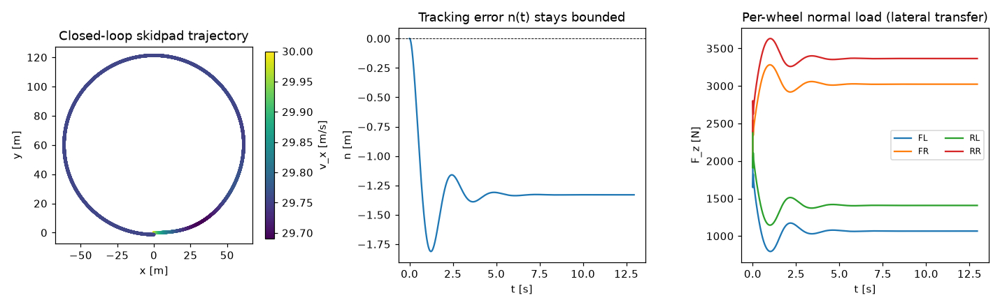
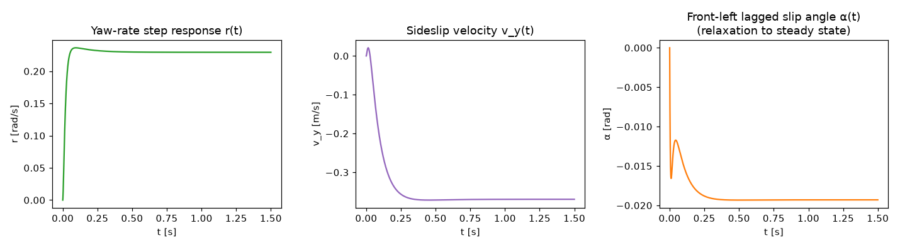
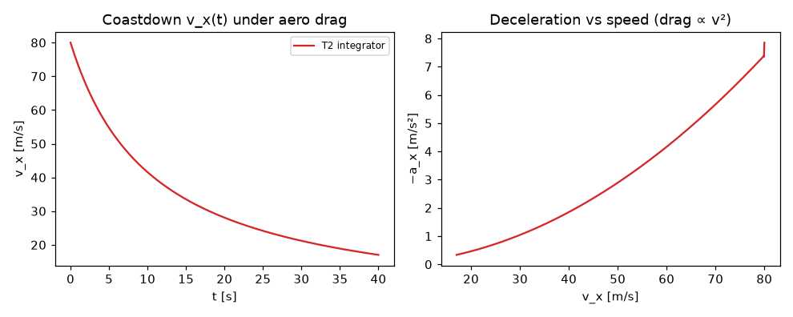
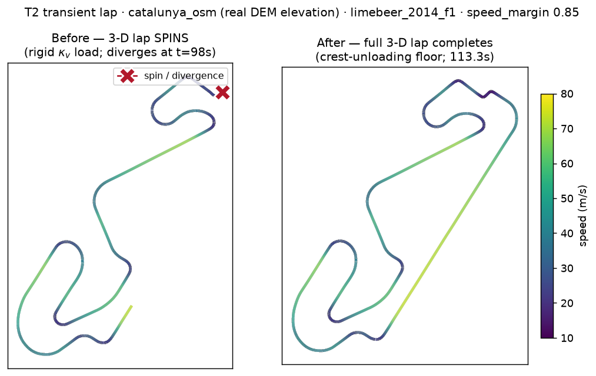
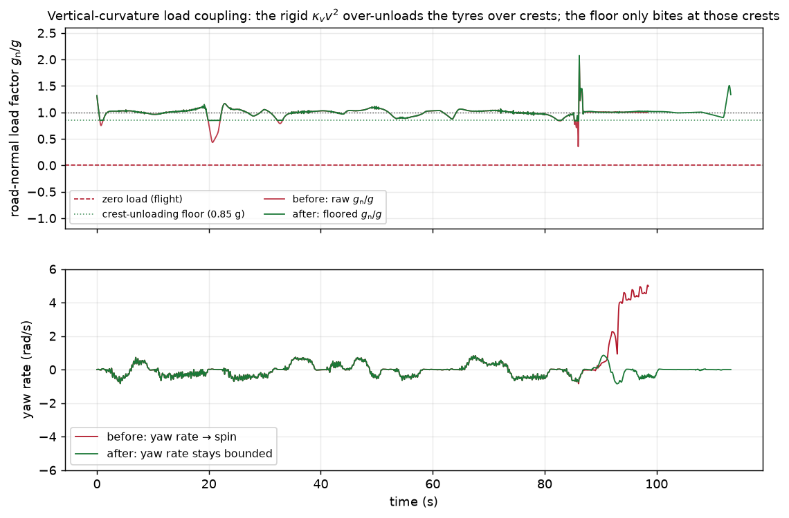
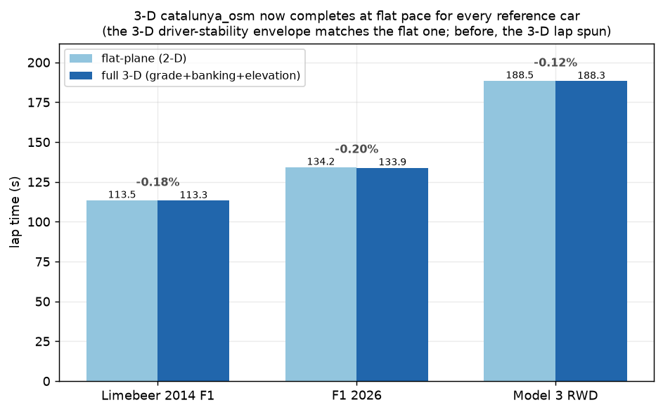

<!-- SPDX-License-Identifier: AGPL-3.0-only -->
# The transient (T2) chassis — 7-DOF curvilinear road-frame model

This page documents the physics of the transient tier's chassis right-hand side
([`outlap_vehicle::chassis`]), the tyre relaxation states it feeds, and the symbolic verification that
keeps its equation-of-motion signs honest. It is a clean-room implementation from the cited
literature; no other project's source was copied (the numerical fastest-lap oracle was **not**
consulted for this PR).

## 1. State and reference frame

The T2 car is a planar rigid body tracked in the **curvilinear 3-D road frame** (Perantoni &
Limebeer 2014; Rowold 2023). The fast state is

```
[ s, n, ψ_rel, v_x, v_y, r, ω_fl, ω_fr, ω_rl, ω_rr ]
```

with (ISO 8855: x forward, y left, z up; SI throughout):

| symbol   | meaning                                             |
|----------|-----------------------------------------------------|
| `s`      | arc length along the reference line, m              |
| `n`      | lateral offset from the reference line, m (+left)   |
| `ψ_rel`  | heading relative to the road tangent, rad           |
| `v_x,v_y`| body-frame CG velocity, m/s                          |
| `r`      | yaw rate, rad/s (+CCW)                               |
| `ω_i`    | wheel spin, rad/s (FL, FR, RL, RR)                  |

The registry reserves the full **14-DOF** footprint (heave/pitch/roll + four unsprung verticals) so
the T3 tier drops in without a layout break; T2 integrates only these first ten slots.

## 2. Equations of motion

**Body dynamics** — a planar rigid body of mass `m` and yaw inertia `I_zz`. The body-frame CG
accelerations carry the transport (Coriolis) terms of the rotating frame:

```
a_x = v̇_x − r·v_y,   a_y = v̇_y + r·v_x
m·a_x = ΣF_x,   m·a_y = ΣF_y,   I_zz·ṙ = ΣM_z
```

so `v̇_x = ΣF_x/m + r·v_y`, `v̇_y = ΣF_y/m − r·v_x`, `ṙ = ΣM_z/I_zz`.

**Force/moment assembly** — the four **wheel-frame** tyre forces `(F_x^w, F_y^w, M_z^w)` are rotated
into the body frame by the per-wheel steer `δ_i` (front axle steers, rear does not) and summed with
their moment arms `(x_i, y_i)` about the CG, minus aero drag along `+x`, plus the in-plane gravity
projection and the external yaw-moment demand `ΔM_z` (torque vectoring, written by a later PR):

```
F_{x,i}^b = F_x^w cos δ_i − F_y^w sin δ_i
F_{y,i}^b = F_x^w sin δ_i + F_y^w cos δ_i
ΣM_z = Σ_i ( x_i·F_{y,i}^b − y_i·F_{x,i}^b + M_{z,i}^w ) + ΔM_z
```

**Grade and banking** rotate gravity into the road-surface plane. With grade `θ(s)` (+uphill) and
banking `φ(s)` (+ raises the road-left edge), the in-plane components along the tangent and the
road-left direction are `g_t = −g sin θ` and `g_w = −g sin φ`; rotating by the heading `ψ_rel` gives
the body-frame gravity force. On flat ground (`θ = φ = 0`) both vanish and the EOM degenerates to the
exact planar model — a property test asserts this. The apparent **normal** gravity that feeds the
algebraic load transfer is `g·cos θ·cos φ + κ_v·v_x²` (the vertical-curvature term unloads on a crest,
`κ_v < 0`, and loads in a dip).

**Wheel spin** — each wheel is a 1-DOF rotor:

```
I_{w,i}·ω̇_i = τ_{drive,i} − τ_{brake,i}·sgn(ω_i) − R_i·F_{x,i}^w
```

The brake sign is smoothed near `ω = 0` to keep the RHS continuous. Gyroscopic (spin × yaw) coupling
is neglected, standard for vehicle-dynamics tiers and a T3 refinement.

**Curvilinear kinematics** — the Frenet progress relations on the reference line of plan-view
curvature `κ = κ_h(s)`:

```
ṡ     = (v_x cos ψ_rel − v_y sin ψ_rel) / (1 − n κ)
ṅ     =  v_x sin ψ_rel + v_y cos ψ_rel
ψ̇_rel =  r − κ·ṡ
```

The `1 − nκ` denominator is singular at the curvature centre `n = 1/κ`; the RHS floors its magnitude
(and the orchestrator edge-clamps `n`) so a large transient offset can never blow up the progress
term. The world trajectory `x/y/z` is reconstructed from the **integrated** `(s, n)` as
`ref(s) + n·lateral(s)` — never from `track.position(s)` on a re-derived `s` (Decision #13).

**Load transfer is algebraic** and reuses the *exported* T1 expressions
(`outlap_qss::t1::load_transfer`), so T1 and T2 derive per-wheel `F_z` from identical algebra
(HANDOFF §6.1). The longitudinal/lateral accelerations feeding the transfer come from the resolved
`fz_coupling` (Decision #29): `one_step_lag` reuses the previous step's `(a_x, a_y)`; `fixed_point`
(the T2 auto-default) damps a few force→accel iterations at the step start.

### 3-D stability on graded roads — two normal-load guards

The 7-DOF chassis runs the full 3-D road frame (grade, banking, the elevated trajectory) on real
DEM-sourced circuits such as `catalunya_osm`. Two small guards on the normal load keep the closed
loop planted where a naïve rigid model would spin the car; both are **inert on a flat track**
(`κ_v ≡ 0`, no light wheels) and neither changes a flat lap by a bit.

- **A per-wheel `F_z` floor.** Over a crest at speed a wheel can go light enough that the
  load-transfer algebra returns exactly zero. There the tyre relaxation length `σ(F_z) → 0` and the
  exact-exponential slip update becomes ill-posed (a zero-length filter has infinite bandwidth). The
  load block floors each wheel at a small positive load (`FZ_FLOOR_N`); the force it implies
  (`≈ μ·F_z_floor`, a few newtons) is negligible against a kN-scale wheel load, so a planted lap is
  untouched — it only ever lifts a would-be-zero wheel.

- **A crest-unloading floor on `κ_v·v²`.** A T2 chassis is *rigid*: the sprung mass is modelled as
  following the road's vertical curvature exactly (the suspension travel that would let the wheels
  drop into a crest while the body carries on is the T3 tier, deferred to M6, Decision #3). That
  rigidity makes the `κ_v·v²` term **over-predict the unloading** over a sharp crest — on
  `catalunya_osm` the raw term drives the road-normal load through zero (flight) mid-corner at racing
  speed, collapsing grip and spinning the otherwise-planted loop. Meanwhile the QSS point-mass profile
  the driver tracks was built with the envelope's own `g_normal` clamped to `[0.5 g, 2 g]` plus a
  flight guard, so the two tiers disagree on the available grip exactly there. The transient therefore
  **floors the unloading** at a fraction of `g` below the static (grade/banking) load
  (`CREST_UNLOADING_FLOOR_G = 0.15`) — the T2 analogue of the QSS clamp + flight guard. The **loading**
  side (dips, Eau-Rouge-type compressions) is transmitted in full, so downforce-on-compression physics
  is preserved. This is a documented T2 model closure; full vertical-load fidelity — a wheel load that
  rides the suspension over the crest — arrives with the T3 suspension DOF. With both guards the three
  reference cars lap `catalunya_osm` in 3-D within ≤0.2 % of their flat-plane time, i.e. the 3-D and
  flat driver-stability envelopes now coincide.

If the closed loop *does* leave the physical envelope (a spin the driver cannot catch — e.g. an
over-aggressive `speed_margin`), the solver stops cleanly on a finite, truncated trace and records the
divergence, rather than integrating a non-finite state or reporting a runaway `lap_time_s`.

### Step ordering (a recorded decision)

The relaxation-lagged slip is advanced by the exact-exponential sub-step **before** the RK sweep and
held frozen across the RK stages; the algebraic `F_z` is likewise resolved once per step. So within a
step the ordering is *relaxation → load transfer → RK*. This split-integration ordering (relative to
the fast RK update) is a documented step-phase choice, per Decision #29/#5.

## 3. Symbolic verification (Decision #32)

The chassis EOM is derived **independently** in `docs/derivations/t2_chassis_kane.ipynb` and the
Rust test `crates/outlap-vehicle/tests/kane_fixture.rs` asserts the hand-written [`Chassis`] RHS
agrees to **1e-12** at 64 seeded random states/parameters/loads. What each part of the RHS is checked
against:

* the **body-frame transport terms** (`v̇_x = ΣF_x/m + r·v_y`, `v̇_y = ΣF_y/m − r·v_x`, `ṙ = ΣM_z/I_zz`)
  — derived by `sympy.physics.mechanics`’ `KanesMethod` from the kinematics (the classic sign trap);
* the **force rotation and yaw moment** (wheel→body by δ, `r × F`) and the **gravity projection**
  (grade/banking rotated by `ψ_rel`) — derived from `sympy.physics.vector` reference frames + cross
  products, *not* the hand-written scalar formula, so an assembly sign error surfaces as a mismatch;
* the **wheel rotors** and **curvilinear kinematics** — transcribed identities, checked for
  self-consistency here and for sign correctness by the physical property tests (§5: front-force yaw,
  uphill decel, straight-line kinematic degeneration, step-steer).

CI re-executes the notebook, regenerates the committed fixture
`docs/derivations/fixtures/t2_chassis_rhs.json`, and `git diff --exit-code`s it, so the symbolic
source stays authoritative (a cross-platform last-ULP libm difference is the one low-probability
flake vector; the Rust 1e-12 check itself is tolerant to it).

## 4. Tyre relaxation lengths (Pacejka 2012 re-verification)

The lagged slip `(κ, α)` fed to the force model follows the first-order relaxation
`σ·ẋ + |V_x|·x = |V_x|·x_ss`, advanced with the **exact-exponential** update
`x ← x_ss + (x − x_ss)·exp(−|V_x|·dt/σ)` (see [the integrator page](integrator.md)). The relaxation
lengths `σ_κ`, `σ_α` were carried over from the M2 tyre model with a provisional `(~)` flag; they are
re-verified here against **Pacejka 2012** (3rd ed., §8.6 “Non-lag / transient behaviour”, the MF6.1
`PT*` relaxation block) and the flag is dropped:

```
σ_κ = F_z·(PTX1 + PTX2·dfz)·exp(−PTX3·dfz)·(R0/FNOMIN)·λ_σκ          (long., eq. 8.90-form)
σ_α = PTY1·sin( 2·atan( F_z/(PTY2·F'_z0) ) )·(1 − PKY3·|γ*|)·R0·LFZO·λ_σα   (lat., eq. 8.91-form)
```

with `dfz = (F_z − F'_z0)/F'_z0`, `F'_z0 = LFZO·FNOMIN`. When the `PT*` set is absent the code falls
back to the carcass-stiffness identity `σ = K_slip / C_carcass`, then to `0.5·R0`; every route is
recorded in the loaded-model report. Both lengths are floored at `SIGMA_FLOOR_M = 1e-3 m`.

## 5. Verification

Property tests (`outlap-vehicle`, `outlap-transient`): ISO 8855 sign conventions (leftward front
force ⇒ +yaw; uphill grade decelerates), flat-track planar degeneration, wheel spin-up, frame-
singularity flooring, relaxation convergence to steady state, coastdown drag deceleration, step-steer
yaw sign/magnitude (`r → v·δ/L`), friction-circle containment on a skidpad, the `F_z` floor over a
light crest, a cornering-crest lap staying planted, the divergence guard stopping an unholdable line
cleanly, and bit-exact reproducibility. The `transient_lap` example emits the closed-loop skidpad /
coastdown / step-steer traces below (regenerate with `docs/derivations/plot_t2_demo.py`).







### 3-D driver stability on `catalunya_osm`

The full 3-D road frame runs on the real DEM-elevated `catalunya_osm`. Before the crest-unloading
floor, the rigid `κ_v·v²` normal-load coupling drove the tyres over-light on the crests and spun the
otherwise-planted closed loop mid-lap (left); with the floor the same lap completes and stays planted
(right). Regenerate with `docs/derivations/plot_t2_3d_stability.py`.



The mechanism: the raw road-normal load factor `g_normal/g` swings hard over the crests (and would go
airborne at racing speed), collapsing grip until the yaw rate runs away; the floor bounds the
*unloading* only where it bites, leaving normal running untouched, and the yaw rate stays bounded.



With both normal-load guards the three reference cars lap the elevated circuit within ≤0.2 % of their
flat-plane time — the 3-D and flat driver-stability envelopes now coincide.



## References

- G. Perantoni, D. J. N. Limebeer, *Optimal control for a Formula One car with variable parameters*,
  Vehicle System Dynamics 52(5), 2014.
- M. Rowold et al., *A curvilinear 3-D road model for vehicle dynamics on banked and graded tracks*,
  2023.
- H. B. Pacejka, *Tyre and Vehicle Dynamics*, 3rd ed., Butterworth-Heinemann, 2012 (§8.6 transient
  relaxation; slip conventions §1.3).
- R. S. Sharp, D. Casanova, P. Symonds, *A mathematical model for driver steering control* (MacAdam
  lineage) — background for the placeholder driver (the full model lands with the MacAdam driver).
