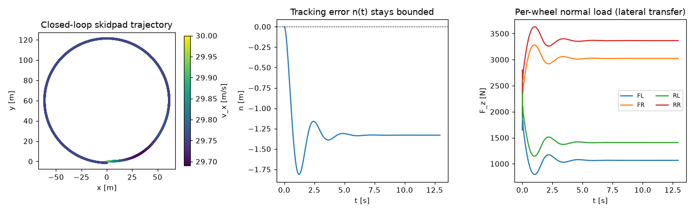
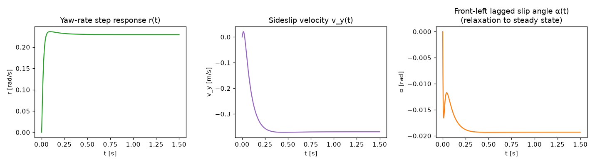
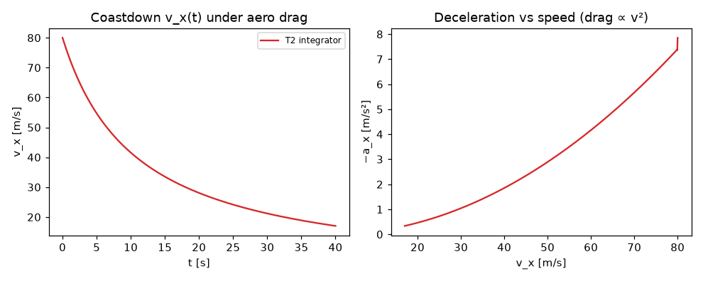
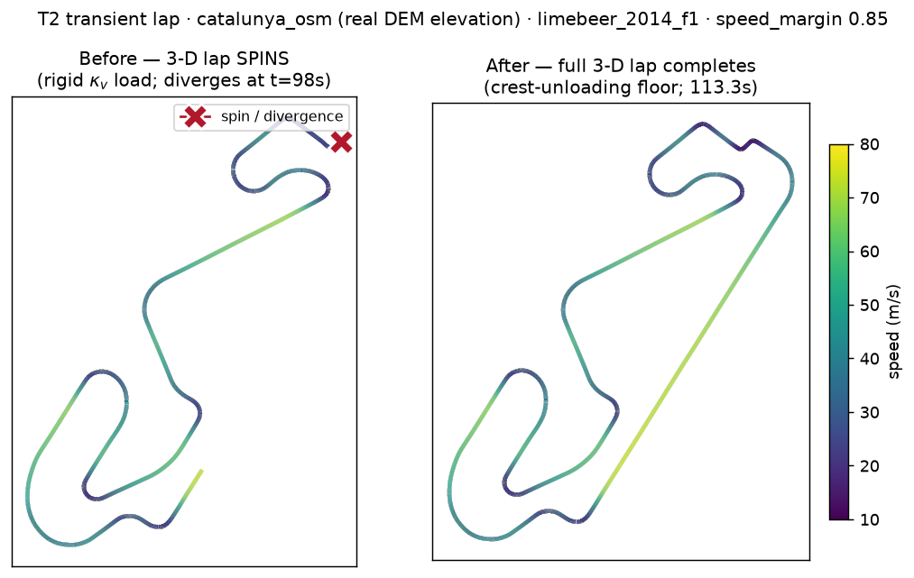
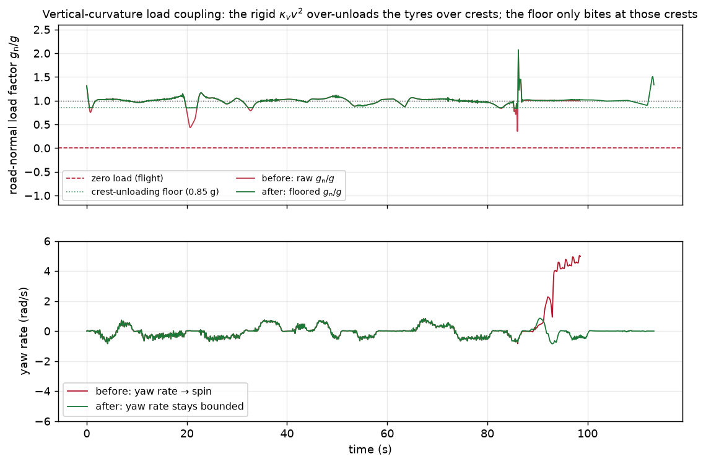
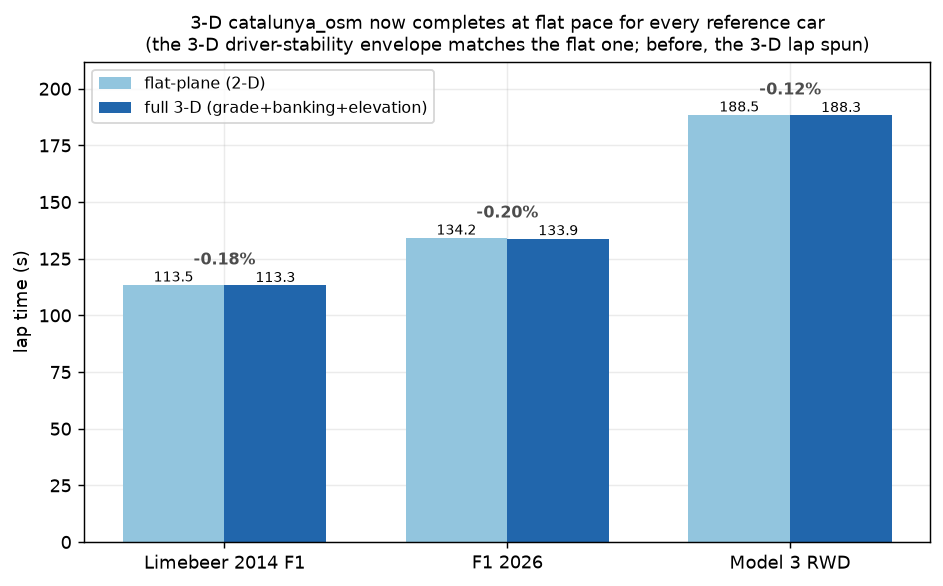

<!-- SPDX-License-Identifier: AGPL-3.0-only -->
# The transient (T2) chassis: a 7-DOF curvilinear road-frame model

This page documents three things: the physics in the right-hand side of the transient chassis
([`outlap_vehicle::chassis`]), the tire relaxation states that it feeds, and the symbolic
verification that keeps the signs in its equations of motion honest.

It is a clean-room implementation from the literature cited at the end. No source from another
project was copied. The numerical fastest-lap oracle was **not** consulted for this PR.

## 1. The state and the reference frame

The T2 car is a planar rigid body, tracked in the **curvilinear 3-D road frame** (Perantoni &
Limebeer 2014; Rowold 2023). The fast state is

```
[ s, n, ψ_rel, v_x, v_y, r, ω_fl, ω_fr, ω_rl, ω_rr ]
```

Axes are ISO 8855, so x is forward, y is left, and z is up. Every unit is SI.

| symbol   | meaning                                             |
|----------|-----------------------------------------------------|
| `s`      | arc length along the reference line, m              |
| `n`      | lateral offset from the reference line, m (+left)   |
| `ψ_rel`  | heading relative to the road tangent, rad           |
| `v_x,v_y`| body-frame CG velocity, m/s                          |
| `r`      | yaw rate, rad/s (+CCW)                               |
| `ω_i`    | wheel spin, rad/s (FL, FR, RL, RR)                  |

The registry reserves the full **14-DOF** footprint, which is heave, pitch, roll, and the four
unsprung verticals. The T3 tier therefore drops in without breaking the layout. T2 integrates only
the first ten slots.

[`t3-chassis.md`](t3-chassis.md) documents the 14-DOF extension: the ride dynamics of the sprung
mass, `F_z` from the tire spring, and the gyroscopic and frame-transport terms.

## 2. Equations of motion

**Body dynamics.** The body is planar and rigid, with mass `m` and yaw inertia `I_zz`. The
accelerations of the CG in the body frame carry the transport, or Coriolis, terms of the rotating
frame:

```
a_x = v̇_x − r·v_y,   a_y = v̇_y + r·v_x
m·a_x = ΣF_x,   m·a_y = ΣF_y,   I_zz·ṙ = ΣM_z
```

Therefore `v̇_x = ΣF_x/m + r·v_y`, `v̇_y = ΣF_y/m − r·v_x`, and `ṙ = ΣM_z/I_zz`.

**Assembling the forces and moments.** The four tire forces arrive in the **wheel frame**, as
`(F_x^w, F_y^w, M_z^w)`. The steer of each wheel, `δ_i`, rotates them into the body frame. The front
axle steers, and the rear does not.

They are then summed with their moment arms `(x_i, y_i)` about the CG. Aero drag is subtracted along
`+x`. The in-plane projection of gravity is added, and so is the external yaw-moment demand `ΔM_z`,
which torque vectoring writes in a later PR:

```
F_{x,i}^b = F_x^w cos δ_i − F_y^w sin δ_i
F_{y,i}^b = F_x^w sin δ_i + F_y^w cos δ_i
ΣM_z = Σ_i ( x_i·F_{y,i}^b − y_i·F_{x,i}^b + M_{z,i}^w ) + ΔM_z
```

**Grade and banking** rotate gravity into the plane of the road surface. Grade is `θ(s)`, positive
uphill. Banking is `φ(s)`, positive when it raises the road-left edge. The in-plane components along
the tangent and toward road-left are `g_t = −g sin θ` and `g_w = −g sin φ`. Rotating those by the
heading `ψ_rel` gives the gravity force in the body frame.

On flat ground, `θ = φ = 0`, both components vanish, and the equations degenerate to the exact
planar model. A property test asserts this.

The apparent **normal** gravity that feeds the algebraic load transfer is
`g·cos θ·cos φ + κ_v·v_x²`. The vertical-curvature term unloads the car on a crest, where
`κ_v < 0`, and loads it in a dip.

**Wheel spin.** Each wheel is a rotor with one degree of freedom:

```
I_{w,i}·ω̇_i = τ_{drive,i} − τ_{brake,i}·sgn(ω_i) − R_i·F_{x,i}^w
```

The brake sign is smoothed near `ω = 0`, which keeps the RHS continuous. Gyroscopic coupling between
spin and yaw is neglected. That is standard for tiers of this kind, and it is a refinement for T3.

**Curvilinear kinematics.** These are the Frenet relations for progress along a reference line whose
plan-view curvature is `κ = κ_h(s)`:

```
ṡ     = (v_x cos ψ_rel − v_y sin ψ_rel) / (1 − n κ)
ṅ     =  v_x sin ψ_rel + v_y cos ψ_rel
ψ̇_rel =  r − κ·ṡ
```

The denominator `1 − nκ` is singular at the center of curvature, `n = 1/κ`. The RHS therefore puts a
floor under its magnitude, and the orchestrator clamps `n` at the edges. A large transient offset can
therefore never blow up the progress term.

The world trajectory `x/y/z` is reconstructed from the **integrated** `(s, n)`, as
`ref(s) + n·lateral(s)`. It is never taken from `track.position(s)` on a re-derived `s`
(Decision #13).

**Load transfer is algebraic.** It reuses the *exported* T1 expressions,
`outlap_qss::t1::load_transfer`. T1 and T2 therefore derive per-wheel `F_z` from identical algebra
(HANDOFF §6.1).

The accelerations that feed the transfer come from the resolved `fz_coupling` (Decision #29).
`one_step_lag` reuses `(a_x, a_y)` from the previous step. `fixed_point`, which T2 selects by
default, damps a few iterations from force to acceleration at the start of the step.

### Stability in 3-D on a graded road: two guards on the normal load

The 7-DOF chassis runs the full 3-D road frame, with grade, banking, and an elevated trajectory. It
does this on real circuits sourced from a DEM, such as `catalunya_osm`.

Two small guards on the normal load keep the closed loop planted where a naive rigid model would
spin the car. Both are **inert on a flat track**, where `κ_v ≡ 0` and no wheel goes light. Neither
changes a flat lap by a single bit.

- **A floor on per-wheel `F_z`.** Over a crest at speed, a wheel can go light enough that the
  load-transfer algebra returns exactly zero. The tire relaxation length then goes to zero,
  `σ(F_z) → 0`, and the exact-exponential slip update becomes ill-posed, because a filter of zero
  length has infinite bandwidth.

  The load block therefore floors each wheel at a small positive load, `FZ_FLOOR_N`. The force this
  implies is about `μ·F_z_floor`, which is a few newtons. That is negligible against a wheel load of
  a kilonewton, so a planted lap is untouched. The floor only ever lifts a wheel that would
  otherwise read zero.

- **A floor on how far `κ_v·v²` can unload the car over a crest.** A T2 chassis is *rigid*. It
  models the sprung mass as following the vertical curvature of the road exactly. The suspension
  travel that would let the wheels drop into a crest while the body carries on belongs to the T3
  tier, which is deferred to M6 (Decision #3).

  That rigidity makes the `κ_v·v²` term **over-predict the unloading** over a sharp crest. On
  `catalunya_osm` at racing speed, the raw term drives the road-normal load through zero, which
  means flight, in the middle of a corner. Grip collapses, and the loop spins a car that would
  otherwise stay planted.

  Meanwhile the QSS point-mass profile that the driver tracks was built with the envelope's own
  `g_normal` clamped to `[0.5 g, 2 g]`, plus a flight guard. The two tiers therefore disagree about
  the available grip at exactly that place.

  The transient tier therefore **floors the unloading** at a fraction of `g` below the static load
  from grade and banking, with `CREST_UNLOADING_FLOOR_G = 0.15`. It is the T2 analogue of the QSS
  clamp and flight guard.

  The **loading** side is transmitted in full. That covers dips and compressions of the Eau Rouge
  kind, so the physics of downforce under compression is preserved.

  This is a documented closure of the T2 model. Full fidelity in vertical load, where a wheel load
  rides the suspension over the crest, arrives with the suspension DOF of T3. With both guards, the
  three reference cars lap `catalunya_osm` in 3-D within 0.2 % of their time on the flat plane. The
  driver-stability envelopes in 3-D and on the flat therefore coincide.

If the closed loop *does* leave the physical envelope — a spin the driver cannot catch, for example
under an over-aggressive `speed_margin` — the solver stops cleanly. It returns a finite, truncated
trace and records the divergence. It does not integrate a non-finite state, and it does not report a
runaway `lap_time_s`.

### The order of operations within a step, which is a recorded decision

The exact-exponential sub-step advances the relaxation-lagged slip **before** the RK sweep, and
holds it frozen across the RK stages. The algebraic `F_z` is likewise resolved once for each step.

Within a step the order is therefore *relaxation, then load transfer, then RK*. This ordering of the
split integration, relative to the fast RK update, is a documented choice of step phase, under
Decisions #29 and #5.

## 3. Symbolic verification (Decision #32)

The equations of motion are derived **independently**, in
`docs/derivations/t2_chassis_kane.ipynb`. The Rust test `crates/outlap-vehicle/tests/kane_fixture.rs`
then asserts that the hand-written [`Chassis`] RHS agrees with that derivation to **1e-12**, at 64
seeded random combinations of state, parameters, and loads.

Each part of the RHS is checked against a different thing.

* The **transport terms in the body frame** — `v̇_x = ΣF_x/m + r·v_y`, `v̇_y = ΣF_y/m − r·v_x`, and
  `ṙ = ΣM_z/I_zz` — are derived from the kinematics by `KanesMethod` in
  `sympy.physics.mechanics`. These are the classic sign trap.
* The **force rotation and yaw moment**, which take the wheel frame to the body frame through δ and
  form `r × F`, and the **gravity projection**, which rotates grade and banking by `ψ_rel`, are
  derived from reference frames and cross products in `sympy.physics.vector`. They are *not* derived
  from the hand-written scalar formula. A sign error in the assembly therefore surfaces as a
  mismatch.
* The **wheel rotors** and the **curvilinear kinematics** are transcribed identities. This test
  checks them for self-consistency. The physical property tests of §5 check their signs: yaw from a
  front force, deceleration uphill, degeneration of the kinematics in a straight line, and the step
  steer.

CI re-executes the notebook, regenerates the committed fixture
`docs/derivations/fixtures/t2_chassis_rhs.json`, and runs `git diff --exit-code` on it. The symbolic
source therefore stays authoritative.

One low-probability flake vector remains: a last-ULP difference in libm across platforms. The Rust
check at 1e-12 tolerates it.

## 4. Tire relaxation lengths, re-verified against Pacejka 2012

The lagged slip `(κ, α)` that feeds the force model follows first-order relaxation,
`σ·ẋ + |V_x|·x = |V_x|·x_ss`. The **exact-exponential** update advances it, as
`x ← x_ss + (x − x_ss)·exp(−|V_x|·dt/σ)`. See [the integrator page](integrator.md).

The relaxation lengths `σ_κ` and `σ_α` were carried over from the M2 tire model with a provisional
`(~)` flag. They are re-verified here against **Pacejka 2012** (3rd ed., §8.6 "Non-lag / transient
behaviour", and the `PT*` relaxation block of MF6.1). The flag is therefore dropped:

```
σ_κ = F_z·(PTX1 + PTX2·dfz)·exp(−PTX3·dfz)·(R0/FNOMIN)·λ_σκ          (long., eq. 8.90-form)
σ_α = PTY1·sin( 2·atan( F_z/(PTY2·F'_z0) ) )·(1 − PKY3·|γ*|)·R0·LFZO·λ_σα   (lat., eq. 8.91-form)
```

with `dfz = (F_z − F'_z0)/F'_z0` and `F'_z0 = LFZO·FNOMIN`.

When the `PT*` set is absent, the code falls back to the identity from carcass stiffness,
`σ = K_slip / C_carcass`, and then to `0.5·R0`. The loaded-model report records whichever route it
took. Both lengths are floored at `SIGMA_FLOOR_M = 1e-3 m`.

## 5. Verification

The property tests live in `outlap-vehicle` and `outlap-transient`. They cover: the ISO 8855 sign
conventions, where a leftward front force gives positive yaw, and an uphill grade decelerates; the
degeneration to a planar model on a flat track; wheel spin-up; the flooring at the frame
singularity; convergence of the relaxation to steady state; deceleration under drag in a coastdown;
the sign and magnitude of yaw in a step steer, where `r → v·δ/L`; containment in the friction circle
on a skidpad; the `F_z` floor over a light crest; a lap over a cornering crest staying planted; the
divergence guard stopping an unholdable line cleanly; and bit-exact reproducibility.

The `transient_lap` example emits the closed-loop traces below, for the skidpad, the coastdown, and
the step steer. Regenerate them with `docs/derivations/plot_t2_demo.py`.







### Driver stability in 3-D on `catalunya_osm`

The full 3-D road frame runs on the real `catalunya_osm`, elevated from a DEM.

Before the crest-unloading floor, the rigid coupling of normal load through `κ_v·v²` drove the tires
too light over the crests. The closed loop, which was otherwise planted, spun in the middle of the
lap. That is the left panel. With the floor, the same lap completes and stays planted, in the right
panel. Regenerate with `docs/derivations/plot_t2_3d_stability.py`.



The mechanism is visible in the next figure. The raw road-normal load factor, `g_normal/g`, swings
hard over the crests, and at racing speed it would go airborne. Grip collapses until the yaw rate
runs away. The floor bounds the *unloading* only where it bites. Normal running is untouched, and
the yaw rate stays bounded.



With both guards on normal load, the three reference cars lap the elevated circuit within 0.5 % of
their time on the flat plane: limebeer at −0.32 %, f1_2026 at −0.49 %, and model3 at −0.18 %. The
3-D laps run marginally *faster*, because the shaped speed reference exploits the downhill sections.
The driver-stability envelopes in 3-D and on the flat therefore coincide.



## References

- G. Perantoni, D. J. N. Limebeer, *Optimal control for a Formula One car with variable parameters*,
  Vehicle System Dynamics 52(5), 2014.
- M. Rowold et al., *A curvilinear 3-D road model for vehicle dynamics on banked and graded tracks*,
  2023.
- H. B. Pacejka, *Tyre and Vehicle Dynamics*, 3rd ed., Butterworth-Heinemann, 2012 (§8.6 transient
  relaxation; slip conventions §1.3).
- R. S. Sharp, D. Casanova, P. Symonds, *A mathematical model for driver steering control* (MacAdam
  lineage) — background for the placeholder driver (the full model lands with the MacAdam driver).
