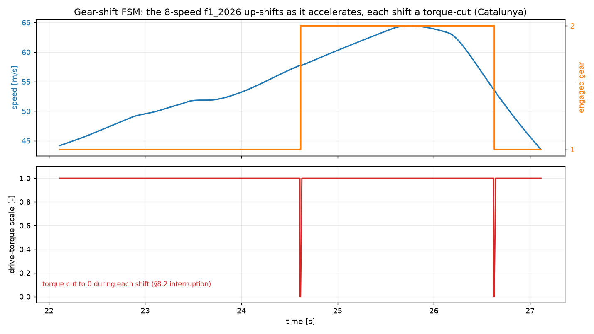
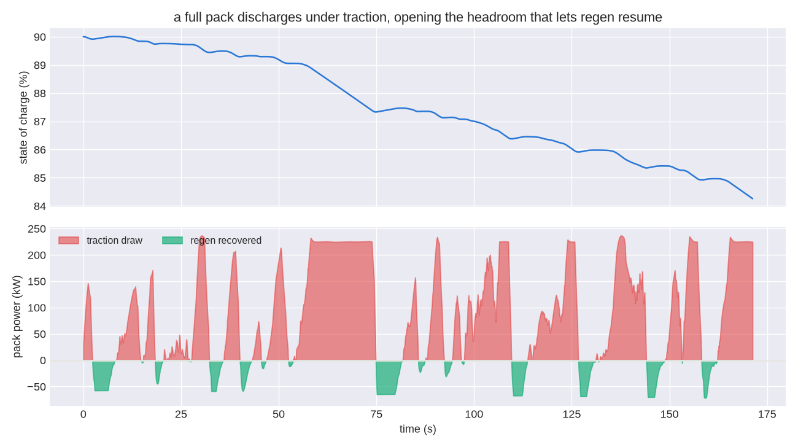

<!-- SPDX-License-Identifier: AGPL-3.0-only -->
# The transient rule-based control layer: shift FSM, regen blend, and torque vectoring

This page documents the **rule-based control layer** of the transient tier (HANDOFF §8.0, §8.2, and
§8.4). It has three parts: the finite state machine for gear shifts,
[`outlap_transient::control::Shifter`]; the blend between regeneration and the friction brakes, with
the slow-state battery stack; and the allocator that turns a yaw-moment demand into torque vectoring,
[`outlap_vehicle::control::allocate_yaw_moment`] and [`TorqueVectoring`].

The layer sits between two things. Above it is the ideal driver, which produces demands for steer,
throttle, and brake; see [driver.md](driver.md). Below it are the tire and chassis blocks, which turn
wheel torques into forces.

Every model here is a clean-room implementation from the literature cited in §7. No source from
another project was read or copied.

The layer is deliberately **rule-based in v1** (Locked Decision #2). The interface of the allocator
is a feasibility set for each wheel, plus a fill rule. That shape lets a quadratic-program allocator
replace the body after v1, without touching a single caller.

## 1. Where the discrete state and the slow state live

The continuous SoA fast buffer holds only the differentiable states of the chassis, the relaxation,
and the controller. Its layout is frozen.

The state of the control layer is neither continuous nor fast. It therefore lives elsewhere:

| state | clock | home |
|-------|-------|------|
| engaged gear, shift timers | step boundary | the [`EventQueue`] (time-ordered, drained per step) |
| pack state of charge, temperature | decimated **slow** clock | the [`SlowStack`] trait object (Decision #6) |
| drive-torque scale, regen ceiling, realised `ΔM_z` | every step | interned bus channels |

The orchestrator owns one of each. It publishes their outputs onto the bus once for each step, and
those outputs are **frozen across the Runge–Kutta sweep**. That is exactly the treatment that tire
relaxation and the load-transfer coupling already get.

Freezing matters. A discrete quantity that jumped between RK stages — a gear swapping in the middle
of a sweep — would make the stages inconsistent, and it would silently destroy the order of the
integrator.

The slow stack is touched once every `slow_decimation` fast steps. Its single dynamic dispatch is
therefore off the hot path. The hot-loop discipline forbids dispatch inside a timestep, not outside
one.

## 2. The gear-shift FSM: cut the torque, swap the ratio, ramp the clutch

A shift is not instantaneous. It costs an **interruption of torque**.

Naunheimer et al. describe the phase sequence of a shift in an automated or sequential transmission.
The model reproduces its three observable phases, and charges the car's own
`Gearbox.shift_time_s` for the whole thing:

```
elapsed < f_cut·T_shift          →  torque_scale = 0                  (torque cut)
elapsed = f_cut·T_shift          →  Engage(to)   [EventQueue]         (ratio swap)
f_cut·T_shift ≤ elapsed < T_shift →  torque_scale = (elapsed − f_cut·T_shift)/(T_shift − f_cut·T_shift)
elapsed ≥ T_shift                →  Complete     [EventQueue]         (clutch fully re-engaged)
```

`torque_scale ∈ [0,1]` multiplies the wheel drive force that the powertrain has available, at each
step. The car therefore genuinely coasts through the cut, and recovers drive over the clutch ramp.

`f_cut = 0.35`, the constant `SHIFT_CUT_FRACTION`, is a **modeling constant**. Nobody measured it. It
puts most of the shift into the ramp of re-engagement, which matches the qualitative shape of a
seamless-shift race gearbox. It is surfaced as estimated. Setting `shift_time_s = 0` recovers the
instantaneous ideal shift from before PR6, exactly.

**The cut reaches a machine on the crank too.** Consider a car whose energy manager governs an
electrical machine bolted to the crank, such as an F1 MGU-K. That machine sits *upstream* of the
gearbox. An open driveline therefore transmits neither the torque of the engine nor the torque of
the machine.

The same `torque_scale` therefore interrupts the electrical deploy. It is applied once, in the ERS
governor, where it scales three things together: the deploy wheel force, the draw from the pack, and
the winding loss in the machine. See
[ers-energy-manager](ers-energy-manager.md#the-shared-crank-one-shaft-two-sources).

**The engaged gear indexes no force.** The ceiling on wheel force stays the traction envelope of the
*best gear*, because the QSS tier already picks the gear at each speed. The entire physical effect
of the FSM on the car is therefore the interruption of torque described above.

Traction curves indexed by gear would let a mis-timed shift leave the car in the wrong ratio out of
a corner. That is a change for after v1.

**Crossing a threshold.** The thresholds for an up-shift are the crossover speeds that the assembly
pipeline supplies.

When the speed crosses one during a step, a single linear back-interpolation across that step
recovers the *time* of the crossing, through `back_interpolate`. There is no root-finding (§11.2).
The two discrete transitions are then scheduled on the event queue, at `t_cross + f_cut·T_shift` and
at `t_cross + T_shift`.

The schedule is a pure function of the step boundary. The timeline of a shift is therefore
bit-reproducible, which `shift_timeline_is_deterministic` asserts.

**Hysteresis.** A down-shift fires only once the speed falls below `0.93 ×` the up-shift threshold of
the gear below. That factor is `DOWNSHIFT_HYSTERESIS`.

Without it, a car cruising exactly at a shift point would chatter between gears on every step. That
is the classic limit cycle of a relay with noise, and the hysteresis band removes it.

**Where the thresholds come from.** The up-shift speeds are the QSS powertrain's own crossover
speeds for the best gear, `T1Vehicle::upshift_speeds`. They are the speeds at which the wheel-force
curve of the next gear overtakes the current one, and they are already baked into the best-gear
traction envelope that the lap uses.

The interruption of torque therefore lands exactly where the ceiling switches gears, and the
delivered force is unchanged.

A geared car steps through its ratios as it accelerates, and each shift is a cut. A single-speed car
with direct drive has no crossover speeds, so the FSM is inert.



## 3. Blending regeneration: series, or blended, braking

Production EVs and full hybrids use **series regenerative braking**.

The pedal demands a *total* brake torque. The balance bar splits it between front and rear. On each
driven axle, that axle's machine absorbs as much of its share as it can. The friction brakes then
supply only the **deficit**:

```
τ_brake,axle  =  τ_regen,axle  +  τ_friction,axle        (the commanded axle torque, unchanged)
```

The machine substitutes for the calipers *inside* the commanded torque. It does not add to it. The
axle total, which is what the tire responds to, therefore never moves.

The car decelerates identically, whether the energy went into the pack or into the discs. Only the
recovered energy differs.

That is the invariant of Decision #11, and it is asserted exactly. The test
`regen_is_energy_only_the_trajectory_is_identical_on_off` uses `assert_eq!` on the whole speed
trace, not a tolerance.

This is not an approximation that we pay for. It is what a correct series blend does. And it is why
regeneration cannot perturb the parity gates between tiers.

### 3.1 Each machine brakes its own axle

A machine can only apply torque to the wheels it drives. A rear-drive EV therefore regenerates on
the rear axle, and not at all on the front. A dual-motor car runs two independent regen actuators
that happen to share one battery.

The transient block models the two axles separately. The QSS assembly attributes the braking
capability of each drive unit to the axles in its driven set, through
`T1Vehicle::max_regen_force_by_axle`. When a single motor spans both axles through a center
differential, it splits by the count of driven wheels.

An **internal-combustion engine recovers nothing**. It has no negative quadrant to command. Its
braking on overrun is parasitic drag from pumping and friction, and that energy is not recoverable.
Its regen envelope is identically zero, and the loaded-model report says so.

### 3.2 The three ceilings on the machine

For each axle `a` that has a machine, the regen braking force it takes is

```
F_regen,a = min( authority_a · F_brake,a ,  F_env,a(v_x) · fade(v_x) )
```

1. **The regen torque available.** `F_env,a(v_x)` is the braking envelope of the machine. It comes
   from `max_regen_torque_nm_vs_speed` in `ptm/1.2`, taken through the best gear and expressed at the
   wheel. It is sampled into the shared monotone cubic at assembly, so the hot loop never touches a
   `.ptm` map.

   When a map declares no regen envelope, outlap assumes the machine is **symmetric** with its drive
   envelope. That is the usual first-order truth when inverter current sets the limit. The
   assumption is surfaced as *estimated*. It is never applied silently (#41).
2. **Blend authority.** `authority_a = max_regen_frac` is a policy cap on the machine's share of the
   brake torque commanded on *its own axle*. A value of `1` means "take everything the envelope and
   the pack allow".
3. **Fade at low speed.** `fade(v_x) = clamp(v_x / 2 m/s, 0, 1)`. A real controller hands braking
   back to the calipers at walking pace. Torque control degrades there, the recoverable energy is
   negligible, and the machine must release the wheel before the car stops.

Driveline efficiency is deliberately *not* applied to `F_env`. Under drive, a loss shrinks the force
that reaches the wheel. Under regeneration the power flows the other way, so a loss would *add*
braking at the wheel while shrinking what the machine recovers. Charging `η` once, against the
recovered power, keeps the ledger honest. It understates the braking authority of the machine rather
than overstating it.

### 3.3 One pack, shared: charge acceptance against SoC *and* temperature

The two machines draw on one battery. Their combined electrical demand,
`Σ_a η_a · F_regen,a · v_x`, is capped by the **charge-acceptance ceiling** of the pack.

When the cap binds, both machines are scaled back by the same factor, which preserves the split
between front and rear. The calipers then absorb the remainder on each axle. The axle totals are
untouched, so the trajectory does not move either way.

The ceiling itself, `Pack::regen_power_limit_w`, is the minimum of three limits that a real BMS
enforces:

```
P_accept = min( peak_regen(SoC) · derate(T) ,  V_max·(V_max − emf)/R0(SoC,T) )     (0 above the SoC window)
```

- **The design ceiling against SoC**, which is the declared `peak_regen_power_w_vs_soc(SoC)` curve.
- **The kinetic, or cold, derate**, which is `derate(T)`, from `regen_derate_vs_temp` in
  `battery/1.1`.

  **A cold lithium-ion cell cannot accept a fast charge.** Below roughly 10 °C, the intercalation
  kinetics at the anode slow down, until plating metallic lithium becomes the competing reaction. A
  BMS therefore cuts charge current hard, and typically to zero below 0 °C, to avoid irreversible
  loss of capacity and the growth of dendrites.

  This is a *kinetic* limit. It does **not** fall out of the ohmic grid, and it must be declared. If
  it is absent, outlap assumes the pack accepts its full ceiling at any temperature, and marks that
  assumption estimated.
- **The voltage, or CV, ceiling.** Charging drives the terminal voltage *above* the open-circuit EMF
  by `I·R0`, and it may not exceed `ns · cell_v_max`.

  With `emf = OCV(SoC,T) − V_RC`, the largest charge current is `(V_max − emf)/R0`, which gives the
  bound above. This is the constant-voltage taper. It vanishes as the pack fills, because
  `emf → V_max`, and it tightens when the pack is cold, because `R0` rises. Both come for free.

The last two terms are **not** redundant. It is worth being precise about why.

Take the committed `synth_pack` fixture, which is 220S1P with `cell_v_max` of 4.2 V, so `V_max` is
924 V. At 25 °C, at two nodes of the SoC grid:

| SoC | design curve | voltage ceiling | binds |
|-----|--------------|-----------------|-------|
| 0.40 | 180 kW | 750 kW | design |
| 0.80 | 90 kW  | 629 kW | design |

The voltage ceiling never binds on this pack. Its open-circuit voltage tops out near 3.64 V per
cell, a long way under the 4.2 V ceiling.

Nor does the voltage ceiling carry much signal about temperature. The `R0` of this fixture is flat in
temperature, so the ceiling moves only through `OCV(T)`. At SoC 0.4 it spans 742 kW to 755 kW across
0 °C to 45 °C, which is a swing of 1.8 %.

**The ohmic term alone therefore cannot reproduce a cold pack refusing charge.** Not here, and not
on a real pack, where at middle SoC it sits several times above the design curve, even below
freezing. The kinetic derate is what makes a cold pack refuse charge.

The voltage ceiling earns its place at the *other* end. It bites as the open-circuit voltage climbs
toward `ns · cell_v_max`. The headroom `V_max − emf` collapses there, and the admissible current
collapses with it. That is the constant-voltage taper that every charger shows, and it tightens
further when `R0` rises in the cold.

Together the two terms cover both regimes. Neither covers both alone.

### 3.4 What is still not modeled

- **No cap on the regen share from ABS or grip.** The commanded axle torque already respects the
  driver's demand, and regeneration only substitutes within it. The tire therefore never sees more
  than it would have. But a wheel about to lock is not handed back to the friction brakes, the way a
  real ABS event would hand it back.
- **`WheelBrakeTorque` combines friction and regeneration.** A future brake-thermal model must
  subtract the regen share of each axle, which is published on `ctrl.regen_torque_{front,rear}_nm`,
  before it heats the discs. Otherwise it will cook them on a lap with heavy regeneration.
- **Recovery efficiency is constant.** `η` is a documented constant, used as a proxy. The mapped
  efficiency in the `.ptm` file drives energy accounting in QSS, and the wasm-clean block may never
  touch a `.ptm` table.
- Rotor inertia reflected through the driveline is ignored. It is second order at these torques.

## 4. Torque vectoring: a yaw moment that the tires produce, and that nothing injects

The controller tracks the reference yaw rate of the corner, `r_target = v_x · κ_ref`, with
proportional feedback. An optional proxy for the machine envelope caps it:

```
ΔM_z,demand = clamp( k_yaw · (r_target − r),  ±M_max )
```

This is the standard law of **direct yaw-moment control** (Rajamani §8). The ESP of van Zanten uses
the same error signal on yaw rate, and realizes it by braking individual wheels. Sawase & Sano
realize it by distributing driving and braking force, which is the case here.

What matters is the second half. The demanded moment is **not** added to the chassis as a lumped
couple. It is allocated across the four wheels, as deltas in longitudinal force, `Δf_x,i`. Each
delta is clamped inside that wheel's **friction ellipse**. That is the combined-slip limit of the
Pacejka tire model, and the `F_x`–`F_y` ellipse of the friction circle in Milliken & Milliken:

```
f_x,max,i = √( (μ·F_z,i)² − F_y,i² )                     (longitudinal headroom at the current F_y)
s_i       = −sign(ΔM_z,demand · y_i)                     (the delta sign that adds toward the demand)
h_i       = headroom in direction s_i, 0 if s_i>0 and wheel i has no machine   (drive-incapable ⇒ brake only)
M_feasible = Σ_i |y_i| · h_i
ΔM_z       = sign(demand) · min(|demand|, M_feasible)
Δf_x,i     = s_i · min(|demand|/M_feasible, 1) · h_i     (proportional fill of the feasible set)
```

Under ISO 8855, a longitudinal force at lateral arm `y_i`, positive to the left, contributes
`−y_i·Δf_x,i` to the yaw moment. The deltas therefore realize **exactly** `ΔM_z`. That is an
identity, not an approximation, and
`reported_moment_equals_the_moment_the_deltas_produce` asserts it.

The realized moment saturates at `M_feasible`, which is what the tires can actually deliver. With
all four wheels at their lateral limit, `f_x,max = 0`, no moment is feasible, and the block reports
`0` rather than the demand.

The deltas are applied as extra drive or brake **torque** at the wheel, `Δf_x,i · R_i`. The wheel
spin responds, the slip evolves, and the tire produces the extra longitudinal force. The yaw moment
therefore emerges through the contact patch, over the relaxation lag of the tire, with all the phase
lag that implies.

Disabled, the block is a no-op that only zeroes its telemetry channel. A car that does not enable
torque vectoring is therefore byte-identical to the lap before PR6.

`μ` is the representative peak grip of the car, which is the radius coefficient of the ellipse. It is
not an instantaneous estimate of friction at each wheel. A QP allocator with the real combined-slip
surface at each wheel is the replacement after v1 (Decision #2).

## 5. The slow-state stack: state of charge moves in both directions

`SlowStack` is the interface that the orchestrator advances on the decimated slow clock.

It Coulomb-counts the **net** electrical power into the pack over the slow interval. That is the
recovered regeneration of §3, *minus* the electrical draw for traction. It publishes back the
ceiling on charge power, `P_limit(SoC, T)`, which caps §3. It also publishes the pack SoC and
temperature, for telemetry.

The traction draw is the mechanical drive power that each axle with a machine puts down,
`F_drive,axle · v_x`, over its motoring efficiency. Only an electric axle draws from the pack,
because an engine burns fuel.

State of charge therefore **falls under power and rises under braking**, as it does in a real stint.
A pack seeded full discharges until it has headroom, rather than sitting on a dead cell with
regeneration refused:



`SlowStack` is *received* as a boxed artifact. The concrete implementation wraps the QSS `Pack`
primitive at the Python boundary. The wasm-clean transient crate therefore never depends on the trim
and envelope machinery of QSS. This mirrors how the line table and the traction envelope are handed
in (§11.1).

This tier carries two simplifications, and the lap notes surface both. The whole drive power on an
axle with a machine is drawn from the pack, which is a pure-EV assumption; the engine's share on a
hybrid is not split out until the QP powertrain arrives. And the draw is not capped by the pack's
*discharge* ceiling; at T2 the traction envelope limits drive power, not the pack, so a depleted
pack does not yet fade the car.

## 6. Parameters and defaults

| symbol | field | default | meaning |
|--------|-------|---------|---------|
| `T_shift` | `drivetrain.gearbox.shift_time_s` | vehicle data | total shift duration (`0` ⇒ ideal instantaneous shift) |
| `f_cut` | `SHIFT_CUT_FRACTION` | 0.35 | fraction of the shift spent in the torque cut |
| — | `DOWNSHIFT_HYSTERESIS` | 0.93 | down-shift band below the up-shift threshold |
| `authority` | `brakes.regen_blend.max_regen_frac` | vehicle data | max machine share of *its own axle's* brake torque |
| `F_env` | `.ptm` `limits.max_regen_torque_nm_vs_speed` | drive envelope | machine braking envelope (symmetric when absent) |
| `derate(T)` | `battery` `limits.regen_derate_vs_temp` | `1` (no derate) | cold-charge acceptance factor, `0..1` |
| `V_max` | `battery` `limits.cell_v_max` × `ns` | vehicle data | pack charge-voltage ceiling (the CV taper) |
| `fade` | `REGEN_FADE_SPEED_MPS` | 2.0 m/s | speed below which regen fades linearly to zero |
| `η` | — | constant proxy | machine + inverter recovery efficiency |
| `k_yaw` | `drivetrain.control.torque_vectoring.k_yaw` | vehicle data | yaw-rate feedback gain, N·m per rad/s |
| `M_max` | `drivetrain.control.torque_vectoring.max_yaw_moment_nm` | `+∞` (unset) | hard cap on `|ΔM_z|` (machine-envelope proxy) |
| `μ` | derived | vehicle peak grip | friction-ellipse radius coefficient |

Three fields were added to the schemas, and all three are additive: `max_yaw_moment_nm`
(`vehicle/1.6`), `max_regen_torque_nm_vs_speed` (`ptm/1.2`), and `regen_derate_vs_temp`
(`battery/1.1`).

## 7. Verification

The allocator has four contract invariants. Property tests check all four over randomized wheel
states that are physically consistent, in `outlap-vehicle/tests/control_props.rs`: containment in
the friction ellipse; the sign convention, where the realized moment never opposes the demand and
never overshoots it; exactness of the moment; and drive capability, where a wheel with no machine
may only brake.

The suite is mutation-checked. Letting the fill overshoot the feasible set fails it. So does
reporting the demand instead of the realized moment.

The determinism of the shift FSM, its torque cut, and its gear swap are unit-tested in place. The
bound on regen energy, the bit-identical trajectory invariant of Decision #11, and the SoC closure
of the slow stack are integration tests at block level, in `outlap-transient/tests/control.rs`.

The regen blend is pinned at three levels, and each level is mutation-checked.

- **The pack** (`outlap-qss/tests/battery.rs`). A cold pack accepts less than a warm one, and
  nothing below 0 °C. The derate scales the design curve. An absent derate leaves acceptance
  independent of temperature, which keeps `battery/1.0` compatible. A nearly full pack tapers on the
  voltage ceiling. That ceiling itself tightens as `R0` rises in the cold. And acceptance is never
  negative, anywhere on the `(SoC, T)` grid.
- **The machine** (`outlap-qss/tests/t1_powertrain.rs`). A rear-drive EV regenerates only at the
  rear. Each machine of a dual-motor car regenerates its own axle. An ICE recovers nothing, and says
  so. An absent envelope is symmetric, *and it is surfaced*. A declared envelope is used verbatim.
- **The blend** (`outlap-vehicle/src/control.rs`). The machine takes its share, and the calipers take
  the rest. A machine never brakes the other axle. A pack that cannot accept charge hands braking
  back to the calipers entirely. The machine envelope, the blend authority, and the fade at low
  speed each cap the share. A shared pack ceiling scales both axles in proportion. And regeneration
  never exceeds the commanded braking.

  Letting a machine reach across axles fails this suite. So does forgetting to scale its braking
  torque when the pack ceiling binds.

## References

- H. B. Pacejka, *Tyre and Vehicle Dynamics*, 3rd ed., Butterworth-Heinemann, 2012 — combined slip and
  the longitudinal/lateral friction ellipse that bounds each wheel's force delta.
- W. F. Milliken & D. L. Milliken, *Race Car Vehicle Dynamics*, SAE, 1995 — the friction circle/ellipse
  construction and the tyre force budget.
- R. Rajamani, *Vehicle Dynamics and Control*, 2nd ed., Springer, 2012 — direct yaw-moment control, the
  reference yaw rate `r = v·κ`, and yaw-rate error feedback.
- A. T. van Zanten, "Bosch ESP Systems: 5 Years of Experience," SAE Technical Paper 2000-01-1633, 2000
  — yaw-rate tracking realised through individual-wheel longitudinal force.
- Y. Sawase & Y. Sano, "Application of active yaw control to vehicle dynamics by utilizing
  driving/braking force," *JSAE Review* 20(3), 1999, pp. 289–295 — direct yaw moment generated by
  distributing driving/braking force across wheels (torque vectoring).
- H. Naunheimer, B. Bertsche, J. Ryborz & W. Novak, *Automotive Transmissions: Fundamentals,
  Selection, Design and Application*, 2nd ed., Springer, 2011 — the shift phase sequence (torque
  interruption, ratio change, clutch re-engagement).
- L. Guzzella & A. Sciarretta, *Vehicle Propulsion Systems: Introduction to Modeling and Optimization*,
  3rd ed., Springer, 2013 — series vs parallel regenerative braking and the recuperation power limit.
- G. L. Plett, *Battery Management Systems, Volume 2: Equivalent-Circuit Methods*, Artech House, 2015 —
  the voltage-limited power-capability bound `P = V_max·(V_max − emf)/R0` used for the CV taper, and the
  Thevenin equivalent-circuit parameterisation the pack is built on.
- J. Jaguemont, L. Boulon & Y. Dubé, "A comprehensive review of lithium-ion batteries used in hybrid and
  electric vehicles at cold temperatures," *Applied Energy* 164, 2016, pp. 99–114 — the collapse of
  charge acceptance at low temperature.
- M. Petzl & M. A. Danzer, "Nondestructive detection, characterization, and quantification of lithium
  plating in commercial lithium-ion batteries," *Journal of Power Sources* 254, 2014, pp. 80–87 — why a
  BMS must cut charge current when cold (the kinetic derate).
- T. D. Gillespie, *Fundamentals of Vehicle Dynamics*, SAE, 1992 — brake balance and the axle brake
  force split.

No external open-source project was consulted for this layer. It is authored from the literature
above.
