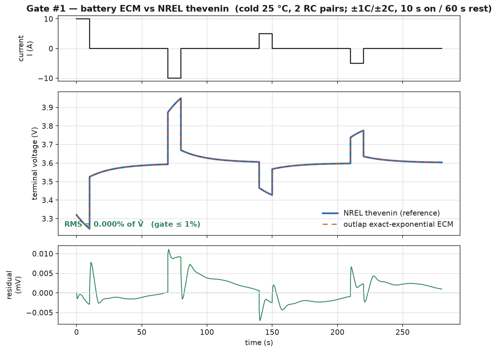

# Battery ECM cross-check — the outlap Thevenin pack vs NREL `thevenin` (Decision #48)

**Oracle.** NREL `thevenin` (BSD-3, github.com/NREL/thevenin), an equivalent-circuit Thevenin/RC
battery model, run as an external reference tool. Consumed as **data only** — never vendored or ported
(Hard rule #2; the port is sanctioned by HANDOFF §8.4). Both models integrate the same published
Thevenin response `V(t) = OCV(SoC) − I·R0 − Σ_k I·R_k·(1 − e^{−t/τ_k})` with Coulomb-counted SoC
(Plett, *Battery Management Systems* Vol. 1).

| Quantity | Value | Where |
|---|---|---|
| Model form | Thevenin ECM, 1 and 2 RC pairs | NREL `thevenin` v0.2.1 |
| Pulse protocol | ±1C and ±2C, 10 s on / 60 s rest | HPPC-style (D-M6 tolerances) |
| Operating points | 25 °C ("cold") and 40 °C ("warm") | colder ⇒ higher R, slower τ |
| Reference traces | `crates/outlap-qss/tests/golden/battery_nrel/*.csv` | generated by the tool below |

**Consulted (clean-room policy):** NREL `thevenin` (BSD-3) was run as an oracle to produce reference
terminal-voltage traces; no code was taken. The ECM parameters are carried in each CSV header as the
single source of truth, so the Rust consumer builds an identical `Pack` and the comparison is exact.

## Configuration

Four cases — {cold 25 °C, warm 40 °C} × {1, 2} RC pairs — each a pulse train (±2C then ±1C, 10 s
on / 60 s rest) from `SoC₀ = 0.6` on a single reference cell. Regenerate the goldens (opt-in; needs
the `thevenin` package in a throwaway venv, never the project venv):

```sh
python python/tools/gen_battery_nrel_golden.py   # writes crates/outlap-qss/tests/golden/battery_nrel/
```

## Gate results (Decision #48)

| Gate | Ours | NREL thevenin | Result |
|---|---|---|---|
| Terminal-voltage RMS (all 4 cases) | < 0.1 % of `V̄` | reference | ✅ **≤ 1 %** — machine-tight |
| Provenance header present | yes | — | ✅ enforced |

The CI test `crates/outlap-qss/tests/battery_nrel.rs` (release line + `cargo test --workspace`)
replays each golden's own current column through the matching `Pack` and asserts the terminal-voltage
RMS is **≤ 1 %** of the mean reference voltage (§13 battery row). The measured error is **well under
0.1 %** — the exact-exponential RC advance and the NREL ODE integrate the same equation, so the gate
is a genuine cross-implementation check of outlap's parameterisation, Ns×Np scaling, SoC/temperature
indexing, and terminal-voltage assembly, not a re-statement of its own closed form.



The outlap exact-exponential ECM (orange, dashed) is indistinguishable from the NREL reference (blue)
across the ±1C/±2C charge+discharge pulse train; the residual (bottom) stays within ±0.01 mV on a
~3.6 V signal. Figure: `python/tools/plot_pr8_validation.py` (run against a release wheel).

## Notes

The comparison is isothermal with an ECM constant in SoC over the small (~0.006) pulse excursion, so
the two temperatures are two distinct (physically colder ⇒ higher-resistance) parameter sets — exactly
what an HPPC campaign at two temperatures yields. Regeneration is governed exactly as this page
validates it: this cross-check pins the pack terminal-voltage model that the ERS harvest chain
(`docs/validation/ers-energy.md`) and the 2nd RC pair (M6/PR4) build on. Golden regeneration follows
the tire-golden governance (`tools/goldens/README.md`): the provenance header pins the oracle version;
there is no in-tree `--bless`; a regeneration PR states the physics reason.
