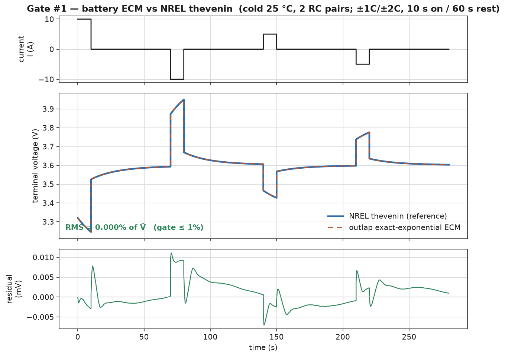

# Battery ECM cross-check: the outlap Thevenin pack against NREL `thevenin` (Decision #48)

**Oracle.** NREL `thevenin` (BSD-3, github.com/NREL/thevenin) is an equivalent-circuit battery
model of the Thevenin and RC form. outlap runs it as an external reference tool and consumes
**its data only**. outlap never vendors it and never ports it. This is Hard rule #2, and HANDOFF
§8.4 sanctions the port.

Both models integrate the same published Thevenin response,
`V(t) = OCV(SoC) − I·R0 − Σ_k I·R_k·(1 − e^{−t/τ_k})`, with SoC from Coulomb counting (Plett,
*Battery Management Systems* Vol. 1).

| Quantity | Value | Where |
|---|---|---|
| Form of the model | Thevenin ECM, with 1 and with 2 RC pairs | NREL `thevenin` v0.2.1 |
| Pulse protocol | ±1C and ±2C, 10 s on and 60 s of rest | HPPC style, with the D-M6 tolerances |
| Operating points | 25 °C, called "cold", and 40 °C, called "warm" | Colder gives higher R and slower τ |
| Reference traces | `crates/outlap-qss/tests/golden/battery_nrel/*.csv` | Generated by the tool below |

**What was consulted, under the clean-room policy.** NREL `thevenin` (BSD-3) was run as an oracle,
to produce reference traces of terminal voltage. No code was taken. Each CSV header carries the ECM
parameters, and that header is the single source of truth. The Rust consumer therefore builds an
identical `Pack`, and the comparison is exact.

## Configuration

There are four cases: {cold at 25 °C, warm at 40 °C} crossed with {1, 2} RC pairs. Each case runs a
pulse train of ±2C then ±1C, 10 s on and 60 s of rest, from `SoC₀ = 0.6`, on a single reference
cell.

To regenerate the goldens, opt in. This needs the `thevenin` package in a throwaway venv. Never
install it in the project venv.

```sh
python python/tools/gen_battery_nrel_golden.py   # writes crates/outlap-qss/tests/golden/battery_nrel/
```

## Gate results (Decision #48)

| Gate | Ours | NREL thevenin | Result |
|---|---|---|---|
| RMS error in terminal voltage, over all 4 cases | < 0.1 % of `V̄` | reference | ✅ **≤ 1 %**, which is machine-tight |
| A provenance header is present | yes | — | ✅ enforced |

The CI test is `crates/outlap-qss/tests/battery_nrel.rs`. It runs on the release line and under
`cargo test --workspace`. For each golden, it replays that file's own current column through the
matching `Pack`. It then asserts that the RMS error in terminal voltage is **≤ 1 %** of the mean
reference voltage. This is the battery row of §13.

The measured error is **well under 0.1 %**. Both sides integrate the same equation: outlap advances
the RC states with an exact exponential, and NREL solves the ODE. The gate is therefore a genuine
check across two implementations. It tests how outlap parameterizes the pack, how it scales Ns×Np,
how it indexes SoC and temperature, and how it assembles the terminal voltage. It does not merely
restate the closed form of one model.



The exact-exponential ECM of outlap is the orange dashed line. The NREL reference is the blue line.
The two cannot be told apart across the pulse train, which charges and discharges at ±1C and ±2C.
The residual, at the bottom, stays within ±0.01 mV on a signal of about 3.6 V.
`python/tools/plot_pr8_validation.py` draws the figure. Run it against a release wheel.

## Notes

The comparison is isothermal. The ECM is constant in SoC, because the pulse moves SoC by only about
0.006. The two temperatures are therefore two distinct parameter sets, where the colder one has
higher resistance, as physics requires. An HPPC campaign at two temperatures yields exactly this.

Regeneration is governed exactly as this page validates it. This cross-check pins the model of pack
terminal voltage. Two things build on that model: the ERS harvest chain
(`docs/validation/ers-energy.md`) and the second RC pair (M6, PR4).

Golden regeneration follows the same rule as the tire goldens (`tools/goldens/README.md`). The
provenance header pins the oracle version. There is no in-tree `--bless`. A PR that regenerates a
golden must state the physics reason.
