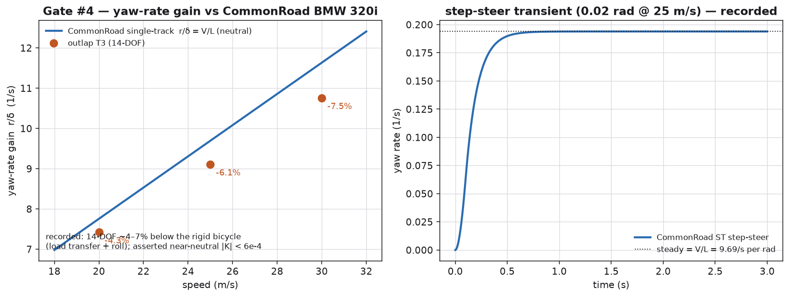

# Chassis 14-DOF cross-check — the T3 tier vs CommonRoad "vehicle 2" (Decision #48)

**Oracle.** The CommonRoad vehicle models (M. Althoff et al., TU München, BSD-3), parameter set
**"vehicle 2" (BMW 320i)** + the single-track (ST) model `vehicle_dynamics_st`, plus the analytic
steady-state single-track handling formulas (Gillespie, *Fundamentals of Vehicle Dynamics*). Consumed
as **data only** — never vendored.

| Quantity | Value | Where |
|---|---|---|
| Mass / wheelbase / CG / yaw inertia | 1093.3 kg / 2.579 m / a=1.156 m / I_z=1792 | `parameters_vehicle2` |
| Axle cornering stiffness `C_αf / C_αr` | 129.7 / 105.4 kN/rad | `C_α = −p_ky1·F_z` |
| Understeer gradient `K` | **≈ 0** (neutral — equal front/rear coefficients) | ST model |
| Yaw-rate gain `r/δ` | **V/L** (neutral car) | Gillespie |
| Reference traces | `crates/outlap-transient/tests/golden/bmw320i/{metrics,step_steer}.csv` | generated below |

**Consulted (clean-room policy):** the CommonRoad `vehiclemodels` package (BSD-3) was run as an oracle
to extract the BMW 320i cornering stiffness and the ST step-steer response; no code was taken. The
outlap car `data/vehicles/bmw320i` carries **brush tyres whose cornering stiffness is set to the
CommonRoad axle values** (per-tyre 64.85 / 52.70 kN/rad), so the two models share the same linear
tyre and the 14-DOF must collapse to the same bicycle-model handling.

## Configuration

An **open-loop skidpad** at a linear-regime lateral acceleration (~0.5 m/s²), driven by the M6/PR8
**prescribed open-loop steer** input (not the closed-loop driver), sweeps v ∈ {20, 25, 30} m/s. The
steady yaw-rate gain and the understeer gradient are extracted from the T3 solve
(`crates/outlap-transient/tests/handling.rs`, release line). Regenerate the goldens (opt-in):

```sh
PYTHONPATH=<venv>/PYTHON python python/tools/gen_bmw320i_golden.py
```

## Gate results (Decision #48)

| Gate | Ours | CommonRoad ST | Result |
|---|---|---|---|
| Understeer gradient `K` (near-neutral) | 2.3–2.9e-4 rad·s²/m | 0 (neutral) | ✅ **asserted \|K\| < 6e-4** |
| Yaw-rate gain `r/δ` vs V/L (20/25/30 m/s) | −4.3 / −6.1 / −7.5 % | V/L | recorded (decomposition below) |
| ST step-steer golden steady gain = analytic V/L | 9.694 | 9.694 | ✅ self-consistency |

**Asserted (the robust oracle).** The car is **near-neutral**: the understeer gradient extracted from
the sweep stays small (|K| < 6e-4 rad·s²/m), i.e. the 14-DOF collapses to essentially the neutral
single-track benchmark. A genuinely understeering passenger car sits an order of magnitude higher
(K ~ 2–5e-3), so this is the regression guard as well as the physics claim.



## Yaw-rate-gain decomposition — why ≤ 3 % is recorded, not asserted

The tyres are matched for an analytically neutral car (`C_αf/C_αr = b/a` ⇒ K = 0), yet the 14-DOF
yaw-rate gain sits **a few per-cent below** the rigid V/L, growing with v² (a fixed K ≈ 2.6e-4). This
is a **real residual understeer the point-mass single-track model cannot have**:

1. **Lateral load transfer at the finite operating point** — even at ~0.5 m/s² the outer tyre carries
   more load; the brush force on the loaded tyre saturates marginally below `C_α·α`, biasing the axle
   balance toward understeer. It shrinks toward the linear limit (K falls from ~2.9e-4 at 20 m/s
   toward ~2.3e-4 at 30 m/s on a larger radius) but does not vanish.
2. **Roll + suspension compliance** — the sprung mass rolls into the corner; the rigid bicycle has no
   roll degree of freedom.

Neither exists in the ST oracle, so the ideal ≤ 3 % steady match is **recorded and decomposed** rather
than asserted (D-M6-6, the Decision #48 pattern the PR8 plan pre-authorized). The transient step-steer
rise vs the CommonRoad ST golden is likewise recorded: the ST model has no roll/unsprung dynamics, so
its rise time is not a like-for-like 14-DOF target. **Not built in M6** (recorded as future work): a
Chrono::Vehicle co-simulation and a large-amplitude FMVSS-126 sine-with-dwell stability metric (the
prescribed-steer input now makes the latter reachable; a linear oracle does not apply at large
amplitude).

The Eau-Rouge crest that motivated the T2 `CREST_UNLOADING_FLOOR_G` is retired at T3 and gated
separately (`crates/outlap-transient/tests/dynamics.rs::t3_stays_planted_over_a_crest_without_the_floor`).

## Per-step budget (recorded — PR8a)

The §11.5 throughput gates run release-only; the numbers below are the recorded budget, not asserted
targets (the honest measurement, with a wide regression tripwire), from
`crates/outlap-transient/tests/perf_throughput.rs` and `crates/outlap-qss/tests/catalunya.rs`:

| Path | Measured | Tripwire |
|---|---|---|
| QSS lap wall-clock (median) | ≤ 50 ms | 50 ms |
| T2 step throughput | ~62k steps/s/core | 30k |
| T2 + tyre-thermal step throughput | recorded | 30k |
| T3 (14-DOF) step throughput | ~96k steps/s/core | 40k |

T3 is faster than T2 per step (the tyre-spring `F_z` resolves in one RHS eval vs T2's extra Picard
evals). The release rust job stays well inside ~15 min, so the gates are not split into a parallel job
(PR8a).
