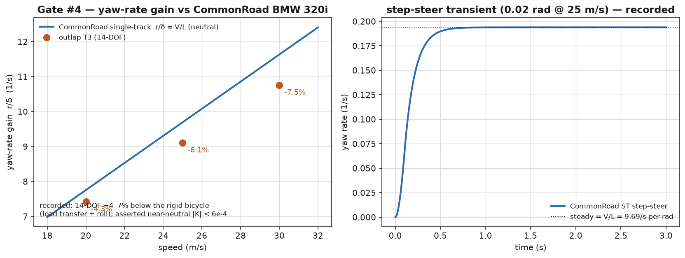

# Chassis 14-DOF cross-check: the T3 tier against CommonRoad "vehicle 2" (Decision #48)

**Oracle.** The CommonRoad vehicle models (M. Althoff et al., TU München, BSD-3). This page uses
the parameter set **"vehicle 2", a BMW 320i**, and the single-track model `vehicle_dynamics_st`. It
also uses the analytic steady-state handling formulas for a single-track car (Gillespie,
*Fundamentals of Vehicle Dynamics*). outlap consumes **the data only**. It never vendors the code.

| Quantity | Value | Where |
|---|---|---|
| Mass, wheelbase, CG, yaw inertia | 1093.3 kg, 2.579 m, a = 1.156 m, I_z = 1792 | `parameters_vehicle2` |
| Cornering stiffness of each axle, `C_αf / C_αr` | 129.7 / 105.4 kN/rad | `C_α = −p_ky1·F_z` |
| Understeer gradient `K` | **≈ 0**, so the car is neutral, because the front and rear coefficients are equal | The ST model |
| Yaw-rate gain `r/δ` | **V/L**, for a neutral car | Gillespie |
| Reference traces | `crates/outlap-transient/tests/golden/bmw320i/{metrics,step_steer}.csv` | Generated below |

**What was consulted, under the clean-room policy.** The CommonRoad `vehiclemodels` package
(BSD-3) was run as an oracle. It extracted the cornering stiffness of the BMW 320i and the
step-steer response of the ST model. No code was taken.

The outlap car `data/vehicles/bmw320i` carries **brush tires whose cornering stiffness is set to
the CommonRoad axle values**, which is 64.85 and 52.70 kN/rad for each tire. The two models
therefore share the same linear tire, and the 14-DOF model must collapse onto the handling of the
same bicycle model.

## Configuration

The test runs an **open-loop skidpad** at a lateral acceleration in the linear regime, about
0.5 m/s². The **prescribed open-loop steer** input from M6 PR8 drives it, not the closed-loop
driver. It sweeps v over {20, 25, 30} m/s.

The steady yaw-rate gain and the understeer gradient are extracted from the T3 solve, in
`crates/outlap-transient/tests/handling.rs`, on the release line.

To regenerate the goldens, opt in:

```sh
PYTHONPATH=<venv>/PYTHON python python/tools/gen_bmw320i_golden.py
```

## Gate results (Decision #48)

| Gate | Ours | CommonRoad ST | Result |
|---|---|---|---|
| Understeer gradient `K`, which should be near neutral | 2.3–2.9e-4 rad·s²/m | 0, neutral | ✅ **asserted at \|K\| < 6e-4** |
| Yaw-rate gain `r/δ` against V/L, at 20, 25, and 30 m/s | −4.3 / −6.1 / −7.5 % | V/L | Recorded. The decomposition follows. |
| Steady gain of the ST step-steer golden, against the analytic V/L | 9.694 | 9.694 | ✅ self-consistent |

**What is asserted, because the oracle is robust here.** The car is **near neutral**. The
understeer gradient extracted from the sweep stays small, at |K| < 6e-4 rad·s²/m. The 14-DOF model
therefore collapses onto the neutral single-track benchmark, near enough.

A passenger car that genuinely understeers sits an order of magnitude higher, with K around 2e-3 to
5e-3. This assertion is therefore both a claim about physics and a guard against regression.



## Decomposition of the yaw-rate gain: why ≤ 3 % is recorded and not asserted

The tires are matched to make the car analytically neutral, because `C_αf/C_αr = b/a` gives K = 0.
Even so, the yaw-rate gain of the 14-DOF model sits **a few percent below** the rigid V/L, and the
shortfall grows with v², at a fixed K of about 2.6e-4.

This is a **real residual understeer that a point-mass single-track model cannot have**. Two
effects cause it.

1. **Lateral load transfer at a finite operating point.** Even at about 0.5 m/s², the outer tire
   carries more load. The brush force on the loaded tire saturates slightly below `C_α·α`. That
   biases the balance between the axles toward understeer. The effect shrinks toward the linear
   limit as the radius grows: K falls from about 2.9e-4 at 20 m/s toward about 2.3e-4 at 30 m/s. It
   does not vanish.
2. **Roll and suspension compliance.** The sprung mass rolls into the corner. The rigid bicycle
   model has no roll degree of freedom.

Neither effect exists in the ST oracle. The ideal steady match of ≤ 3 % is therefore **recorded and
decomposed**, not asserted. This is D-M6-6, and it follows the pattern of Decision #48 that the PR8
plan pre-authorized.

The rise of the transient step-steer against the CommonRoad ST golden is recorded the same way. The
ST model has no roll dynamics and no unsprung dynamics, so its rise time is not a like-for-like
target for a 14-DOF model.

Two things were **not built in M6**, and are recorded as future work: a co-simulation against
Chrono::Vehicle, and a large-amplitude stability metric from FMVSS-126, the sine with dwell. The
prescribed-steer input now makes the second one reachable. A linear oracle does not apply at large
amplitude.

The crest at Eau Rouge motivated `CREST_UNLOADING_FLOOR_G` at T2. T3 retires that floor and gates
the crest separately, in
`crates/outlap-transient/tests/dynamics.rs::t3_stays_planted_over_a_crest_without_the_floor`.

## Budget for each step (recorded, PR8a)

The throughput gates of §11.5 run on release builds only. The numbers below are the recorded
budget. They are not asserted targets. They are the honest measurement, with a wide tripwire for
regressions. They come from `crates/outlap-transient/tests/perf_throughput.rs` and
`crates/outlap-qss/tests/catalunya.rs`:

| Path | Measured | Tripwire |
|---|---|---|
| Wall-clock of a QSS lap, median | ≤ 50 ms | 50 ms |
| T2 step throughput | About 62k steps/s on each core | 30k |
| T2 step throughput with tire thermal | recorded | 30k |
| T3 step throughput, 14-DOF | About 96k steps/s on each core | 40k |

T3 is faster than T2 for each step. The tire spring resolves `F_z` in one RHS evaluation, whereas
T2 needs extra Picard evaluations.

The release Rust job stays well inside about 15 minutes. The gates are therefore not split into a
parallel job (PR8a).
