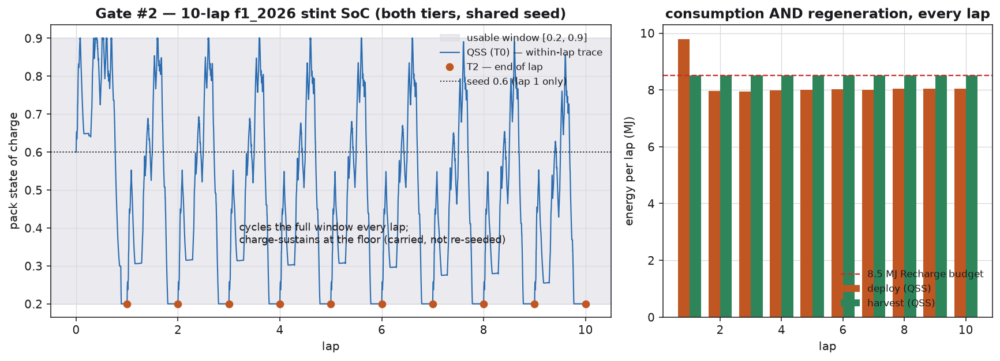
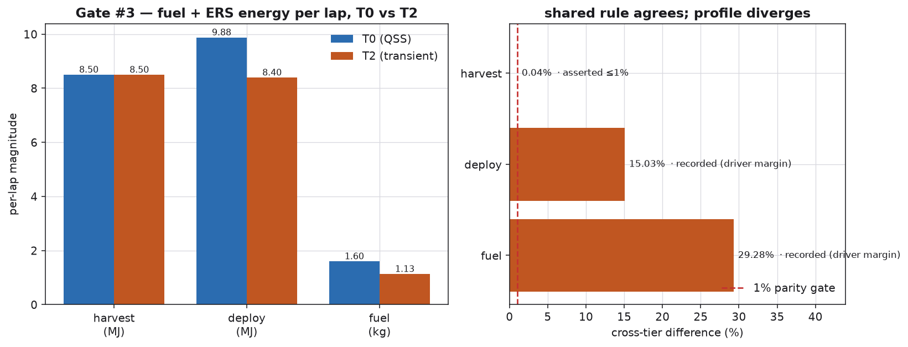

# ERS energy cross-check: stint SoC carry, and energy parity between T0 and T2 (Decision #48)

**Oracle.** The regulatory mechanisms of FIA 2026, Section C, Issue 19, which the flagship ERS
energy manager implements. Three of them apply here: the power caps of ±350 kW (C5.2.7), the usable
window of 4 MJ (C5.2.9), and the Recharge budget of 8.5 MJ for each lap (C5.2.10). The exact
identities of energy accounting apply as well:

| Quantity | Identity | Where |
|---|---|---|
| Continuity of charge | `SoC(lap k+1, s=0) = SoC(lap k, s=end)` | The QSS stint carry (M6, PR3) |
| Coulomb closure | `ΔSoC = −∫I dt / Q`, exactly | `crates/outlap-qss/tests/stint.rs` |
| Fuel energy for each lap | `E_fuel = (m₀ − m_end)·LHV` | §8.1 |
| Net ERS energy for each lap | `E_net = ∫(P_deploy − P_harvest) dt` | §8.3 |

**What was consulted, under the clean-room policy.** Nothing. The energy manager is an outlap
flagship, implemented from the FIA regulations
(`docs/theory/ers-energy-manager.md`). This page validates its outputs.

## Gate #2: the stint carries SoC, which is the acceptance check of the author

A **10-lap** stint on f1_2026, run in **both** tiers, seeded with the **same explicit
`initial_soc`**. The test is
`python/tests/test_stint_soc.py::test_stint_soc_10lap_both_tiers_consumption_and_regeneration`.
`crates/outlap-qss/tests/stint.rs` adds exact Coulomb closure and the ledger for each lap.

| Property | Result |
|---|---|
| Continuous across a QSS lap boundary, with no reset | ✅ asserted |
| Never re-seeded on a lap, so it carries the physics state | ✅ asserted, in both tiers |
| Both consumption and regeneration act on every lap | ✅ asserted, through the deploy and harvest ledgers and the swing within a lap |
| Decreases under net consumption | ✅ asserted. Lap 1 ends below the seed, in both tiers. |
| Exact charge closure, at a relative error ≤ 1e-9 | ✅ asserted in Rust, because Coulomb counting is exact |

f1_2026 deploys hard, and it is **starved of SoC**. Under the greedy feed-forward manager
(D-M6-8), it cycles the full 4 MJ window on every lap and charge-sustains at the floor.

Two consequences follow. "Consumption AND regeneration" means the full swing within a lap, from 0.2
to 0.9 and back. And the carry shows the pack sitting at the floor that the physics drives it to,
from lap 2 onward. It does **not** show the mid-window seed that a stint with re-seeding would
show.

The honest signal for net consumption is the SoC **state**, not the ledger. A pack rejects harvest
at the ceiling of its window. The ledger of *attempted* harvest can therefore exceed deploy while
the pack still drains on net.

## Gate #3: parity gate #4, on fuel and ERS energy for each lap, T0 against T2

The car is f1_2026, on smooth geometry, with frozen tires and a shared `initial_soc`. The test is
`python/tests/test_parity.py::test_energy_parity_gate4`. D-M6-11 pre-authorized this gate to assert
one row and record the others.

| Quantity | T0 | T2 | Δ | Result |
|---|---|---|---|---|
| Harvest energy for each lap | 8.50 MJ | 8.50 MJ | **+0.04 %** | ✅ **asserted at ≤ 1 %** |
| Deploy energy for each lap | 9.88 MJ | 8.40 MJ | +15.0 % | recorded, from the driver margin |
| Fuel burned on each lap | 1.60 kg | 1.13 kg | +29.3 % | recorded, from the driver margin |

**The asserted row is the shared rule.** Both tiers consume the *same* `outlap-powertrain`
rulebook. The quantity that the rule alone decides is the Recharge budget for each lap, and the two
tiers agree on it to **≤ 1 %**. That agreement is the evidence that the energy accounting is sound.

**Decomposition of the deploy and fuel residuals, which are recorded and not gated.** The corner
margin of the T2 driver dominates both. It contributes 14 % to 17 %, and it is the named residual
in `docs/validation/limebeer.md`. The ideal driver uses MacAdam preview and a PI loop. It runs a
slower line at lower throttle. It therefore deploys the MGU-K less **and** burns less fuel on each
lap.

That is a gap in how competitive the driver is. It is not an error in energy accounting, and the
agreement on harvest isolates the two.

This residual is separate from the M5 caveat on stint decay for f1_2026 at T2, which is 0.16 s per
lap. That one is a tire effect, not an energy effect.

A wide tripwire at ≤ 45 % guards against a regression in the wiring.

## A recorded limitation: the asymmetry between QSS and T2 on an EV stint

Consider a **mapped EV**, which has no energy manager. The QSS stint re-seeds the machine-thermal
network on every lap. It must, because a march over distance would otherwise run away through
feedback between derate and slowdown, with no cooling between laps to stop it. T2 integrates that
network continuously.

Over a long EV stint, the QSS pack can therefore derate where T2 does not. This is an asymmetry
between the tiers, and this page records it. It expands the forward reference in
`docs/validation/qss_stint_soc/README.md`.

It affects mapped EVs only. Under an ERS manager, outlap does not march the machine at all
(D-M6-10). The car in gate #2 is f1_2026, so that gate is unaffected.
