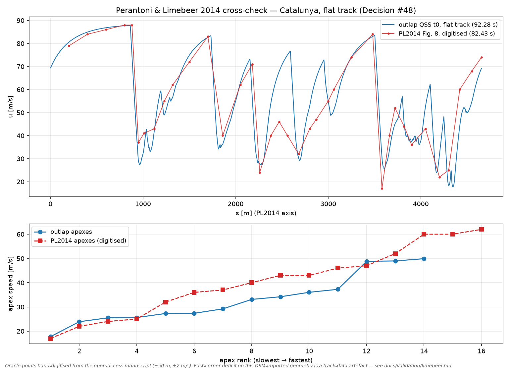

# Limebeer cross-check — the QSS tier vs Perantoni & Limebeer 2014 (Decision #48)

**Oracle.** G. Perantoni and D. J. N. Limebeer, *Optimal control for a Formula One car with
variable parameters*, Vehicle System Dynamics **52**(5), 653–678, 2014. Open-access manuscript:
Oxford University Research Archive, `uuid:ce1a7106-0a2c-41af-8449-41541220809f`. Published
results used here (all from the manuscript):

| Quantity | Value | Where |
|---|---|---|
| Optimal lap, Circuit de Catalunya (2 m grid) | **82.43 s** | §4.3 |
| Mesh-asymptotic optimal lap | 82.57 s | Fig. 11 |
| Speed trace (top speed ≈ 88 m/s; 16 corner apexes 17…62 m/s) | Fig. 8 | digitised: `data/pl2014_fig8_speed.csv` |
| Complete car parameter set | Tables 3–4, Appendix A | transcribed: `data/vehicles/limebeer_2014_f1` |
| Engine power (not stated in the manuscript) | 560 kW | Perantoni doctoral thesis (*Optimal control of vehicle systems*): "the peak engine power of 560 kW is capable of supporting a top speed of 85.4 m/s"; consistent with Fig. 8's ≈88 m/s via P = ½ρ·CdA·u³ |
| QSS-vs-OCP lap-time gap at Barcelona | 2.19 s | §1, citing its ref [14] (Brayshaw & Harrison 2005) |

**Consulted (clean-room policy):** `fastest-lap` (MIT, github.com/juanmanzanero/fastest-lap) was
read as a **parameterisation cross-check only** — its `limebeer-2014-f1.xml` transcribes
Tables 3–4 identically to ours. Its powertrain (735.5 kW + 120 kW boost) is that project's own
choice, so its published lap times are **not** comparable oracles. No code was taken.

## Configuration

`limebeer_2014_f1` (see its README for per-parameter provenance) on the Catalunya import's
min-curvature line, `sim.flat_track: true` (PL2014 is a 2-D study), production 40×25×7 envelope,
ρ pinned to the paper's 1.2 kg/m³. Reproduce with:

```sh
cargo run --release -p outlap-qss --features parallel --example limebeer_lap
python python/tools/plot_limebeer.py
```



## Gate results (Decision #48)

| Gate | Ours | PL2014 | Result |
|---|---|---|---|
| Top speed ≤ 1% | 87.8 m/s | ≈88 m/s (Fig. 8) | ✅ −0.2% |
| Slow-corner apex ≤ 5% | 17.7 m/s | 17 m/s (slowest, Fig. 8) | ✅ +4.1% |
| Fast-corner apexes ≤ 5% | 59.1 / 60.8 m/s | 60 / 60 / 62 m/s | ✅ −1.5% / −1.9% — **on the paper's own geometry** (below); on the committed OSM import the fast corners are geometry-corrupted and are not gated |
| Lap time | 92.36 s (committed track) / 87.08 s (paper's geometry) | 82.43 s | recorded, **not gated** (decomposition below) |

The CI test (`python/tests/test_limebeer.py`) gates what the committed track geometry supports:
top speed and the slowest-corner apex. The fast-corner band was validated against the paper's own
centre-line curvature (extracted from the Fig. 6 vector data during the 2026-07-06 analysis
session; +5.64% lap time); it becomes a CI gate when an era-consistent measured-width track lands
(the TUMFTM racetrack-database import, PR10).

## Lap-time decomposition — why the delta is structural, not a model error

A QSS solver on a fixed heuristic line **cannot** reproduce a transient optimal-control lap that
co-optimises the driven line; the delta decomposes as:

1. **QSS vs transient OCP, ~2.2 s** — the paper itself cites 2.19 s for exactly this circuit
   (its ref [14]).
2. **Line optimality** — the min-curvature line minimises ∫κ², not time; it systematically
   under-opens the medium-speed corners (30–50 m/s), which is precisely where the residual apex
   deficit lives once the geometry is controlled. A time-weighted raceline QP is scheduled for M4
   (Decision #48).
3. **Envelope conservatism, ~1–1.5 s** — the trim-feasibility boundary delivers 85–91% of the
   four-wheel point-mass ideal (legitimate double-track physics: load transfer with load-sensitive
   μ + yaw-moment balance on equal-μ axles).
4. **Track geometry** — the committed OSM import carries interpolation noise (spurious curvature
   spikes) and defaulted widths, and is the current (2021 T10, post-2023) layout vs the paper's
   2013 layout: worth ~5 pp of lap time here (92.36 → 87.08 s on the paper's own curvature).

What the cross-check **does** validate: the complete car transcription. Peak μ exact at all
loads, peak-slip locations within 0.5%, combined-slip coupling within ~5% of the paper's model,
the full longitudinal drive/brake chain overlaying the closed forms, top speed to −0.2%, and the
slow/fast corner speeds to ≤5% on like-for-like geometry.

## Notes on the tyre transcription

The paper's Table 3 states the peak slips as κ = 0.11/0.10 and α = 9°/8°, but its own formula
(A.11–A.14, `S = π/(2·arctan Q)`) peaks at 0.756× those values. The transcription anchors the
MF6.1 peaks where the formula actually peaks, since the simulation is the validation target — see
`data/tires/limebeer_2014_f1/README.md` for the full derivation and the fitted combined-slip
coefficients.
