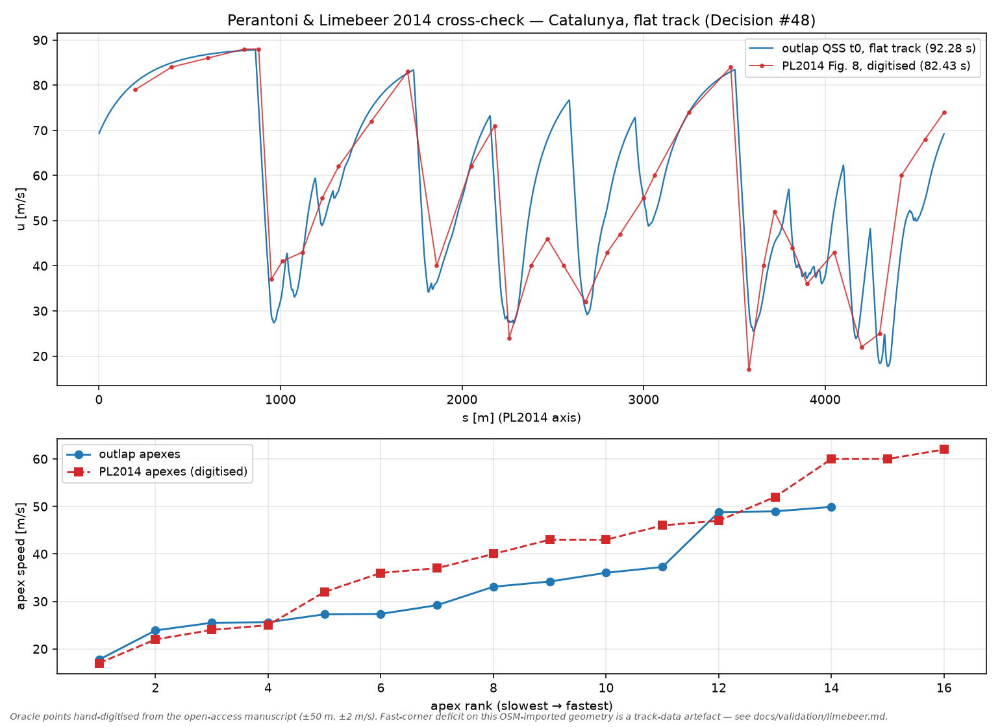

# Limebeer cross-check: the QSS tier against Perantoni & Limebeer 2014 (Decision #48)

**Oracle.** G. Perantoni and D. J. N. Limebeer, *Optimal control for a Formula One car with
variable parameters*, Vehicle System Dynamics **52**(5), 653–678, 2014. Open-access manuscript:
Oxford University Research Archive, `uuid:ce1a7106-0a2c-41af-8449-41541220809f`.

Every published result used here comes from that manuscript:

| Quantity | Value | Where |
|---|---|---|
| Optimal lap at Circuit de Catalunya, on a 2 m grid | **82.43 s** | §4.3 |
| Optimal lap in the mesh-asymptotic limit | 82.57 s | Fig. 11 |
| Speed trace. Top speed is about 88 m/s. 16 corner apexes run from 17 to 62 m/s. | Fig. 8 | Digitized as `data/pl2014_fig8_speed.csv` |
| The complete parameter set for the car | Tables 3–4, Appendix A | Transcribed into `data/vehicles/limebeer_2014_f1` |
| Engine power, which the manuscript does not state | 560 kW | The doctoral thesis of Perantoni, *Optimal control of vehicle systems*: "the peak engine power of 560 kW is capable of supporting a top speed of 85.4 m/s". This agrees with the 88 m/s in Fig. 8, through P = ½ρ·CdA·u³. |
| Gap in lap time between QSS and OCP at Barcelona | 2.19 s | §1, citing its ref [14], Brayshaw & Harrison 2005 |

**What was consulted, under the clean-room policy.** `fastest-lap` (MIT,
github.com/juanmanzanero/fastest-lap) was read as a **cross-check on parameterization and nothing
else**. Its `limebeer-2014-f1.xml` transcribes Tables 3 and 4 the same way this repository does.
Its powertrain is that project's own choice, at 735.5 kW plus a 120 kW boost. Its published lap
times are therefore **not** comparable oracles. No code was taken.

## Configuration

The car is `limebeer_2014_f1`; its README gives the provenance of each parameter. The line is the
minimum-curvature line on the Catalunya import from OSM and a DEM, `catalunya_osm`. PL2014 is a 2-D
study, so `sim.flat_track: true`. The envelope is the production 40×25×7. ρ is pinned to the
1.2 kg/m³ of the paper.

To reproduce:

```sh
cargo run --release -p outlap-qss --features parallel --example limebeer_lap
python python/tools/plot_limebeer.py
```



## Gate results (Decision #48)

| Gate | Ours | PL2014 | Result |
|---|---|---|---|
| Top speed, within 1% | 87.8 m/s | About 88 m/s, Fig. 8 | ✅ −0.2% |
| Apex of the slow corner, within 5% | 17.7 m/s | 17 m/s, the slowest in Fig. 8 | ✅ +4.1% |
| Apexes of the fast corners, within 5% | 59.1 / 60.8 m/s | 60 / 60 / 62 m/s | ✅ −1.5% / −1.9%, measured **on the geometry of the paper**, as described below. On the committed OSM import the fast corners are corrupted by geometry, so they are not gated. |
| Lap time | 92.36 s on the committed track; 87.08 s on the geometry of the paper | 82.43 s | Recorded, and **not gated**. The decomposition follows. |

The CI test is `python/tests/test_limebeer.py`. It gates what the committed track geometry
supports: top speed, and the apex of the slowest corner, on the `catalunya_osm` import.

The band for the fast corners was validated against the center-line curvature of the paper itself.
That curvature was extracted from the vector data of Fig. 6 during the analysis session of
2026-07-06, and it gives +5.64% on lap time. This gate **stays deferred to M4**.

**Why the TUMFTM Catalunya did not turn the fast gate on (PR10).** PR10 vendored the TUMFTM
`racetrack-database`. The expectation was that a Catalunya with measured widths, consistent with
the era, would unlock the gate on the fast corners. It does not.

Its center line is a **smoothed** class-C layout. It rounds the slow chicane open and it tightens
the fast corners. Under QSS on a minimum-curvature line it therefore reproduces *neither* apex
band. The slowest apex comes out at **19.65 m/s, which is +15.6%**, against 17.7 m/s and +4.1% on
`catalunya_osm`. The fast apexes come out at **57.0 and 58.4 m/s, which is −5.0% and −5.8%**. Top
speed is still within −0.15%.

A sweep over corridor width barely moves the slow apex: it falls only from 19.65 to 19.18 m/s, and
that needs an absurd 8 m car. This confirms that the cause is the residual in line optimality, item
2 in the decomposition below. It is **not** an artifact of width or of the import.

The gate on fast corners therefore lands in M4, together with the time-weighted raceline QP
(Decision #48). That QP is the machinery that closes this gap. The M3 cross-check stays on
`catalunya_osm`.

## Decomposition of the lap time: why the delta is structural and not a model error

A QSS solver runs on a fixed heuristic line. An optimal-control lap co-optimizes the line it
drives. The first therefore **cannot** reproduce the second. The delta decomposes into four terms.

1. **QSS against a transient OCP, about 2.2 s.** The paper itself cites 2.19 s for exactly this
   circuit, in its ref [14].
2. **Line optimality.** The minimum-curvature line minimizes ∫κ², not time. It therefore
   under-opens the medium-speed corners, from 30 to 50 m/s. Once the geometry is controlled, that
   is exactly where the residual deficit in apex speed lives. A time-weighted raceline QP is
   scheduled for M4 (Decision #48).
3. **Conservatism in the envelope, about 1 s to 1.5 s.** The boundary of trim feasibility delivers
   85% to 91% of the four-wheel point-mass ideal. This is legitimate double-track physics: load
   transfer with a load-sensitive μ, plus balance of the yaw moment on axles of equal μ.
4. **Track geometry.** The committed OSM import carries interpolation noise, which appears as
   spurious spikes in curvature, and it carries defaulted widths. It is also the current layout,
   with T10 from 2021 and the changes after 2023, while the paper uses the 2013 layout. This is
   worth about 5 percentage points of lap time here: 92.36 s falls to 87.08 s on the curvature of
   the paper.

What the cross-check **does** validate is the complete transcription of the car. Peak μ is exact at
every load. Peak-slip locations are within 0.5%. The coupling under combined slip is within about
5% of the model in the paper. The full longitudinal chain, both drive and brake, overlays the
closed forms. Top speed is within −0.2%. On like-for-like geometry, the speeds at both the slow and
the fast corners are within 5%.

## The T2 transient lap: recorded, and not the ≤1% gate (M4)

The M4 gate of ≤1% on the Limebeer lap time was scoped behind two things: the transient **T2** tier,
and the time-weighted raceline QP. Both have landed.

The gate is **not achievable at T2**. Following the pattern of Decision #48, this page records it
with a decomposition rather than flipping it green. The measurement runs on `catalunya_osm`, flat,
with the production envelope
(`python/tests/test_limebeer.py::test_limebeer_t2_lap_time_recorded_not_gated`):

| lap | time | vs OCP 82.43 s |
|---|---|---|
| OCP oracle (PL2014 §4.3) | 82.43 s | — |
| T0 QSS, min-curvature line | 92.36 s | +12.0% |
| T0 QSS, **time-weighted** line | 92.07 s | +11.7%  (line saves 0.29 s) |
| **T2 transient**, min-curvature line | 105.47 s | +28.0% |
| **T2 transient**, time-weighted line | 105.20 s | +27.6%  (line saves 0.27 s) |

The T2 lap is about **+28%** over the oracle. It does not approach ≤1%. The gap is structural, not
a model error. It adds one T2-specific term to the four QSS terms above.

5. **The stability margin of the driver, +13.1 s. This term dominates.** The ideal driver uses
   MacAdam preview and a PI loop, and it keeps a stability margin that **scales with the corner**.
   Where lateral demand is low it tracks the full QSS profile; top speed is 310 km/h against 316,
   which is within 2%. Where the profile rides the lateral grip limit, it tracks about 0.85 of it.
   Braking and traction passes that know the friction ellipse shape the transitions. A sideslip
   damper catches translational slides. A pedal governor holds wheelspin at the drive wheels to the
   force peak. See `outlap_qss::margin` and `docs/theory/driver.md`.

   Tracking the **raw** profile still **spins the car**, because nothing filters the QSS boundary
   for open-loop stability. The corner margin is therefore the honest boundary of this driver.

   This is a limit on how **competitive** the driver is at the limit. It is not an error in the
   chassis or in the tire. The T2 operating points sit **inside** the T1 g-g-g-v hull, with 0.0%
   exceedance, which is the asserted parity gate.

An earlier scheme used a *global* margin of 0.85, applied at every station including the straights.
It measured +15.6 s. The corner-scaled scheme recovered 2.4 s of that, almost all of it on the
straights.

The corner margin alone is still about +14% of T0. The QSS floors account for the rest: about 5
percentage points from geometry, about 2.2 s from QSS against OCP, and about 1.5 s from the
envelope. The ≤1% assertion therefore stays **deferred**. No fixture with the paper's geometry is
committed, and even on ideal geometry the corner margin puts the gate well out of reach.

A wide tripwire around the recorded band, +20% to +45%, guards against silent drift. The honest
number is surfaced. A green ≤1% that is not real never appears.

## Notes on the tire transcription

Table 3 of the paper states the peak slips as κ = 0.11 and 0.10, and α = 9° and 8°. Its own formula
disagrees: eqs. A.11–A.14, with `S = π/(2·arctan Q)`, peak at 0.756 times those values. The
validation target is the simulation, so the transcription anchors the MF6.1 peaks where the formula
peaks. `data/tires/limebeer_2014_f1/README.md` gives the full derivation and the fitted
coefficients for combined slip.
