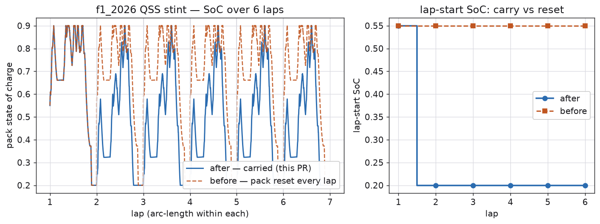
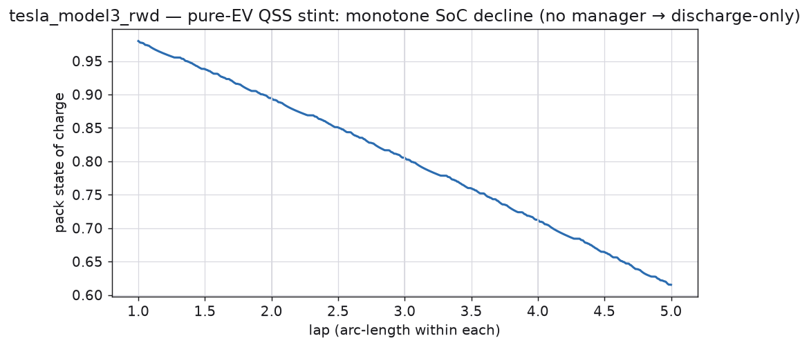
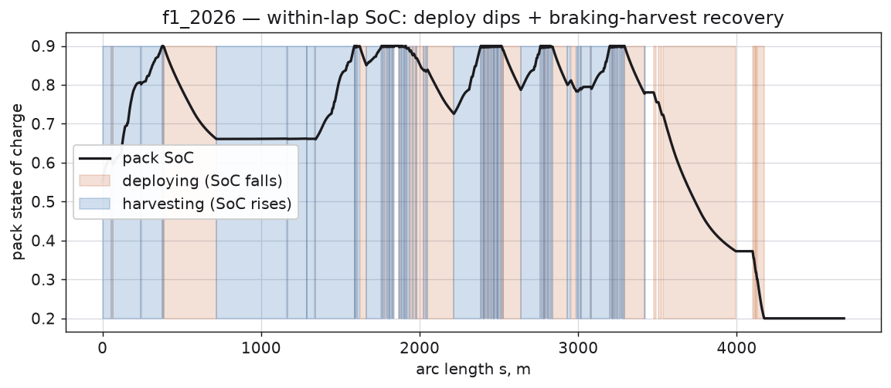
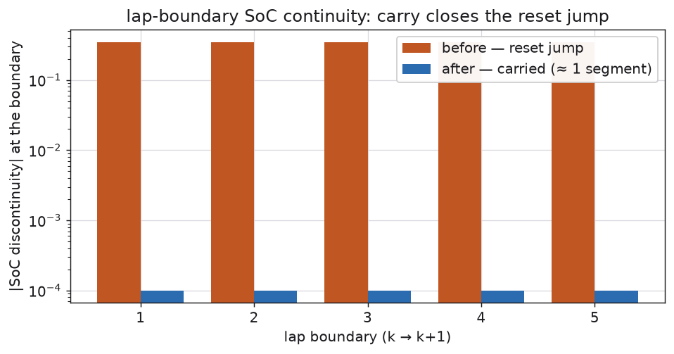

<!-- SPDX-License-Identifier: AGPL-3.0-only -->
# QSS stint state-of-charge carry (M6 PR3)

A multi-lap QSS run carries the electro slow stack across every lap boundary, exactly as the tyre
state already does. The genuine slow states — pack **SoC** and **temperature**, and the
representative-tyre state — persist lap-to-lap; only the per-lap ERS budget ledger resets at the
start/finish. The pack's within-lap transients (RC over-potential, last terminal current) reset at
the boundary, and the **machine-thermal network is a per-lap diagnostic, not carried** (see below).

Figures generated by [`gen_figs.py`](gen_figs.py) (run from the repo root:
`uv run --directory python python docs/validation/qss_stint_soc/gen_figs.py`).

## SoC carry — before vs after

Before this PR the QSS stint rebuilt the pack from the assembled top-/mid-window state **every lap**
(the pack was silently resurrected at the start/finish). After it, the pack state carries: lap N+1
starts at lap N's terminal SoC and the run evolves toward its real charge-sustaining state.

## Pure-EV consumption (`tesla_model3_rwd`)

A mapped EV has no energy manager, so the QSS march is discharge-only: SoC falls monotonically,
scaled by lap energy, with no harvest to confound it — the consumption half of the acceptance check.

## Hybrid within-lap recovery (`f1_2026`)

Within a lap the managed ERS both deploys (SoC falls) and harvests under braking (SoC rises) — the
regeneration half. Carried across laps, the two halves net out to the charge-sustaining SoC.

## Lap-boundary continuity

The lap-boundary SoC discontinuity: the carry closes the ≈0.3-SoC reset jump the old per-lap rebuild
introduced, leaving only the ≈1-segment step inherent to logging entry states on a closed loop.

## Recorded limitation — machine-thermal inter-lap continuity

The machine-thermal network is **re-seeded each lap** (surfaced as the end-of-lap `machine_temp_c`
diagnostic), not carried. Seeding a near-limit winding temperature into the quasi-steady **distance**
march creates a derate↔slowdown positive feedback — a slower lap integrates *more* heating over its
longer time, so the winding gets hotter, derates harder, and slows further — with no inter-lap
cooling to arrest it. That is an artifact of the QSS march, not real thermal behaviour; inter-lap
machine-thermal continuity is the transient tier's job (T2, with real-time cooling). Under an energy
manager the machine is not marched at all (D-M6-10), so this affects only mapped-EV stints. This
QSS-vs-T2 EV-stint asymmetry is expanded in the M6 PR8 validation pages.
