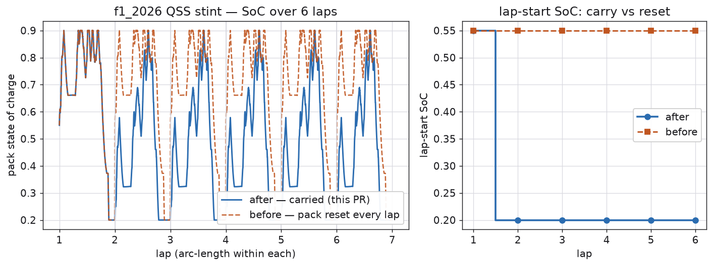
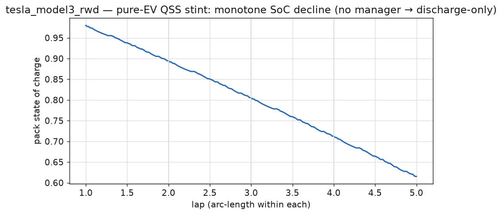
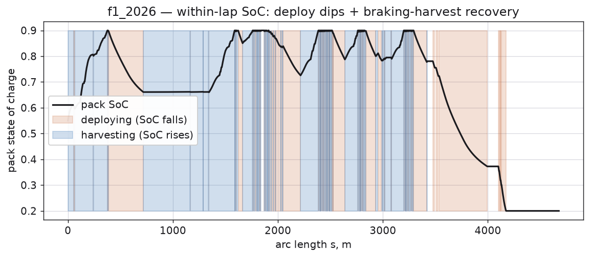
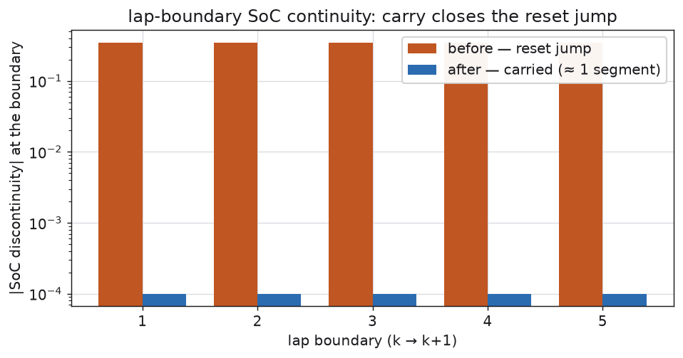

<!-- SPDX-License-Identifier: AGPL-3.0-only -->
# How a QSS stint carries state of charge (M6 PR3)

A QSS run over many laps carries the slow electrical stack across every lap boundary. The tire
state already worked this way. The states that are genuinely slow now persist from lap to lap: pack
**SoC**, pack **temperature**, and the state of the representative tire. Only the ERS budget ledger
for each lap resets at the start and finish line.

Two things do not carry. The transients inside a lap reset at the boundary, which are the RC
over-potential and the last terminal current. The **machine-thermal network is a diagnostic for
each lap, and it does not carry**. The last section explains why.

[`gen_figs.py`](gen_figs.py) generates the figures. Run it from the root of the repository:
`uv run --directory python python docs/validation/qss_stint_soc/gen_figs.py`.

## SoC carry, before and after

Before this PR, the QSS stint rebuilt the pack **every lap** from the state that assembly produced
at the top or middle of the window. The pack was silently resurrected at the start and finish line.

After this PR, the pack state carries. Lap N+1 starts at the SoC that lap N ended on, and the run
evolves toward the charge-sustaining state that it really has.

## Consumption on a pure EV (`tesla_model3_rwd`)

A mapped EV has no ERS manager. A battery and an electric machine still **regenerate** under
braking (M6 PR3). Over a hot lap the car consumes more than it recovers. SoC therefore steps down
NET on each lap, and it carries from lap to lap.

This is the consumption side of the acceptance check, with the braking regeneration of the machine
folded in. Note that near 100 % SoC the charge acceptance of the pack throttles regeneration almost
to nothing.

## Recovery within a lap on a hybrid (`f1_2026`)

Within one lap the managed ERS does both jobs. It deploys, and SoC falls. It harvests under
braking, and SoC rises. That is the regeneration half. Carried across laps, the two halves net out
to the charge-sustaining SoC.

## Continuity at the lap boundary

This figure plots the discontinuity in SoC at the lap boundary. The old rebuild for each lap
introduced a reset jump of about 0.3 SoC. The carry closes that jump. What remains is a step of
about one segment. That step is inherent to logging entry states on a closed loop.

## A recorded limitation: machine-thermal continuity between laps

The machine-thermal network is **re-seeded on each lap**. It surfaces as the end-of-lap
`machine_temp_c` diagnostic. It does not carry.

Seeding a winding temperature that is near the limit into the quasi-steady march over **distance**
creates positive feedback between derate and slowdown. A slower lap takes longer, so it integrates
*more* heating. The winding therefore gets hotter, derates harder, and slows the car further.
Nothing cools the machine between laps to stop this.

That behavior is an artifact of the QSS march. It is not real thermal behavior. Continuity of
machine temperature between laps is the job of the transient tier, T2, which cools in real time.

Under an energy manager, outlap does not march the machine at all (D-M6-10). This therefore affects
only stints on a mapped EV. The M6 PR8 validation pages expand on this asymmetry between QSS and T2
for EV stints.
