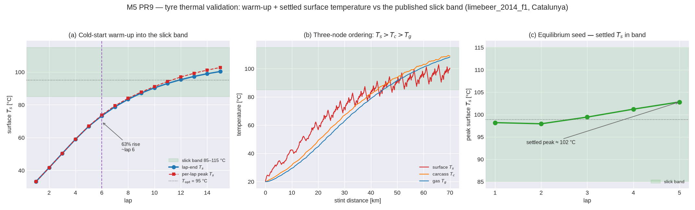

# Tyre thermal ring — warm-up + steady-state bands (Decision #48)

**Oracle.** The reduced Farroni thermo-racing-tyre model and published temperature bands:

- F. Farroni, D. Giordano, M. Russo, F. Timpone, *TRT: thermo racing tyre — a physical model to
  predict the tyre temperature distribution*, **Meccanica 49**(3), 707–723, 2014.
- F. Farroni, A. Sakhnevych, F. Timpone, *TRT EVO: advances in real-time thermodynamic tyre
  modelling*, Proc. IMechE Part L, 2017.

Published behaviour used here:

| Quantity | Value | Where |
|---|---|---|
| Slick tread-surface working range | **≈ 85–115 °C** | Farroni TRT surface-node traces; F1 broadcast tyre-temp overlays |
| Warm-up | monotone rise from ambient to the working range over an out/in-lap timescale | TRT step-heating response |
| Node ordering | surface hotter than carcass hotter than gas under load | TRT 3-node energy balance |

The model itself (three-node ring, semi-implicit Euler) and its clean-room provenance are in
[`docs/theory/tire-thermal.md`](../theory/tire-thermal.md); this page is the numeric cross-check.

**Consulted (clean-room policy):** none beyond the cited literature. Game-engine tyre-thermal code
(Speed Dreams / VDrift) was **not** consulted as a source of derivation. No code was taken.

## Configuration

`limebeer_2014_f1` (racing-slick `.tyr`, thermal ring from M5 PR1) on `catalunya_osm`,
`sim.flat_track: true`, coarse CI envelope (8×7×2), T0 stint. Cold start seeds the surface at
20 °C; the equilibrium start seeds at the grip optimum. Reproduce with:

```sh
python python/tools/plot_tire_thermal_validation.py
```



## Gate results (Decision #48)

The CI test is `python/tests/test_wear_validation.py::test_thermal_warmup_and_steady_band`.

| Gate | Ours | Oracle | Result |
|---|---|---|---|
| Cold-start warm-up monotone | rises 20 → 33 → 100 °C (lap-end, cold-start) | monotone to working range | ✅ asserted |
| Node ordering T_s > T_c > T_g | surface leads carcass leads gas | TRT 3-node | ✅ asserted (property test, PR1) |
| Settled surface temp in band | **≈ 99 °C mean, 101 °C peak** | 85–115 °C | ✅ asserted (peak in band) |
| Warm-up time constant | **≈ 6 laps to 63 % rise (~500 s)** | out/in-lap timescale | recorded, **not gated** (below) |

## Recorded, not gated — the warm-up timescale

The steady-state surface temperature (~99–101 °C) sits squarely in the published slick band and is
**asserted**. The warm-up *time constant* is **recorded**: from a 20 °C cold seed the surface
crosses 63 % of the rise to equilibrium at lap ~6 (~500 s), and reaches the working range by lap
~12–15. This is slower than a real F1 out-lap (~1–2 laps). The decomposition:

1. **Lumped heat capacities** — the ring uses a generic racing-slick `c_s`/`c_c` (M5 PR1,
   `docs/theory/tire-thermal.md`), not a compound-specific fit; larger capacities lengthen the time
   constant. These are calibration targets, not model errors — the *equilibrium* they relax to is
   in band.
2. **QSS heat input** — in T0/T1 the frictional sliding power is estimated from the friction-circle
   utilisation at the quasi-static solution (`outlap_qss::tire`), a per-segment average rather than
   the peak transient loading a real out-lap sees, so the ramp is gentler.

Because the equilibrium band is the robust, physically-anchored quantity, it is asserted; the
warm-up timescale is surfaced honestly and left as a calibration record rather than a green gate
that the generic (uncalibrated-per-compound) capacities do not support.
