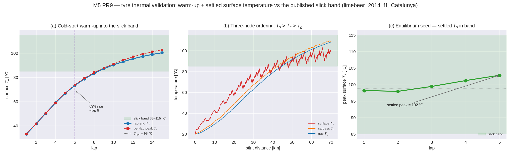

# Tire thermal ring: warm-up and steady-state bands (Decision #48)

**Oracle.** The reduced Farroni thermo-racing-tire model, and its published temperature bands:

- F. Farroni, D. Giordano, M. Russo, F. Timpone, *TRT: thermo racing tyre — a physical model to
  predict the tyre temperature distribution*, **Meccanica 49**(3), 707–723, 2014.
- F. Farroni, A. Sakhnevych, F. Timpone, *TRT EVO: advances in real-time thermodynamic tyre
  modelling*, Proc. IMechE Part L, 2017.

This page uses three published behaviors:

| Quantity | Value | Where |
|---|---|---|
| Working range of the tread surface on a slick | **≈ 85–115 °C** | Surface-node traces in Farroni TRT; tire-temperature overlays on F1 broadcasts |
| Warm-up | A monotone rise from ambient to the working range, over the time of an out-lap or in-lap | The step-heating response of TRT |
| Node ordering | Under load, the surface is hotter than the carcass, and the carcass is hotter than the gas | The 3-node energy balance of TRT |

[`docs/theory/tire-thermal.md`](../theory/tire-thermal.md) describes the model itself, which is a
three-node ring integrated with semi-implicit Euler. It also records the clean-room provenance.
This page is the numerical cross-check.

**What was consulted, under the clean-room policy.** Nothing beyond the literature cited above.
Tire-thermal code in game engines, such as Speed Dreams and VDrift, was **not** consulted as a
source for the derivation. No code was taken.

## Configuration

The car is `limebeer_2014_f1`, with a racing-slick `.tyr` and the thermal ring from M5 PR1. The
track is `catalunya_osm`, with `sim.flat_track: true`. The envelope is the coarse CI envelope,
8×7×2. The run is a T0 stint.

A cold start seeds the surface at 20 °C. An equilibrium start seeds it at the grip optimum.

To reproduce:

```sh
python python/tools/plot_tire_thermal_validation.py
```



## Gate results (Decision #48)

The CI test is `python/tests/test_wear_validation.py::test_thermal_warmup_and_steady_band`.

| Gate | Ours | Oracle | Result |
|---|---|---|---|
| Warm-up from a cold start is monotone | Rises 20 → 33 → 100 °C, measured at lap end from a cold start | Monotone to the working range | ✅ asserted |
| Node ordering, T_s > T_c > T_g | Surface leads carcass, carcass leads gas | TRT, 3 nodes | ✅ asserted, by a property test in PR1 |
| Settled surface temperature is in band | **≈ 99 °C mean, 101 °C peak** | 85–115 °C | ✅ asserted, on the peak |
| Time constant of warm-up | **≈ 6 laps to 63 % of the rise, about 500 s** | The time of an out-lap or in-lap | Recorded, and **not gated**. See below. |

## Recorded but not gated: the warm-up timescale

The steady-state surface temperature, near 99 °C to 101 °C, sits well inside the published band for
a slick. That value is **asserted**.

The *time constant* of the warm-up is **recorded** instead. From a cold seed at 20 °C, the surface
crosses 63 % of its rise to equilibrium at about lap 6, near 500 s. It reaches the working range by
lap 12 to 15. A real F1 out-lap does this in 1 to 2 laps, so the model is slower.

Two things cause the difference.

1. **The heat capacities are lumped.** The ring uses a generic `c_s` and `c_c` for a racing slick
   (M5 PR1, `docs/theory/tire-thermal.md`). Neither is fitted to a specific compound. A larger
   capacity lengthens the time constant. These values are calibration targets, not errors in the
   model, because the *equilibrium* that they relax to is in band.
2. **The QSS heat input is an average.** At T0 and T1, `outlap_qss::tire` estimates the frictional
   sliding power from how much of the friction circle the quasi-static solution uses. That is an
   average over each segment. It is not the peak transient load that a real out-lap applies.
   Therefore the ramp is gentler.

The equilibrium band is the quantity that is robust and anchored in physics, so this page asserts
it. The warm-up timescale is surfaced honestly and left as a calibration record. Generic capacities
that are not calibrated for each compound cannot support a green gate.
