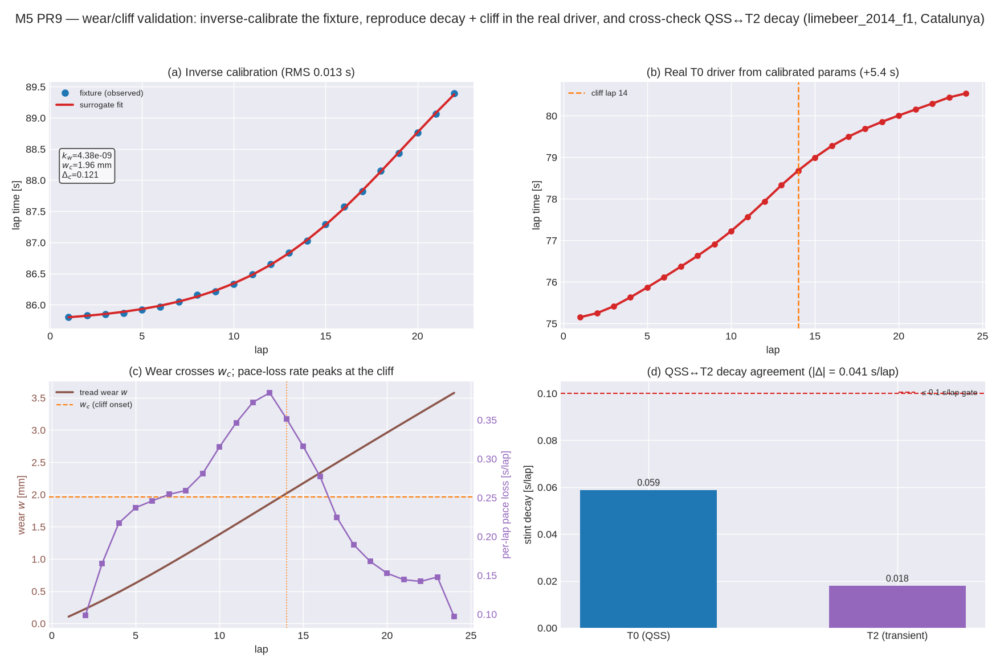

# Tyre wear + cliff — inverse calibration and QSS↔T2 decay (Decision #48)

**Oracle.** Observed Formula 1 stint pace degradation: a soft/medium slick loses on the order of
**~0.05–0.10 s/lap** early in a stint, accelerating into a **cliff** as the tread crosses a critical
depth (the well-documented "falling off the cliff"). The degradation model is built from published
laws — Archard sliding-energy wear (J. F. Archard, *Contact and rubbing of flat surfaces*, J. Appl.
Phys. **24**(8), 1953) with Grosch temperature-hardness (K. A. Grosch, Proc. R. Soc. Lond. A
**274**, 1963) — see [`docs/theory/tire-wear.md`](../theory/tire-wear.md).

| Quantity | Value | Where |
|---|---|---|
| Early stint decay | ~0.05–0.10 s/lap | FastF1 stint pace deltas (medium compound) |
| Cliff | pace loss accelerates then tapers as grip saturates | stint pace curves |
| Committed fixture | 22-lap derived medium stint | `data/wear/f1_medium_catalunya_stint.csv` |

**Redistribution policy (§15).** FastF1 telemetry and parameters fitted from it are calibration
artefacts only. The committed fixture is a small **derived** per-lap pace curve — no raw telemetry,
no fitted TTC parameters. The live FastF1 loader (`outlap.wearcal.load_fastf1`) is opt-in and never
in CI; the offline round-trip and this gate need only the committed fixture + scipy.

## Configuration

`limebeer_2014_f1` on `catalunya_osm`, `sim.flat_track: true`, coarse CI envelope (8×7×2). The
calibrator (`outlap.wearcal`) fits `k_w`, `w_c`, `s_w`, `delta_c` to the fixture through the
reduced-order surrogate; the recovered parameters are then run through the **real** T0 stint driver.
Reproduce with:

```sh
python python/tools/plot_wear_cliff_validation.py
```



## Gate 1 — wear/cliff reproduced after inverse calibration

CI test: `python/tests/test_wear_validation.py::test_wear_cliff_reproduced_after_calibration`.

Recovered from the fixture (surrogate fit, RMS 0.013 s):
`k_w = 4.4e-9`, `w_c = 1.96 mm`, `s_w = 0.49 mm`, `delta_c = 0.121`.

Run through the real T0 driver (24-lap stint):

| Gate | Ours | Oracle | Result |
|---|---|---|---|
| Wear monotone non-decreasing | 0.11 → 3.7 mm | Archard (sliding energy only adds) | ✅ asserted |
| Reaches the cliff (wear crosses `w_c`) | at **lap 14** | cliff exists | ✅ asserted |
| Degradation accelerates into the cliff | peak per-lap loss **~0.41 s at lap ~13**, vs ~0.10 s fresh | cliff = max degradation rate | ✅ asserted |
| Net pace loss | **+5.4 s over 24 laps** (mean ~0.26 s/lap; early ~0.05–0.10 s/lap) | monotone loss | ✅ asserted (trend) |

The pace curve is an S-shape: a gentle ~0.05–0.10 s/lap fresh-tyre loss (matching the oracle band),
ramping to a peak rate as the tread crosses `w_c` (the `C_s(w)` positive feedback — worn tyres run
hotter, off-window — steepens it), then tapering as the cliff sigmoid saturates.

## Gate 2 — QSS↔T2 stint-decay agreement (≤ 0.1 s/lap)

CI test: `python/tests/test_wear_validation.py::test_qss_t2_stint_decay_agreement`. Both tiers run a
6-lap stint on the same calibrated car; the lap-time decay slopes are compared.

| Tier | Decay | Note |
|---|---|---|
| T0 QSS | **0.059 s/lap** | grip-limited quasi-static pace |
| T2 transient | **0.018 s/lap** | closed-loop, `speed_margin` 0.85 |
| \|Δ\| | **0.041 s/lap** | ✅ ≤ 0.1 s/lap gate |

The gate holds, and the residual is **recorded and decomposed** (Decision #48), not swept under:

1. **Driver stability margin (the dominant term)** — the T2 lap runs at `speed_margin` 0.85 in the
   corners (the corner-scaled margin, `docs/validation/limebeer.md`), so it slides **less** than the
   T0 pace that rides the grip limit. Less sliding energy → less Archard wear per lap → a gentler
   decay slope. This is the same T2 driver-competitiveness limit recorded for the Limebeer lap, now
   visible in the degradation rate rather than the absolute lap time.
2. **Per-lap re-seed vs continuous run** — T0 re-seeds the slow-state march from the previous lap's
   terminal tyre state; T2 is one continuous integration across the start/finish line. Over a short
   stint both stay in the early gentle-decay regime, so this term is small here.

Both tiers **agree in sign and to within the gate**; the honest driver-margin residual is surfaced
rather than tuned away. On the robust flat/2-D geometry the gate is asserted; the 3-D geometry
carries the M4 T2 stability caveat (`docs/validation/limebeer.md`) and is not gated here.
