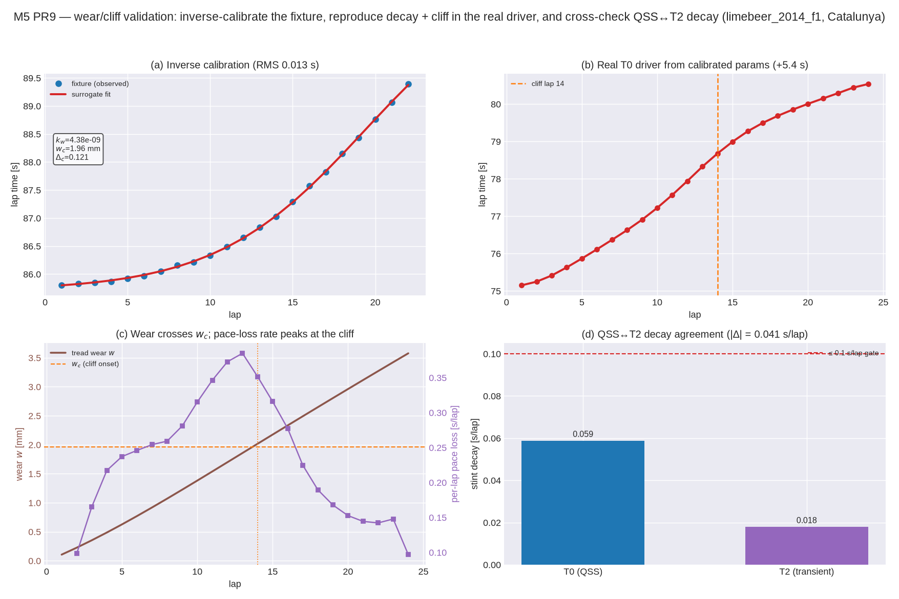

# Tire wear and cliff: inverse calibration, and decay across QSS and T2 (Decision #48)

**Oracle.** The degradation of stint pace that Formula 1 observes. A soft or medium slick loses on
the order of **0.05 s to 0.10 s per lap** early in a stint. The loss then accelerates into a
**cliff**, as the tread crosses a critical depth. Teams call this "falling off the cliff", and it
is well documented.

The degradation model is built from published laws: Archard wear from sliding energy (J. F.
Archard, *Contact and rubbing of flat surfaces*, J. Appl. Phys. **24**(8), 1953), with Grosch
temperature-hardness (K. A. Grosch, Proc. R. Soc. Lond. A **274**, 1963). See
[`docs/theory/tire-wear.md`](../theory/tire-wear.md).

| Quantity | Value | Where |
|---|---|---|
| Decay early in a stint | 0.05 s to 0.10 s per lap | Stint pace deltas from FastF1, on the medium compound |
| Cliff | The loss of pace accelerates, then tapers as grip saturates | Stint pace curves |
| Committed fixture | A derived 22-lap stint on the medium compound | `data/wear/f1_medium_catalunya_stint.csv` |

**Redistribution policy (§15).** Use FastF1 telemetry, and any parameter fitted from it, only to
calibrate. The committed fixture is a small **derived** pace curve, one value for each lap. It
holds no raw telemetry and no fitted TTC parameters. The live FastF1 loader,
`outlap.wearcal.load_fastf1`, is opt-in and never runs in CI. The offline round trip and this gate
need only the committed fixture and scipy.

## Configuration

The car is `limebeer_2014_f1`, on `catalunya_osm`, with `sim.flat_track: true` and the coarse CI
envelope, 8×7×2.

The calibrator is `outlap.wearcal`. It fits `k_w`, `w_c`, `s_w`, and `delta_c` to the fixture,
through the reduced-order surrogate. The recovered parameters then run through the **real** T0
stint driver.

To reproduce:

```sh
python python/tools/plot_wear_cliff_validation.py
```



## Gate 1: wear and cliff reproduced after inverse calibration

The CI test is
`python/tests/test_wear_validation.py::test_wear_cliff_reproduced_after_calibration`.

The surrogate fit recovers these values from the fixture, at an RMS of 0.013 s:
`k_w = 4.4e-9`, `w_c = 1.96 mm`, `s_w = 0.49 mm`, `delta_c = 0.121`.

Those values then run through the real T0 driver, over a 24-lap stint:

| Gate | Ours | Oracle | Result |
|---|---|---|---|
| Wear never decreases | 0.11 → 3.7 mm | Archard: sliding energy can only add | ✅ asserted |
| The stint reaches the cliff, so wear crosses `w_c` | at **lap 14** | A cliff exists | ✅ asserted |
| Degradation accelerates into the cliff | Peak loss of **about 0.41 s at lap 13**, against about 0.10 s when fresh | The cliff is where the degradation rate peaks | ✅ asserted |
| Net loss of pace | **+5.4 s over 24 laps.** The mean is about 0.26 s per lap. Early laps lose 0.05 s to 0.10 s. | The loss is monotone | ✅ asserted, on the trend |

The pace curve is an S shape. It starts with a gentle loss of 0.05 s to 0.10 s per lap on a fresh
tire, which matches the oracle band. It ramps to a peak rate as the tread crosses `w_c`. Positive
feedback through `C_s(w)` steepens that ramp, because a worn tire runs hotter and therefore falls
outside its window. The curve then tapers as the cliff sigmoid saturates.

## Gate 2: agreement in stint decay between QSS and T2, at ≤ 0.1 s per lap

The CI test is `python/tests/test_wear_validation.py::test_qss_t2_stint_decay_agreement`. Both
tiers run a 6-lap stint on the same calibrated car. The test compares the slopes at which lap time
decays.

| Tier | Decay | Note |
|---|---|---|
| T0 QSS | **0.059 s per lap** | Quasi-static pace, limited by grip |
| T2 transient | **0.018 s per lap** | Closed loop, with `speed_margin` 0.85 |
| \|Δ\| | **0.041 s per lap** | ✅ passes the gate of 0.1 s per lap |

The gate holds. Decision #48 requires that the residual be **recorded and decomposed** rather than
buried. Two terms explain it.

1. **The stability margin of the driver, which dominates.** The T2 lap runs at `speed_margin` 0.85
   in the corners. This is the margin that scales with the corner, described in
   `docs/validation/limebeer.md`. The car therefore slides **less** than the T0 pace, which rides
   the grip limit. Less sliding energy gives less Archard wear on each lap, and therefore a gentler
   decay slope. This is the same limit on how competitive the T2 driver is that the Limebeer lap
   records. Here it shows up in the degradation rate instead of the absolute lap time.
2. **A re-seed on each lap, against one continuous run.** T0 re-seeds its march of the slow states
   from the tire state that the previous lap ended on. T2 runs one continuous integration across
   the start and finish line. Over a short stint both tiers stay in the early regime, where decay
   is gentle. This term is therefore small here.

Both tiers **agree in sign, and they agree within the gate**. The residual from the driver margin
is honest, and this page surfaces it rather than tuning it away.

The gate is asserted on the flat 2-D geometry, which is robust. It is not gated on the 3-D
geometry, which carries the M4 caveat about T2 stability. See `docs/validation/limebeer.md`.
